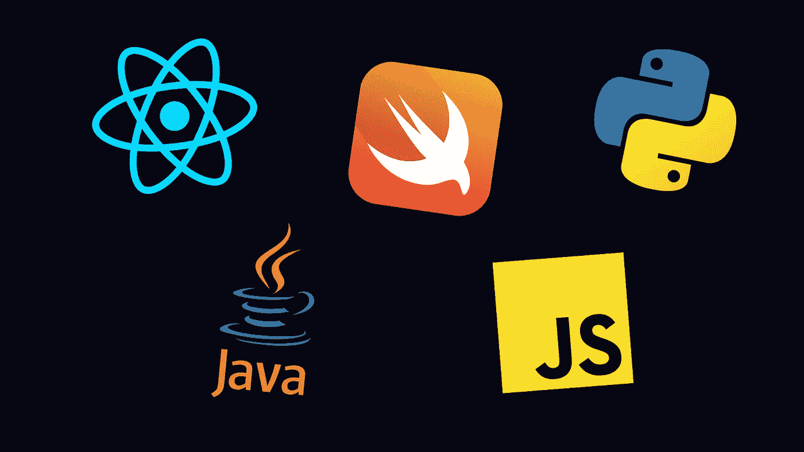

# 2022 年最值得学习的 7 种编程语言和技术

> 原文：<https://medium.com/codex/the-7-best-programming-languages-technologies-to-learn-for-2022-325b5190bed2?source=collection_archive---------9----------------------->

## 今年试着学其中一门吧！

使用 Canva 创建的照片

我喜欢每年为自己设定的目标之一是学习一项新技术或编程语言。我喜欢看到它们与我熟悉的语言相比是如何工作的，并用它们构建一些项目来实践我所学到的东西。所以如果你正在进入这个领域，并且想知道…