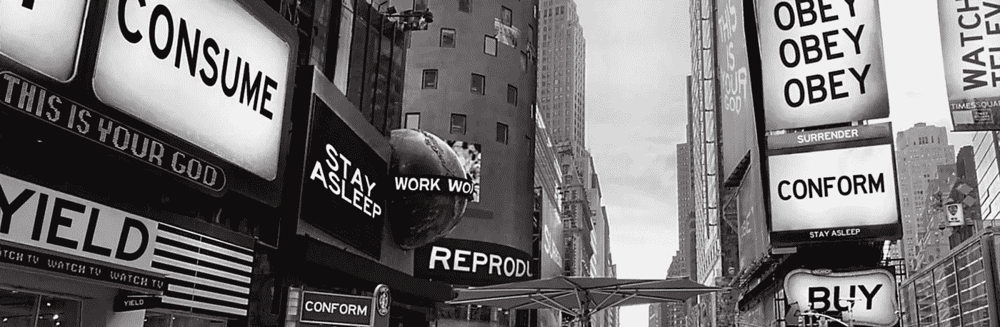

# 7 种宣传技巧以及它们是如何吸引网站开发者的。

> 原文：<https://medium.com/codex/the-7-propaganda-techniques-and-how-they-sucker-web-developers-cd03333b2f0b?source=collection_archive---------1----------------------->

## [法典](http://medium.com/codex)

我们睡觉，他们活着

几乎可以说,“七种经典宣传技巧”最早是在 1937 年第二期《宣传分析》的一篇未编辑的文章中被整理出来的。这只是当时新成立的宣传分析研究所的一份小简报。(国际音标)。