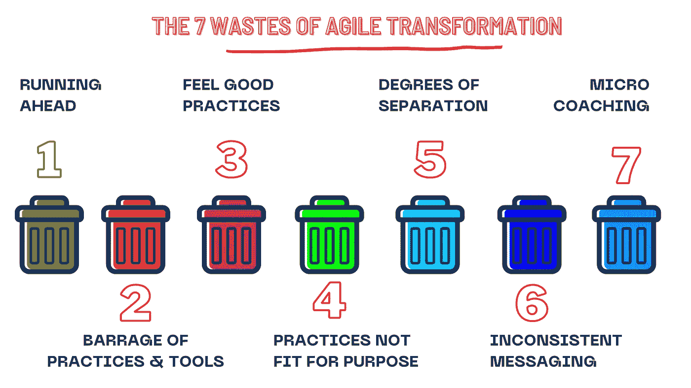
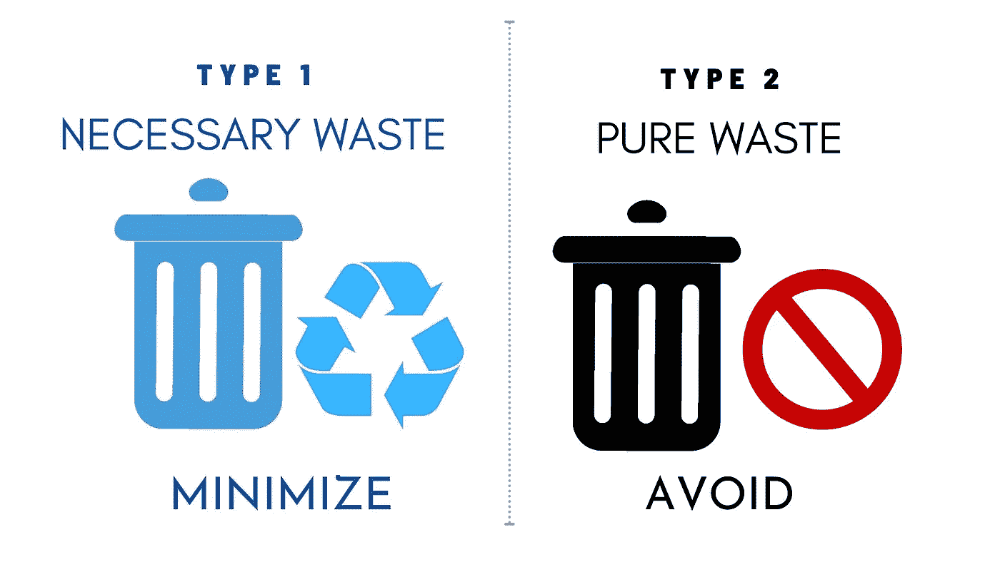
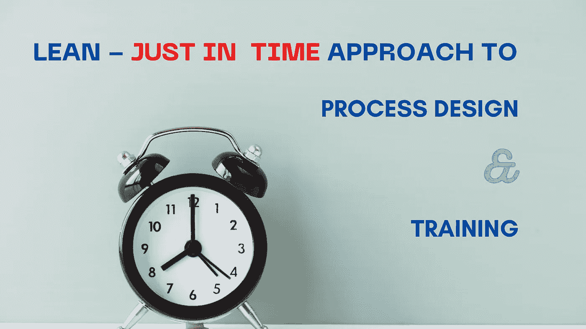
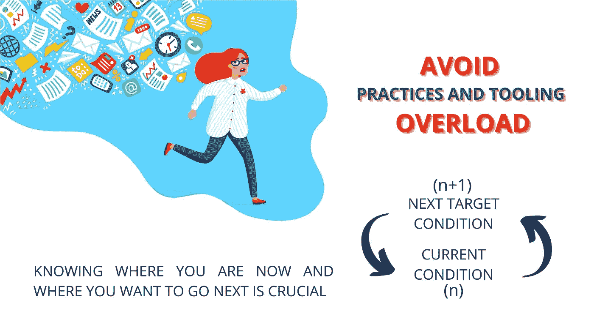
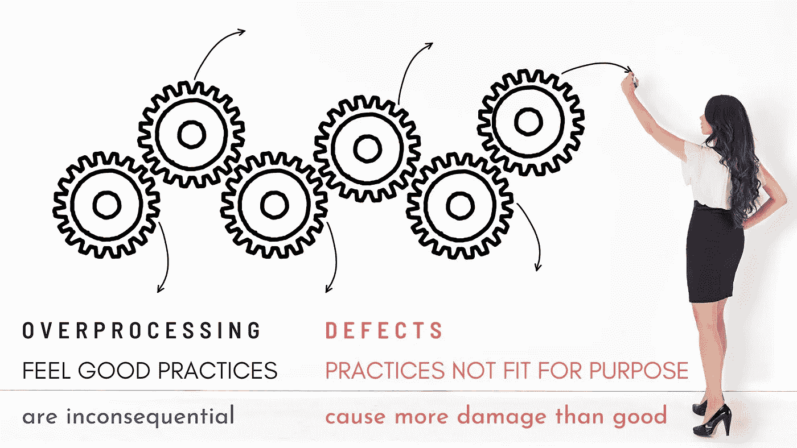
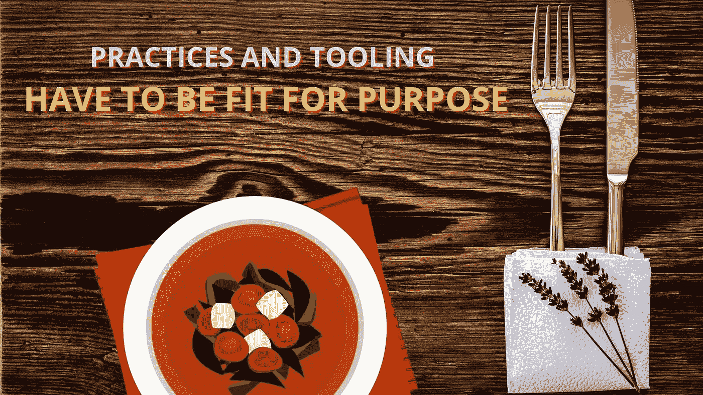
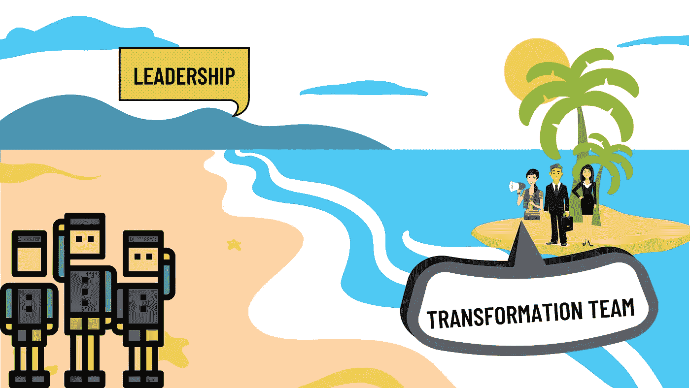
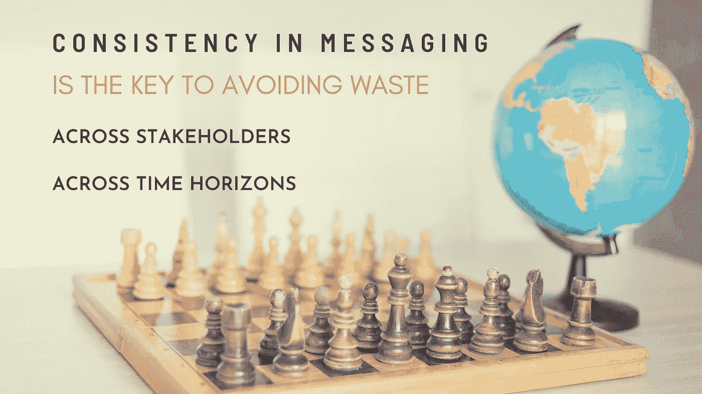
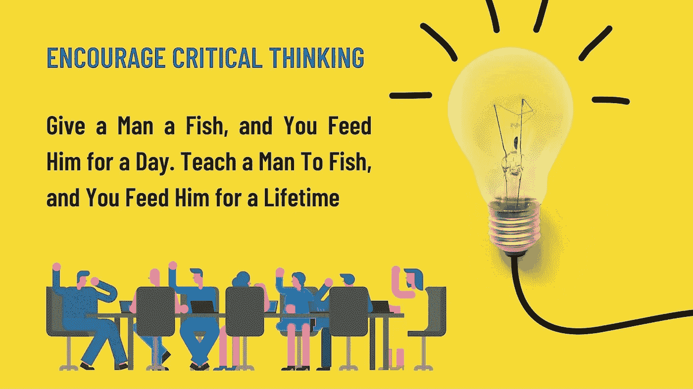

# 敏捷转型中的 7 种浪费

> 原文：<https://medium.com/codex/the-7-wastes-in-agile-transformations-f0f0b3a443d8?source=collection_archive---------6----------------------->

敏捷成为主流，敏捷报告第 15 期声明[。该报告强调了敏捷在企业中的爆炸性增长。94%的人表示他们的公司正在使用敏捷方法。尤其是在软件开发团队中，敏捷采用率从 2020 年的 37%飙升至 2021 年的 86%。开发和运营部门正在积极采用敏捷实践和流程。财务、人力资源和营销等非 IT 职能部门也是如此。](https://stateofagile.com/#ufh-i-661275008-15th-state-of-agile-report/7027494)

Gartner 还在其“[敏捷和 DevOps 2020](https://www.gartner.com/en/documents/3987588/hype-cycle-for-agile-and-devops-2020) 宣传周期”报告中指出，“敏捷运维已经完成了宣传周期，因为敏捷实践已经被证明能够交付价值。”

# 在炒作周期中保持敏捷。真的吗？

尽管敏捷实践变得越来越普遍，而且毫无疑问，如果正确实施，敏捷实践确实会带来价值，但是组织仍然在努力从他们的敏捷采用中获得收益。术语和框架比比皆是，但商业利益难以捉摸，也不常见。正如几年来的“敏捷报告状态”向我们展示的那样，采用敏捷的组织所面临的关键挑战依然如故。“跨团队的不一致的过程和实践”以 46%的比例高居榜首，其次是组织文化的挑战(43%)和组织对变革的普遍抵制(42%)。

在大型企业中，像敏捷这样的重大转型将是一个漫长的多年旅程。方法是结果的关键因素。如果没有精益的思维和方法，这些多年的努力往往会产生浪费，组织无法实现预期的结果。

# 敏捷转型中的浪费

几十年来，精益为我们提供了关于如何优化流程价值的深刻见解。而“过程”这个词通常被认为是敏捷世界中的一个禁忌。不需要如此。*敏捷宣言声明“个人和交互”优先于“过程和工具”。*它并没有要求我们忽略流程。事实上，有了精益思想，我们可以定义流程，从而增强个人之间的互动。实践和流程对我们的运营方式至关重要，应持续优化以最大化预期结果。

必要浪费和纯粹浪费

精益的浪费是指任何消耗资源但不能给客户带来同等价值的活动。精益还进一步阐明了并非所有的浪费都是不可避免的，有些浪费确实可能是“必要的浪费”(1 类大木)，以优质的方式完成工作。定期向高级利益相关者报告可能不会增加直接价值；但是，它有助于提高转型计划的整体成功和质量。我们必须找出如何优化这些活动，以最大限度地减少花费在这些活动上的时间和精力。纯浪费(2 型大木)是非增值和不必要的活动，不会带来价值，并对整体计划结果产生不利影响。应删除类型 2。

受精益的[七种浪费的启发，这篇文章着眼于七种属于纯粹浪费类别的关键浪费，它们会减缓或阻碍敏捷转型的努力。它还探讨了可以用来避免或最小化它们的策略。](https://kanbanize.com/lean-management/value-waste/7-wastes-of-lean)

# 七种敏捷转型浪费

1.  *跑在前面|盘点*
2.  *一连串的实践和工具|超过生产*
3.  *觉得好的做法|过度处理*
4.  *实践不符合目的|缺陷*
5.  *轮毂和辐条模型|运输*
6.  *微辅导|等待*
7.  *不正确和不一致的信息|动作*

# **提前运行|库存**

> 精益制造中的库存——原材料、在制品(WIP)或成品形式的库存代表一种尚不能产生收入的资本支出。产品处于这种状态的时间越长，造成的浪费就越多。(来源:[维基百科](https://en.wikipedia.org/wiki/Muda_(Japanese_term)#Inventory))

精益—流程设计和培训的及时方法

超前运行和瀑布式思维是最大的浪费产生者之一。这些通常可以在构成敏捷转型的两个关键部分中看到——“新的工作方式”和支持这些新工作方式的员工“培训”。在这个关键领域，平衡设计和出现是至关重要的。

**培训**尤其重要，让我们先来看看。一份 [2018 年培训行业报告](https://www.bizlibrary.com/blog/training-programs/cost-of-training-employees/)称，所有行业的组织平均每年在每位员工身上花费 1000 美元。在大多数情况下，敏捷培训项目的成本会远远高于这个平均值。员工参加敏捷认证项目，让他们都充满激情地体验敏捷。然而，在他们的项目中，实现可能需要几周或几个月才能开始。培训通常比实际实施更容易推广，并且是敏捷转型项目计划上的一个很好的“标记”。

员工培训和技能使用之间的滞后是浪费的一个重要原因。需要有一个更接近实施的再学习或复习计划。复习课程可能不会产生同样的激情或动力。一些员工也开始尝试敏捷实践，而没有等待他们所在领域的正式实施。虽然实验是一个很好的开始，但在某些情况下，它们也可能导致实践被错误地实施，并且一旦在他们的领域中开始实施，就需要大量的遗忘。

我经常发现更接近精益的迭代和增量方法——及时思考非常有帮助。我们采取了两级战略进行部门转型，涉及大约。一个 IT 专业 3000 人。第一个层次是使用 Coursera 和 Pluralsight 提供的电子学习课程，让每个人掌握敏捷的基础知识。从培训的角度来看，电子学习是转型最初几个月的重点。电子学习有助于术语的统一，以及对敏捷含义的初步共识。它也很快推出，没有重大投资。

第二层是详细的讲师指导课程和认证。批量选择主要是根据未来几天和几周的计划实施项目决定的。意识到他们需要很快使用这些知识也让参与者提出与他们的背景相关的问题，而不仅仅是理论上的。更接近于“及时”精益方法的两级策略极大地降低了重新学习的成本，并导致了更好的实践采用。

设计新的工作方式是许多顾问甚至高管的最爱。他们希望看到明确阐述和沟通的最终状态。他们的敏捷转型计划本质上是实现这一目标的一系列步骤。工艺设计通常会看到两种主要的废物产生模式。一种是顾问花费大量时间(和金钱)研究和设计新的工作方法。另一种是强制组织适应一些流行的扩展框架。

经验主义，敏捷的基础，已经丢失了。最终状态必须通过实验来演化，而不是规定。使用规定的方法会失去确保实践与领域相关并获得必要认同的机会。

流程设计必须是渐进的。

拥有像 [SAFe](https://www.scaledagileframework.com/) 或 [Scrum@Scale](https://www.scrumatscale.com/) 这样的流行框架作为你的参考点也是非常好的。然而，那些框架推荐的实践可能是你前进的方向，而不是计划。对于美国一家领先的电信公司，我们开始讨论 scrum 实现，作为更广泛的安全实现的一部分。然而，随着讨论的进展，很明显团队的挑战更多的是在上游需求管理过程中，而不是在开发中。

虽然我们确实实现了 scrum 实践，但是转换的核心部分是实现和购买一个全面的看板，以征求和提炼需求到有价值的用户故事中。对团队有意义并解决了实际问题的实践导致了更好的采用和与业务结果更紧密的结合。

# **大量实践和工具|生产过剩**

> 精益制造中的生产过剩——生产超过需求的产品会导致多种形式的浪费，通常是由大批量生产造成的。在大批量生产的过程中，客户的需求经常会发生变化。过度生产被认为是最严重的浪费。(来源:[维基百科](https://en.wikipedia.org/wiki/Muda_(Japanese_term)#Overproduction))

避免实践和工具过载

敏捷宣言谈到重视“个人和交互”胜过“过程和工具”毫无疑问，过程和工具有它们的价值。如果没有优秀的敏捷生命周期管理工具，在全球分布的团队中运作几乎是不可能的。

然而，当对话主要转移到在工具中做事，而不是用正确的文化和心态实现实践时，浪费就开始了。在一个短暂的时期，有时是几周的产品化时期，团队被期望突然“转移”到新的实践和工具上。大量的实践和工具经常导致团队的认知超载，他们争先恐后地确保一切顺利。带着“清单”和“敏捷成熟度模型”来帮助团队的教练经常会增加问题。团队不会质疑建议帮助他们适应环境的实践。他们也不适应新的文化和心态。实践和工具实现仍然是肤浅的，没有任何可见的影响。

虽然团队可能最终需要适应所有推荐的实践，但是演进的方法通常更好。对于一个实施 SAFe / Scrum 的客户，我们采用了一种渐进的方法来实现敏捷成熟度。通常，敏捷成熟度评估通常用线性标度描绘理想的最终状态，例如从第 1 级到第 5 级，每一级都已经定义了特征。从一个希望自我提高的团队的角度来看，这种方法是很好的。然而，从变革管理的角度来看，它有其挑战。对于团队来说，很难想象他们现在所处的位置会达到最终状态。从他们的角度来看，第五层是梦幻的、不切实际的、无法实现的——正如他们常说的“与环境不一致”

我们采取了丰田式的方法来改变管理。我们设计了一个 1 级评估，看看大多数团队在哪里，以及他们可以合理达到的可能水平。级别 1 需要推动他们的边界，然而没有一个崇高的目标团队会声称是理论上的、梦幻的和幻想的。我们经常会问，它会有多少个级别？答案是我们不知道。敏捷性是一个持续的过程。随着许多团队开始向 1 级实践发展，我们设计了 2 级实践。这种方法大大减少了团队和领导的认知负荷，因为他们有一个明确的目标要实现。但是，请注意，这不是清单实施。团队可以自由地调整和添加他们认为有帮助的或者在他们的环境中有意义的其他实践。

# **感觉良好的做法|过度处理**

> 精益制造中的过度加工——对产品的加工超过最终客户的要求，导致生产时间更长，成本更高。这也包括使用比绝对需要的更精确、更复杂、更昂贵或更高质量的部件。(来源:[维基百科](https://en.wikipedia.org/wiki/Muda_(Japanese_term)#Over_processing))

我曾经被邀请作为观察员参加一个 PI 规划会议。在我的开发生涯中，我曾经和那个客户合作过。客户端的一位高管也是我的好朋友。这一天从我亲爱的朋友的一篇演讲中精彩地开始了，会议开始了。我环顾四周，发现房间里不超过 25 个人。在一次休息中询问“敏捷蔻驰”时，他告诉我这是只有三个团队的“小艺术”。我很认真的问，25 个人，做一个艺术？这不是外管局所建议的，甚至没有实际意义。他们的日程排得满满的，还“填充”了一些团队建设游戏，还有一天的亮点——一顿丰盛的鸡尾酒会。当一天结束时，每个人都感觉很好。

现在，PI 规划作为一种实践或团队建设游戏没有任何问题。它们确实是优秀的实践，但是客户需要它们吗？没有什么东西可以设计出确切的日程，因为把人们聚集在一起总是有益的(鸡尾酒会也很有趣)，但这真的是 PI 规划吗？团队是一门艺术吗？有没有更简单的机制来实现相同的业务目标？每一个语境都会有它的故事；然而，敏捷转换的实现充斥着这些“镀金”的研讨会和实践。

[镀金](https://en.wikipedia.org/wiki/Gold_plating_(project_management))是指在一个项目或任务上工作超过收益递减点的现象。虽然这种讲习班或做法不会造成伤害，但也不会增加任何价值。投资与回报不匹配。我经常观察到的另一种方法是“指导道场”同样，做得很好，为了解决一个特定的问题或解决一种情况，教练 dojos 将是出色的。然而，当它作为一个事件被添加时，因为“我们这个月必须做一些新的事情”，那么它就是浪费。

实验是伟大的。然而，在尝试新事物之前，我们必须评估“适合目的”并意识到“收益递减点”。我们将在下一个主题中对此进行更多的讨论，在这个主题中，我们将讨论不符合目的的实践所造成的浪费。“感觉良好的实践”和“不符合目的的实践”之间的关键区别是，感觉良好的实践可能不会造成任何伤害，通常是无关紧要的，而后者可能会对我们的结果产生负面影响。

# **不符合目的的做法|缺陷**

> 精益制造中的缺陷——由于早期有缺陷的工作或组件而不得不丢弃或返工产品，导致额外的成本和延迟。(来源:[维基百科](https://en.wikipedia.org/wiki/Muda_(Japanese_term)#Defects))

实践和工具必须符合目的

敏捷是关于心态的，但是实际的实现是通过实践的。通常围绕实践采用的讨论集中在那些实践的优点上。当这种讨论是基于那些实践的绝对价值，而不是实践对于环境的适合性时，浪费就发生了。

确定“适合目的”的一个很好的方法是将讨论建立在“准备好”和“完成”的定义的有用结构上。如果您正在使用看板方法，它将是列策略。这些结构定义了您需要从过程的角度实现什么，以及一个优秀的透镜来评估与您想要推动的结果不一致的实践。

我曾经遇到过一次升级，客户抱怨新的敏捷流程导致了太多的开销。这种抱怨是新实现中最常见的挑战之一，在新实现中，领导层的认同或对敏捷的理解可能是一个挑战。然而，在进行客观评估时，我确实发现了升级的一些优点。

这个团队处理大型产品的配置活动。配置请求通常涉及设计和实现。这不仅仅是机械的任务执行。请求通常也会提前完成，有时是 2-3 周，但不总是这样。这个团队被“转移”到一个 scrum 过程，在敏捷转换中有 2 周的冲刺。sprint 规划过程要求他们“估计”这些请求。

长话短说，评估过程是争论的焦点。在敏捷实现之前，团队会在每周的业务电话中对配置请求进行排序，然后开始实现它们。Scrum 对他们来说是多余的。对过去三次 sprints 中所做的评估进行简单的 Pareto 分析也表明，大多数请求在提出后不到一周就得到处理。只有少数复杂的配置花费了超过两周的时间。

转向 scrum 后，周转时间也受到了影响。现在，每个请求至少需要 2 周或更长时间。持续时间的增加引起了领导层的不安，他们自己并没有很好地理解敏捷，而是按照教练的建议去做。这个团队的看板工作模式简化了场景，使团队更加有效。

没有练习是不好的。但是，在这种情况下应用它需要尽职调查。我发现的另一种有助于尽职调查评估目的适合性的方法是 [OKRs](https://en.wikipedia.org/wiki/OKR) 。有一个客观的评价是必要的。评估被推荐的实践是否会对关键结果产生积极或消极的影响，是该方法是否有意义的一个很好的指标。同样，这不是一次性的工作，而是一项持续的工作。

# **分离度|运输度**

> 精益制造中的运输——每次产品被不必要的触摸或移动，都存在损坏、丢失、延误等风险。也是一种没有附加值的成本。(来源:[维基百科](https://en.wikipedia.org/wiki/Muda_(Japanese_term)#Transportation))

无形的领导和脱节的转型团队

敏捷转型项目启动时，首先要建立的是一个中央敏捷转型团队或敏捷卓越中心。核心团队通常有大约 5-10 名成员或更多，这取决于规模。该团队通常由企业教练和转型领导组成。敏捷教练和 scrum 大师的扩展圈子进一步支持核心团队推动转型。这种类型的组织通常被称为中心辐射模型。

虽然星型模型通常是最合理的选择，但这种方法会造成浪费，除非您有积极的策略来避免或尽量减少浪费。我通常做的一个快速测试是问开发人员、scrum 大师、交付项目经理和敏捷教练一个简单的问题——我们为什么要进行敏捷转型？这些答案根据每个参与者与核心团队的分离程度，提供了许多关于信息丢失的见解。

> 西蒙·西内克说，“人们不会买你做的东西。他们会购买你这么做的原因。”并且“一个真正的领导者的价值不是由他们做的工作来衡量的，而是由他们激励其他人去做的工作来衡量的。”

如果“为什么”在翻译中丢失了，我们开始看到浪费行为像清单一样被遵循，没有人挑战现状。虽然核心团队一直在谈论文化和心态的重要性，但 scrum 大师的重点是如何正确地燃烧，通常是通过巧妙的黑客手段。

虽然中枢辐射模式不是完全可以避免的，但它有助于投资建设网络。他们可以更好地传播信息和意图。在一家大型 IT 服务提供商的一个转型项目中，我们从交付职能部门创建了一个变革代理团队，与教练密切合作。他们中的许多人都是实践 scrum 的大师或项目经理。他们没有一个是全职的，这是一个自愿的角色。

每周都有一个开放日，人们可以带来他们在执行过程中面临的挑战，或者让他们一瞥核心团队正在做什么。它创造了买入机会，并在尝试新方法之前获取了他们的反馈。变革推动者也是第一批在各自领域推广新实践的人，并在必要时提出调整建议。

一个额外的细微差别是与全球分布的教练和 scrum masters 团队一起玩。虽然敏捷宣言的价值观和原则是普遍的，但是文化和背景经常会影响解释和实施。我们通过在教练之间进行广泛的交流，并专注于尽量减少可能发展的自然孤岛，为遍布印度和中东的教练团队减少了这种差距和不一致。有效的策略之一是结对指导。两人一起工作让教练们能够在真实的环境中达成一致，而不仅仅是每周通话中的理论讨论。

# **不一致的信息|动作**

> 精益制造中的运动——与运输相反，运输指的是与移动产品相关的损害和交易成本，运动指的是对创造产品的东西造成的损害和成本。(来源:[维基百科](https://en.wikipedia.org/wiki/Muda_(Japanese_term)#Motion))

虽然我们看到了“分离度”产生的浪费，但另一个主要的浪费来源是来自领导层和核心转型团队的不正确和不一致的信息。中东的一个组织开始了一场重大的交付变革，将看板作为一种交付方法和变更管理方法。与所有敏捷转型一样，结果很难量化，随着领导层的变动，一个改进的战略被宣布。

该组织现在要做“安全”许多海报、邮件开始随着新的安全信息四处飘散。地面上的队伍将和同样的教练一起工作。他们仍然要建立故事和功能，但他们感到困惑。所有人都进入了“观望”状态。对于那些想要借口不做敏捷的怀疑论者来说，这个转变也是一个极好的时机。他们现在正在等待“新培训”的结束，然后在他们的领域进行任何重大变革。在这种情况下，SAFe 是一种进化，并不一定与以前的方法相冲突。可以避免再次创建买入和完全“修改”的指导(主要是在文档中)的浪费。

另一个经常观察到的典型差距是当核心团队跟上“敏捷作为一种思维模式”的信息时。然而，在地面上的实现更多的是工具实现。使用的度量标准是这一差距的重要来源。

信息的一致性——来自领导层、核心转型团队，以及实践如何实施、治理和度量是至关重要的。如果没有这一点，团队就不一致，并且经常会感到困惑。没有能言出必行的领导，就没有真正的变革。留给转型团队来推动变革的无形领导是另一个必须积极避免的巨大浪费。领导的积极参与是成功的必要条件。

# **微教练|等待**

> 精益制造中的等待——只要产品不在运输或加工过程中，它就在等待(通常在队列中)。在传统流程中，单个产品生命周期的很大一部分都在等待加工。(来源:[维基百科](https://en.wikipedia.org/wiki/Muda_(Japanese_term)#Waiting))

鼓励团队中的批判性思维

教练是一项困难的工作。尤其是敏捷教练，业界仍然在争论我们是否需要敏捷教练或顾问。不管争论如何，教练的主要角色是帮助球队取得成功。在敏捷转型中，教练帮助团队采用敏捷思维和实践。

教练经常观察到的一种浪费模式是，当谈到“敏捷”时，教练在做所有的思考。团队只是一个跟随者。虽然一些手把手是必不可少的，但如果不能引发团队的批判性思维，教练可能永远不会发现潜在的挑战或适应环境的必要措施。我经常在教练团队的大部分由内部教练组成的变革中观察到这种模式。他们很难摆脱以前的角色以及对产品和企业功能的了解。事实上，知识就是他们的力量。除非他们有意识地只在战略上使用它，否则它会产生浪费，因为团队只会等待他们的指导。

这种行为也可以在“工厂”实现中观察到，在这种实现中，团队被迫采用集中的敏捷过程方法。这听起来可能很奇怪，但你可能会惊讶于它是如此普遍。甚至最新的敏捷状态报告也声称“过程和实践中的不一致”是敏捷采用的最大障碍。中央转换团队对这些不一致的反应是标准化的方法和指导方针。这些标准在整个组织中强制执行，往往会导致灾难性的后果。

一些成功的模式肯定会存在，并且可以在整个企业中使用。不这样做，而是重新发明轮子也是低效的。然而，必须有最后一英里适应环境的空间。我们需要允许团队根据需要进行调整，以提高效率和有效性。团队不能在中央团队那里等待过程的“更新版本”或对他们想要做的小改动的批准。

# **结论**

无论您是首席执行官还是推动数字化转型的领导者，关注这七个浪费领域和类似模式都有助于加快您想要推动的变革，并提高这些计划的投资回报。对于敏捷转型团队来说，这七种浪费可以作为回顾会议的输入。转换团队可以思考这些浪费中的哪些在他们的实现中是普遍的，以及在什么程度上是普遍的。最大限度地减少和消除七种浪费的集中行动有助于发现和释放组织的全部潜力，使其更接近业务敏捷性的目标。

# **附加参考**

[什么是大木、穆拉和穆瑞？](https://theleanway.net/muda-mura-muri)

[精益，停止浪费时间做敏捷——满屏](https://screenful.com/blog/2015/3/3/be-lean-and-stop-wasting-your-time-doing-agile)

[浪费的等待；原因、症状、示例和解决方案](https://leanmanufacturingtools.org/126/waste-of-waiting-causes-symptoms-examples-and-solutions/)

[精益的 7 种浪费(软件开发)|作者 Mark Barber | Medium](/@markbarbs/the-7-wastes-of-lean-software-development-1a6acbe9d5d7)

[12 个基本精益六适马概念和工具|卓越流程网络](https://www.processexcellencenetwork.com/lean-six-sigma-business-performance/articles/12-essential-lean-concepts-and-tools)

***你喜欢这个吗？**随意按动那个拍手按钮**。你想要更多吗？**在 Medium 上关注我**， [LinkedIn](https://www.linkedin.com/in/hkarekar/) 或 [Instagram](https://www.instagram.com/agile.nomad/) 或 [**阅读更多此处**](https://hrishikeshkarekar.medium.com/) 。***