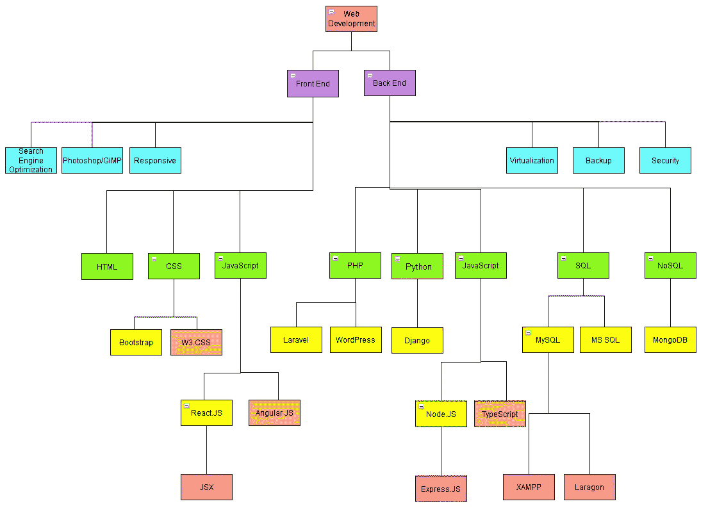

# 一张图中的 Web 开发绝对初学者指南

> 原文：<https://medium.com/codex/the-absolute-beginners-guide-to-web-development-in-one-picture-ebf9e8c96bdd?source=collection_archive---------20----------------------->

本·怀特在 [Unsplash](https://unsplash.com?utm_source=medium&utm_medium=referral) 上的照片

你是否在考虑成为一名网络开发人员，但是你不知道从哪里开始？不要害怕，因为所有有经验的 web 开发人员都曾在某个时候出现过。对于一些人来说，获得正确的信息可能很容易，但是如果你没有开发人员朋友，或者你毕业于一种不包括软件开发的教育形式，这对你来说可能很难开始。

当然，我们很多人都听说过经典的“从 HTML 开始，然后是 CSS，然后是 Javascript”。但这真的是你需要做的吗？我对 web 开发最大的挫折是，当我开始学习时，你可以学习这么多框架和这么多不同的东西来涵盖 web 开发的一小部分，你不知道什么是一个，什么是另一个，你真的不知道哪个是你想学习的，因为要学习所有这些东西需要花费很长时间，只是选择一个而放弃其他的。所以我发现，为了更好地理解 web 开发，你需要看一看更大的图片。所以在那个时候，我收集了尽可能多的信息，并在一张图中完成了绝对的网站开发初学者指南。

这是我想出来的

现在，这还远非完美，它并没有涵盖所有的内容，但这是一个很好的开端。我故意不告诉你任何颜色的意思。你可能会看着它，告诉自己它对你没有任何帮助，因为没有任何解释，但有趣的是。你所要做的就是谷歌(或任何你喜欢的搜索引擎)你在这张图片中看到的每一个关键词，以更好地理解整个 web 开发。上面展示的一些东西是编程语言，一些是框架，一些是概念等等。朝着正确的方向迈出一步，在网上搜索每一条。了解什么是框架，什么是编程语言等等。即使你对开发或编程一无所知，你也应该首先试着看到更大的图景，而不是一头扎进去，迷失在这个过程中。

一旦你对 web 开发有了一个整体的概念，你需要自己决定你想专攻这个领域的哪一小部分。如果你不确定，你可以什么都尝试一点，做最适合你的事情！事实是，并不像许多人声称的那样，从 HTML 开始，然后是 CSS 等等，你可以在不太了解其他东西的情况下制作 SQL 数据库或 PHP 后端，并且仍然认为自己是一名 web 开发人员。

在你决定你想做什么之后，你需要实践经验。互联网上有很多很棒的地方，那里有很多免费的资源，你可以在那里学习 web 开发，或者任何你想要的开发类型。我将在未来写一篇关于他们所有人的文章，敬请期待！在那之前，我会给你一个小提示，你可能想从网上搜索 W3Schools 开始，并使用他们的免费学习资源作为起点。

不要害怕自己去探索，要敢于学习非常规的方法。

保持坚定！