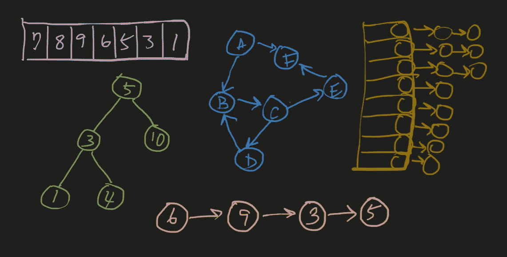
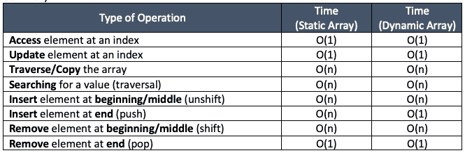
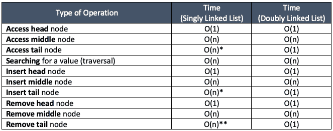
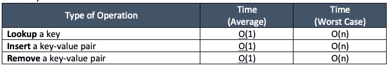
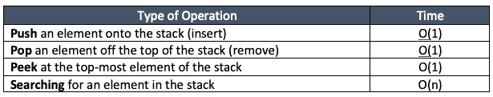
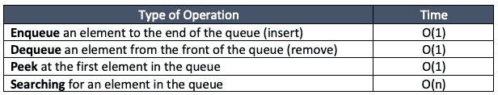

# 解决编码面试问题你需要知道的数据结构的绝对要点

> 原文：<https://medium.com/codex/the-absolute-essentials-of-data-structures-you-need-to-know-to-solve-coding-interview-problems-fbfb13700d5c?source=collection_archive---------13----------------------->

## 编码面试的主数据结构

## 了解这些 DSA 主题，通过大量的实践，您可以解决任何编码问题

## 以下是本文所涵盖主题的目录:

*   什么是编码
*   数据结构
*   复杂性分析
*   记忆
*   大 O 符号
*   对数
*   数组
*   链接列表
*   哈希表
*   堆栈和队列
*   用线串
*   图表
*   树

# 什么是编码

→操纵数据

→在最基本的层面上，软件工程师所做的是操纵输入数据以产生一些期望的输出数据。

# **数据结构**

→一种组织数据的方法，以便有效地处理数据，产生所需的输出。

# **复杂性分析**

→确定算法效率的过程。

*   涉及到**时间复杂度** & **空间复杂度**
*   时间和空间复杂度都用**大 O**符号表示。
*   **时间复杂度→** 算法有多快
*   **空间复杂度** →一个算法使用多少额外的存储空间

您需要做的是确定在解决特定的编码问题时应该使用哪种数据结构，以及当您对数据结构应用特定的函数和操作来解决问题时，时间和空间复杂性的结果是什么。

# **内存**

→临时存储代码中声明的变量和函数的地方。

内存可以被看作是一块有边界的画布，上面有有限数量的存储数据的槽。因为内存空间是有限的，所以尽量减少内存空间的使用是很重要的。

## 数据存储在存储器的**位**中。

*   一个内存插槽可以容纳 8 位(1 字节)。
*   1 个**字节**可以代表多达 256 个数据值(2⁸).
*   一个 8 位整数总共可以表示 256 个数字，从 0 到 255。
*   例如，数字 1 可以表示为 8 位二进制整数 0000 0001

## 我们如何表示更大的数据(例如大于 255 的数字)？

→使用更大的数据格式(例如 32 位整数、64 位整数等。)

*   因为每个字节可以代表 8 位，所以 32 位整数需要 32 位，或 4 个字节，或 4 个内存槽
*   当表示由超过 1 个字节组成的数据时，我们需要连续的内存槽来完整地存储数据。当操作系统为一段数据分配内存时，只会分配能够存储整个数据的连续内存插槽

需要注意的是，当你在这些整数“形式”中表示整数时，这个“形式”中的所有整数都是一个**固定宽度的整数**——所有 32 位整数都有 32 位，即使一个数并不真的需要全部 32 位。未使用的位简单地用 0 填充。

*   例如，用 32 位整数表示的数字 1 是

00000000 00000000 00000000 00000001

当这样的整数被存储在存储器中时，4 个连续的槽被分配来存储每 8 位。字节序列的顺序由“**字节序**决定。

*   在**小端字节序(LE)** 系统中，最低有效(或最右)字节(00000001)存储在 4 个槽的第一个(地址号最低的槽:

00000001 00000000 00000000 00000000

*   在**大端字节序(BE)** 系统中，最高有效(或最左边)字节(00000000)存储在地址号最低的槽中:

00000000 00000000 00000000 00000001

除了像存储整数一样存储一段数据，内存插槽还可以存储对包含某段数据的另一个内存插槽(或内存地址)的引用。

→这种存储对另一个存储器地址的引用的存储器槽充当“**指针**，指向存储某段数据的存储器地址。

访问内存槽(一个字节或一系列字节)被认为是一个非常基本的基本操作，只需要一个操作单元，因为访问指定地址的内存槽是即时完成的，就像访问数组的索引一样。

# **大 O 批注**

→大 O 记法用于表示一个算法的时间复杂度和空间复杂度。

**时间复杂度**衡量算法运行的速度——更准确地说，它衡量算法随着输入大小的增加而运行的速度。

**空间复杂度**衡量算法使用了多少额外的内存空间——更准确地说，它衡量相对于输入大小需要多少额外的内存空间。

**大 O** 是一个**渐近**符号→我们分析一个算法相对于输入大小的复杂度。随着输入 n 的增加(趋于无穷大)，使用的速度和空间有多快。

这意味着，当你用大 O 表示时空复杂性时，你忽略了任何常数和任何不重要的项。

*   例如，一个算法，比方说，无论输入 n 的大小是多少，都需要正好 30 次运算，将被表示为具有 O(1)的时间复杂度，即使确切的时间函数是 f(30)。
*   类似地，例如，已经被计算为具有 f(3n)的时间函数的算法将被简单地表示为 O(n)。
*   此外，如果您有一个算法，该算法有三个分别花费 O(1)、O(n)和 O(n)时间的函数，则该算法的时间函数将表示为 f(n + n + 1)。
*   然而，由于我们正在研究随着 n 变得越来越大而趋于无穷大，算法将花费多少时间，随着 n 变得足够大，n 和 1 与 n 相比将变得越来越不重要，以至于 n 和 1 可以被简单地忽略。
*   因此，时间复杂度可以简单地用最高有效项→ O(n)来表示。

## 当你有不止一个输入的时候呢？

→当一个算法接受多个可变大小的输入时，比如 n 和 m，您必须表示这两个输入。

*   例如，如果有一个算法对所有 n 个输入执行单个操作，而对所有 m 个输入执行另一个操作，则这将是 O(n + m)。你不能把这个组合成 O(2n)或者 O(2m)就说是 O(n)或者 O(m)。是 O(n + m)。
*   重要的是，这可能很棘手，但如果你有一个 n 和 m 的阶数不同的时间函数，比如 f(n + mlogm + n)，你可以忽略 n(与 n 相比，它的重要性较低)，但你不能忽略 mlogm，因为 n 和 m 是不同的输入。时间复杂度将为 O(n + mlogm)。

另外，请注意，虽然大 O 符号通常被解释为在编码面试的上下文中表达算法的最坏情况复杂性，但对于特定的算法，最坏情况可能不同于平均情况。

→在这种情况下，你应该确定平均和最坏情况的复杂性。

# **对数**

→对数是计算机科学中广泛使用的数学概念，在编码面试的情况下，用来描述某些算法的复杂度分析。

## **对数的定义(以 2 为底):**

*log2(n) = k 当且仅当 2^k = n*

当输入的大小为 n 时，log(n)基本上意味着获得 n 所需的 2 的幂。

*   例如，如果有一个输入 n，其中 n = 8，log(n) = log(8) = 3，因为 2 = 8。

从时间复杂度分析的角度来看，这真正意味着，输入 n 的大小每增加一倍，需要完成的操作数量只增加 1 个单位。

*   例如，让我们将 n 的大小加倍，使它现在是 16。log(16) = 4。这只是比 n 为 8 时多了 1 个单位。
*   随着 n 的规模越来越大，所需运算次数的边际增量越来越小。
*   这是一个非常重要的概念，与线性复杂度相比，它允许非常快的算法时间复杂度，更不用说其他更慢形式的时间复杂度了。

另一种看待 log(n)与时间复杂度分析的关系的方式是，当您有一个大小为 n 的输入时，每个操作会消除一半的输入元素(log 的底 2 基本上是这样的)，直到只剩下一个元素供操作处理，在这样的序列中从 n 到 1 所需的操作总数就是 log(n) = k。

*   例如，如果 n = 1，000，000，第一个操作消除 1，000，000 的一半，或 500，000，下一个操作依次消除 500，000 的一半，或 250，000，等等，直到只剩下 1。log(1，000，000) ~= 20。我们只需要做 20 次运算来处理 1，000，000 的输入。
*   另一方面，如果你有一个线性复杂度，对于同样大小的 n = 1，000，000，你需要做 1，000，000 次运算。
*   1，000，000 vs. 20 是一个非常大的差别，而且这个差别随着 n 的大小的增加变得越来越大。

# **数组**

→数组是最基本的数据结构。

从我们对内存的讨论中可以看出，当一块数据或一系列固定大小的数据存储在内存中时，操作系统会将它们分配给一系列可以连续存储全部数据的内存插槽。

假设我们有一个包含 3 个整数元素的数组:[1，2，3]。假设每个整数都是 32 位整数。

*   这意味着每个整数需要 32 位或 4 个字节。
*   因为数组有 3 个整数，所以它需要 4 * 3 = 12 字节的内存空间。
*   当操作系统存储该数组时，它必须找到一个具有 12 个连续可用地址的内存插槽序列，并将数组数据存储在该地址序列中。
*   更一般地，n 个元素的阵列，其中每个元素是 32 位整数(4 字节)，将需要 4n 字节的存储空间。
*   这也意味着数组被分配了一个字节序列的内存空间，其中数组的第一个元素存储在字节序列的第一个字节中。

现在，让我们看一下在阵列上执行一些常见操作的复杂性:

*   **GET** —访问给定索引处的元素:O(1) →操作系统通过将索引号乘以每个元素的大小来访问给定索引处的元素。因为每个元素都是固定宽度的，并且数组的第一个元素位于存储数组的字节序列的第一个字节，所以第 x 个元素位于所分配的内存空间的第 x 个字节。因此，操作系统简单地访问数组的第 x 个元素(32 位整数),从所分配的内存地址的开始处获取 x *字节的内存地址。
*   **SET** —更新给定索引处的元素:O(1) →在给定索引处设置元素，在时间复杂度上本质上和访问元素是一样的。
*   **COPY** —复制数组:O(n) →复制整个数组本质上需要访问所有元素—遍历数组。每当一个操作需要遍历数组时，它将花费 O(n)时间。当复制数组并将其存储在另一个内存地址序列中时，这需要额外的 n 空间。所以这也需要 O(n)空间。
*   **INSERT** —在开头、中间或结尾插入一个元素:O(n) →本质上，为现有数组分配的内存空间可能只够恰好适合该数组，例如，紧接在存储数组最后一个元素之后的下一个内存槽被一些其他数据占用。因此，本质上，将元素插入到数组中，无论元素插入到数组中的什么位置，都需要复制所有现有元素，并重新分配由插入的元素+现有元素的副本组成的新数组，这需要遍历所有元素— O(n)次。此外，由于必须使用新的存储空间来适应新的阵列，这也需要 O(n)空间。

这就引出了数组的关键子主题:**静态数组与动态数组。**

## 静态数组

→静态数组有一个固定的内存空间大小，这个大小不能改变。

## 动态数组

→另一方面，动态数组的数组大小是可以改变的。在大多数语言和操作系统中，动态数组是这样构造的，它用两倍于原始数组大小的容量进行初始化，然后每当没有更多空间来容纳额外的元素时，数组的大小就加倍。

因此，对于动态数组，在数组末尾插入一个元素只需要 O(1)次运算，当末尾有空间可用于额外的元素时，但是当空间被填满并且没有更多的空间可用时，数组的大小需要加倍，然后被重新分配给新的合适的内存槽，因此需要 O(n)次运算。

*   在数学上，这渐进地收敛到 2n 个操作。每次数组大小加倍都需要 n 次操作，但是随着大小的增加，大小加倍所花费的时间越来越长，因为每次数组大小加倍都必须插入双倍数量的元素。这实质上将 O(n)操作的频率减少了两倍，而 O(1)的频率增加了一倍。这可以表示为 n + n/2 + n/4 + n/8 … + 1，收敛到 2n。所以从数学上来说，在末尾插入动态数组也需要 O(n)时间。
*   但从概念上讲，由于 O(n)的频率越来越小而 O(1)的频率越来越高，所以我们说在动态数组末尾插入一个元素的**摊销**时间复杂度为 O(1)。
*   对于在开头或中间插入，动态数组帮助不大，因为元素无论如何都必须移位。
*   **在开头/中间删除** —删除开头(和中间)的元素:O(n) →同样，删除开头或中间的元素需要移动元素以填充删除的空间，对于静态和动态数组都需要 O(n)时间。
*   **删除末尾** —删除末尾的一个元素:O(1) →无论是静态数组还是动态数组，删除末尾的一个元素只是需要删除它，需要不断的运算。

## 总结:

# **链表**

→链表在概念上类似于数组，因为它们本质上是一个从左到右读取的元素列表，但关键区别在于它们在内存中的存储方式。

*   数组(静态)的主要缺点是需要连续的内存插槽来存储它
*   链表克服了数组的这个缺点。
*   链表的“元素”是“节点”，每个节点以指针属性的形式“链接”到下一个节点(或元素)。这意味着链表中的节点不必像数组中的元素那样在内存中背对背放置。
*   数组中的每个节点可以位于内存画布中的任何位置，但是每个节点都有一个指针，指向链表中的下一个节点。
*   因此，每个节点都有两个属性:值和指向下一个节点 (next)的指针**。**
*   链表的一个很大的缺点是，由于每个节点不是背靠背地存储在内存中，而是通过每个节点的指针的引用来链接，所以访问除了头节点(第一个节点)之外的特定节点需要从头节点开始，并逐个指针地遍历每个节点。这需要 O(n)时间。
*   搜索具有特定值的节点也需要 O(n)，因为需要遍历来定位该值。
*   从链表中插入和移除节点都需要首先通过遍历访问节点，然后执行插入或移除操作。这需要 O(n)进行访问+ O(1)进行插入/删除，或者基本上是 O(n)。
*   在链表中添加和删除一个节点本质上涉及到覆盖“下一个”指针。这要求您访问要插入/移除的节点之前的节点。

链表跟踪头节点(第一个节点)和尾节点(最后一个节点)，指向一个“空”作为它的“下一个”属性。根据你如何构造一个链表，你可以选择跟踪或者不跟踪尾节点。如果跟踪尾节点，则尾节点的查找时间将为 O(1)，而如果不跟踪，则必须从头到尾遍历一次，需要 O(n)。

## 链表分为两种类型:

*   **单链表** →除了 value 属性之外，还有指向下一个节点的指针(“next”属性)。单向(“单向”)链表。
*   **双向链表** →除了 value 属性，还有两个指针，一个指向下一个节点(“next”)，另一个指向上一个节点(“prev”)。头节点的“prev”属性指向“null”，尾节点的“next”属性指向“null”。双向(“双向”)链表。
*   **循环链表→** 循环链表没有明确的头节点或尾节点，由于尾部指向其头部(而不是 null)，形成循环关系。循环链表可以是**单向循环链表**或**双向循环链表**。

## 总结:

*假设没有跟踪尾节点。这里假设对于单链表，不跟踪尾部节点，但是对于双向链表，它们与头部一起被跟踪。

* *对于移除单链表中的尾节点，即使跟踪尾节点，时间仍然是 O(n ),因为要移除尾节点，您需要访问尾之前的节点，但是在单链表中，您没有“prev”属性来直接从尾访问前一个节点。您必须遍历节点，直到“next”属性指向尾部(它的“next”为 null)。

→某些操作的复杂性取决于如何构建链表。例如，如果构建单链表，使得每次插入/移除节点时更新尾节点，那么访问或插入尾节点将花费 O(1)时间。

# **哈希表**

→哈希表是一个键值存储。

对于哈希表来说**最重要的一点是，对于查找、插入和删除**，它的速度非常快，平均时间为常数 O(1)。

构建哈希表有很多方法，但是最常见的**哈希表使用的是动态链表数组**。

## 在哈希表中的查找是如何在常量时间内完成的？

→哈希表使用哈希函数将一个键(通常是一个字符串，也可以是任何其他可以被哈希的数据)转换成一个哈希值，然后映射到底层动态数组中的一个索引。与该键相关联的值被添加到存储在动态数组的映射索引处的链表中，并且对该键的引用也与该值一起存储。因此，只要最小化**冲突**，就可以在 O(1)中立即通过密钥访问哈希表。

*   当多个键映射到基础动态数组的同一索引时，就会发生冲突。存储在动态数组的每个索引处的链表允许存储已经映射到同一索引的多个键。
*   如果使用的散列函数不好，则键的分布非常不均匀，极端的情况是所有键都映射到一个索引，并且都存储在该索引处的一个链表中。这基本上需要 O(n)来访问某个值，因为您必须遍历链表来查找该值。
*   然而，如果使用非常好的散列函数，平均来说，动态数组的键的分布将是平衡的，使得时间复杂度基本上是 O(1)。
*   如果底层动态数组用完了可用的索引，那么必须调整它的大小(加倍)，以便可以映射更多的键。这与调整动态数组的大小本质上是相同的概念，摊销时间复杂度为 O(1)。

## 总结:

# **堆栈&队列**

## **栈**

→具有后进先出结构的类似数组的数据结构

*   堆栈通常用动态数组或链表来实现。
*   动态数组比较常见。

## **队列**

→具有 FIFO 结构的类似数组的数据结构(先进先出)

*   队列通常用(双向)链表来实现。
*   如果使用一个数组来创建一个队列，那么出列将需要 O(n)。

# **琴弦**

→字符串是一种原始数据类型，其行为类似于数据结构(字符数组)。

*   字符串中的每个字符都通过字符编码标准(如 ASCII 或 Unicode)映射到一个整数，这决定了在内存中存储字符串所需的字节数。

## **弦乐需要记住的一件非常重要的事情**:

*   根据您使用的语言，字符串可以是可变的或不可变的。
*   例如，在 C++中，字符串基本上是一个字符数组，你基本上可以像修改数组一样修改字符串
*   然而，在大多数其他语言中，如 JavaScript、Python 和 Java，字符串是不可变的。一旦你有了一个字符串，你不能改变它。如果你想改变一个字符串，唯一的方法是创建一个新的字符串。

→这意味着当您使用“string”+=“char”语法时，例如，在 JavaScript 中，这不仅仅是将“char”附加到“string”的末尾。实际上，它创建了一个全新的 n + m 大小的字符串，并将这个新字符串重新赋给原来的变量。

看一下下面的例子:

由于字符串的不变性，上面的例子看起来非常昂贵。

→它需要 O(n)，因为对于长度为 n 的 str 中的每个字符，它都创建了一个长度为 I 的新字符串<= n by copying and re-assigning all of the characters, which itself takes O(n) operations. Performing O(n) operations (creating new string) n times (length of str) essentially leads to a time complexity of O(n²).

## Therefore, when you need to deal with strings, *您不应该使用这样的语法直接操作字符串*。

*   您应该首先将字符串拆分成一个由单个字符组成的数组→ O(n)
*   然后执行所需的操作(追加等。)在数组上→ O(1)
*   然后将字符重新连接成一个新的字符串→ O(n)

这比直接在字符串上做一堆 O(n)操作要有效得多。

# **图表**

→图是相互连接或不连接的节点的集合。

## 图表由两部分组成:

*   **顶点**:节点
*   **边**:节点之间的连接

## **连接的**与**断开的**图表

*   连通图是指图中每对顶点都有一条路径，由一条或多条边连接。
*   在有向图的情况下，该图是:

**强连通**如果每对顶点之间存在双向连接

**弱连接**如果连接不必是双向的

*   不连通的图是不连通的图。

## **有向** vs. **无向**图

*   有向图有从一个顶点到另一个顶点的有向边。顶点之间的连接是单向的。只能在一个方向上移动。
*   无向图的边是非定向的，或者说本质上顶点之间的连接是双向的。可以双向穿越。

## **循环**对比**非循环**图

*   循环图是具有一个或多个循环的图。
*   无圈图是没有圈的图。

当三个或更多顶点连接成一个闭环时，就形成了一个**循环**。连续遍历路径将导致在当前路径中已经访问过的顶点。顶点以环形方式连接。

## 遍历一个图有两种方式:

*   **深度优先搜索(DFS):** 先深入再广泛
*   广度优先搜索(BFS): 先广后深

在 DFS 和 BFS 中，你需要访问每个顶点和每个顶点的边，所以遍历需要 O(V + E)时间。

图通常在代码中表示为邻接表，邻接表实质上是底层动态数组和链表的散列映射，其将顶点存储为关键字，并将每个顶点的连接边存储为映射到相应链表的关键字的值。

因为这需要所有顶点和所有边的内存空间，所以实现一个图需要 O(V + E)空间。

# **树木**

→树是一种特殊类型的图形

树有利于分层存储数据。

在编码面试中，树经常被用来测试你的递归知识。

*   必须连接*采油树*。如果断开连接，它就不是一棵树。
*   树是有根节点的有向无环图。

## 一棵树有:

*   根节点
*   每个节点有零个或多个子节点

每个节点及其子节点可以被视为递归形成的树的子树。

*   没有孩子的树的节点被称为**叶节点**(或**叶节点**)。
*   根节点和它的叶子之间的路径叫做**分支**。
*   一棵树的高度等于最长树枝的深度。
*   节点的**深度**是它到根节点的距离。(又名**级**)。

树的类型有很多种——**二叉树**、 **n 叉树**、**堆**、**树**等。

**二叉树:**节点最多可以有两个子节点的树。

N 叉树:节点最多可以有 N 个子节点的树。

**平衡二叉树:**二叉树在技术上可以是不平衡的，这样节点都以线性方式连续有一个子节点。平衡二叉树是这样一种二叉树，其中所有节点都有高度相差不超过 1 的左右子树。

遍历一棵树(访问所有节点)需要 O(n)时间，其中 n 是节点数。

## 遍历树有三种主要方式:

*   **预排序:**先访问根节点，再访问左节点，再访问右节点
*   **按顺序:**先访问左节点，再访问根节点，再访问右节点
*   **后置顺序:**先访问左节点，再访问右节点，最后访问根节点

**二叉查找树(BST):** 二叉查找树是一种特殊类型的二叉树，它对树的结构有特定的规则。对于所有节点，其左子节点必须小于父节点，右子节点必须大于父节点。

在二叉查找树中搜索一个节点平均需要 O(logn)时间，其中 n 是节点的数量。如果二叉查找树不平衡，最坏情况下的搜索时间可以是 O(n)。

**完全二叉树:**完全二叉树的节点完全填充到最后一级，对于最后一级，节点从左到右填充。

**完全(严格)二叉树:**节点有 0 或 2 个子节点的二叉树。它不能有 1 个子代。

**完美二叉树:**既完全&满又完全充满最大节点数的树。

## 参考:

算法专家(algoexpert.io)

Abdul Bari 教授的讲座(在 YouTube 和 Udemy 上)