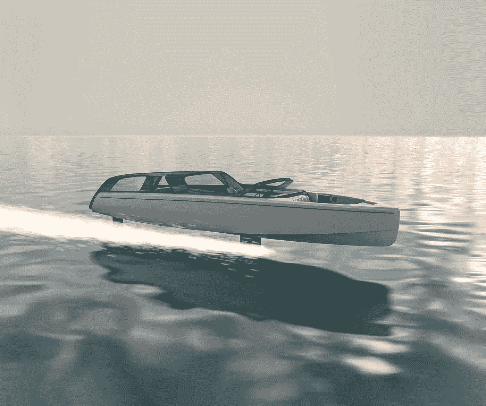

# Alte Volare:与众不同的电动水翼艇

> 原文：<https://medium.com/codex/the-alte-volare-an-electric-hydrofoil-tender-with-a-difference-e84a67ab68cf?source=collection_archive---------8----------------------->

## 这种船只彰显了富裕的生活方式

[Alte Volare(由 Cockwells 提供的媒介)](https://cockwells.co.uk/wp-content/uploads/2022/09/Alta-Volare-7-extended-2000x1673.jpg)

Alte Volare 是日益增长的电动水翼艇趋势的一部分，在过去几年中， [Navier](/@jclos2679/the-new-navier-27-an-electric-boating-masterpiece-d310bd8af2ae) 和 [Candela](/codex/a-hydrofoil-boat-should-help-venice-a07a19e42208) 设计了这种艇。然而，使 Alte Volare 与众不同的是它的创新设计，它有一个大的玻璃包裹部分