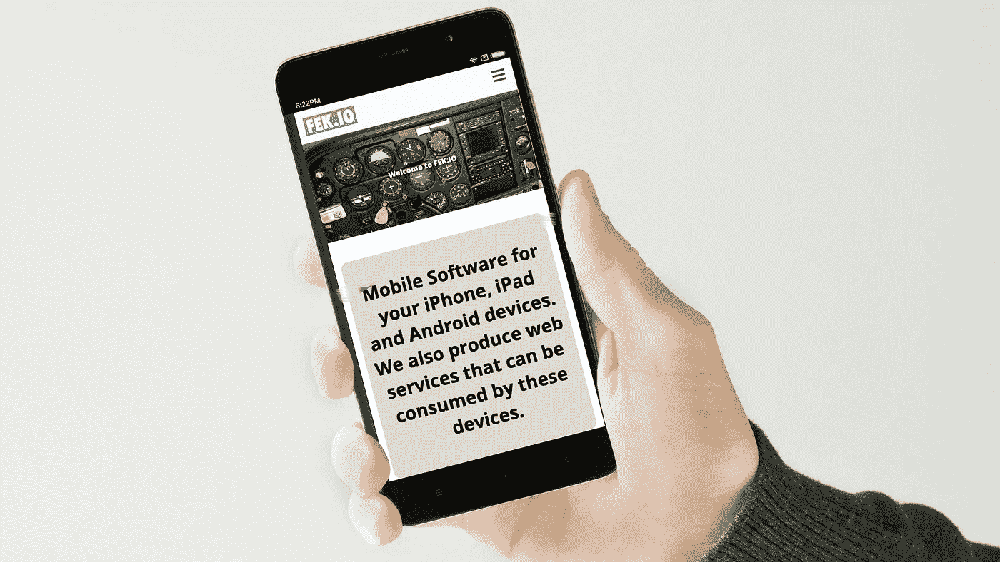

# Android WebView 坏了，谷歌不会修复它

> 原文：<https://medium.com/codex/the-android-webview-is-broken-and-google-will-not-fix-it-1160d1fb0d70?source=collection_archive---------6----------------------->

图片由大卫·费克提供

来自我最初的[博文](https://fek.io/blog/the-android-web-view-is-broken-and-google-will-not-fix-it)。

苹果和谷歌都是大公司。当他们的技术出现问题时，我们会记录错误，有时可能需要几年才能解决。对于个人开发者来说，这可能令人难以置信地沮丧。

尽管非常鼓励开发人员原生构建移动应用程序，但仍有许多…