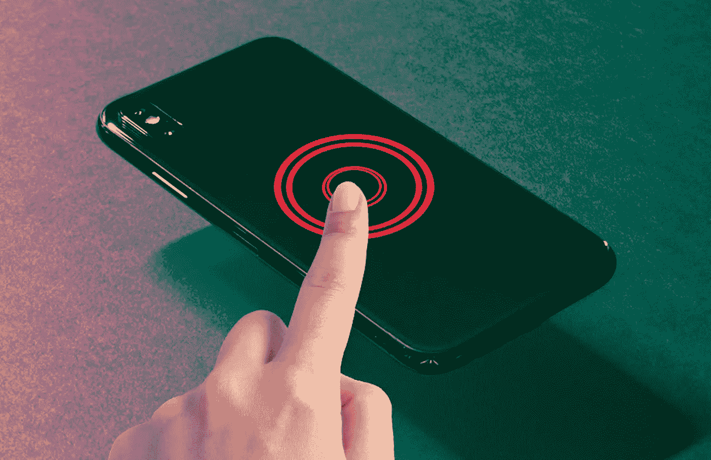

# iPhone 上的 Apple 标志是一个按钮。不开玩笑。

> 原文：<https://medium.com/codex/the-apple-logo-on-your-iphone-is-a-button-no-joke-dc039357b6f1?source=collection_archive---------4----------------------->

## 充分利用 1000 美元的电话。

来源:TapSmart

如果你可以双击手机背面，比如打开手电筒，那该有多酷？如果你想打开一个应用程序，或者只需按下苹果标志就可以截图，该怎么办？所有这些选项都是可能的！

# 我该如何施展这个魔法？