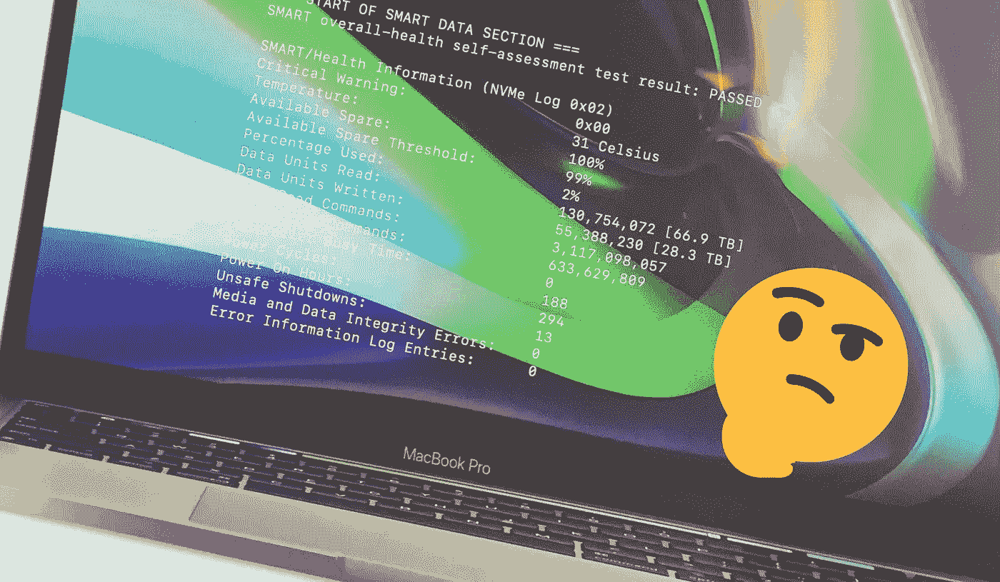

# 苹果 M1 固态硬盘交换门是一个巨大的过度反应

> 原文：<https://medium.com/codex/the-apple-m1-ssd-swapgate-is-a-massive-overreaction-50002ee23d0?source=collection_archive---------0----------------------->

## [法典](http://medium.com/codex)

我不是来为苹果辩护的。天知道，他们没有给我任何我没有付钱的东西(除了 Apple TV+)，我没有一个苹果股份，我的矮仙人掌也不是史蒂夫·乔布斯的远亲。和许多人一样，我也是一名技术爱好者，但也许我对技术世界的看法比这些天来的习惯更加平衡——因此我声明所有…