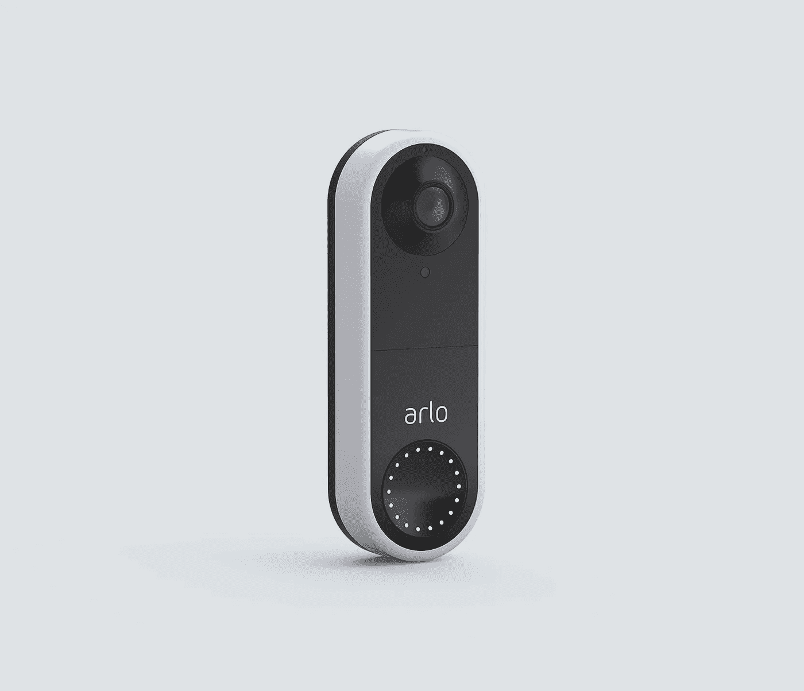

# Arlo Essential 有线视频门铃——综述

> 原文：<https://medium.com/codex/the-arlo-essential-wired-video-doorbell-a-review-1dcc52ef9c14?source=collection_archive---------12----------------------->

## 毕竟到目前为止我已经买了三个了！

[爱洛必备有线门铃(媒体由爱洛提供)](https://www.amazon.com/Arlo-Essential-Wired-Video-Doorbell/dp/B07YMV9VMT/ref=sr_1_5?crid=2TKIXCHQVMT2X&keywords=arlo%2Bessential%2Bwired%2Bvideo%2Bdoorbell&qid=1668779079&sprefix=arlo%2Bess%2Caps%2C127&sr=8-5&th=1#:~:text=https%3A//amzn.to/3gkHYtG)

Jeffrey Clos 是 Amazon Associates LLC associates 计划的参与者，这是一个附属广告计划，旨在为网站提供一种通过广告和链接到 Amazon.com 的**来赚取广告费的手段。本文中有一些链接指向所描述的产品。**