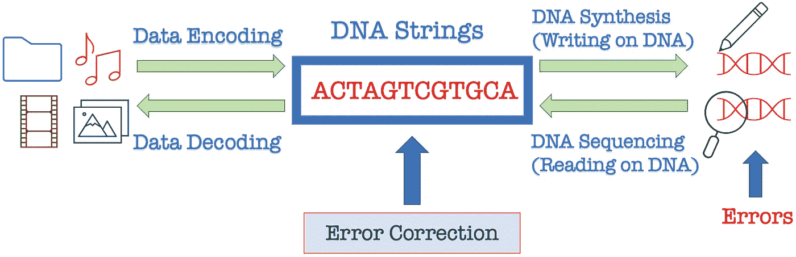
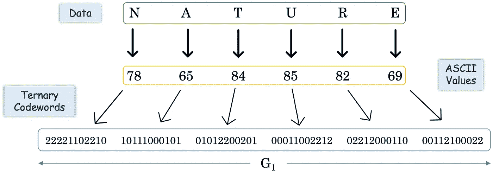
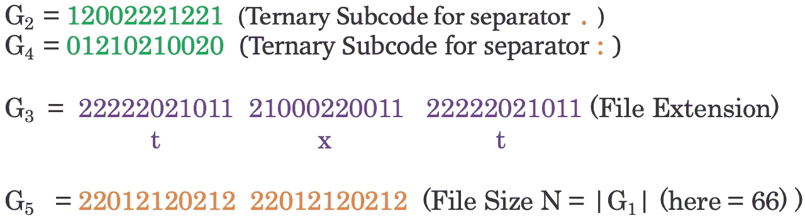
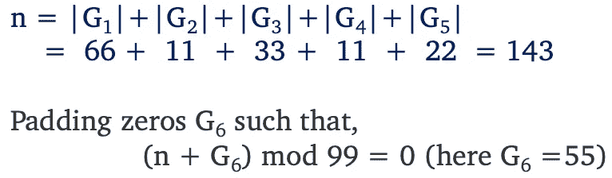
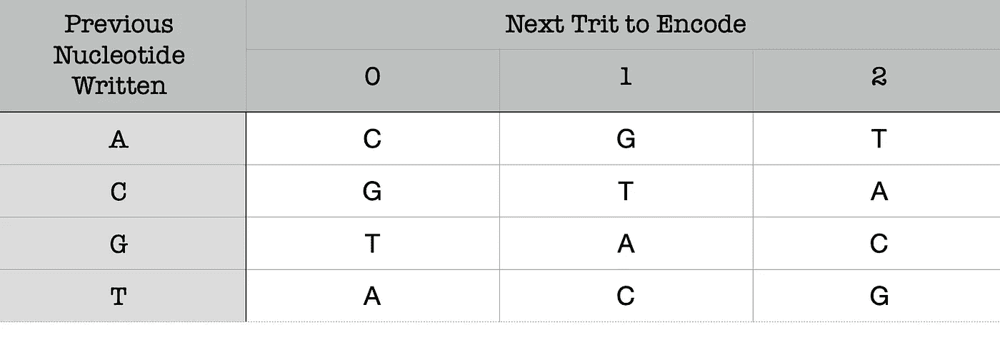
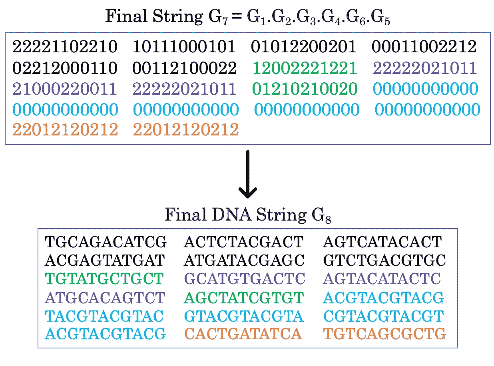
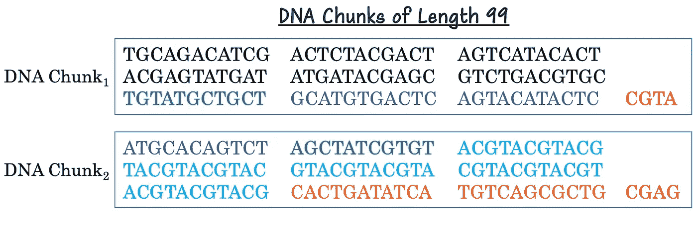

# DNA 数据存储的到来

> 原文：<https://medium.com/codex/the-arrival-of-dna-data-storage-c64c73ee8be5?source=collection_archive---------1----------------------->

计算是计算机执行信息处理的基本原语，需要存储、处理和检索数据。当这些计算由 DNA &蛋白质等生物分子执行时，它就产生了“生物分子计算”。人们可以将其分为 DNA、RNA、细菌、膜&肽计算。最受欢迎的新兴领域之一是 DNA 计算，其中计算是使用 DNA 链进行的。我们知道，在经典计算机中，计算问题是通过计算机中的电路来解决的，计算机以 0 的二进制串& 1 的形式提供输出。而在 DNA 计算中，计算问题被引入到 A、C、G、T 的 DNA 串中，计算在试管中进行，也以 DNA 链的形式产生输出。当被探索时，DNA 计算应用存在于 DNA 数据存储系统、DNA 瓦片、DNA 纳米结构、DNA 电路、DNA 链置换和 DNA 密码术的领域中；拥有有趣的数学问题。所有领域的计算都需要一个至关重要的东西，那就是数据。因此，我们一直在生产如此多的数据，以至于在不久的将来不可能处理数据爆炸危机。例如，自 2016 年以来，人类产生了超过 90%的世界当前总数据，我们每天都在创建海量的 2.5 万亿(10 ⁸)字节的数据。Eric Schmidt 对数据爆炸给出了一个很好的估计:

> “从文明诞生到 2003 年，人类已经产生了 5eb 的数据。现在，我们每两天生产 5 EB，而且速度还在加快。”—埃里克·施密特，谷歌前董事长，2010 年 8 月

我们看到这些数据在持续上升，所以要问的问题是，这个数据有多大？一兆兆字节(10 字节)可以在一个硬盘中存储 200，000 张照片，而一兆字节(10 ⁸字节)将占用 2000 个机柜，并包含一个占据整个城市街区的 2 层数据中心。最后，一个 yottabyte (10 ⁴字节)将充满美国特拉华州和罗德岛州的百万数据中心。存储数据的成本呢？如今，人们可以花 50 美元买到 1tb 的硬盘。因此，购买 1 兆字节的存储空间将花费 50 万亿美元。为了比较这一估计，我们看到 2019 年美国的国内生产总值约为 21 万亿美元。显然，存储一个字节是不可行的，因为它的成本比世界上一些最大的经济体还要高！我们得出结论，存储空间和成本都是亟待解决的问题。

下一代存储设备是 DNA。1 克 DNA 可以存储高达 455 艾字节的数据长达 1000 年。目前互联网的大小约为 700 艾字节，因此，2 克 DNA 足以存储整个互联网，这是一件了不起的事情。

DNA 数据存储系统的工作始于将二进制数据编码成 DNA 串。然后，这种 DNA 在实验室合成并储存在试管中。最终，这些数据可以从试管中取出，然后进行测序。最终，这些数据可以从 DNA 字符串解码成二进制字符串。(见图 1)我们应该知道，DNA 合成仅仅是 DNA 分子的书写或创造，DNA 测序是我们可以读取或测序 DNA 核苷酸的过程。然而，在这个过程中，在数据的读取、写入和存储过程中，确实会发生碱基替换、删除和插入等错误，因此编码理论在这里发挥了纠正错误的作用。

图 1:DNA 数据存储系统的工作机制。

乔治·丘奇和他的同事在 2011 年完成了第一个大型 DNA 数据存储实验，成功编码了一本 659 千字节的书。2013 年，Goldman 等人提出了一个模型，该模型使用纠错方案对超过 500 万比特的数据进行编码。后来开发了多种存储 DNA 数据的算法，但我们将看到其中一种早期的算法，它开发了一种高内存效率版本的 Goldman 模型。下面是一个将字符串*自然*作为文本文件编码成 DNA 字符串的例子:

图 2:展示了将字符串性质编码成三元码字。

在图 2 中，我们从将文本编码成 ASCII 值开始。ASCII 是一种用于电子通信的字符编码方案，用于将数字(0–9)、英文字母(大写和小写)和特殊字符编码为 0–255 范围内的值。我们看到任何计算机文件都可以转换成 ASCII 值的列表。然后，这个 ASCII 值被转换成一个三进制子码(trit ),由 3 进制编码(0、1 和 2)组成，每个 ASCII 值被分配一个长度为 11 的三进制码字(见中的表 2)。用于*性质*(长度为 66 的字符串)的完整三进制码字被称为 *G1* 。我们也采用三进制代码字作为分隔符*。*和 *:* 分别存储为字符串 *G2* 和 *G4* 。随后，文件扩展名 *txt* 和文件大小 *G1* 也被编码为 trit。(见图 3)

图 3:分隔符、文件扩展名和文件大小的三元代码字。

注意，琴弦 *G1* 、 *G2* 、 *G3* 、 *G4* 、 *G5* 的总长度为 143。现在，我们需要向这个字符串添加 55 个零，这样总长度可以被 99 整除。(见图 4)

图 4:展示了文件的总长度和零的填充。

在图 6 中，我们现在得到一个长度为 198 的最终字符串 *G7* ，由三进制子码组成。为了将这个字符串存储到 DNA 中，我们现在使用图 5 中的表格将 *G7* 转换成 DNA 字符串 *G8*

图 5:用于将三元码字串转换成 DNA 串的算法表。

转换以这样的方式进行，即识别前一个写入的核苷酸和下一个要编码的三进制代码字。例如，我们在前者中有 base *C* ，在后者中有 trit *1* 。所以，使用这个表，我们可以得到相应的基底，这里是 *T* 。因此，后面的 trit *1* 现在被转换成核苷酸 *T* 。这个过程以同样的方式继续，直到我们获得完整的最终 DNA 序列。(见图 6)

图 6:三元码字串到 DNA 串的转换。

在图 7 中，如此获得的 DNA 链现在被切割成两个长度为 99 的片段。这两个组块随后分别附加有组块标识符 CGTA 和 CGAG。我们现在获得了最终编码的 DNA 串！

图 7:显示了两个 DNA 片段。

DNA 数据存储领域有许多有趣的数学问题。例如，图 5 中描述的映射可以扩展到不同的字母表，例如二进制⁴、四进制等。或者更一般地用于其他代数结构，例如有限域和有限环。我们需要确保图谱保留了非均聚物、DNA 链自由二级结构和其他生物限制的特性，以便将 DNA 存储中的错误降至最低。提供 DNA 字符串的安全存储也是一个有趣的数学挑战。寻找不同的编码方法，以便能够实现 DNA 数据存储的最大物理密度和理论数据密度也很重要。许多研究者已经研究了许多错误模型和编码方案。

## 最近的一些发展

2019 年 3 月，微软与华盛顿大学合作，成功地将数字信息编码成 DNA，并再次还原成比特。这台机器由装有化学药品的玻璃瓶和一个序列发生器组成，能够存储和检索单词“hello ”,仅仅是 5 个字节的数据。此外，这一过程需要 21 小时，大约产生 1 毫克 DNA。这表明，我们距离实现速度快十亿倍、超级紧凑的 DNA 数据存储方法还很远。

像 Twist Bioscience、Catalog、Helixworks、DNA Script 等创业公司。领导团队创造了一种商业的 DNA 数据存储方法。微软也是这一领域的游戏改变者。还有像 Evonetix、Molecular Assemblies、Iridia、Kilobaser、Synthomics 等公司。都在这个领域工作。最近，在 2020 年末，Illumina、Twist Bioscience、微软和西部数据组成了一个联盟，以发展一个行业，并彻底改变 DNA 数据存储的商业化。

目前的测序技术，如 Sanger 测序，一种使用酶、DNA 核苷酸、双脱氧核苷酸和引物对 DNA 进行测序的方法，具有诸如高成本、低产量和不紧凑的局限性。此外，下一代测序技术更好，但仍然不是很有能力。最近，纳米孔 DNA 测序已经有了显著的发展，它能够在很短的时间内对长 DNA 片段进行测序。这项技术由牛津纳米孔技术公司开发，成本低，超紧凑，可以在一个像钢笔一样小的设备中对 DNA 进行测序。此外，纳米孔测序不需要 PCR(聚合酶链式反应)，一种用于复制 DNA 片段的实验室技术，或化学标记，因此是未来使用的非常可行的技术。

最近的一些头条新闻也探索了在基于细菌的数据存储器上存储数据的可能性。令人兴奋的是，人们将能够在他们的胃中储存肠道细菌的数据！

此外，不久前，一部数字电影使用 CRISPR-Cas 成功存储在细菌活体种群的基因组中。CRISPR 是一种基因编辑技术，可用于改变 DNA 序列。可以很容易理解为一把能够改变基因组功能的分子剪刀。

要深入了解这一领域，你可以看看⁵、⁶和⁷.

最后，我们引用 Adleman 的一句话作为结束，他邀请研究人员在这个新兴领域的海洋中潜水。

> “生物学和计算机科学——生命和计算——是相关的。我相信，在它们的界面上，伟大的发现正等待着那些寻找它们的人。”——伦纳德·阿德曼，《科学美国人》，1998 年 8 月

## 参考

乔治·m·丘奇、高远和斯里拉姆·科苏里，*DNA 中的下一代数字信息存储*，《科学》337 (2012)，第 6102 期，第 1628-1628 页。

尼克·戈德曼、保罗·贝尔托内、陈思远、克利斯朵夫·德西莫兹、艾米丽·m·莱普罗斯特、博东·希波什和伊万·伯尼，*《合成 DNA 中实用、高容量、低维护的信息存储》*，《自然》494 期(2013 年)，第 7435 期，第 77-80 页。

Dixita Limbachiya、Vijay Dhameliya、Madhav Khakhar 和 Manish K Gupta，*关于档案 DNA 存储的最佳编码家族*，2015 年第七届信号设计及其在通信中的应用国际研讨会(iwsda)，2015 年，第 123-127 页。

⁴·克里希纳·戈帕尔·贝内吉、苏拉夫·德布和马尼什·k·古普塔，*关于无冲突 DNA 编码*，《密码学与通信》13 (2021)，第 1 期，第 143-171 页。

⁵·s·m·侯赛因·塔巴塔巴伊·亚兹迪、韩茂凯、伊娃·加西亚·鲁伊斯、马建、赵慧敏和奥尔吉卡·米伦科维奇，*基于 DNA 的存储:趋势和方法*，IEEE 分子、生物和多尺度通信汇刊 1 (2015)，第 3 期，第 230-248 页。

⁶·路易斯·塞兹、杰·尼瓦拉和卡琳·施特劳斯，*使用 DNA 的分子数字数据存储*，《自然评论遗传学》20 (2019)，第 8 期，456-466。

⁷ DNA 数据存储联盟，*保存我们的数字遗产:**DNA 数据存储介绍*，2021 年。于 2021 年 6 月出版，可在[https://dnastoragealliance.org/publications/](https://dnastoragealliance.org/publications/)网站在线获取