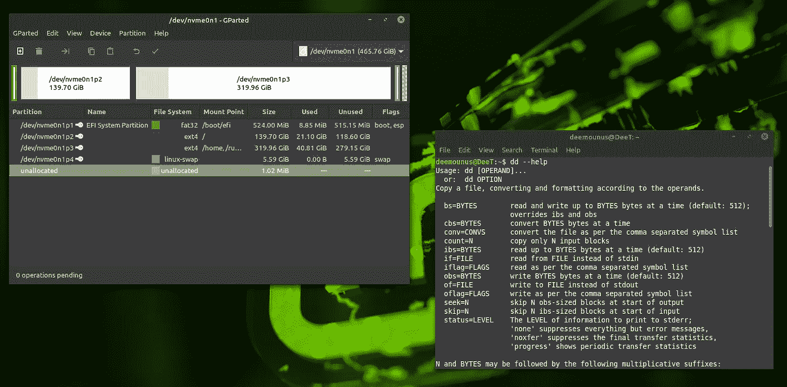

# 克隆磁盘驱动器的艺术:“dd”命令的主要使用模式

> 原文：<https://medium.com/codex/the-art-of-cloning-disks-the-dd-command-primary-usage-patterns-ff377b7616c9?source=collection_archive---------0----------------------->

## [法典](http://medium.com/codex)

Gparted 在终端中与 DD 一起运行

*最好的学习方法是什么？*通过做事，对吗？事实上，这就是我们学习的方式。包括犯错误，这是不可避免的。

例如，我已经学会了如何通过使用众所周知的“dd”命令来克隆磁盘。这里有什么问题？我把硬盘上的内容弄乱了，因为我提供了…