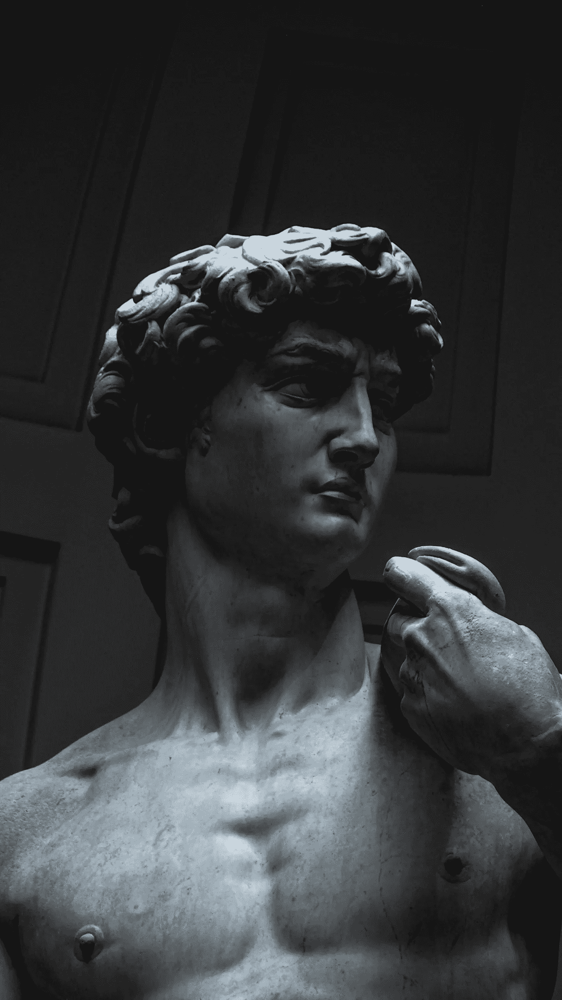

# 代码的艺术

> 原文：<https://medium.com/codex/the-art-of-code-1842602b5651?source=collection_archive---------12----------------------->

杰克·亨特在 [Unsplash](https://unsplash.com/s/photos/michelangelo?utm_source=unsplash&utm_medium=referral&utm_content=creditCopyText) 上的照片

当你想到艺术时，你会想到什么名字？或许是米开朗基罗？贝多芬呢？吉恩·凯利？安德里亚·博切利呢？甚至孙子？

艺术，以其多种形式，给世界带来了巨大的影响和意义。无论是绘画、音乐、戏剧……艺术都可以是有教育意义和鼓舞人心的。它吸引了想象力，点燃了情感。它可以改变世界——一次一颗心。有趣的是，艺术的力量不是…