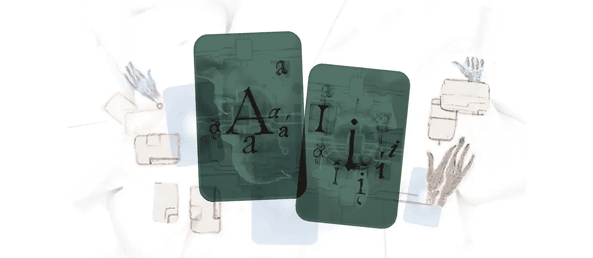

# 人工智能如何改变我们书写事实和虚构的方式

> 原文：<https://medium.com/codex/the-artificial-author-15a55f9f4b3a?source=collection_archive---------36----------------------->

## 虚构的作者

人工智能(AI)能够自动生成与人类书写的文本几乎无法区分的文本。图片:Alina Constantin/AI 的更好图像/手工制作的人工智能/由 CC-BY 4.0 授权

人工智能(AI)可能会彻底改变我们的写作方式。人工智能可以生成任何主题的大量综合内容，从小说中过滤事实，并为诗人和编剧提供创作灵感。但是我们应该如何看待这个革命性的工具呢？计算机无止境的输出有可能揭示我们隐藏的某些东西吗？

*作者亚当·斯密*

人工智能将如何改变人类的书写方式？我认为首先我们应该考虑写的是什么。写作是做什么的，为什么？写作的目的是交流，虽然，我想有些人可能很高尚，不会承认这一点。

写作不仅是记录信息的一种方式，也是交流信息的一种方式。写作可以通过多种方式和多种层次进行交流。

例如，这是菲利普·拉金的一首著名的诗的第一行:“他们操你，你的妈妈和爸爸”。

尽管句子中没有任何东西可以直接传达出它是一首诗——尽管句子本身可能不会被认为是一首特别有诗意的诗——然而，诗歌的这种间接传达给我们提出了一个重要的挑战，挑战我们对诗歌的理解。如果我说“他们操你”，但不解释我在引用拉金的诗，我还有必要说“来自菲利普·拉金的著名诗，”他们操你吗？“那会显得相当尴尬……

所以写作可以间接沟通事物。也是一种和自己沟通的方式，和和别人沟通一样多。

如果我写下一些东西，比如购物清单，那么一般来说我会更容易记住它。如果一篇文章的内容与我相关——而不仅仅是与他人相关——那么写下来会让这种相关性在我心中更加强烈。

# 占卜师和茶叶

除了开头的问题，这六个段落是由哲学家 AI 写的——一种建立在语言模型基础上的人工智能算法，使用深度学习来制作类似人类的文本。GPT-3 模型是我们开发的最复杂的自动完成形式。它从构成互联网的大量推文、帖子、文章、博客和其他内容中汲取营养，已经“学会”了最有可能跟随提示的句子。很明显，他有诗歌天赋。

正如治疗师可能会建议自由联想，或者垮掉的一代作家可能会在致幻剂的影响下产生意识流，人工智能能够实现人工智能作者 K·阿兰多-麦克道尔所描述的“自动化笔迹狂”。

不是所有的事情都是相关的，甚至是可以理解的；就像占卜者检查茶叶一样，从模式中挑选出意义是人类的责任。机器人哲学家的回答对我们和它本身有什么意义？

“写作是一种交流方式”可能是对这个问题最直接的回答，也是事实和虚构作家利用人工智能最明显的方式。在过去的二十年里，随着社交媒体的出现，我们相互交流的能力得到了极大的提高。然而，也打开了阴谋论和病毒谎言的大门。

大量的帖子让人类很难区分哪些是准确的，哪些是不准确的。然而，人工智能也许能够扭转这一波错误信息的浪潮。像英国 Logically 这样的公司将人工智能与人类研究人员一起使用，以阻止在线阴谋的流动，通过之前经过事实核查的信息数据库运行潜在的虚假声明，以分配可信度得分，并在人们分享之前警告他们不可解密。

人工智能还可能在其他方面帮助记者:撰写体育赛事或季度收益报告的简短摘要，分析数据库并从大数据中提醒人类趋势，甚至向读者推荐内容。与其让记者失业，不如节省他们收集信息、核实事实和撰写只有人类才能完成的深度报道的宝贵时间。

哲学家艾恰当地指出，文字也可以用来与我们自己交流。对于有创意的作家，丹麦亚历山德拉研究所的人工智能团队与出版社 Egolibris 合作，创建了一个数字编辑器。在收到各种类型的 3000 多本畅销书后，这个名为 Edison 的算法会提供关于可读性、人物互动和叙事弧线的反馈。

有些人可能担心千篇一律的小说或剧本的崛起，但在这里，人工智能可以简单地扩大布莱克·斯奈德的《拯救猫》或坎贝尔·约瑟夫的《千面英雄》等作品已经提供的洞察力——或许可以揭示我们口味背后隐藏的深度。艺术托起生活的镜子，人工智能也有可能托起艺术的镜子。

然而，无论好坏，没有一个系统是完美的。前者带来了数据诗人罗斯·古德温(Ross Goodwin)所利用的那种创作自由，他最近的短篇《太阳之春》(Sunspring)是由一个经过数十部科幻电影剧本训练的人工智能创作的。

结果很糟糕，漫无目的的对话几乎与之前的句子无关，自相矛盾的舞台指示让演员们无法遵守，但电影的形状是显而易见的——就像一个半记得的梦——看起来仍然很有趣。像这样使用一个人工智能有着清晰的创造历史。200 多年前，浪漫主义诗人约翰·济慈提出了“消极能力”的概念，即作家可以不受真理、逻辑和科学的传统框架的束缚，追求自己的视野；同样的框架，人类可能会受到限制，但人工智能是自由的。

# 偏见和平庸

正如人们常说的那样，人工智能的弊端在于它没有完全摆脱框架。经过人类语言和感知的训练，它反映了人类的偏见。阿姆斯特丹 NxTMuseum 的编码凝视展览展示了面部识别工具中的人工智能如何反映执法和安全机构中的种族主义和性别歧视——无法为有色人种提供与白人面孔相同的个性和特权。

向前看——无论是阅读这份档案中的文章，还是更普遍地思考人工智能——还有哲学家艾的信息的最后一部分需要考虑:相关性。

尽管这看起来是关于购物清单的老生常谈，但该算法实际上发现了一个显著的观察结果，即无论写下了什么，它都更有可能记住。在哲学家人工智能网站的底部，有一个将其输出共享到 Reddit 的提示。这样做最终会成为另一种人工智能训练计划的一部分。用 GPT-3 在其他项目中制作的文本也可能在互联网上发布，所有这些都成为反馈回路的一部分。

虽然我们不知道未来的算法会告诉我们什么，但它们的答案将基于我们今天提出的问题和采取的行动。这是我们对自己和未来的责任，确保它们是好的。

## **相关链接**

*   [哲学家艾](https://www.philosopherai.net/)
*   [科技公司逻辑上](https://www.logically.ai/)
*   [天秤座](https://gts-net.dk/ny-ai-model-skal-spotte-den-naeste-bestseller-bog/)
*   [短片《太阳之春》](https://www.endcue.com/sunspring)
*   [视频系列“编码凝视”，在阿姆斯特丹 NxTMuseum 展览](https://nxtmuseum.com/artist/the-coded-gaze-algorithmic-justice-league/)

## 作者

亚当·史密斯是《独立报》的科技记者。

版权:正文:[歌德学院，亚当斯密](https://www.goethe.de/en/index.html)。本作品在[知识共享署名 4.0 国际版(CC BY-SA 4.0)](http://creativecommons.org/licenses/by-nd/4.0/) 许可下获得许可。

2022 年 2 月

*原载于*[*https://www . Goethe . de*](https://www.goethe.de/prj/one/en/aco/art/22736509.html)*。*