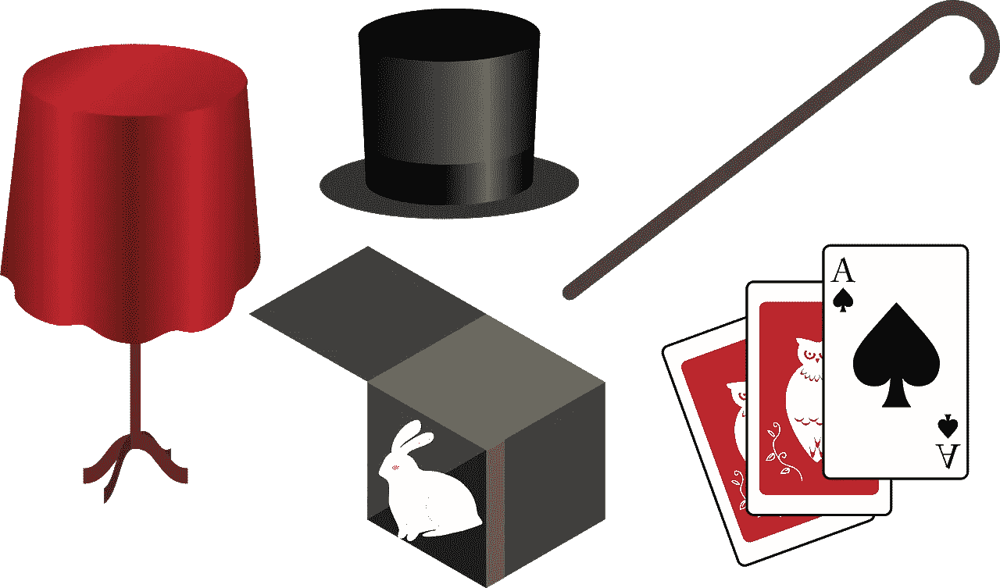

# 惊人的空弦

> 原文：<https://medium.com/codex/the-astonishing-empty-string-44c25a261db9?source=collection_archive---------17----------------------->

## 等等，什么？

照片由[企鹅摄影](https://pixabay.com/users/penguingraphics-5426829/)在[皮克斯贝](https://pixabay.com/vectors/magic-wizard-magician-fantasy-4638924/)拍摄

如果你像我一样，已经使用动态类型编程语言如 JavaScript、PHP 或 Python 工作了一段时间，那么你可能会在某个时候将`null`值赋给一个字符串变量。

# 为什么不呢？

或许，你在想这样做更好，或者，甚至更简单，当你习惯了…