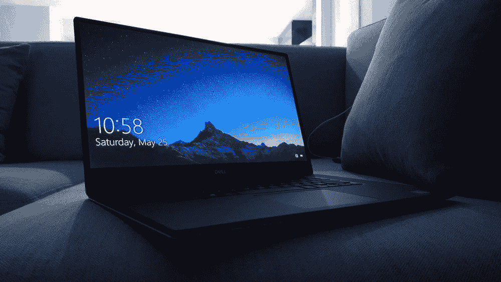

# Windows 笔记本电脑尴尬的中间状态

> 原文：<https://medium.com/codex/the-awkward-middle-state-of-windows-laptops-1a9912ae1b9?source=collection_archive---------6----------------------->

图片来源: [Jay Prajapati via Unsplash](https://unsplash.com/@jayprajapati_)

从很小的时候起，我就是一个篮球迷。90 年代，我在纽约长大，爱上了这项运动。像帕特里克·尤因和迈克尔·乔丹这样的球员的球技让我立刻对这项运动产生了热爱，这种热爱伴随了我的一生。篮球的一个现实是，特别是在职业水平上，你最不想去的地方就是中间。作为一个团队和一个…