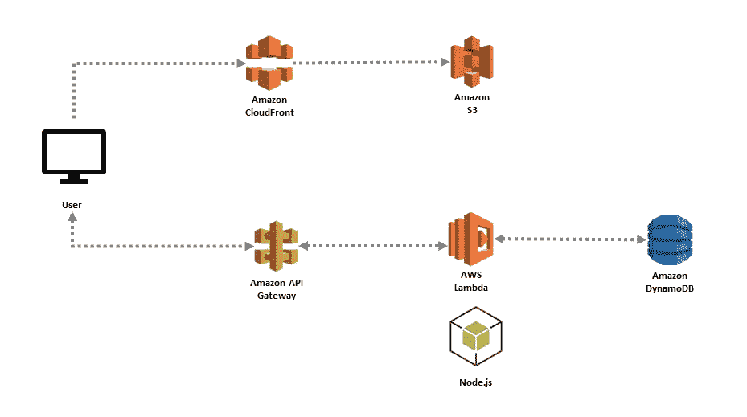
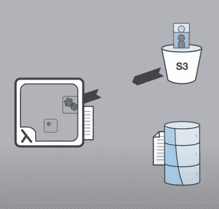
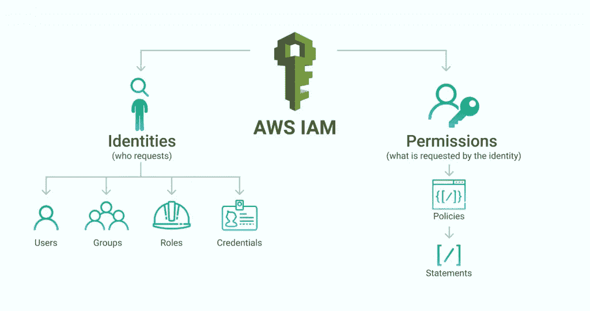
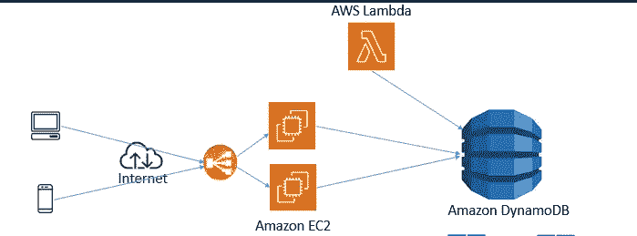
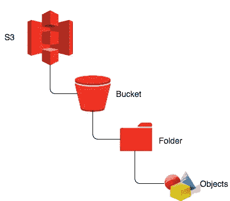

# AWS 无服务器骑手

> 原文：<https://medium.com/codex/the-aws-serverless-horseriders-d09124ca7fde?source=collection_archive---------16----------------------->

图片来源:Greenbiz

每天都有很多关于云的讨论，今天我选择了我们就**无服务器架构**和相应的可能改变工程师实现云的方式的骑士进行一次小小的交谈。2016 年，当我第一次进入云计算领域时，我经常从高级工程师那里听到**“无服务器”**这个词，但我总是想象无服务器意味着实际上没有服务器，但随着时间的推移，我开始理解真正的东西。

但是，让我们来定义一下**【无服务器】**这个概念。首先，在无服务器计算世界中实际上存在物理服务器，但是工程师/开发人员不需要知道它们的存在。无服务器架构定义了工程师在云中部署和处理代码的能力，而无需担心基础设施和流程。*它很大程度上被看作是云中的一个****【as-used】****服务。*

> **云计算运营的核心是围绕“无服务器架构”构建的**

在 AWS 中，无服务器的概念必须遵守四个主要规则:

*   **系统中存在容错/可用性。**
*   **运行代码的现收现付价值系统(未使用的部分不会计费)。**
*   **服务器不需要开发者/用户管理。**
*   **基于使用曲线的系统缩放。**

展望未来，无服务器架构允许工程师投入更多精力来构建产品，而云操作则在书本之外处理。但是，该架构是由一些被视为 AWS 无服务器架构骑士的服务驱动的，但我认为它们是支柱(如果你喜欢，你可以使用骑士)。骑士/柱子会在我们开车的时候详细讨论，请续杯咖啡。

无服务器架构

## **AWS Lambda**

当在应用程序的后端空间处理事件时，您将需要管理基础设施、检查应用程序状态、管理大量服务器和其他繁琐的活动，但是随着无服务器计算的出现，您需要支付的只是计算时间，然后您可以根据自己的需要在本地消耗和处理代码。

> **AWS Lambda 由事件驱动计算驱动，作为服务运行(将事件分配给特定应用程序代码),最重要的是无需服务器。**

AWS Lambda 运行对对象上传/下载、存储桶管理、数据库更新甚至应用内活动等事件的响应。它将实时日志发布到 cloud watch，你可以跟踪你上传的代码的操作。你可以很容易地开始使用它，你可以使用你的任何语言库，比如 Node.js，Python，Go 等等，最近本地库也参与进来了。*使结构完整的功能有三个部分；* ***Handler()函数，事件对象和上下文对象*** 。有一些已经为普通应用程序建立的结构的使用示例，所以如果你是初学者，你可以探索一下，如果你已经有了 lambda 代码，你可以把它作为 zip 文件上传，甚至可以使用 Lambda 函数 open space。

S3、DynamoDB 和 Lambda 函数之间的数据流

如图所示，您可以使用 AWS SDK 和 boom 将 S3 桶和 DynamoDB 与 Lambda 函数集成在一起，这样您就可以实现流程自动化，照顾您的狗，甚至下棋。最后，谈到支付，你可以根据价值和运行代码来支付，但根据我的经验，有时更多的内存可以降低价格，令人震惊吧？我来解释一下， ***Lambda 只公开了一个内存控制器，将 CPU 内核和网络容量的%分配给该函数。所以如果你的代码依赖于网络，内存，甚至是网络，那么你可能需要使用更多的内存来降低速度。***

## AWS IAM

每当我想到 IAM 时，脑海中浮现的都是安全性和特权，然后是对服务的关键访问。AWS IAM 是 AWS 身份访问管理的缩写。有了这个特性，您可以为用户分配角色，这样他们就可以执行他们需要执行的任务。根据定义，IAM 策略编写允许您向您的用户/工程师授予访问权限，但更进一步，AWS 需要执行这些策略，并允许基于已设置的预定义规则进行访问控制。

IAM 政策理念草图-MSP360

有一个策略结构/语法，它有四个主要部分，I **【缩写】** **PARC** ，分别代表**主体、动作、资源和条件** n。在每种情况下，它们都必须在代码中进行标识，但在某些情况下，主体可能不是必需的。然而，根据经验，如果您引用某个存储桶，我认为您应该确保分配主体。

*AWS 将* ***主体*** *定义为允许/拒绝访问的实体，将动作定义为允许/拒绝访问的访问，* ***资源*** *是动作将作用于的 AWS 资源，然后最终* ***条件*** *是访问有效的条件(这可以在构建 VPC 和基础设施时出现。最后，IAM 与无服务器架构非常相关，您应该在此处* *查找文档* [***。***](https://docs.aws.amazon.com/IAM/latest/UserGuide/access_policies.html)

在总结 IAM 之前，我们应该理解策略类型和可能的用例。一些最著名的政策如下所示:

*   **服务控制策略:**这是为了禁用帐户主体上的服务访问而设计的，因此在使用存储桶策略时相对有用。
*   **权限策略和权限边界:**这很简单，只是用来描述如何为某些用户设置边界。例如，用户可以限制在组织内设置某些权限。
*   **缩小范围的策略:**这进一步减少了系统中通常共享的权限。
*   **基于资源的策略:**顾名思义，它们是基于资源的策略，它控制对系统/组织中某些资源的跨帐户访问。
*   **端点策略:**使用 VPC 端点，您可以控制对服务的访问，我指的是组织内用户对服务的访问。

最后，我想我应该在此结束 IAM 策略，但我相信您应该理解，这些策略通过确保服务控制策略和 IAM 策略/基于资源的策略之间存在某种信任系统来协同工作，因此一切都必须允许纯粹的通信。你可以在这里 阅读更多关于策略 [**及其对无服务器架构的影响。**](https://aws.amazon.com/iam/#:~:text=AWS%20Identity%20and%20Access%20Management%20(IAM)%20enables%20you%20to%20manage,offered%20at%20no%20additional%20charge.)

## AWS DynamoDB

[Amazon DynamoDB](https://aws.amazon.com/dynamodb/) 是一种快速灵活的 NoSQL 数据库服务，适用于任何规模下需要一致的单位数毫秒延迟的所有应用程序。还记得我们的无服务器用例吗？在这个用例中，事件和活动不容易处理，所以我们需要雇佣这些骑手来使工作顺利进行。嗯，Amazon DynamoDB 就是这样的骑手之一，它被用于许多可伸缩的应用程序中。它是完全托管的，可以处理加密、SLA，每天可以处理超过 1 万亿个请求。

带 Lambda 的 DynamoDB 草图

在使用 DynamoDB 时，不需要创建/配置服务器，您只需访问控制台并开始创建表，这与复杂世界中的其他数据库不同。*它的一些特性包括事务、动态容量管理、高可用性、持久性、按需容量模式、静态加密、表部件(即分区键、排序键、属性等)、用户友好的控制台、DAX 支持，以及许多其他很酷的东西*。进一步，您可以通过这个[指南测试表的创建。](https://docs.aws.amazon.com/amazondynamodb/latest/developerguide/SampleData.CreateTables.html)

## AWS S3

[亚马逊简单存储服务](https://aws.amazon.com/s3/)是一种对象存储服务，提供行业领先的可扩展性、数据可用性、安全性和性能。亚马逊 S3 易于使用，有一个简单的网络服务界面来存储和检索网络上任何地方的任何数量的数据。企业和产品(尤其是拥有大量用户的产品)中使用的数据类型非常复杂，这就是必须引入存储服务的地方。在某些情况下，它可以用于从 Cloudwatch 收集日志，以便进行研究和提取。

S3 基础建筑

这里有无与伦比的耐用性、安全管理和由来自世界各地的多样化第三方合作伙伴组成的庞大生态系统。它还允许在 AWS 中进行任何分析处理的业务流程。出于数据标准和保护的考虑，数据可以存储在不同的可用性区域，但为了降低成本，您也可以采用其他方式，这无疑是有风险的。对于安全性和法规遵从性，执行加密，并遵循安全标准和最佳实践。此外，我们可以将 S3 与 Lambda 结合使用，这是一种有趣的数据存储方式。有机会利用红移光谱来分析 S3 桶数据和云中其他很酷的东西。我们可以继续下去，但让我把你留在这里消化，我们可以在其他时间谈论其他 AWS S3 的细节。

最后，每个了解如何构建和自动化之前讨论的这些服务的 AWS 工程师/用户都有能力构建一个新的世界，端到端地骑着无服务器的马，关闭那个世界，创建一个新的世界，再骑一次并重复——明确地说，知道这些骑手的本质，你就控制了世界。

现在，为了记录，这个内容对社区中的各种人开放。如果你有问题，有评论，有投稿，在这里拍或者**联系我** [**推特**](https://twitter.com/SamuelArogbonlo) **和**[**Github**](https://github.com/samuelarogbonlo)**。**

**感谢阅读❤️**

如果你对这个话题有任何想法，请留下评论——我乐于学习和探索知识。

# 我可以想象这个帖子有多有用，请留下掌声👏下面几次来表示你对作者的支持