# 邻里之战…

> 原文：<https://medium.com/codex/the-battle-of-the-neighborhoods-8de8f556e01e?source=collection_archive---------2----------------------->

## 应用数据科学


[https://www . green packs . org/WP-content/uploads/2010/12/Rome . jpg](https://www.greenpacks.org/wp-content/uploads/2010/12/Rome.jpg)

# 目录

*   [简介:商业问题](http://fabappslab.com)
*   [数据](http://fabappslab.com)
*   [方法论](http://fabappslab.com)
*   [分析](http://fabappslab.com)
*   [结果和讨论](http://fabappslab.com)
*   [结论](http://fabappslab.com)

# 简介:业务问题

罗马以美味的食物而闻名，如意大利面、千层面、披萨和冰淇淋。这个意大利的首都以历史古迹而闻名，如罗马圆形大剧场、许愿池和梵蒂冈城。罗马是古罗马人创造我们沿用至今的系统和结构的地方。因此，由于这些原因和许多其他原因，这个城市吸引了许多不同背景的人..

在这个项目中，我们将努力寻找一个餐厅的最佳位置，专门面向有意在意大利**罗马**开设**法国餐厅**的利益相关者。

因为义大利有很多餐厅，我们会试着找出还没有挤满餐厅的地点。我们还将关注附近没有法国餐馆的地点，这些地点也尽可能靠近市中心。

然后，我们将展示我们的数据科学知识，寻找新兴社区，分析它们，并表达我们的最佳可能最终位置，利益相关方可以从中选择…

# 数据

在为利益相关方寻找最佳位置的过程中，我们需要收集一些数据，帮助我们设定和定义一些因素，这些因素包括:

*   附近现有餐馆的数量(任何类型的餐馆)
*   附近 ***法国餐厅*** 的数量和距离，如果有的话
*   社区离市中心的距离

我们还将使用网格间距对话框指定网格线的精确位置，并使用**规则间距网格**指定以市中心为中心的位置，然后定义我们的社区。

提取/生成所需信息还需要以下数据源:

*   候选区域的中心将通过算法生成，这些区域中心的大致地址将使用 **GeoPy 反向地理编码**获得
*   使用 **Foursquare API** 将获得每个街区的餐馆数量及其类型和位置
*   使用众所周知的 ***罗马*** 位置的**地理位置地理编码**获得 ***罗马*** 中心的坐标

让我们首先导入所需的库

```
**import** requests *# library to handle requests* **import** pandas **as** pd *# library for data analsysis* **import** numpy **as** np *# library to handle data in a vectorized manner* **import** random *# library for random number generation**#!conda install -c conda-forge geopy --yes***from** geopy.geocoders **import** Nominatim *# module to convert an address into latitude and longitude values* **from** IPython.display **import** Image
**from** IPython.core.display **import** HTML
**from** IPython.display **import** display_html
**import** pandas **as** pd
**import** numpy **as** np
**from** pandas.io.json **import** json_normalize
**from** bs4 **import** BeautifulSoup*#!conda install -c conda-forge folium=0.5.0 --yes* **import** folium *# plotting library* **from** sklearn.cluster **import** KMeans
**import** matplotlib.cm **as** cm
**import** matplotlib.colors **as** colors
**import** shapely.geometry
**import** pyproj
**from** pyproj **import** Transformer,transform
**import** math
```

获取我们城市目标“罗马”的纬度和经度…

```
address **=** 'Rome, Italy'
geolocator **=** Nominatim(user_agent**=**"foursquare_agent")location **=** geolocator.geocode(address, language**=**'en')
lat **=** location.latitude
lon **=** location.longitude
rome_center **=** [lat,lon]
```

笛卡尔坐标系是笛卡尔最重要的遗产之一，它允许我们用代数来回答几何问题，并使代数关系可视化，否则这些关系将非常抽象。笛卡尔 2D 坐标系允许我们用米而不是纬度/经度来计算距离。因此，对于我们的项目，我们需要创建一个函数，在 WGS84 球面坐标系(纬度/经度)和 UTM 笛卡尔坐标系(X/Y 坐标，单位为米)之间进行转换，然后将这些坐标(纬度/经度)投影到要显示的 follow 地图上..

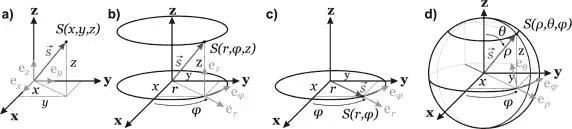

[https://ars . els-cdn . com/content/image/3-s 2.0-b 9781455731411500071-f07-04-97814](https://ars.els-cdn.com/content/image/3-s2.0-B9781455731411500071-f07-04-9781455731411.jpg)

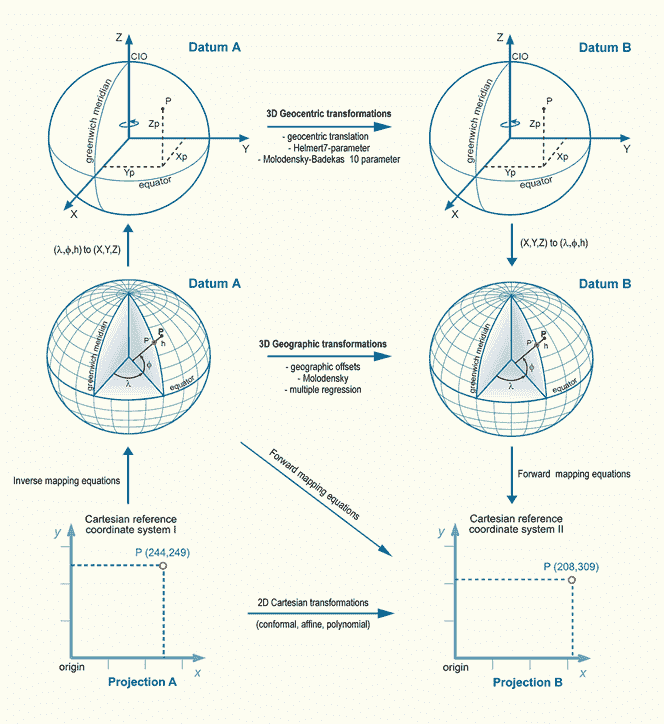

[https://alienspacesciencenews . files . WordPress . com/2013/10/3d-geographic-transfor](https://alienspacesciencenews.files.wordpress.com/2013/10/3d-geographic-transformations-datum-a-to-b-2d-cartesian-transformations-may-be-used-to-transform-coordinates-from-one-map-coordinate-system-to-another.gif)

现在，让我们使用笛卡尔 2D 坐标来创建一个以市中心为中心，距离我们的坐标约 6 公里的等距区域/邻域网格。我们的邻居将被定义为半径为 300 米的圆形区域，因此我们的邻居中心将相距 600 米。

```
**def** lonlat_to_xy(lon, lat):
     *transformer = Transformer.from_crs("epsg:4326", "epsg:3857")*
     *xy = transformer.transform(lon,lat)*
    **return** xy[0], xy[1]

**def** xy_to_lonlat(x, y):
    *transformer = Transformer.from_crs("epsg:3857","epsg:4326")*
   *lonlat = transformer.transform(x,y)*
    **return** lonlat[0], lonlat[1]

**def** calc_xy_distance(x1, y1, x2, y2):
    dx = x2 - x1
    dy = y2 - y1
    **return** math.sqrt(dx*dx + dy*dy)

print('Coordinate transformation check')
print('-------------------------------')
print('Rome center longitude=**{}**, latitude=**{}**'.format(rome_center[1], rome_center[0]))
x, y = lonlat_to_xy(rome_center[1], rome_center[0])
print('Rome center UTM X=**{}**, Y=**{}**'.format(x, y))
lo, la = xy_to_lonlat(x, y)
print('Rome center longitude=**{}**, latitude=**{}**'.format(lo, la))
```

*坐标转换检查
-
罗马中心经度=12.4829321，纬度=41.8933203
罗马中心 UTM X=291187.2193899718，Y=4640995.599190208
罗马中心经度= 12.48293210000001，纬度= 41.89332001*

在下面的代码中创建一个六边形的单元格网格，其中单元格中心与所有相邻单元格的距离相等 **…**

```
rome_center_x, rome_center_y = lonlat_to_xy(rome_center[1], rome_center[0]) *# City center in Cartesian coordinates*k = math.sqrt(3) / 2 *# Vertical offset for hexagonal grid cells*
x_min = rome_center_x - 6000
x_step = 600
y_min = rome_center_y - 6000 - (int(21/k)*k*600 - 12000)/2
y_step = 600 * k latitudes = []
longitudes = []
distances_from_center = []
xs = []
ys = []
**for** i **in** range(0, int(21/k)):
    y = y_min + i * y_step
    x_offset = 300 **if** i%**2**==0 else 0
    **for** j **in** range(0, 21):
        x = x_min + j * x_step + x_offset
        distance_from_center = calc_xy_distance(rome_center_x, rome_center_y, x, y)
        **if** (distance_from_center <= 6001):
            lon, lat = xy_to_lonlat(x, y)
            latitudes.append(lat)
            longitudes.append(lon)
            distances_from_center.append(distance_from_center)
            xs.append(x)
            ys.append(y)print(len(latitudes), 'candidate neighborhood centers generated.')print('Total number of restaurants:', len(restaurants))
print('Total number of French restaurants:', len(french_restaurants))
print('Percentage of French restaurants: **{:.2f}**%'.format(len(french_restaurants) / len(restaurants) * 100))
print('Average number of restaurants in neighborhood:', np.array([len(r) **for** r **in** location_restaurants]).mean())
```

*餐厅总数:1579
法国餐厅总数:5
法国餐厅百分比:0.32%
街区平均餐厅数:3.75*

```
print('List of all restaurants')
print('-----------------------')
**for** r **in** list(restaurants.values())[:10]:
    print(r)
print('...')
print('Total:', len(restaurants))
```

 **【4fa7abc7e4b0b487cf9d4e5d’,‘Assyrtico’,41.8410974,12.4652566,‘Fira Santorini,意大利’,166,False,289549.452511014,4635240.053573056)
【4d9dbeffc97a236a9f23c499’,‘704 餐厅’,41.84170370486973,12.464632987976074,‘海路 704,00144 罗马拉齐奥,意大利’,115,FALSE,289499.6610658221,46358.90566257】
【4e66567bd4c06542ac9 罗马 罗马 罗马 罗马 罗马 罗马 罗马 罗马 罗马 罗马 罗马 罗马 罗马 罗马 罗马 罗马 罗马 罗马 罗马 罗马 罗马 罗马 罗马 罗马 罗马 罗马 罗马 罗马 罗马 罗马 罗马 罗马 罗马 罗马 罗马 罗马 罗马 罗马 罗马 罗马 罗马 罗马 罗马 罗马 罗马 罗马 罗马 罗马 罗马 罗马 罗马 罗马 罗马 罗马 罗马 罗马 罗马 罗马 罗马 罗马 罗马 罗马 罗马 罗马 意大利 罗马 罗马 ……
总计: 1579**

```
print('List of French restaurants')
print('---------------------------')
**for** r **in** list(french_restaurants.values())[:10]:
    print(r)
print('...')
print('Total:', len(french_restaurants))
```

)(那)(就)(是)(我)(们)(的)(一)(年)(里)(,)(我)(们)(都)(不)(知)(道)(了)(,)(我)(们)(还)(不)(知)(道)(,)(我)(们)(还)(不)(知)(道)(,)(我)(们)(还)(不)(知)(道)(,)(我)(们)(还)(是)(这)(些)(人)(还)(有)(些)(人)(,)(我)(们)(还)(没)(听)(过)(这)(些)(话)(,)(我)(们)(还)(没)(听)(过)(这)(些)(话)(,)(我)(们)(还)(没)(听)(过)(这)(些)(话)(。……
总计: 5

```
print('Restaurants around location')
print('---------------------------')
**for** i **in** range(100, 110):
    rs = location_restaurants[i][:8]
    names = ', '.join([r[1] **for** r **in** rs])
    print('Restaurants around location **{}**: **{}**'.format(i+1, names))
```

*地点周围的餐厅
-
地点 101 周围的餐厅:Vecchi Sapori、frontoni & frontoni
地点 102 周围的餐厅:L'Osteria di Monteverde、Mezè Bistrot Mediterraneo
地点 103 周围的餐厅:La Tavernaccia、Albaruja
地点 104 周围的餐厅:Stazione Di Posta、Trattoria Pecorino、Checchino dal 1887
地点 105 周围的餐厅:Sushisen、Porto 107 号位置周围的天堂美食俱乐部餐厅、Città Delle Meraviglie
餐厅:Vivai、Roma Antica、Bull Steak Ristorante Bisteccheria
餐厅 108 号位置周围的餐厅:无
餐厅 109 号位置周围的餐厅:Los Cabos Tex Mex、Ristorante Hari、野餐
餐厅 110 号位置周围的餐厅:傅贵阿莱格里亚的米托斯塔维尔纳餐厅(Mithos Taverna Dell'Allegria ),位于 Due Al Tre、La Zingarella、quello checè*

让我们将数据可视化…

```
map_rome = folium.Map(location=rome_center, zoom_start=13)
folium.Marker(rome_center, popup='Piazza del Campidoglio').add_to(map_rome)
**for** res **in** restaurants.values():
    lat = res[2]; lon = res[3]
    is_french = res[6]
    color = 'red' **if** is_french **else** 'blue'
    folium.CircleMarker([lat, lon], radius=3, color=color, fill=**True**, fill_color=color, fill_opacity=1).add_to(map_rome)
map_rome
```

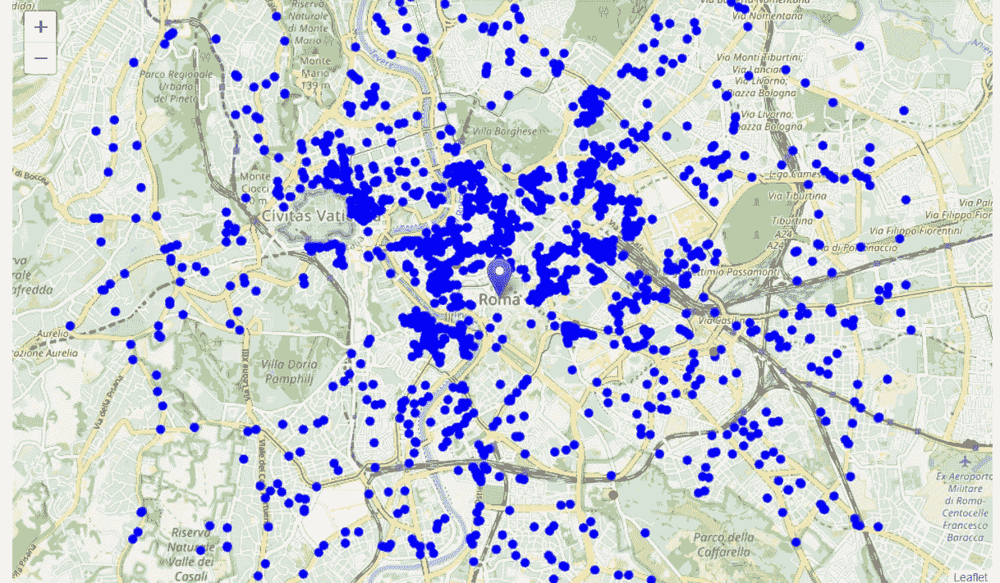

看起来不错。所以现在我们有了距离 Piazza del Campidoglio 几公里范围内的所有餐馆，而且我们知道哪些是法国餐馆！我们还知道哪些餐馆正好在每个邻近候选中心的附近。

数据收集阶段到此结束——我们现在准备使用这些数据进行分析，以生成关于新法国餐厅最佳位置的报告！

# 方法学

在这个项目中，我们将致力于检测罗马餐厅密度低的区域，尤其是那些法国餐厅数量少的区域。我们将分析限制在市中心周围约 6 公里的区域。

第一步，我们收集了所需的**数据:距离罗马中心 6 公里以内的每家餐厅的位置和类型(类别)**。我们还**确定了法国餐馆**(根据 Foursquare 的分类)。

我们分析的第二步将是计算和探索罗马不同地区的'**餐厅密度**——我们将使用**热图**来确定一些靠近市中心的有希望的区域，这些区域一般餐厅数量较少(*和*附近没有法国餐厅)，并将我们的注意力集中在这些区域。

第三步也是最后一步，我们将关注最有前景的区域，并在这些区域内创建符合与利益相关方讨论确定的一些基本要求的**个地点集群:我们将考虑在**半径 250 米**内不超过两家餐厅的地点，我们希望在**半径 400 米**内没有法国餐厅的地点。我们将展示所有此类位置的地图，但也会创建这些位置的聚类(使用 **k-means 聚类**)以确定一般区域/街区/地址，这些区域/街区/地址应该是利益相关方最终“街道级别”探索和搜索最佳场馆位置的起点。**

# 分析

让我们执行一些基本的解释性数据分析，并从原始数据中获得一些额外的信息。首先，让我们来数一数每个候选区域的**家餐厅**:

```
location_restaurants_count = [len(res) **for** res **in** location_restaurants]df_locations['Restaurants in area'] = location_restaurants_countprint('Average number of restaurants in every area with radius = 300m:', np.array(location_restaurants_count).mean())df_locations.head(10)Average number of restaurants in every area with radius = 300m: 3.75
```

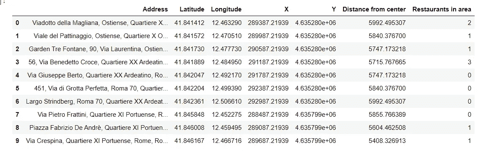

现在让我们计算从每个候选区域中心到最近的法国餐馆的距离(不仅仅是 300 米内的，我们想要到最近的法国餐馆的距离，不管它有多远)。

```
distances_to_french_restaurant = []**for** area_x, area_y **in** zip(xs, ys):
    min_distance = 10000
    **for** res **in** french_restaurants.values():
        res_x = res[7]
        res_y = res[8]
        d = calc_xy_distance(area_x, area_y, res_x, res_y)
        **if** d<min_distance:
            min_distance = d
    distances_to_french_restaurant.append(min_distance)df_locations['Distance to French restaurant'] = distances_to_french_restaurant
df_locations.head(10)
print('Average distance to closest French restaurant from each area center:', df_locations['Distance to French restaurant'].mean())
```

*从每个区域中心到最近的法国餐厅的平均距离:11305*

好的，那么平均来说，每个候选区域中心大约 3 公里内都可以找到法国餐厅。我们需要仔细筛选我们的区域！

让我们创建一个显示**热图/餐馆密度**的地图，并尝试从中提取一些有意义的信息。此外，让我们在地图上显示出罗马行政区的边界，以及距离坎皮多利奥广场 1 公里、2 公里和 3 公里的几个圆圈。

```
*#Creating a geojson object named rome_boroughs with coordinates of each of the 15 boroughs in Rome..*rome_boroughs={
  "type": "Feature",
  "geometry": {
    "type": 'Polygon',
    "coordinates": [[[41.91462085439633, 12.453880259351273],[41.9323252862348, 12.472743915862067],
                    [41.95459853645301, 12.517301710976446],[41.927401191945876, 12.573984428765995],
                    [41.90042507803908, 12.574239963824201],[41.87365902350219, 12.633031521668117],
                    [41.878807470933715, 12.481057949431518],[41.84887494434637, 12.497835707490317],
                    [41.839143578605835, 12.44446268112522],[41.75656198951887, 12.34778565644536],
                    [41.83929732046143, 12.442616272611323],[41.871053634308964, 12.420010414810722],
                    [41.89322490765442, 12.43834294376203],[41.92821724387105, 12.408302173512357],
                    [41.94263655480194, 12.470443567468067]]]
  },
  "properties": {
    "name": "Rome Boroughs"
  }
}restaurant_latlons = [[res[2], res[3]] **for** res **in** restaurants.values()]french_latlons = [[res[2], res[3]] **for** res **in** french_restaurants.values()]**from** **folium** **import** plugins
**from** **folium.plugins** **import** HeatMapmap_rome = folium.Map(location=rome_center, zoom_start=13)
folium.TileLayer('cartodbpositron').add_to(map_rome) *#cartodbpositron cartodbdark_matter*
HeatMap(restaurant_latlons).add_to(map_rome)
folium.Marker(rome_center).add_to(map_rome)
folium.Circle(rome_center, radius=1000, fill=**False**, color='white').add_to(map_rome)
folium.Circle(rome_center, radius=2000, fill=**False**, color='white').add_to(map_rome)
folium.Circle(rome_center, radius=3000, fill=**False**, color='white').add_to(map_rome)
folium.GeoJson(rome_boroughs, style_function=boroughs_style, name='geojson').add_to(map_rome)
map_rome
```

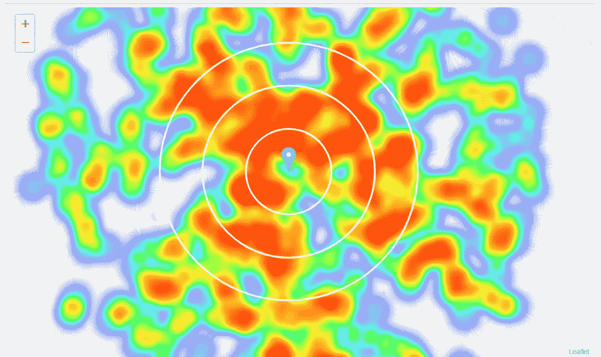

在世界上所有的城市中，很少有比罗马的街区更迷人、更有价值的地方了。罗马的里奥尼街区骄傲地站在纽约市的行政区和巴黎的行政区等著名街区的旁边，到处都是历史遗迹和博物馆，在酒店、餐馆、酒吧、咖啡馆和俱乐部方面，每一个街区都有自己的风格。

对流行的旅游指南和网站的分析经常提到罗马中心美丽、有趣、历史和文化丰富..罗马的历史中心 T21 很受游客和意大利人的喜爱。

受游客欢迎，另类和波西米亚，但蓬勃发展和时尚，相对靠近市中心和良好的连接，这些区似乎证明了进一步的分析。

让我们定义一个新的、更窄的感兴趣区域，它将包括罗马餐馆数量少的部分，并且最靠近 Piazza del Campidoglio..

```
roi_x_min = rome_center_x - 2000
roi_y_max = rome_center_y + 1000
roi_width = 5000
roi_height = 5000
roi_center_x = roi_x_min + 2500
roi_center_y = roi_y_max - 2500
roi_center_lon, roi_center_lat = xy_to_lonlat(roi_center_x, roi_center_y)
roi_center = [roi_center_lat, roi_center_lon]

map_rome = folium.Map(location=roi_center, zoom_start=14)
HeatMap(restaurant_latlons).add_to(map_rome)
folium.Marker(rome_center).add_to(map_rome)
folium.Circle(roi_center, radius=2500, color='white', fill=**True**, fill_opacity=0.4).add_to(map_rome)
folium.GeoJson(rome_boroughs, style_function=boroughs_style, name='geojson').add_to(map_rome)
map_rome
```

*生成了 2261 个候选邻域中心。*

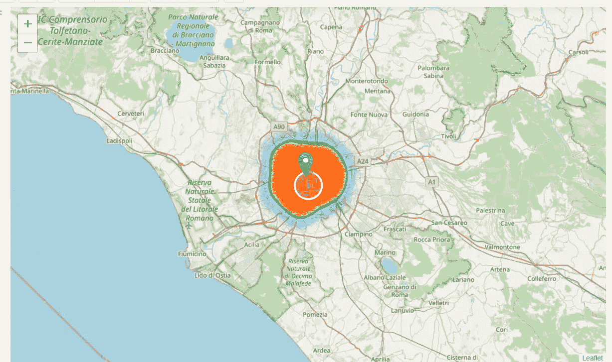

好的。现在，让我们为每个候选位置计算两个最重要的事情:附近餐馆的数量(我们将使用 250 米的半径)和到最近的法国餐馆的距离(如果有的话)。

```
**def** count_restaurants_nearby(x, y, restaurants, radius=250):    
    count = 0
    **for** res **in** restaurants.values():
        res_x = res[7]; res_y = res[8]
        d = calc_xy_distance(x, y, res_x, res_y)
        **if** d<=radius:
            count += 1
    **return** count

**def** find_nearest_restaurant(x, y, restaurants):
    d_min = 100000
    **for** res **in** restaurants.values():
        res_x = res[7]; res_y = res[8]
        d = calc_xy_distance(x, y, res_x, res_y)
        **if** d<=d_min:
            d_min = d
    **return** d_min

roi_restaurant_counts = []
roi_french_distances = []

print('Generating data on location candidates... ', end='')
**for** x, y **in** zip(roi_xs, roi_ys):
    count = count_restaurants_nearby(x, y, restaurants, radius=250)
    roi_restaurant_counts.append(count)
    distance = find_nearest_restaurant(x, y, french_restaurants)
    roi_french_distances.append(distance)
print('done.')
```

*生成候选位置数据...完成了。*

```
*# Let's put this into dataframe*
df_roi_locations = pd.DataFrame({'Latitude':roi_latitudes,
                                 'Longitude':roi_longitudes,
                                 'X':roi_xs,
                                 'Y':roi_ys,
                                 'Restaurants nearby':roi_restaurant_counts,
                                 'Distance to French restaurant':roi_french_distances})

df_roi_locations.head(10)
```

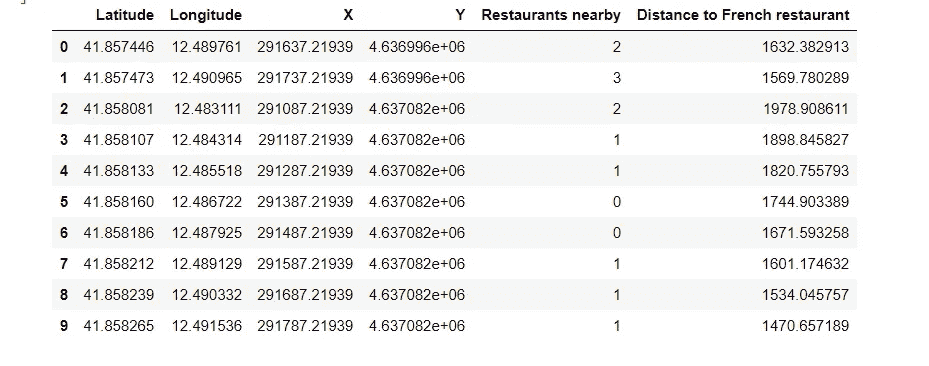

好的。现在我们过滤这些位置:我们只对半径 250 米内不超过两家餐馆，半径 400 米内没有意大利餐馆的位置感兴趣。

```
good_res_count = np.array((df_roi_locations['Restaurants nearby']<=2))
print('Locations with no more than two restaurants nearby:', good_res_count.sum())

good_ita_distance = np.array(df_roi_locations['Distance to French restaurant']>=400)
print('Locations with no French restaurants within 400m:', good_ita_distance.sum())

good_locations = np.logical_and(good_res_count, good_ita_distance)
print('Locations with both conditions met:', good_locations.sum())

df_good_locations = df_roi_locations[good_locations]
```

*附近没有两家以上餐厅的地点:1017
400 米内没有法国餐厅的地点:2070
两个条件都满足的地点:947*

让我们看看这在地图上是什么样子。

```
good_latitudes = df_good_locations['Latitude'].values
good_longitudes = df_good_locations['Longitude'].values

good_locations = [[lat, lon] **for** lat, lon **in** zip(good_latitudes, good_longitudes)]

map_rome = folium.Map(location=roi_center, zoom_start=14)
folium.TileLayer('cartodbpositron').add_to(map_rome)
HeatMap(restaurant_latlons).add_to(map_rome)
folium.Circle(roi_center, radius=2500, color='white', fill=**True**, fill_opacity=0.6).add_to(map_rome)
folium.Marker(rome_center).add_to(map_rome)
**for** lat, lon **in** zip(good_latitudes, good_longitudes):
    folium.CircleMarker([lat, lon], radius=2, color='blue', fill=**True**, fill_color='blue', fill_opacity=1).add_to(map_rome) 
folium.GeoJson(rome_boroughs, style_function=boroughs_style, name='geojson').add_to(map_rome)
map_rome
```

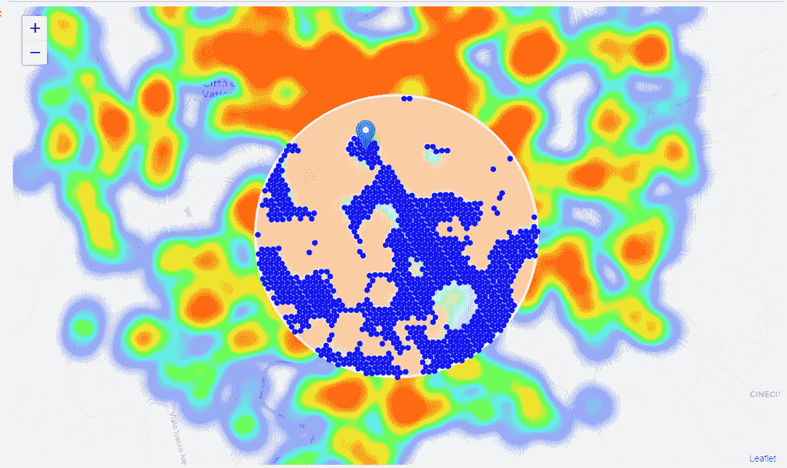

看起来不错。我们现在有一个清晰的指示，附近的餐馆数量很少，附近根本没有法国餐馆。

现在让我们将这些位置聚集起来，创建包含好位置的区域中心。这些区域、它们的中心和地址将是我们分析的最终结果。

```
**from** **sklearn.cluster** **import** KMeansnumber_of_clusters = 15good_xys = df_good_locations[['X', 'Y']].values
kmeans = KMeans(n_clusters=number_of_clusters, random_state=0).fit(good_xys)cluster_centers = [xy_to_lonlat(cc[0], cc[1]) **for** cc **in** kmeans.cluster_centers_]map_rome = folium.Map(location=roi_center, zoom_start=14)
folium.TileLayer('cartodbpositron').add_to(map_rome)
HeatMap(restaurant_latlons).add_to(map_rome)
folium.Circle(roi_center, radius=2500, color='white', fill=**True**, fill_opacity=0.4).add_to(map_rome)
folium.Marker(rome_center).add_to(map_rome)
**for** lon, lat **in** cluster_centers:
    folium.Circle([lat, lon], radius=500, color='green', fill=**True**, fill_opacity=0.25).add_to(map_rome) 
**for** lat, lon **in** zip(good_latitudes, good_longitudes):
    folium.CircleMarker([lat, lon], radius=2, color='blue', fill=**True**, fill_color='blue', fill_opacity=1).add_to(map_rome)
folium.GeoJson(rome_boroughs, style_function=boroughs_style, name='geojson').add_to(map_rome)
map_rome
```

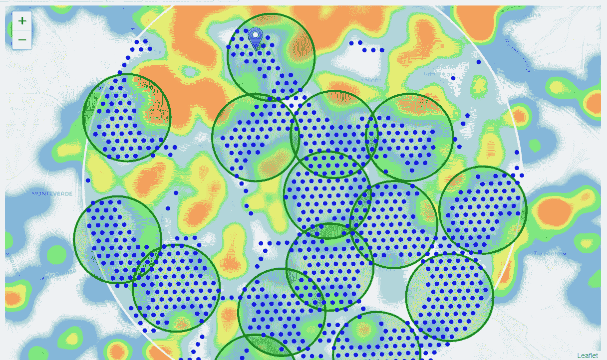

不错——我们的聚类代表了大多数候选位置的分组，聚类中心正好位于候选位置“丰富”区域的中间。

这些聚类中心的地址将是探索邻域的良好起点，以便根据邻域的具体情况找到最佳位置。

让我们在没有热图的城市地图上看到这些区域，用阴影区域表示我们的聚类:

```
map_rome = folium.Map(location=roi_center, zoom_start=14)
folium.Marker(rome_center).add_to(map_rome)
**for** lat, lon **in** zip(good_latitudes, good_longitudes):
    folium.Circle([lat, lon], radius=250, color='#00000000', fill=**True**, fill_color='#0066ff', fill_opacity=0.07).add_to(map_rome)
**for** lat, lon **in** zip(good_latitudes, good_longitudes):
    folium.CircleMarker([lat, lon], radius=2, color='blue', fill=**True**, fill_color='blue', fill_opacity=1).add_to(map_rome)
**for** lon, lat **in** cluster_centers:
    folium.Circle([lat, lon], radius=500, color='green', fill=**False**).add_to(map_rome) 
folium.GeoJson(rome_boroughs, style_function=boroughs_style, name='geojson').add_to(map_rome)
map_rome 
```

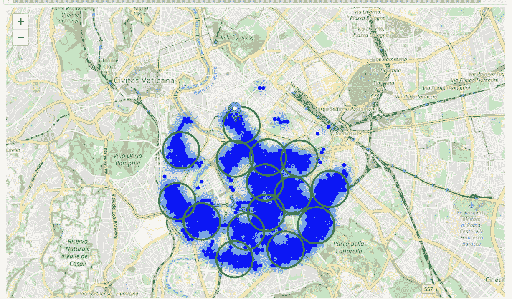

最后，让我们**对这些候选区域中心进行反向地理编码，以获得可以呈现给利益相关者的地址**。

```
candidate_area_addresses = []
print('==============================================================')
print('Addresses of centers of areas recommended for further analysis')
print('==============================================================**\n**')
**for** lon, lat **in** cluster_centers:
    *#addr = get_address(google_api_key, lat, lon).replace(',Italy', '')*
    l = [lat,lon]
    location = geolocator.reverse(l,language='en')
    addr = location.address
    candidate_area_addresses.append(addr)    
    x, y = lonlat_to_xy(lon, lat)
    d = calc_xy_distance(x, y, rome_center_x, rome_center_y)
    print('**{}{}** => **{:.1f}**km from City center'.format(addr, ' '*(50-len(addr)), d/1000))
```

*= = = = = = = = = = = = = = = = = = = = = = = = = = = = = = = = = = = = = = = = = = = = = = = = = =
推荐进一步分析的区域中心前 5 位地址
= = = = = = = = = = = = = = = = = = = = = = = = = = = = = = = = = = = = = = = = = = = = = = = = = = =*

**65，Via Giovannipoli，Garbatella，Ostiense，Quartiere X Ostiense，罗马，Roma Capitale，Lazio，00145，意大利= >距离市中心 3.7 公里*

**卡拉卡拉浴场，Via Antonina，Municipio Roma I，罗马，罗马首都，拉齐奥，00154，意大利= >距离市中心 1.8 公里*

**Teatro India，1，Lungotevere 维托里奥·加斯曼，Quartiere XI 葡萄牙，罗马，罗马首都，拉齐奥，00146，意大利= >距离市中心 2.8 公里*

** pertinenza scuola Kennedy 区，Via Dandolo，Rione XIII Trastevere，Municipio Roma I，罗马，Roma Capitale，Lazio，00120，意大利= >距离市中心 1.6 公里*

**Caserma Goffredo Zignani，Piazza Zama，San Giovanni，Municipio Roma VII，罗马，Roma Capitale，Lazio，00183，意大利= >距离市中心 3.2 公里*

让我们把它们放在地图上…

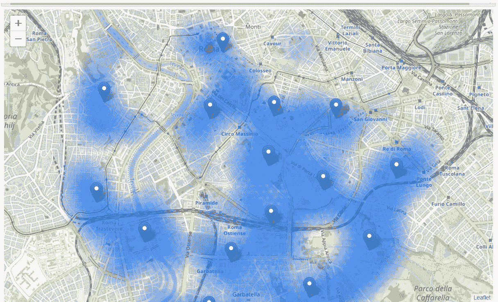

# 结果和讨论

我们创建了 15 个代表区域中心的地址，这些区域包含餐馆数量较少且附近没有法国餐馆的位置，所有区域都离市中心相当近(所有区域都不到 4 公里，其中大约一半距离城市不到 2 公里)。虽然地图上显示的区域半径约为 500 米(绿色圆圈)，但它们的形状实际上非常不规则，它们的中心/地址仅应被视为搜索潜在餐厅位置时探索邻近区域的起点。大多数区域位于罗马的历史中心，我们认为这里很有趣，因为它很受游客欢迎，离市中心很近，公共交通也很便利。

这些候选位置被聚类以创建包含最大数量的候选位置的感兴趣区域。还使用反向地理编码生成了这些区域的中心地址，以用作基于其他因素的更详细的本地分析的标记/起点。

所有这一切的结果是，根据现有场所的数量和距离，15 个区域包含了最多的潜在新餐厅位置，包括一般餐厅和意大利餐厅。当然，这并不意味着这些区域就是新餐馆的最佳位置！此分析的目的是仅提供靠近罗马中心但现有餐厅(尤其是法国餐厅)不多的区域的信息—完全有可能在这些区域中的任何一个区域有少量餐厅，这些原因会使它们不适合新餐厅，尽管该区域缺乏竞争。因此，建议的区域应仅被视为更详细分析的起点，该分析最终会得出不仅没有邻近竞争，而且考虑了其他因素并满足所有其他相关条件的位置

# 结论

该项目的目的是确定罗马市中心附近餐馆(尤其是法国餐馆)数量较少的区域，以帮助利益相关方缩小寻找新法国餐馆最佳位置的范围。通过从 Foursquare 数据中计算餐厅密度分布，我们首先确定了证明进一步分析合理的一般行政区，然后生成了满足一些关于现有附近餐厅的基本要求的大量位置集合。然后对这些位置进行聚类，以创建主要的感兴趣区域(包含最大数量的潜在位置),并创建这些区域中心的地址，作为利益相关方最终勘探的起点。

最佳餐厅位置的最终决定将由利益相关方根据每个推荐区域的社区和位置的具体特征做出，并考虑其他因素，如每个位置的吸引力、交通/靠近主要道路、房地产可用性、价格、每个社区的社会和经济动态等。