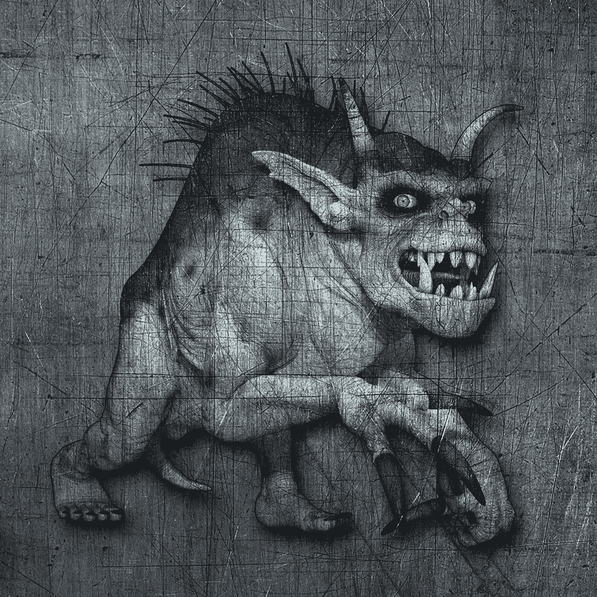

# 软件工艺中的美

> 原文：<https://medium.com/codex/the-beauty-in-software-craft-2354abb486aa?source=collection_archive---------5----------------------->

## [法典](http://medium.com/codex)

[歌特式怪物](https://pixabay.com/illustrations/background-monster-gothic-dark-2032255/)由[ractacopulous](https://pixabay.com/users/ractapopulous-24766/)根据 [Pixabay 许可证](https://pixabay.com/service/license/)授权

> "所有生物都有某些不规则和缺陷，它们不仅是生命的标志，也是美的源泉。"约翰·罗斯金

敏捷宣言已经发表 20 年了，那么我们取得了什么成就呢？仍然存在大量的挫折感和两极分化。每隔几年就会有一个品牌重塑，比如 DevOps、敏捷转型或业务敏捷性。

但是也许最被低估的品牌重塑是软件工艺。它不同于其他任何植根于软件开发的实际实践。思考如果我们都选择 XP 而不是 Scrum 会怎么样。对技术灵活性的需求。

从表面上看，与工艺的比较似乎有点奇怪。毕竟，它来自一个简单得多的时代，在现代技术出现之前，在处理物质制造的时候。

另一方面，软件在抽象中运行，产生无形资产。它体现了技术，是现代知识经济的核心，它取代了我们对制造实物的关注。

那么我们真正能从手工艺中学到什么呢？一百多年前，工艺美术运动已经试图复兴它，但失败了，为什么我们还要试图模仿它呢？它的吸引力受限于它缺乏经济性，以及它的理想受到过去玫瑰色印象的影响。

答案更多在于我们的本性，我们如何思考、学习和创造；以及我们如何在这个复杂多变的世界中应用它。

让我们从最初的工艺美术运动的灵感开始。

## 热爱变化

1849 年，维多利亚时代的主要艺术评论家约翰·罗斯金来到威尼斯。他开始对威尼斯建筑进行详尽的分析。他将绘制出古典时代、哥特时代和文艺复兴时期的演变图。

他断定哥特式绘画代表了威尼斯设计的顶峰。罗马和希腊传统的古典设计更简洁、更精确。文艺复兴也是如此。但他更喜欢哥特式建筑的粗糙但更丰富的变化。这种不完美更能代表我们生活的自然世界。永恒的变化之一。

> “不完美在某种程度上是我们所知道的生活中必不可少的。它是凡人身体中生命的标志，也就是说，是进步和变化的状态。活着的东西没有，也不可能是绝对完美的；一部分正在衰退，一部分正在新生。”约翰·罗斯金

他继续将建筑与当时的社会条件联系起来；更具体地说是对工人的影响。古希腊人和现代威尼斯人都热爱秩序。这是以把工人限制在传统和统一的痛苦中为代价的。在哥特时代，工人的不完美是被接受的。人们热爱变化，允许工人发挥他们的创造力。

> “再次检查那些丑陋的妖精，无形的怪物，和严峻的雕像，解剖和僵化；但不要嘲笑它们，因为它们是每个敲石头的工人的生命和自由的标志；思想的自由和存在的等级，如没有法律，没有特许状，没有慈善机构可以保证“约翰·罗斯金”

他批评了当前对劳动分工的执着，以及这是如何通过将工作与思考分开来贬低工人的。

> “我们希望一个人总是在思考，另一个人总是在工作，我们称一个人是绅士，另一个是实干家；而工人应该经常思考，思想家应该经常工作，两者都应该是绅士，在最好的意义上。”约翰·罗斯金

罗斯金激发了维多利亚建筑中的哥特式复兴和工艺美术运动的产生。他的话今天看来仍然适用。

想想对秩序的热爱，以及我们对僵化的过程、确定性和教条式思维的倾向。

另一方面，员工的哥特式自由和快乐唤起了团队授权和内在动力。

接受我们的易错性和我们世界的不完美性意味着足够好的设计、快速失败和混沌工程。

## 掌握技能

当中世纪的大师花了很多年耐心地培养他们的学徒时，一种现代类型的炼金术出现在技能的获得中。只需进行知识传授，或在线课程，或只需在几天内获得认证。这让我想起了《黑客帝国》,在那里尼奥需要驾驶直升机，需要驾驶技能，然后他就起飞了。要是这样就好了。

现实情况是，软件开发技能的获得与其他任何领域都没有什么不同。在这方面，我们可以从手工艺中学到很多东西，这一过程让我们适应并维持了数千年。

手艺告诉我们的是，精通是一生的辛劳和反复试验。导师之一。在那里，技能的增长是通过内省练习来实现的。

按照食谱上的说明做。煮 20 分钟或直到棕色。用软件术语来说，我们可以把它描述为命令式的而不是声明式的。一个说做什么。另一个描述结果。第一个很容易理解，但第二个需要理解。通过之前太生、太干或烧焦的经验获得的理解。所以为什么不直接说煮 20 分钟呢？每一种烹饪都发生在特定的环境中。环境差异，如环境温度、锅的厚度、烤箱温度变化或配料的成熟度。

在软件领域，随着环境的广泛变化，挑战令人生畏。不断变化、复杂且不可预测的代码库。在所有这些流沙中，你将会以一种全新的方式再次改变它。什么会出错？

像所有技能的获得一样，关键是重复。你将开始笨拙。如果你只有一把锤子，那么一切都是钉子。或者如果你正在读的是设计模式的书，那么每个问题都需要一个工厂或者上帝禁止一个单独的。给它时间。实验。失败的经历和变化的环境将逐渐导致对如何以及何时应用技术或模式的更好理解。只要你对自己的工作有疑问，或者有导师来验证。

最终你会进入隐性知识的领域。在那里你绕过思想，本能地轻松优雅地做事。当工匠将工具描述为自己的延伸时，他们就在那里。

我能回忆起我自己的一次经历。我在大学的实验室里偶然发现了一个 ZX 频谱模拟器。这是一次回到童年的旅行。已经 10 多年了。只有一个问题——如何输入 load 命令来玩游戏？我知道这个命令是 LOAD " "，但是我没有键盘映射来做翻译。我绞尽脑汁，但想不出答案。然后奇怪的事情发生了。我的手向下敲击键盘，选择了 J，shift，P，P。我不能这样想，所以我就这样做了。

## 沉浸式练习

> “我们所想的，或者我们所知道的；或者我们相信什么，最终都无关紧要。唯一重要的是我们做什么”约翰·罗斯金

罗斯金拒绝使用机器。对他来说，工艺就是人和手工艺品。这难道不会使软件开发与工艺难以调和吗？

这个问题更多地存在于工厂内部的既定关系中，在这里，工人被降格为机器的不假思索的助手。工艺美术运动的核心人物 C. R. Ashbee 总结得很好，他说:“我们不拒绝机器，我们欢迎它。但我们希望看到它被掌握。”

关键是将人的创造力与机器的能力和精度结合起来。就像工匠几千年来使用工具一样。丰田后来通过他们的自动化概念完美地掌握了这一点，这是一种人性化的自动化。

那么，材料的物理工作与软件的抽象思维和无形输出之间的差异是什么呢？答案更多地存在于工人的头脑中，而不是工作的细节中。

从手工艺开始，想象有人雕刻和打磨一块木头。他们通过与活动的互动沉浸在活动中。空气中弥漫着木头的味道。雕刻一块。看着它。或者用手去感受。然后纠正任何检测到的缺陷。工匠沉浸在行动和接受反馈的持续过程中。这使得他们不需要完美就能产生想要的结果。而是通过快速调整来弥补缺陷，以实现他们的目标。他们的灵巧程度可能达到这样的水平，即他们的一致性和精确性需要较少的调整，但这种反馈仍然影响他们的每个动作。

当我第一次开始在嵌入式系统上开发时，一个构建可能需要一个小时。可能还需要半个小时才能刷新到设备上。在你的打卡被处理之前，一两代人可能要等上一天。当然，对我来说，这导致了对我头脑中的问题进行更多的推理，也许是涂鸦一个设计，然后进行更多的推理。最后，我会开始把这些想法翻译成代码。所有这些都是抽象的。它是思考而不是制造。

当我开发软件的时候，制作是从 make 开始的。此时，我对语法正确的代码的假设被编译器暴露了。反馈通常是许多编译错误。这就是花太长时间抽象的风险。就像工匠闭着眼睛雕刻或者没有触觉。

当时我没有太多的选择，因为反馈的成本太高了。如今没有这样的借口了。现代的 ide 会在你打字的时候给出即时的语法反馈，允许你即时修正打字错误。做 TDD 意味着你不断地执行你的代码，并得到反馈来证实你对其行为的假设。您经常集成到主线代码中，Jenkins 确认它与所有其他最近的更改一起运行。

技术不再是障碍。因此，寻找那些能够让你像他们车间里的工匠一样操作的实践——TDD、持续集成或持续交付。这让你沉浸在创造中，感受你每一个动作的影响，通过微小的修正获得一种流动和完美的幻觉。

## 持续学习

精通是一个旅程，而不是目的地。大师只不过是在那条路上走得很远的人。在这一点上，旅程赋予了他们质量和效率的天赋，允许他们指引他人的道路，并在新的人迹罕至的道路上创新。任何认为他们已经到达目的地的人都要小心，因为那里有教条。

记住罗斯金的话——不要被我们对秩序的热爱所消耗，因为我们生活在一个变化多端的世界，所以不可能有完美。

> “几乎每个人心中最强烈的本能之一是对秩序的热爱，这使我们渴望我们的房子窗户应该像我们的马车一样成对，并允许我们毫不犹豫地将我们的信仰交给建筑理论，这些理论为每件事情确定一种形式，并禁止它的变化”约翰·罗斯金

这通常以时尚的形式出现。像你的架构一定是微服务。微服务像任何其他架构一样有优点和缺点，所以要了解您的背景。永远保持开放的心态，不断学习。

这一旅程的关键是勇敢和好奇的心。好奇心会让你陷入困境，但这是学习的地方。

通过这个你慢慢地分层你的技能。回想一下你的旅程。

你有没有看过你妈妈的手指绕着键盘寻找下一个字母？你去过一次。然后你学会了一种编码语言。你开始编译、运行和调试代码。

突然之间，你得到了报酬。现在你有了客户、期限和预算。你面临着规模和复杂性。在团队中工作。

好奇心帮助你像工匠一样沉浸在反馈的训练实践中。

好奇心让你意识到，要维持下去，你必须关注质量和可维护的代码。你偶然发现干净的代码，试图写出有条理的简洁的文章。更小的功能。更好的名字。评论少。你想分离，找到坚实的原则，告诉不要问。

好奇心让你发现，要想写好代码，你需要面向客户。你努力将工作分成小的功能变化。你学 DDD。不仅仅是存储库模式，还有所有其他的战术模式。更重要的是，你抓住了战略部分。你想找到更快的方式将你的代码交付给客户，连续交付是必须的。

好奇心告诉你，效率不是忙碌，而是更好地利用资源。最大限度地利用干燥。通过更好的优先顺序最大化未完成的工作，学会说不和 YAGNI。

好奇心不断扩大你的知识面。其他范例中的其他编程语言。系统架构。团队动力。精益原则。

如果没有好奇心和应用你所发现的东西的勇气，你仍然只是在编写代码和修复 bug。有了它，你就有了纪律和技能，并且知道如何最好地运用它们。

现在清楚的是，为了最好地服务于连贯的整体，你必须小心地平衡大量的约束——同情客户、交付价值、沉浸在反馈中、协作、学习和寻找新的视角、编写清晰简洁的代码、管理复杂性、最大化重用、教导他人等等。

这些制约因素中有许多是相互依赖的，因此改善一个因素可能会损害其他因素。这使得每一个决定都是复杂的权衡。

正是这种缺乏远见导致缺乏经验的开发人员或不专注于工艺的开发人员的良好意图适得其反——引入错误、技术债务或沉迷于质量而忘记了客户。

## 卓越与熵等

让我们在一个假设的高风险扑克游戏中演示一下商业技巧。这张牌桌上还有其他玩家。我们姑且称之为熵和未来机会。

首先我们需要定义这个游戏的规则。我们需要完美的定义。让我们说，这个行业是纯粹的可持续繁荣。

这符合熵的游戏风格。这是一个利用变化、相互依存和我们自己的一贯正确的问题。因为这个定义制造了一个冲突——眼前繁荣与未来繁荣前景的对立。这需要权衡，不可能完美。

这也减少了游戏的未来机会——他们的策略通常是“草皮定律”,但偶尔也会有意外收获。

作为工匠，我们了解这些对手。对于熵，我们需要知道与目标相关的所有约束，认识到它们的相互依赖性，然后做出细微的权衡。为了将来的机会，我们保持开放的选择，并在我们的游戏中建立弹性。

我们先玩，增加一些客户价值。

熵打出了他们的相互依赖牌，降低了组织性，增加了复杂性和认知负荷。

我们用重构来检查这一步。

熵计数器通过引入我们重构中的一个错误，但是我们已经发现了做 TDD 并修复了它。

我们开始更多的功能。

未来的机会进入游戏，让开发人员对最新的变化感到恶心。

这不是问题。我们一直在这个问题上结对编程，所以可以有连续性。

未来的机会又来了，这一次客户尖叫着要一个新的和意想不到的变化。

没有戏剧。我们通过良好的模块化保持了选择的开放性。

于是游戏继续。统计数字对我们不利。但是我们利用我们的技能和对大局的把握。脚踏实地解决手头的问题，而不是过度关注解决方案。始终评估不断变化的环境或新信息。这就是工艺之道。

## 工艺选择

那么，对于一个软件开发人员来说，如何才能在这个快节奏和复杂的技术世界中生存下来呢？从谦逊开始。认识到我们不完美的世界和我们在其中的易错性。但也要认识到这创造的美——生活和变化的源泉。通过跟随飞船，我们延续了迄今为止我们物种的进化道路。技术进步是一个创造和制造的过程。让我们沉浸在自己的世界中。通过好奇和实验。为自己的工作感到自豪。学习。社交。追求质量。对社会有目的的贡献；以及可持续发展的终极行动，传递我们的技能。

## 参考

干净的代码——罗伯特·C·马丁

工匠——Richard sen nett

威尼斯之石第 2 卷——约翰·罗斯金

克雷夫特:传统工艺不仅仅是制作——亚历山大·朗兰兹

精通——罗伯特·格林