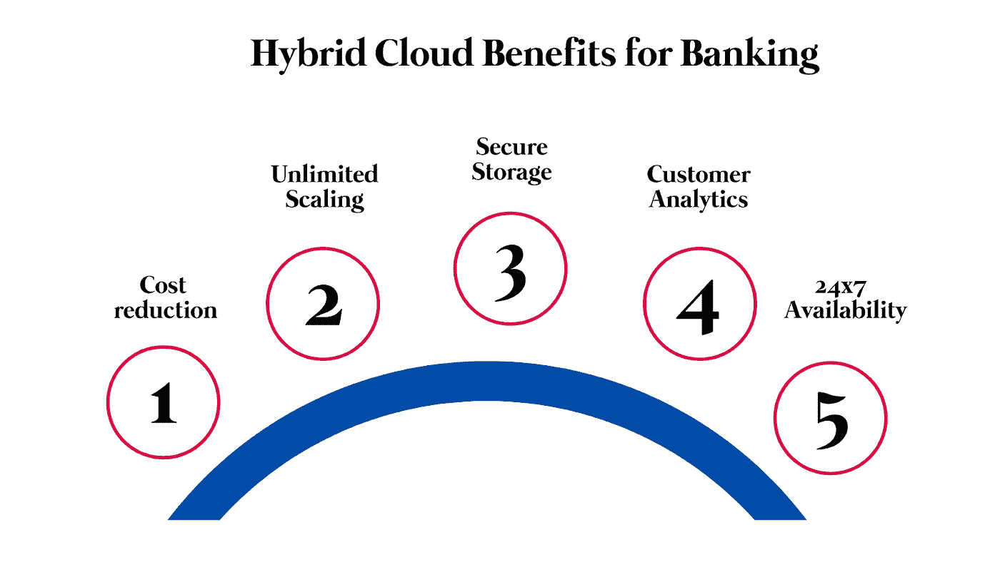

# 混合云给银行带来的好处

> 原文：<https://medium.com/codex/the-benefits-of-hybrid-cloud-for-banks-2b64b585328a?source=collection_archive---------11----------------------->

消息来源估计，到 2022 年底，90%的企业将拥有混合云存储和运营模式..据估计，与 2019 年的 280 亿美元相比，这一数字将超过 600 亿美元。

混合云在疫情期间经历了一次大规模的高潮。该技术确保您能够访问私有云以获得更好的数据安全性，并访问公共云以实现资源共享。混合云数据共享模式有助于克服多重挑战，而无需访问物理数据中心。

银行业将体验到[混合云的好处](https://www.botreetechnologies.com/blog/benefits-of-cloud-computing-for-businesses/)。IDC 的 2020 年 CloudPath 调查报告称 [89%的银行](https://www.n-ix.com/hybrid-cloud-banks/#:~:text=According%20to%20the%20IDC's%202020,taking%20advantage%20of%20cloud%20technology.)运营或计划运营混合云存储和部署。为银行业量身定制混合云可以降低成本、提高效率，并使银行能够更好地管理其客户。

本文将重点了解 [**混合云如何惠及银行业**](https://www.botreetechnologies.com/blog/the-benefits-of-hybrid-cloud-for-banks/) 。它将重点介绍[银行混合云](https://www.botreetechnologies.com/fintech-app-development)的优势、银行混合云的使用案例，以及如何开始使用混合模式实施银行云架构的旅程。

> ***阅读更多:*** [***为什么选择 AWS 云做企业 Web 应用？***](https://www.botreetechnologies.com/blog/why-choose-aws-cloud-for-enterprise-web-applications/)

# 混合云给银行业带来的好处

银行是遗留系统的最大用户。由于他们拥有庞大的利益相关者网络和机密信息，升级似乎是一个挑战。混合云是公共云和私有云的结合。虽然银行私有云有很多好处，但灵活性较差。另一方面，使用公有云的银行往往面临数据安全的风险。

这就是混合云模式的用武之地。它支持私有云和公共云的通用数据管理。它支持在私有云上部署系统，同时在需要时借助公共云进行扩展。

混合模式的银行云架构确保银行能够利用私有云和公共云来改善客户体验。以下是混合云为银行业带来的优势-

**降低成本**

*   云计算在银行业等金融服务领域的主要[好处之一是降低成本。当客户易于管理时，银行不需要高端基础设施。他们可以将资金投入到业务计划和创收上，而不是将资金锁定在数据存储的基础架构上。](https://www.botreetechnologies.com/blog/7-critical-benefits-of-the-cloud-based-cmms-that-every-industry-needs/)

**无限缩放**

*   随着越来越多的客户转向在线渠道，银行需要维护一个混合云来管理这些客户。他们可以随着流量的增加扩展基础架构，而无需购买任何新的本地设备。混合云提供即时扩展，而不会给系统增加太多负担。

**安全存储**

*   混合云最大的优势之一是数据的安全存储。银行可以将机密信息转移到私有云，而其他低风险数据可以放在公共云中，以便于访问。它使银行能够为不同类型的数据建立单独的系统。

**客户分析**

*   为银行业定制混合云使机构能够在云上存储数据。在 AI 和 ML 部署的帮助下，银行可以获得对客户的宝贵见解。他们可以获得追加销售、交叉销售和支持方面的信息，以提供更好的服务。大数据应用还有助于通过混合云存储实现更好的银行业绩。

**全天候可用性**

*   银行私有云与公共云的结合确保了客户服务的全天候可用性。云模式很少被接受，因为像 AWS、Google Cloud 等服务提供商总是让他们的服务器保持运行。银行可以随时随地轻松访问数据，确保客户获得最佳服务。
*   混合云的这些优势在所有混合云模型中都很普遍。有不同类型的混合模式—使用更多公共云和更少私有云，反之亦然，或者银行以不同的比例使用公共云和私有云。

> ***结账:***[***2021 年企业应该知道的 7 大云计算趋势***](https://www.botreetechnologies.com/blog/cloud-computing-trends/)

# 银行业混合云的主要使用案例

混合云在银行中越来越受欢迎。它的用例也跨越不同的部门。一些顶级混合云使用案例包括-

**新应用部署**

*   银行正在向网上转移。新应用可轻松部署在混合云模型上，在降低应用部署成本的同时保护敏感信息的安全。混合云存储还可以确保在应用程序上的支出有限。

**合规**

*   银行需要在几个方面定期遵守国际权威机构和数据保护基准。银行私有云可以限制这一点。结合使用公共云和私有云的银行可以更好地关注数据治理合规性。

**更快的参赛作品**

*   [混合云数据共享](https://www.botreetechnologies.com/blog/extracting-text-from-image-using-google-cloud-vision-ocr-with-ruby/)支持在系统中更快地输入客户信息。员工可以随时随地访问信息，与任何人共享信息，并进行实时更改。它加快了流程并消除了多个瓶颈。

**工作量分离**

*   银行可以使用混合云模型在私有云上存储敏感信息，如客户的银行账户详细信息、信用卡号等。他们可以使用公共云来销售产品，并向客户发送营销和促销信息。

# 如何从面向银行的混合云计算开始

采用混合云模型的过程很简单。一家好的[软件开发公司](https://www.botreetechnologies.com/)可以帮助您轻松地在混合云上部署系统和工作负载。以下是你如何开始混合云计算的方法

1.  评估您的资源、应用和工作负载。确定混合云迁移的投资回报和预算。
2.  划分你的信息，确定哪些上私有云，哪些上公有云。
3.  雇佣 [web 应用开发公司](https://www.botreetechnologies.com/web-application-development)或云计算公司来部署架构，包括云基础设施。
4.  选择合适的提供商。有几家公司提供混合云优势，如 AWS、Google Cloud、DigitalOcean 等。
5.  将混合云与您的内部组织系统联系起来。引入适当的安全性并在一段时间内监控性能。

> ***点击这里:*** [***选择 AWS 作为你的云平台的 7 大理由***](https://www.botreetechnologies.com/blog/7-reasons-to-choose-aws-as-your-cloud-platform/)

# 总结

随着时代的进步，混合云银行的优势越来越明显。现代技术、[远程工作](https://www.botreetechnologies.com/blog/cloud-computing-to-build-a-remote-organization/)和实时信息共享展示了[云计算](https://www.botreetechnologies.com/blog/cloud-computing-the-booster-in-your-digital-transformation-journey/)模式对银行和其他金融机构的重要性。

**BoTree Technologies 是一家领先的云计算公司，支持银行和金融服务提供商在云上部署他们的系统。**

[**联系我们**](https://www.botreetechnologies.com/contact) **今天免费咨询。【https://www.botreetechnologies.com】*原载于 2021 年 7 月 21 日***。****