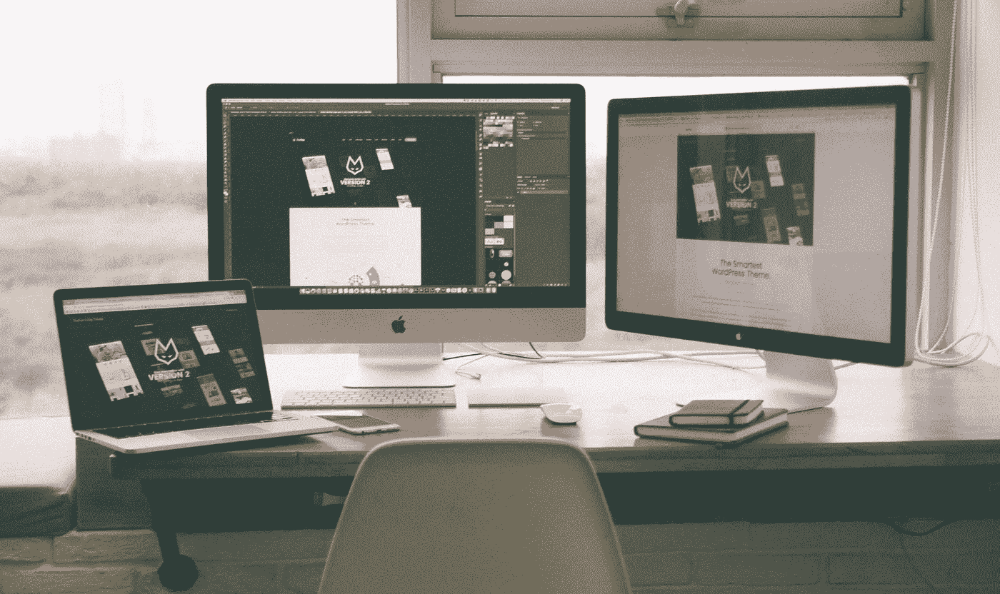

# UX 设计测试的好处

> 原文：<https://medium.com/codex/the-benefits-of-ux-design-testing-5fffc6829347?source=collection_archive---------18----------------------->

## UX 设计测试是设计过程中的一个重要部分，但却被许多设计师忽略了！

照片由 [Tranmautritam](https://www.pexels.com/photo/information-sign-on-shelf-251225/) 拍摄

UX 设计测试是一个帮助设计师在他们的设计向公众发布之前提高其可用性的过程。UX 设计测试的目标是发现并修复用户体验中的缺陷，以便用户可以有一个愉快的体验…