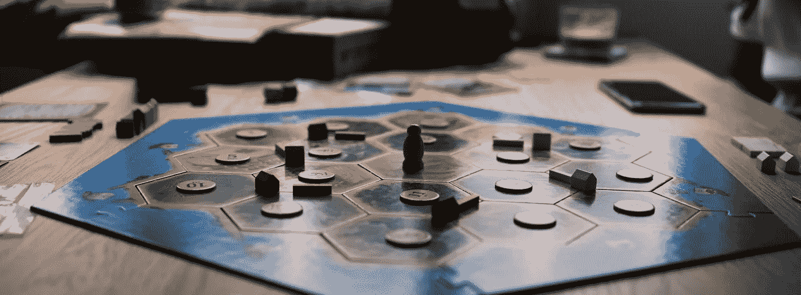

# 我如何建造最好的卡坦板

> 原文：<https://medium.com/codex/the-best-and-worst-catan-board-setups-989df4ba550a?source=collection_archive---------2----------------------->

图片由 [Unsplash](https://unsplash.com/) 提供

如果你玩过卡坦，你就会知道第一个定居点的选择有多重要。先挑能给你巨大的优势，而最后挑会让你在游戏开始前就落后很多。如果有一种方法可以找到最公平的卡坦板设置呢？通过多轮 MATLAB 模拟，我找到了一些最好的(和最差的)棋盘安排，让你的卡坦游戏更公平(或不公平)。