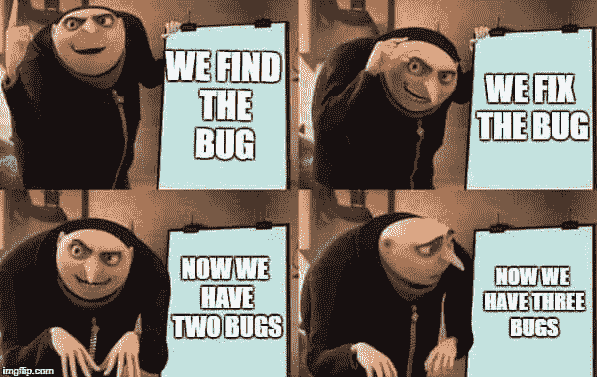

# 作为一名新的软件工程师，最好的入门方式是

> 原文：<https://medium.com/codex/the-best-way-to-get-started-as-a-new-software-engineer-13fad3c33c5b?source=collection_archive---------9----------------------->

## [法典](https://medium.com/codex)

来源:不是我

周五晚上。一个重要截止日期的前一天晚上。作为一名企业家，我已经习惯了周末工作。但是关于一个周末*的最后期限*我还是不太同意。然而，这项工作必须完成。这就是为什么我发现自己在电话里和我的工程师解释。忽略凌晨 1 点的文件。