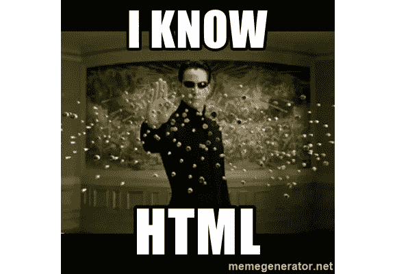
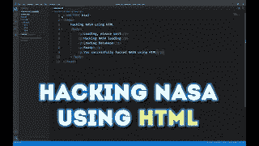

# 最小化代码的最好方法是通过 HTML…

> 原文：<https://medium.com/codex/the-best-way-to-minimise-code-is-through-html-d187a20bb0d6?source=collection_archive---------17----------------------->

## 无论是开发应用程序，网页，或任何软件。现在是我们就一件事达成共识的时候了… HTML 可能是有史以来最简单的语言。

我认识的大多数使用其他编程语言的程序员也懂 HTML。考虑到 HTML 非常容易学习，我假设大多数程序员都知道 HTML。

也就是说，这就是为什么我认为与 Python、JavaScript 等其他编程语言相比，HTML 可以最小化您的工作…

弗洛里安·奥利佛在 [Unsplash](https://unsplash.com?utm_source=medium&utm_medium=referral) 上拍摄的照片

## 首先，我很抱歉

我知道…我的文章一直不规范。但是，当我的考试结束时(在我写这篇文章的时候)，它会尽快恢复正常。

# 何时不使用 HTML

当然，有些地方使用 HTML 是最糟糕的想法。你不希望制作一个视频编辑器或任何复杂的应用程序，使用大量的图形(如 3d 工具等)。

HTML 也不是需要高性能的应用程序的好选择。当我试图用它来构建一个游戏引擎时，我艰难地意识到了这一点。不要成为我。

# 什么时候 HTML 最适合使用

我将用一个例子来解释这一点。我目前正在构建一个应用程序，有点像应用商店，但只是针对我的所有产品(我不会打破惊喜的元素，但你会明白的)。这是使用 HTML 的最佳地方，因为现在你根本不用构建桌面应用程序。你只需要为你的应用商店建立一个网站。现在，使用电子或任何这样的框架使它成为一种应用。就是这样！我的意思是…当然，你可能需要做一些额外的代码行来解决问题，tab，“达尔文”之类的，但是与从头再做一遍相比，这算不了什么。

我会在我的 [YouTube 频道上报道所有关于开发这个的事情。](https://www.youtube.com/channel/UCAEEOplNQDzc1bmrGqDPnyw)所以一定不要错过。我为你们计划了很多…

不开玩笑，这实际上是一个 YouTube 视频

# 您获得的优势

## 跨平台

你可以为免费的 BSD 桌面制作一个本地的桌面应用程序。所以…是的，你知道我在说什么。你不必为多个平台编写代码(不像 Windows 窗体、UWP、SwiftUI 等)。

## 较少代码

我认为如果我使用 JS 或 python 这样的语言来开发简单的应用程序，我会编写更多的代码(同样，我在这里不是在谈论复杂的软件)。

## 易用性

老实说，HTML 非常简单……它很简单，而且有很大的潜力。所以，就好好利用吧。由于每个 web 开发人员都必须使用 HTML，(不像应用程序开发人员使用多种语言)，HTML 也为…嗯…开发提供了很好的支持。

# 接下来…

我将很快写一篇关于只用 HTML、CSS 和 JS 开发任何东西的最佳框架的文章。但是现在，这篇简单的短文就讲到这里了。

# 结论

## 你现在明白我的意思了…

在这一点上，我不想不必要地延长文章。不像其他语言，HTML 有很大的潜力。我们只需要利用它。如果你是在为自己打造 app，那就好好想想吧。也许你可以用 HTML 来做。这也可能导致你在创建普通桌面应用的同时也创建了自己的网络应用。

话虽如此，我实际上是在构建一个 CSS 脚本(免费的，给大家看)。我不会说太多，但你可能会感兴趣。这里有一段视频。

> 法丁吉克