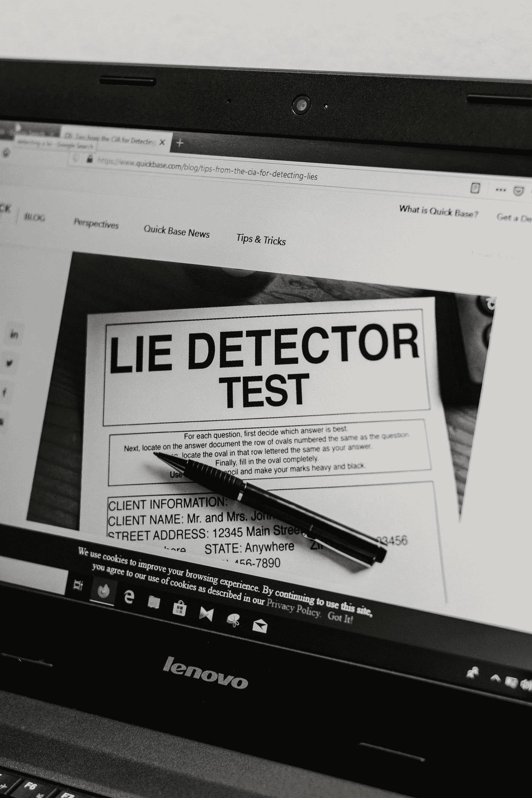

# 软件工程中最大的谎言

> 原文：<https://medium.com/codex/the-biggest-lie-in-software-engineering-f0516d147106?source=collection_archive---------1----------------------->

Ashkan Forouzani 在 [Unsplash](https://unsplash.com?utm_source=medium&utm_medium=referral) 上的照片

# 你是如何跟上行业趋势的？

我在软件工程面试中听到的最大的谎言是什么？它必须是标准工程面试问题的答案…“您如何跟上行业和行业趋势的变化？”

# 常见答案

*   Plurasite/Udemy 上的在线课程