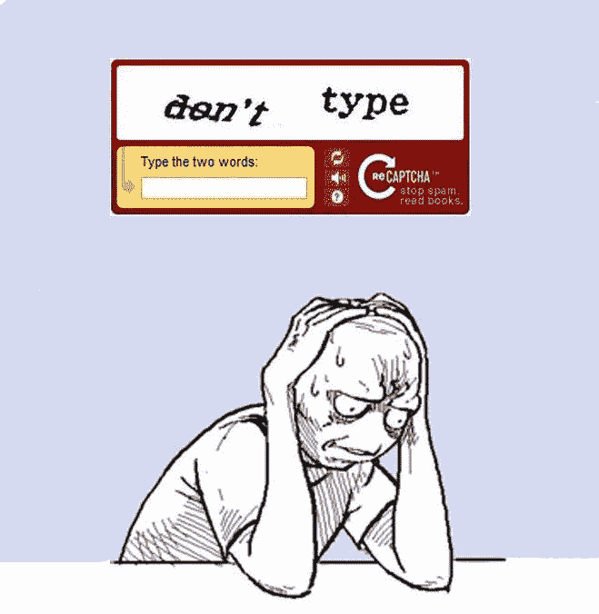
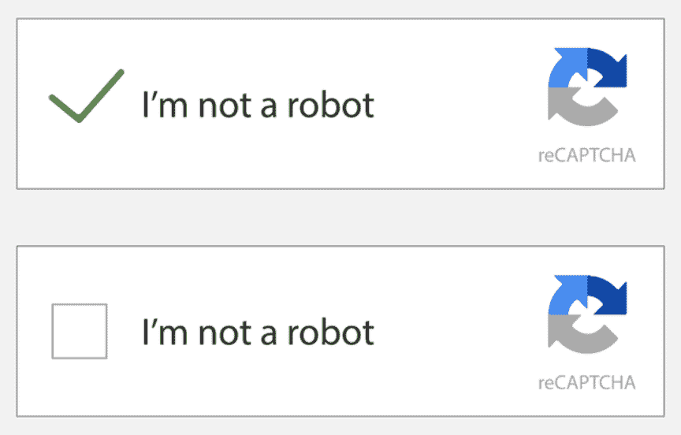

# 最大的网络抓取障碍和如何避免它们

> 原文：<https://medium.com/codex/the-biggest-web-scraping-roadblocks-and-how-to-avoid-them-669125b886b9?source=collection_archive---------8----------------------->

## [法典](http://medium.com/codex)

你好。正如你可能已经知道的，网络搜集对于商业和研究都是非常有用的。这种数据和信息提取越来越受欢迎，因此，网站也试图通过开发对策来阻止蜘蛛爬他们的产品。

当你抓取网页时，你可能会因为网站发现你使用了一个机器人而难以得到你想要的结果。有办法避免这种情况吗？

这就是这篇文章的内容。我将告诉你更多关于蜘蛛的用途，并向你展示如何不用担心反机器人措施就能抓取网页。

所以，如果你想尾随的话，请系好安全带！

# 为什么要使用刮网器

当你想在短时间内大量提取信息时，使用 web scraper 非常有用。企业在日常生活中使用这些工具的用例有很多。它们也可以用于研究目的，例如机器学习。

这里有几个例子来说明为什么网页抓取工具如此受欢迎:

*   线索挖掘
*   机器学习
*   研究
*   价格优化
*   搜索引擎优化

如果你有兴趣了解更多，你可以看看我的其他文章，我在这些文章中详细介绍了[网络爬虫的用例](/@dan.suciu/when-is-web-scraping-the-answer-the-top-7-uses-cases-for-data-extraction-d95cb72d12ac)。

# 网站如何识别和阻止网页抓取工具

上面提到的一些用例是大多数网站不希望被抓取的原因。我们都同意，与你的竞争对手分享信息不是一个好主意，所以他们希望真正的用户在他们的网站上爬行，而不是蜘蛛和机器人。

网站可以通过跟踪浏览器的活动，验证 IP 地址，植入蜜罐，添加验证码，甚至限制请求速率以避免垃圾邮件来识别网络爬虫。

让我向你解释一下这些网络抓取对策是如何工作的，以及你如何绕过它们继续无忧无虑地提取数据。

## 浏览器指纹识别

浏览器指纹是一种网站用来收集用户信息并将其活动和属性与唯一的在线“指纹”相关联的技术。该网站在您的浏览器后台运行脚本，以了解您的设备规格、您使用的操作系统类型或您的浏览器设置。此外，它可以找出你是否使用广告拦截器，用户代理，你在浏览什么语言，你的时区，等等。

所有这些属性被编织成一个独特的数字指纹，在网络上跟随你。通过这种方式，他们更容易检测到机器人，因为改变你的代理，使用匿名模式，清除你的 cookies 或浏览器历史不会改变指纹。

如何防止浏览器指纹干扰您的网页抓取？做这件事的一个好方法是玩假装。无头浏览器的行为就像一个真正的浏览器，但没有任何用户界面包装它。使用 Chrome 驱动程序是一种流行的方法。

现在的网站都有检测无头浏览器的方法，即使你在本地机器上实现解决方案，大规模工作也可能是一个问题，因为同时运行更多的实例将会使用大量的资源(RAM)。

## TLS 指纹识别

传输层安全性是在以前的安全套接字层(SSL)协议基础上开发的一种安全协议。HTTPS 是 HTTP 的安全版本。两者的区别在于 HTTPS 在 HTTP 协议上使用 TLS 或 SSL 加密。

这种类型的指纹类似于上面介绍的浏览器指纹，但是使用 TLS 来识别用户。当用户连接到服务器时，两者之间会交换请求。这个过程被称为“TLS 握手”，如果成功，协议将描述客户端和服务器如何相互通信。

你可以用 [TLSfingerprint](https://tlsfingerprint.io) 查看你的浏览器生成了什么指纹，甚至可以看到它在用户中有多受欢迎。通过使用一组参数，如握手版本、扩展、TLS 版本等，围绕这些“TLS 握手”构建 TLS 指纹。

怎么能把这个指纹换成更偷偷的刮网？替换 TLS 参数并不像听起来那么简单。如果你随机选择参数，TLS 指纹会非常罕见，它会被直接归类为骗局。你最好使用一个工具来帮助你修改你的参数。这里的[模块可能会帮助你](https://nodejs.org/api/tls.html)使用 Node.js 支持的刮刀。

## 可疑 IP

听起来很傻，甚至 IP 地址也可能有犯罪记录。网站有几种方法可以检测 IP 地址是否可疑:

1.  如果你使用的是免费代理池，很有可能他们已经被那个网站禁止了。要么是其他人已经使用了它们，要么是开发者事先将它们添加到了上述网站的黑名单中。如果你能找到那些代理人，他也能。
2.  使用由**数据中心**提供的 IP 地址也可能被认为是可疑的，因为它们具有相同的子网块范围，这使得它们很容易被检测到。
3.  一些网站可能认为来自不同地理位置的 IP 地址也是可疑的。它的内容可能只提供给某些国家或地理区域。虽然这不一定是可疑的，但它可能会阻止您访问所有您想要的内容。

使用住宅 IP 地址，这是一个人的个人网络，是解决这些问题的好办法。它们是来自互联网服务提供商的完全合法的 IP 地址，因此不太可能被阻止。受地理位置限制的内容也不会成为问题，因为一个好的代理池拥有来自世界各地的 IP 地址。

## IP 速率限制

速率限制是网站采用的一种策略，限制同一 IP 地址在一定时间内发出的请求数量。如果一个 IP 地址超过了这个数字，它将被禁止发出请求一段时间。

当在同一个网站上进行大规模网络抓取时，这种类型的机器人对策可能会非常令人恼火，因为它会减慢我的数据收集速度，但这并不意味着我们不能逃避这种不适。

一种解决方案是故意在每个请求之间增加延迟。一个更合适的解决方案是通过使用代理池从不同的位置向您想要抓取的网站发送请求。在请求之间切换到不同的 IP 地址使得速率限制器难以动作。

## 验证码

我敢肯定你在上网的时候遇到过验证码验证。这种类型的反机器人措施通常被网站用来确认一个真实的人在计算机屏幕后面。

[来源](https://i.kym-cdn.com/photos/images/facebook/000/355/550/da2.jpg)

验证码通常显示给可疑的 IP 地址，因此一个快速的解决方案是使用不同的代理重试请求。在其他情况下，使用验证码解决服务将是最佳解决方案，如[2 验证码](https://2captcha.com)或[反验证码](https://anti-captcha.com/mainpage)。

有各种类型的验证码。有些可能涉及解决一个简单的数学问题，单词识别，或识别图片中的物体。例如，谷歌在 2014 年推出了现在很受欢迎的 [reCAPTCHA](https://www.google.com/recaptcha/about/) ，用于跟踪用户的运动和数据。对于用户来说，这可能是一个简单的任务，但对于机器人来说，这往往很难，因为他们往往非常有条理，并在中间选中框。如果验证失败，reCAPTCHA 可以要求进行另一次测试，类似于上面介绍的测试。

请注意，即使您设法通过解决验证码或使用不同的代理重试来避免这种反机器人措施，您的数据提取仍然会被检测到。

# 最后的想法

我希望这个故事对你的网络抓取项目有很好的指导，现在你知道网站如何保护自己，防止你的数据提取过程。

有很多因素需要考虑，并为每个人实现一个旁路，以抓取网站而不被注意和阻止。如果你问我的话，这可能相当耗时，但如果方法正确，这并非不可能。

你有没有想过使用第三方软件，比如 API，它可以帮你解决所有这些麻烦的事情？看看 [WebScrapingAPI](https://webscrapingapi.com) 。对于没有时间从头开始构建自己的工具的开发人员来说，这是一个值得信赖的解决方案。