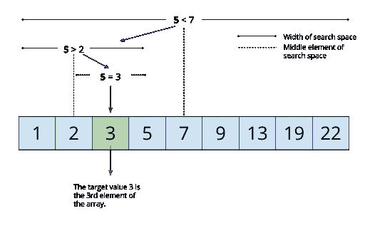
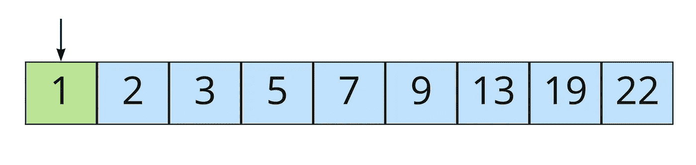
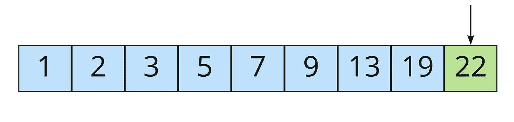

# 二分搜索法方法论

> 原文：<https://medium.com/codex/the-binary-search-methodology-3cd21fc66531?source=collection_archive---------6----------------------->

《奥托姆瓦信使》半月刊| 1902 年 4 月 8 日

我一直在更批判性地思考如何思考编程。

这种批判性思维不是*我*的错。如果让我自己决定，我会很高兴地继续编程，而不会反省。然而，我和*的其他人*一起工作，有时他们会说这样的话，“你到底是怎么从这里到那里的？”或者用一种更直接的方式:“你能描述一下你的思维过程吗？”

*形容* *我现在什么样子*？

显然这些人不满意(*我认为*是什么)一个好答案。就像我五年级的老师戴尔夫人一样，他们要求我展示我的作品。我不知道戴尔夫人是怎么找到他们的，虽然我想起来我可以看到她与犯罪黑社会有联系——但我没有在五年级展示我的作品，而且我肯定赫克斯现在不会开始。

…

好吧，我会试试看。

《二分搜索法》| [维基媒体](https://commons.wikimedia.org/wiki/File:Binary_search.svg)

# 论类比

我想描述一种我经常使用的思考问题的方法:二分搜索法方法。我不是专门用这个的，但是我确实经常用。

我以前曾经顺便描述过这一点，但是当设计“大事情”(即任何比打印声明更琐碎的事情)时，我经常关注问题空间的两个极端:最小值和最大值——就像一个[二分搜索法](https://en.wikipedia.org/wiki/Binary_search_algorithm)！看，这个类比很有道理。

这是我大脑全力运转的数学部分。我倾向于用演绎步骤来思考问题:每一步都构成了通向更大、更友好、更理想的解决方案的桥梁。我们需要这些步骤来用我们有限的大脑做有意义的工作，或者至少在任何非平凡的规模下进行及时的 T21 工作。

如果我们只考虑系统的最小一端，那么我们很可能最终得到一个笨拙的表面区域——你永远也不想使用的代码。当我们写代码时，我们想在好的符号和抽象的基础上写，而不是直接在基本原则上写。我们使用**和**、**或**、**而不是**来代替 [Sheffer Stroke](https://en.wikipedia.org/wiki/Sheffer_stroke) ，后者可用于导出所有那些“高级”布尔运算符。我们用加号和减号代替集合来描述算术[。](https://www.math.uh.edu/~dlabate/settheory_Ashlock.pdf)

这不仅仅是*对[*reduction ad absurdum*](https://en.wikipedia.org/wiki/Reductio_ad_absurdum)的笨拙使用——当 TDD(这是我喜欢的)被用来排除其他所有工具时，这个问题经常出现(稍后会有更多相关内容——更多)。只考虑小部分而不考虑整体会导致不连贯的最终结果，即“技术上可行”但概念上难以操作。*

缩小到我们问题空间的全景。在这个空间的另一端，如果我们只考虑系统的最大端，比如只考虑 API，那么我们很可能会以隐藏的复杂性而告终，而不是真正简单的东西。很多时候，完全自顶向下的设计导致了一系列的外观:每一个都隐藏了潜在的复杂性。正如我之前详细描述的(可能有太多的食物类比)，这导致了*简单*而不是*简单*。

让我们分阶段来解决这个问题。

永别了印度——泰姬陵| [特雷·拉特克利夫](https://www.flickr.com/photos/stuckincustoms/2035748576)

# 第一阶段:我想处理什么代码？

这是我们二分搜索法类比中的最大值。

从结尾开始，先回答代码消耗的问题:有人将如何使用你将要写的代码？有时候，老实说，这是最好的选择:内心对话就此结束。一举解决。

> ME 拖着一个太重的大箱子从左边进入舞台。
> 
> *我自己:[轻蔑地*]你那里有什么——我感兴趣的东西吗？**
> 
> **【*ME 停止。*
> 
> ***我:*沉重地*转念一想……不***
> 
> ***窗帘***

**其他解决方案，在最顶层，就像一个函数调用一样简单。或者，您可能希望使用一些您以前见过的漂亮的 API。或者也许你正在想象*一个完整的、改变世界的、划时代的 DSL*T2(呃，可能不是这个)。**

**我想提醒你:我不是在描述 TDD。**

**使用二分搜索法方法，你*在使用整个系统*之前就消耗掉了它。撰写完整的最终使用案例，从头到尾。你不是针对尚不存在的代码编写单元测试，这更像是针对尚不存在的整体系统编写完整的集成测试。TDD 会让你完成一个系统的各个部分，而二分搜索法方法论(我正在努力让这一切发生)会让你思考一个系统的整体。**

**我一般会打开 VSCode(不要评价我)，做一个新的空白页，然后输入。听起来很疯狂，我知道。我写，我删除，我再写一些，我对它进行代码审查，并试图找出它的混乱之处，哪里有太多的样板文件，哪些是可扩展的，哪些不是。我可能会写几百行代码来**探索**我想要的结果。**

**这不是 TDD。**

****

**蚂蚁吃蚱蜢| [Libreshot](https://libreshot.com/ants-eat-the-grasshopper-2/)**

# ****第二阶段:我做这项工作需要的最少的东西是什么**？**

**你怎么吃蚱蜢？用你盲目的亲信的军队把它撕碎，用蚁酸把它烧死。**

**既然我们知道我们最终想要什么代码，我们需要将我们的思维转移到系统的第一原则(好吧，那篇文章在亚里士多德和埃隆·马斯克之间的对等有点多)。这些“最小的部分”不是重新发明轮子的部分，所以请不要把这当成从头开始写 HTTP 服务器的建议。只有白痴才会这么做。**

**以下是一些很好的例子:**

*   **我需要能把 X 转换成 y 的东西。**
*   **我需要能装东西的东西。**
*   **我需要能发送东西的东西。**
*   **我需要一个能阻止()的东西的集合。**

**第一原则是独一无二的，因为这些项目是如此简单，他们甚至不能真正反对。当你系统的底端*不需要证明*时，你做得很好。如果你需要证明某样东西是需要的，那还不够简单！**

**这是…夸张的说法，至少可以这么说——你不会在这里深入到宇宙的基础；然而，很多时候我们认为我们是“简单的”，但是我们“简单”系统中最小的部分需要大量的解释来维护。这是一个警告信号。如果你从陈述显而易见的事情开始，你可以比从一篇十页的文章开始你的出发点更容易。通常，我用指向单词间的箭头来表达这些首要原则。我知道这很复杂。**

**这也不是 TDD。**

****

**[来自 Piqsels](https://www.piqsels.com/en/public-domain-photo-jqzgp)**

# **第三阶段:TDD？**

**既然我已经多次重复“这不是 TDD ”,让我们回到什么是*TDD，因为虽然你的第一原则可能不需要证明，但你的垃圾代码肯定需要——TDD 是解决这个问题的一个很好的工具。***

***等等——这篇该死的文章到底是什么意思(*原谅你的粗话*)？这个家伙真的有些厚颜无耻 BSD 不就是一个精心包装的 TDD 吗？？***

**TDD 的死忠们欢呼它是一种真正的开发方式，但是很多时候他们会弄不清何时使用它。TDD 是台锯:它不仅让事情变得直截了当和真实，它还能让你更擅长做事情。你将能够做出以前无法做出的东西。**

**另一方面，BSM 是铅笔和纸。**

**你看到了吗？**

# ****TDD 不是思考工具，是工作工具**。**

**你强调那句话了吗？我给你一秒钟时间回去突出显示它。你只要用你的——哦，好吧，你已经知道如何高亮显示了；只是你还没有突出来而已…**

****

**我的鸡舍。对于这幅不可思议的画，我没有一点保留的权利。**

**我已经有了一个关于思维与工作误解的半废弃草稿——所以不要担心，你很快就会淹没在一篇过于冗长的文章中。然而，让我用一个例子来预示。**

**我刚刚在我的后院建了一个鸡舍，让我告诉你——用台锯来思考，即使我可以从无限的木材中得到无限的重来，这仍然是一个愚蠢的建造方式。事实上，我会说我用台锯做了一点点思考，这就是为什么巢箱…需要一些工作。**

**你知道擅长建造鸡舍的人会做什么吗？他们拿出铅笔，先画一幅画。**

**参观一下鸡舍。当我走进去的时候，我应该朝哪个方向开门——这会不会把鸡压扁？从这个角度我能从巢箱里取出一个蛋吗？TDD 忙于确保门按预期打开，而忽略了当你从窗户向后院看时铰链是否好看。**

**另一方面，BSM 是 TDD 等伟大工具的包装者。BSM 帮助你理解事物。只有这样，你才需要使用电动工具来执行。BSM 帮助你使用像 TDD 这样的工具，但是其他人的工作也不行。**

****

**哈姆雷特，哲瑞·雷恩版| [维基媒体](https://commons.wikimedia.org/wiki/File:Hamlet,_Drury_Lane_Edition.jpg)**

# **总之:也许不是 TDD？**

**或者，使用不带 TDD 的 BSM *。***

**也许我应该在这篇文章中使用 BSM，因为我回到了建议也许你不应该使用 TDD(在这一点上，我甚至让自己感到沮丧)。**

**请记住，这整个论述是关于*思考*解决问题——解决问题是一个子项目。不幸的是，TDD 经常被错误分类:TDD 不是一个思考框架，而是一个工作框架。它是许多工作框架中的一个，不应该在需要思考框架的地方使用，也不应该在排除其他工作框架的情况下使用。但无论如何，在正确的环境中使用它，并学会很好地使用它。**

**我从事游戏工作，在开发一个游戏性特性的时候，TDD 几乎完全没有用。许多游戏开发颠倒了 TDD 的关注顺序。而不是“有用吗？”首先，我们最关心的是“感觉好吗？”你可能会惊讶有多少游戏在野外运行得很好，但实际上并没有运行。然而，一个完美的、不好玩的游戏并不是一个好游戏。**

**另一方面，当我们转向创作和扩展某种认证服务器时，我们需要确保它首先工作*——并且客户端有望覆盖大量终端用户的罪恶。不幸的是，许多工程师采用相同的工作工具，TDD，并试图将其应用于这个鸿沟。这会导致失望。***

***把你的头从*工作*中抽出来，试试 BSM 的*思维*。***