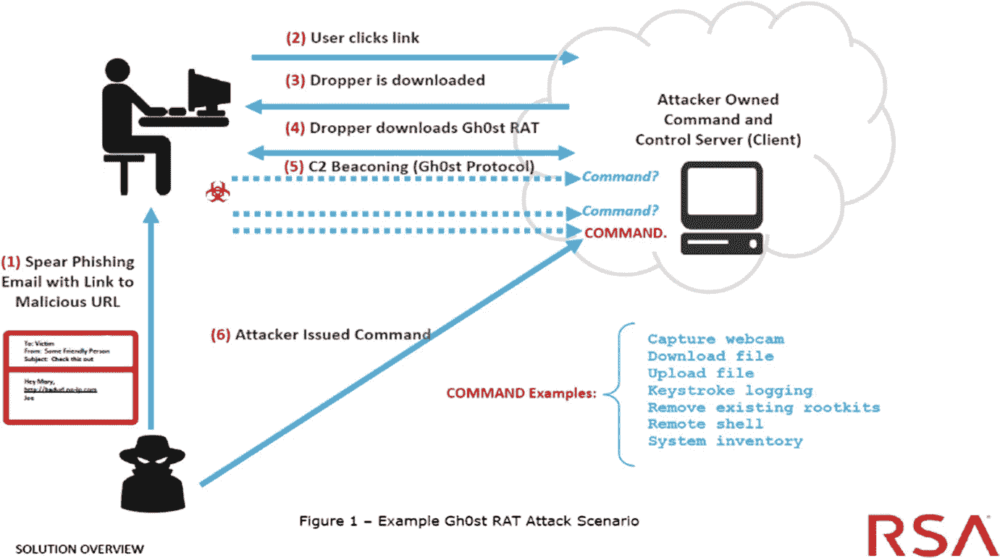

# 远程访问木马(rat)的诞生和崛起

> 原文：<https://medium.com/codex/the-birth-and-rise-of-remote-access-trojans-rats-2819d7ab2b06?source=collection_archive---------4----------------------->

## rat 本身应该考虑使用威胁信息来检测新的数字威胁，并实施防御和预防措施。rat 在高级持续威胁(APT)的执行中扮演着重要角色。

Gh0st RAT 攻击场景示例—来源:[https://link . springer . com/chapter/10.1007/978-3-030-38557-6 _ 18](https://link.springer.com/chapter/10.1007/978-3-030-38557-6_18)