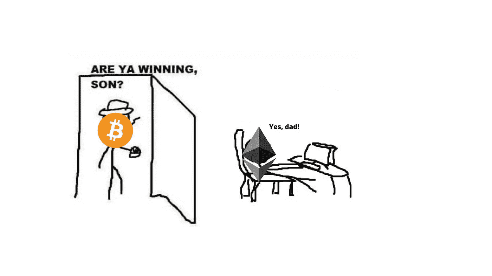
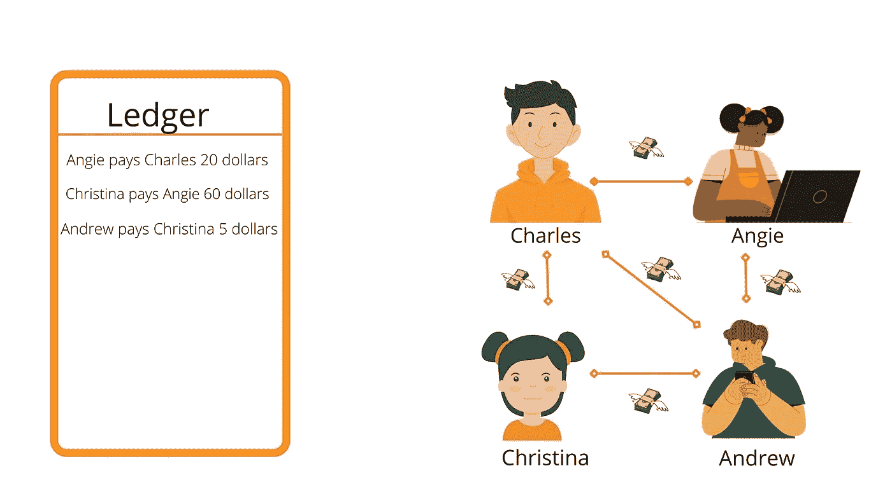
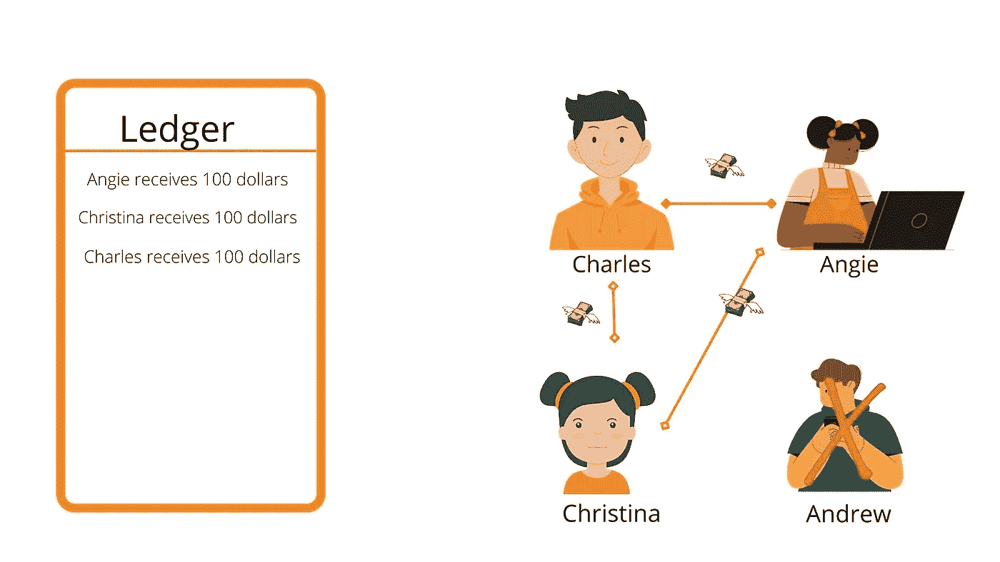
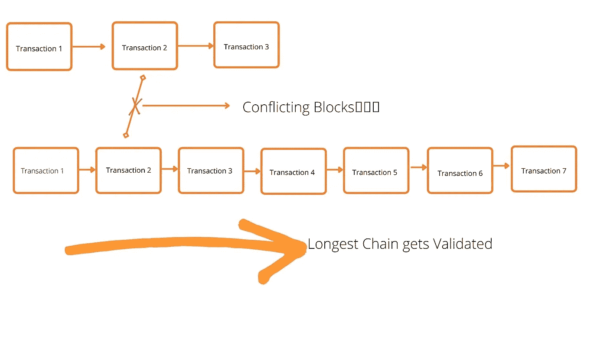
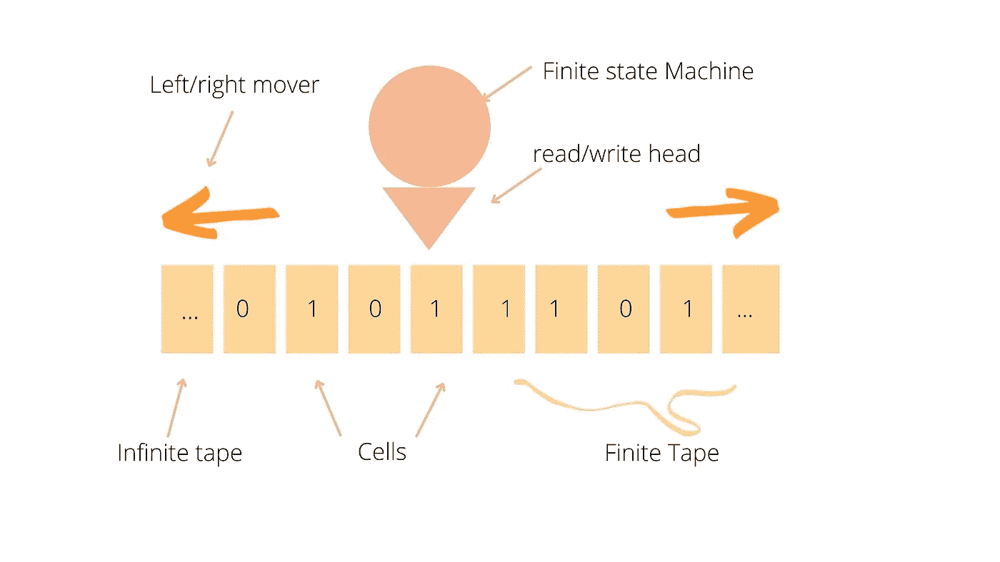
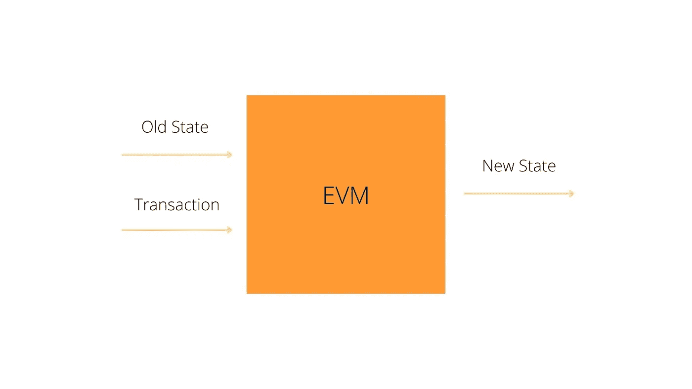

# 区块链社区需要以太坊来赢得胜利！

> 原文：<https://medium.com/codex/the-blockchain-community-needed-ethereum-to-win-c7adb3bf5242?source=collection_archive---------12----------------------->



你赢了儿子迷因是基于加密货币吗？

**目录**

*   [简介](#74c1)
*   [什么是区块链？](#2e19)
*   如何创建自己的区块链的实用指南
*   [比特币协议的局限性](#d95a)
*   [为什么以太坊对以太坊社区如此重要](#801d)
*   [以太坊针对死机问题的热修复](#1937)
*   [以太坊区块链的组成](#091c)
*   [以太坊虚拟机出现图灵不完整的问题](#5ca9)
*   [为什么比特币被做成了图灵不完全](#9265)
*   [结论](#7caa)

比特币白皮书发布于 13 年前。尽管这个想法从那时起已经有了很大的发展，并得到了一些主流的采纳，但这个想法仍然让人感觉是边缘的。比特币白皮书作者中本聪(化名)提出的理论旨在通过重新定义金融机构看待资产的方式以及这些资产的存储和使用方式来扰乱金融机构，方法是将这些资产的创建和分配从政府和金融机构外包给一个分散的、不可信的数据库(单点故障)，个人可以在这个数据库中做出抵制审查的举动，并将资产存储在区块链中。

区块链使得中本聪在白皮书中提出的数字资产比特币真正去中心化。区块链充当公共分类账，以数字方式存储信息，并由每个人都可以访问的节点(存储、共享和保存数据的分散式网络的单个实例)维护。您拥有的数字资产(比特币)数量基于您在区块链的交易历史。如果这看起来太多了(对我来说是:/)，让我们通过一个实际的用例来了解公共总账是如何使用加密技术工作的，以及当参与系统的各方开始不那么信任对方时，它们是如何随着时间变得分散的。

查尔斯、安吉、克里斯蒂娜和安德鲁是大学室友。他们经常一起支付东西，从电费到晚餐账单。每次出现付款需求时，他们都必须将账单分成四份，过一段时间后这变得很麻烦，因此，Angie 创建了一个分类账，记录彼此的所有付款，他们将在月底付清欠款。这个系统减少了他们立即分摊所有费用的需要。例如，如果克里斯蒂娜支付了 100 美元的有线电视费，她会在总账上记下查尔斯、安吉和安德鲁各欠她 25 美元，在月底，他们会支付这笔款项。相当简单(这是我的伏笔)



一个简单的公共分类帐支付系统的例子

在这个系统上，Angie 创建了:

*   任何人都可以在账本上加一行。
*   每个人都在月底收到或发送钱给他们所欠的人。

这个系统在最初的几个月里似乎运行得很好，没有抱怨，因为他们是朋友，彼此信任。几个月后，克里斯蒂娜抱怨她被要求支付多少钱，因为她从来不记得花了那么多钱。经过多次争论，她坚持认为应该有一种更好的方式来记录总账上的交易，使其更加安全。查尔斯建议我们在每一笔交易上签字，以证明我们已经像合同一样看过并认可了。安德鲁对这个想法一笑置之，说有人可以很容易地在账本上伪造签名，这不够安全。在争论中，Angie，一个计算机科学的学生，想起了她被教导的一个概念，叫做加密散列函数。她打断了这场争论，说道:“我们可以通过创建一个程序，将我们在账本上的信息映射到我们自己的密钥上，从而使用数字签名。我们可以使用每个人都可以使用的公钥来验证条目。”

数字签名是一种电子签名，我们可以用它来验证我们写下的消息。我们必须创建一个依赖于消息和私钥(sk)的函数来生成这个签名。

```
Sign(Transaction, sk) = Signature 
```

私钥(sk)用于创建消息的加密哈希函数，并产生固定大小的加密文本输出，称为哈希值，除非您知道私钥，否则任何人都无法解密。

为了验证我们在程序中写下的交易是有效的，我们将对照公钥进行交叉检查，以检查交易是真还是假。

```
Verify(Transaction, Signature, pk) = True or False
```

用高层次的术语来说，我们可以把这个验证系统想象成你小时候，你的监护人每天去学校接你。你的监护人充当了秘密钥匙，他们是唯一被允许通过签字离开学校来接你的人。

加密哈希函数的示例如下:

现在我们有一个分类帐，其中的交易由使用 SHA 256 算法的数字签名保护，这是高度安全的，如果您不知道密钥，很难找到有效的签名。每笔交易还将有一个唯一的 ID，以避免条目重复。

安吉创建的新系统上的协议:

*   任何人都可以向分类帐添加行。
*   每个人都在月底收到或发送钱给他们所欠的人。
*   只有已签名的交易才有效，未签名的交易无效。
*   每个交易还具有唯一的标识符或随机数，以避免条目重复。

这个系统看起来运行良好，直到安德鲁转到另一所学校的那个月。他们发现他在月底负债 1000 美元，这引起了轩然大波和许多内讧。突然之间，没有人再信任对方的钱了。这个问题让安吉明显感到不安，她提出了一个新的想法，“如果我们都投入一个初始金额，并且没有人被允许花费超过他们在账上的金额，会怎么样？”



新的分类账系统，不包括安德鲁，每个人都存 100 美元，并且不允许花费超过他们的存款。

Angie 创建的这个新系统似乎工作得非常好，以至于其他宿舍也开始使用她的程序采用这种方法，很快整个大学都开始使用账本作为交换手段。Angie 创造了她的代币，称为 AngCoin，他们用它来交换，所以学生们用美元交换 Angcoin，因为它成为大学里交换的主要来源。过了一段时间，代币出现了很多关于内幕交易和人为秒杀的猜测。他们说她只是为了自己的利益而利用它，这不是真的。尽管如此，她避开了所有的批评。最终，她决定开源她的程序，给每个人一份账本，让他们自己监控交易，以确保没有任何可疑之处。因此，每次交易发生时，程序会将交易广播给大学中的每个人，以将其添加到他们的分类帐中。Angie 为这个系统创建的新协议如下所示:

*   任何人都可以向分类帐添加行。
*   每个人都以代币的形式从他们所欠的人那里收取或向他们寄钱
*   您可以用真实货币交换分类帐中已签名的事务处理行。
*   只有已签名的交易才有效，未签名的交易无效。
*   只有已签名的交易记录才会添加到分类帐中。
*   每笔交易还有一个唯一的标识符，以避免条目重复。
*   街区里的每个人都有一份数据库的拷贝，这使得数据库变得分散。

这个新系统滋生了不信任，因为任何人都可以在分类账上传播错误的交易。当人们得到不一致的块时，他们将不得不手动检查哪个交易已经被签署，哪个没有被签署，并且对于系统的规模，这个过程是非常麻烦的。因此，Angie 设计了一种方法来阻止人们在区块上进行错误的交易，方法是创建一个工作证明算法，每个要添加到链中的区块都必须求解该算法，每次区块创建者(矿工)求解该算法时，系统都会奖励他们一个不需要任何人签名的 Angcoins。

*比特币工作证明共识需要在哈希函数中至少有 17 个零，程序才能将其添加到区块链中。*

系统上的人还将向这些区块创建者支付费用，以将他们的交易添加到区块中，但交易限额将被限制在每笔交易 0.005 盎格鲁硬币。

*一个区块可以有超过 500 笔交易，规模高达 8MB，平均交易费用为 80 satoshis。*

这也意味着系统中的金币总数会随着每一个新方块的加入而增加。因此，当使用这种交易进行支付时，你会听到相互叠加的连贯块，因此这种新协议的关键是，如果你看到两个冲突的区块链，你会听到你可以信任的最长的区块链，链越长，你就越可以信任它，因为这是计算工作量最大的一个。如果它们的长度相同，请等待，直到您看到一个额外的块，该块使其中一个更长，计算工作量最大。每个块还依赖于添加到其中的块的先前哈希，因此一个块中的更改会影响链中的所有块，从而导致雪崩效应。这个系统使人们更容易真诚地行动，因为对系统采取恶意行动会付出更高的代价。


区块创造者(矿工)将他们开采的区块发送到大学，供每个人添加到他们的分类账中。

*根据比特币协议，矿工每开采一个区块可获得 6.25 比特币，他们获得的金额每四年减少一半，因此他们只有 2100 万个可能被开采的比特币。*



区块链最长的链条正在得到验证。

Angie 创建的区块链技术的简单实现:

用 python 实现一个简单的区块链

```
Output:
Nonce for the genesis block: 175
Nonce for the second block: 133
Nonce for the third block: 708Hash for the genesis block: 003fa7db7fd704d200ccb8b8bba927fa107a015613ca46e9be44f449ba230876
Hash for the second block:
00d7e08a9db22ba7e5b739b3efc3e7f25d34df2147d0a9f8efd7f54b6845791a
Hash for the second block:
003cec13eb3e0243911adcef36221a796c3778623d4835376c51a4cf82e73850
```

这个系统导致了对分散计算工作的信任。这个系统仍然有很多问题，就像 Sybil 攻击发生一样，当一个集中的权力机构控制了 24%的链时，就会发生这种攻击，这使得他们可以进行一些恶意活动。如果他们拥有链上超过 50%的计算资源，他们可以欺骗人们认为添加的块是有效的。尽管如此，当越来越多的人使用这个系统时，这种攻击的威胁就会降低，因为它变得非常耗费资源。

在比特币系统上，控制 50%的计算资源需要 800 亿美元。

这个新系统背后的协议是:

*   任何人都可以向块中添加事务。
*   仅验证已签名的交易。其余作废。
*   你可以用实物货币购买外链代币，换取交易加入区块。
*   每笔交易还有一个唯一的标识符，以避免条目重复。
*   块创建者(挖掘者)将有效事务添加到块中。
*   您需要在将您的块添加到链之前进行工作证明。
*   积木创建者根据他们添加到区块链中的积木数量获得积木奖励。
*   每个人都可以访问区块链或分散的区块链。
*   最长的链是在数据库上得到验证的区块链，而最短的链被系统上的用户作废。
*   每个人都根据分散式分类账上的交易历史，以代币(Angcoins)的形式向他们欠下的人收款或汇款。

**比特币协议受到限制**

从高层次来看，这一概念是比特币使用区块链协议存在的基础。中本聪创建了这一协议，作为一种在去中心化和不可信的平台上交换资产(比特币)的方式，以从区块链创造一种全球货币，这种货币不是由中央政府创造的，也不受中央银行系统控制。这些协议被设计成是为一个特定程序创建的专用工具。对于比特币协议，它是数字资产，对于 Namecoin，它是域名注册。这些协议就像一个计算器，不能用来做协议范围之外的任何事情。


代表区块链协议的计算器

这种设计给区块链开发者带来了很多瓶颈，因为它使得开发者很难创建分散的应用或程序。它们是一些像瑞士军刀一样的协议，但它们受到后见之明的限制。协议被设计成做一件事，并且只做一件事，开发者需要为他们想到的每个分散的应用程序创建一个新的协议，这为开发者创建分散的应用程序提供了一个巨大的障碍。


我所能做的最好的 meme 是基于一个不兼容所有计算用例的瑞士军刀协议。

虽然对使用分散式应用程序有很多批评，但有些批评是有道理的。从法规问题、欺诈和大规模功耗来看，这可能是阻止分散化实现大规模采用的最重要的瓶颈，因为为每个分散化的应用程序创建协议存在障碍。


[采掘用电量](https://reneweconomy.com.au/bitcoin-mining-to-consume-more-electricity-than-whole-of-australia-by-2024/#:~:text=Bitcoin%20mining%20to%20consume%20more%20electricity%20than%20whole%20of%20Australia%20by%202024,-Michael%20Mazengarb%207&text=The%20amount%20of%20electricity%20consumed,Australia%2C%20new%20research%20has%20predicted.)

**为什么以太坊对区块链科技如此重要**

以太坊被设计成一个通用的区块链，像 iOS、Android 或 Windows 操作系统一样。您可以在其上构建应用程序，而不是创建一个全新的操作系统来运行应用程序。以太坊可以通过一个图灵完全虚拟机来实现这一点，其中以太坊虚拟机(EVM)可以存储状态。Vitalik Buterin 创建了以太坊虚拟机来处理任何可以在有限状态机上发生的复杂计算系统。艾伦·图灵(Alan Turing)设计的图灵机是一台拥有无限长度的空白磁带的机器——实际上是一个两端可以无限增长的一维数组——并允许它在磁带上的任何地方读写字符。一个单独的磁带既作为存储又作为输入:它可以预先填充一串字符作为输入。机器可以在执行过程中读取这些字符，并在必要时覆盖它们。有了这盘带子，我们可以解决新的问题，而不仅仅是简单地接受或拒绝字符串。例如，我们可以设计一个确定性的图灵机，在磁带上递增一个二进制数。

它们是在图灵机上递增二进制数的六个步骤:

给机器三个状态，1、2 和 3，状态 3 是接受状态。

*   在状态 1 下启动机器，使磁头位于二进制数最右边的数字上。
*   当在状态 1 中读取到 0(或空白)时，用 1 覆盖它，向右移动磁头，进入状态 2。
*   当处于状态 1 并且读取了 1 时，用 0 覆盖它，并且向左移动磁头。
*   当读取到状态二和 0 或 1 时，向右移动磁头。
*   当处于状态二并且读取空白时，向左移动磁头并进入状态三。



图灵机

能够访问无限长磁带的有限状态机称为图灵机。如果忽略有限内存的限制，所有程序设计语言都是图灵完全的。以太坊能够在称为以太坊虚拟机的状态机中执行存储的程序，同时向内存读写数据，这使其成为一个图灵完全系统，因此也是一个通用图灵机。鉴于有限内存的限制，以太坊可以计算任何图灵机计算的任何算法。Ethereum 是一个确定性的但实际上是未绑定的状态机，由一个全局可访问的单例状态和一个虚拟机组成，该虚拟机使用智能契约将更改应用到表单。



以太坊虚拟机使开发者能够在平台上创建强大的去中心化应用，如社交网络应用、消息系统、去中心化自治组织(Dao)等。，限制很少，同时仍然具有比特币提供的透明度，并且在以太坊 2.0 中引入了[股权证明](https://www.investopedia.com/terms/p/proof-stake-pos.asp#:~:text=Proof%2Dof%2Dstake%20is%20a,and%20keeping%20the%20database%20secure.)，更加碳友好。

以下是如何使用以太坊创建简单、智能的合同的示例:

```
#A program to create a basic decentralized DNS system where people can register addresses on ethereumdata domains[](owner, ip) #mapping between a domain and a tuple conntaining an ip address#register the domain address if the address does not already exist 
def register(addr):
    if not self.domain[addr].owner:
        self.domains[addr].owner = msg.sender # set the ip address associated with the domain address after it has been created 
def set_ip(addr, ip):
    if self.domain[addr].owner == msg.sender:
        self.domains[addr].ip = ip
```

然而，图灵完备性也有它的缺点，比如停机问题证明你不能预测一个程序是否会在你在机器上模拟它的任何时候终止。其他的图灵机，比如打印机，如果运行在无限循环上就可以从源头上停止，而在微波炉的情况下，如果一直运行在无限循环上就可以通过爆炸来控制。


一个小女孩怀疑地盯着燃烧的建筑物后面。

不幸的是，当这个问题出现时，一个去中心化的系统没有“ctrl+C”——如果有，它就不是去中心化的。添加一个无限运行的智能契约，不管是无意的还是有意的，都会导致某种形式的 DOS 攻击。拒绝服务(DoS)攻击旨在关闭机器或网络，使其目标用户无法访问。例如，DoS 攻击可能发生在一家小商店，在大热天，许多人走进商店，假装在购物以躲避高温，因为商店有空调。这种情况一直发生，直到商店满负荷运转。尽管如此，没有人买东西，有些人在偷东西，因为周围有很多人，所以很难跟踪，一天下来你会亏本。拒绝服务攻击浪费了许多资源，其他节点可以使用这些资源来处理智能合同。以太坊对此的解决方案是创造汽油费。当 EVM 执行智能合同时，它会仔细考虑每条指令(计算、数据访问等)。).每条指令都有一个以 gas 为单位的预定成本。当一个交易触发智能合约的执行时，它必须包括一定数量的 gas，该数量设置了运行智能合约可以消耗的气体的上限。如果计算消耗的气体量超过事务中可用的气体量，EVM 将终止执行。Gas 是以太坊使用的机制，它允许图灵完全计算，同时限制任何程序可以消耗的资源。所以以太坊更像是一个准图灵机，利用它的计算能力的优势，同时解决我们可以用以太购买的汽油费的停机问题。

以太坊区块链的组件:

*   一种基于标准化协议的对等(P2P)网络，连接参与者，传播事务，传播事务和验证的事务块
*   事务形式的消息表示状态转换。
*   一组共识规则，管理什么构成事务，什么构成有效的状态转换
*   根据共识规则处理事务的状态机。
*   加密保护的区块链充当所有验证和接受的状态转换的记录。
*   一种共识算法，通过强制参与者合作来实施共识率，从而分散对区块链的控制。
*   从理论上讲，一个游戏听起来像是激励机制(股权证明、汽油费)，以经济的方式保护开放环境中的国家机器。
*   上述内容的一个或多个开源软件实现(“客户端”)。

以太坊回答了这个问题:“如果我们可以跟踪任何任意状态，并对状态机进行编程，以在共识协议下创建一台全球计算机，会怎么样？”


以太坊联合创始人兼首席执行官 Vitalik Buterin 在敌无双演讲。

**以太坊图灵完成的问题**

然而，以太坊确实有很多缺点，因为它的以太坊虚拟环境看似不安全的设计，并且缺乏现代虚拟机功能，如调度和抽象必须完全由面向用户的语言来处理，这使得语言设计者，如 Solidity 的作者，面临艰巨的工作，并且有太多的机会犯严重的错误。字节码模型也使得在链上读取具有挑战性，并且必须被反编译以进行调试或验证。相比之下，任何建立在 EVM 之上的语言都会产生难以辨认和无法被人类验证的字节码，因此只会对用该语言编写的程序的功能产生不完整的理解。这种设计决策使得以太坊容易受到大量攻击。

**比特币解决了这个问题……..**

比特币提供了一种安全、简单、有效可读的字节码语言，旨在保证在区块链上运行的程序的一致性和正确性。它提供了一个最小的指令集，并主要使用字节码来保持较小的有效载荷。创造者有意使图灵不完整，使其更易访问，更有效地与协议一起工作。


阴阳符号，其中白色代表比特币白皮书，黄色代表以太坊黄皮书。

比特币和以太坊协议对于区块链来说同样重要，并且需要彼此来实现全面采用。虽然比特币专注于作为价值储存手段，但以太坊可以通过未来的迭代努力成为更好、更快、更高效的通用计算机。

**供进一步阅读的参考资料**

*   汤姆·斯图尔特的《理解计算》
*   加文·伍德博士和安德里亚斯·安东诺普洛斯的《掌握以太坊》
*   中本聪的比特币白皮书
*   维塔利克·布特林的以太坊黄皮书
*   solidity Security:Adrian Manning 博士的已知攻击媒介和常见反模式的综合列表
*   EVM 从根本上说是不安全的