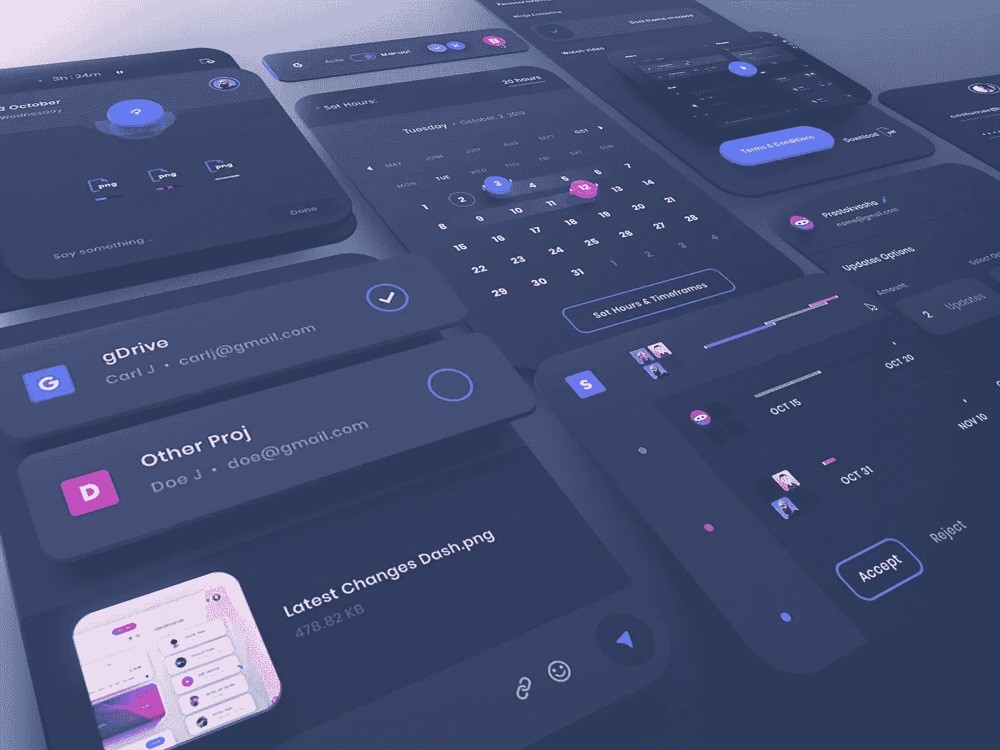
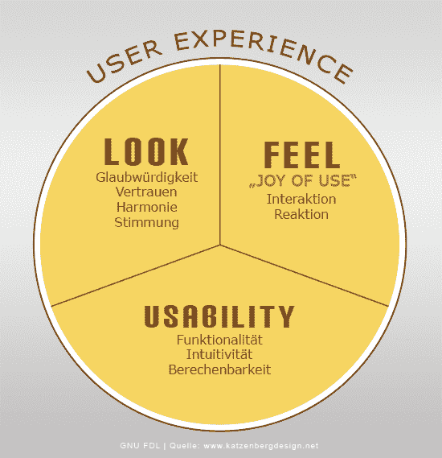
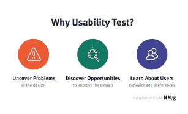

# 用户界面工程中的术语“通用可用性”

> 原文：<https://medium.com/codex/the-buzz-word-universal-usability-in-user-interface-engineering-5ccacdd2aee9?source=collection_archive---------0----------------------->

> 通用可用性就是让用户满意。尽管满足来自不同国家、大陆和文化的人们是一个巨大的任务，但是如果你比较一下 10 年前的设计和今天流畅的交互设计，你会发现 UI 设计已经有了很大的发展。

# **什么是可用性？**

在这个科技时代，从看电影到午夜点餐，一切都可以通过指尖实现。那是相当迷人的，不是吗？随着我们在这个现代世界的进步，每个领域的选择只会越来越多。但是无论做什么，人类总是在寻找安慰。因此，当我们谈论可用性时，我们必须牢记“用户舒适度”这个词。毕竟，可用性就是用户体验(UX)。只有对用户有用，你的产品才能在今天的市场上获得成功。

什么是用户体验

# **什么是通用可用性？**

人机交互(HCI)先驱本·施奈德曼(Ben Shneiderman)将普遍可用性定义为“让 90%以上的家庭每周至少一次成为信息和通信服务的成功用户。”[1]

从这个经典的定义中，我们可以理解通用可用性处理的是大量的用户。“巨大”这个词带来了另一个参数，那就是多样性。简而言之，为了实现通用可用性，设计师必须以这样的方式使用技术，以便不同的用户可以顺利地使用产品。

# **易访问性 Vs 可用性**

人们经常会因为认为可访问性和可用性是相似的而犯错误。虽然他们都处理用户体验(UX)，但他们之间也有关键的区别。可用性更关心的是用户的舒适度，他们是否可以轻松地使用网站或应用程序。更重要的是有效的设计。但是可访问性更多的是关于残疾人是否可以访问应用程序。所以基本上，可访问性处理的是残疾用户的体验。例如，在一个网站中，当设计师上传视频时，他们不仅要为有听力障碍的人上传同步转录，还需要为有视力问题的人播放适当的音频。根据信息技术无障碍法律，有一项规定，即第 508 条，规定所有政府网站对残疾用户都是无障碍的。[2]

我们已经知道，普遍可用性处理的是人类及其文化的多样性。因此，要创建一个 web 或桌面应用程序，我们必须记住一些重要的方面，以实现普遍的可用性。

# **供货情况**

关于这一点最重要的是，作为一个开发者，我们总是要让用户或客户可以使用应用程序。可用性主要取决于托管 web 应用程序的网络或桌面应用程序的硬件支持。另外就是设计上的一致性。如今，人们使用许多智能设备来访问数据。因此，无论使用何种设备，设计都应该始终保持一致。否则，人们有太多的其他选择可以切换。

# **简单**

每个应用程序都应该有一个结构，该结构将指定应用程序的用途。如果在一个网站中，重要的部分没有使用标准结构很好地定义，用户可能会变得沮丧，并会退出网站。让我们想象一个场景，在一个电子商务网站上正在进行销售，但用户或客户无法找到最大折扣的产品。渐渐的，网站会失去潜在客户。所以网站或桌面应用程序应该简单明了。

# **好用**

在全球范围内，设计网站和离线应用程序都有一定的指导原则。在使用之后，人们通常会尝试添加更复杂的东西，使他们的应用程序与众不同。但在当今世界，没有人有时间去理解那些复杂的设计，只是为了访问数据。因此，设计师必须使用简单而独特的设计，易于理解。最主要的是吸引人，用这样的方式做设计，让人们能长久记住。

# **可靠性**

当我们与人类打交道时，可靠性或可信度是关键点。一个用户来到一个网页上，要求提供数据，或者在一个应用程序中，她正在处理一些机密数据。如果该应用程序或网站不是真实的，那么从下一次她将不会使用它，在未来可能该应用程序将被禁止。特别是，当有人通过支付网关进行交易时，系统的完整性是必须的。为了保持可靠性，应用程序的开发者或所有者应该在单独的部分给出他们的详细信息，以便用户可以联系他们进行查询。

可用性测试

如何检查我的系统是否通用？

没有人能一下子实现普遍可用性。在应用程序第一次启动后，应该立即开始用户测试。只有用户能说出他们的需求和应用程序的问题。因此，每个应用程序都应该包含一个单独的反馈部分。用户将通过电子邮件或填写简单的表格给出反馈。之后，开发人员将分析数据，并通过微调来改进应用程序。

# 本·施奈德曼眼中的通用可用性

> 在他 2000 年 5 月的 ACM 通讯文章中，Ben 将障碍从可访问性提升到了“通用可用性”，超越了残疾人的技术可访问性，提升到了每个人都能成功使用计算机。
> 
> 现在，十多年过去了，本很乐观。"我们今天拥有的软件比十年前好得多。"我们有软件和设备的例子，包括移动应用程序、手机和数码相机，其中“大多数人在大多数时候都能成功。”[3]

通用可用性是人机交互研究的一个重要方面，也是用户界面设计的一个重要因素。它基本上是告诉设计师，她必须预测用户的期望。

## **参考文献:**

1.[https://webstyle guide . com/wsg 3/2-universal-usability/4-guidelines . html](https://webstyleguide.com/wsg3/2-universal-usability/4-guidelines.html)

2.[https://www . usability . gov/get-contained/blog/2013/01/accessibility-and-usability . html](https://www.usability.gov/get-involved/blog/2013/01/accessibility-and-usability.html)

3.[https://rosenfeldmedia . com/a-web-for-every one/forward-universal-usability-an-interview-with-Ben-shneiderman/](https://rosenfeldmedia.com/a-web-for-everyone/toward-universal-usability-an-interview-with-ben-shneiderman/)

4.[https://www . interaction-design . org/literature/topics/usability](https://www.interaction-design.org/literature/topics/usability)