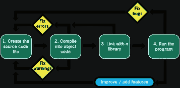

# C 开发周期

> 原文：<https://medium.com/codex/the-c-development-cycle-1ab79b893d01?source=collection_archive---------2----------------------->

## 引用

## *出自* [*微型 C 项目*](https://www.manning.com/books/tiny-c-projects) *出自丹·古金*

*本文讨论了 C 开发周期。*

在[manning.com](https://www.manning.com/books/tiny-c-projects?utm_source=medium&utm_medium=referral&utm_campaign=book_gookin_tiny_9_29_21)结账时，将 **fccgookin** 输入折扣代码框，即可享受 35%的折扣。

根据目前陈列在大英博物馆的古代美索不达米亚石碑，开发一个 C 语言程序需要四个步骤。这些如图 1 所示，你可以清楚地看到用楔形文字写的 C 开发周期。


图一。C 开发周期，由大英博物馆提供。

回顾一下，因为我们都不懂巴比伦语，下面是翻译:

1.  首先创建源代码文件。
2.  将源代码编译成目标代码。
3.  在库中链接以创建程序文件。
4.  最后，运行程序来测试、失望或高兴。

对我来说，步骤 4 是一个相当宽松的翻译。原文是这样写的，“运行程序，通过吃掉一头牛来庆祝。”我也没有提到异教的神。

## **选择提督源代码编辑器**

c 语言源代码是纯文本。使该文件成为 C 源代码文件而不是枯燥的文本文件的是文件扩展名`.c`；所有 C 源代码文件都使用这个文件扩展名。眼球代码使用`.see`扩展。海军代号使用`.sea`。知道区别。

找到一个好的文本编辑器来制作你的源代码是很重要的。事实证明，这一步很重要。程序员们为哪个文本编辑器最好而争论不休，更不用说为缩进代码而进行的制表符和空格之争了。

随着战线的绘制，知道我更喜欢 *vim* 文本编辑器，我使用制表符设置为 4 个空格。如果这个细节足以让你还书，那就这样吧。vim 的*版本，以及令人厌恶的文本编辑器，如 *Emacs* 和 *Nano* ，都可以在命令提示符(文本模式)和窗口 GUI 环境下运行。*

提示一下，`.c`文件名定义了一个 C 语言源代码文件类型。在您的计算机上，使用任何文件魔法将`.c`文件与您的文本编辑器关联起来。这个关联技巧允许你双击一个 C 源代码文件图标，并在文本编辑器中打开它，而不是它可能关联的其他程序。

据我所知，Linux 中的文件关联是粗略的。我试图让它工作，但它不像在 Windows 中那样有效。因此，虽然您可以在 Linux 中使用您最喜欢的编辑器的 GUI 版本，但您不能只是双击一个文件图标，就让它神奇地出现在您最喜欢的编辑器中。

要在 Windows 中关联文件，请按照下列步骤操作:

1.  右击一个 C 语言(`.c`)源代码文件。
2.  选取“打开方式”，然后从子菜单中选取您喜爱的文本编辑器。
3.  嘲笑文件管理器缺乏这种能力的 Linux 用户。

将 C 源代码文件与您喜欢的编辑器相关联后，您可以双击任何 C 源代码文件图标，让编辑器打开它。尤其是在 GUI 环境中，当您在单独的终端窗口中编译和测试时，在一个窗口中打开您的源代码是非常有效的。在 Linux 中也可以这样做，只是没有方便的文件关联。

## **编译、链接和构建的过程**

编写完源代码后，您就可以构建程序了。这个过程结合了只有老程序员家里的少数程序员记得的两个原始步骤:编译和链接。今天大多数代码婴儿只是想到编译，但是链接仍然在某个地方。

长话短说，如今创建程序的过程只需一步，即构建。它结合了编译和成功后的链接。编译生成目标代码。目标代码与一个库链接起来形成一个程序。为了节省时间，并且因为现代编译器自动调用链接器，唯一使用的术语是 *build* 。

当您的源代码通过编译和链接过程后，下一步就是运行程序。当然，这一步并不是最后一步:您要测试程序是否有错误，并可能再次编辑和构建。整个过程，即 C 程序开发周期，如图 2 所示，这比巴比伦人在图 1 中描述的要真实得多:



图二。程序开发周期的真正本质。(图片由加州高速公路安全局提供。)

为了琐事，Unix 中最初的 C 编译器叫做 *cc* 。猜猜它代表什么？

Unix 链接器被命名为 *ld* 。它代表“链接 dis”T2 LD T3 程序仍然存在于今天的 Linux 系统中。它是由编译器在内部调用的——除非代码错误百出，在这种情况下，编译器会调用它的朋友 Betsy 来嘲笑你的 C 代码读起来有多糟糕。

## 在命令提示符下执行此操作

欢迎来到计算机的早期时代。在文本模式下编辑、构建和运行 C 程序有点怀旧，但效果很好，效率也相当高。你必须理解命令行是如何工作的，这是我相信所有 C 程序员天生就应该知道的。的确，很难找到一个不了解 Linux 文本模式编程的 C 程序员。

## **进入终端窗口**

每个 Linux 发行版都有一个终端窗口。Mac OS X 有一个终端程序。即使是 Windows 10 也带有命令 shell，尽管更好的方法是安装 Windows 的 Linux 子系统，并使用 Ubuntu bash shell 来与其他平台保持一致。文本模式编程的时代从来没有这么好过。打开一瓶健怡可乐，脱掉你的凉鞋！

## **安装编译器**

如果您使用的是 Linux、Unix 或 OS/X，那么编译器已经安装好了。肯定是:编译器是操作系统用来自我配置的工具之一。即使是 Windows 10 中的 Ubuntu shell 也采用了传统的 *cc* 编译器，尽管我觉得你最好提供安装 *clang* 。

还有一个版本的 *clang* 也可以在 Windows 10 中原生运行。例如，你可以设置 *clang* 来使用你最喜欢的 Windows IDE。尽管如此，这本书是关于命令行编程的，所以我建议为 Windows 10 的 Ubuntu shell 终端窗口获取 *clang* 。

在许多 Linux 发行版中，您可以通过使用 GUI 软件包管理器来获得命令行软件包。其中包括 *clang* 和其他命令行工具。在 Windows 10 中，与其他 Linux 发行版一样，您可以使用命令行软件包管理器来安装新软件。对于 Windows 10 中的 Ubuntu Linux，包管理器被命名为 *apt* ，高级包工具。

要使用 apt 安装 *clang* 编译器，在 Windows 10 的 Ubuntu shell 中键入以下命令:

```
sudo apt install clang
```

sudo 命令(超级用户 do)提示您输入登录密码。然后程序下载并安装 *clang* 编译器。出现提示时，按下 **Y** 键。

要确认 clang 编译器已安装，请键入以下命令:

```
clang –v
```

输出当前 *clang* 版本和其他东西。您已经准备好开始编码了。

## **探索文本屏幕编辑器**

您可以使用 GUI 编辑器在一个窗口中编写和编辑代码，然后使用终端窗口进行构建和运行。这就是我编码的方式，尽管我手边还有一个文本模式编辑器。有时候我只需要在提示符下运行编辑器，编辑，然后返回命令提示符。

许多有用的编辑器在默认情况下随 Linux 一起安装。没有的可以从你的发行版的软件包管理器中获得。在 Mac 上，你可以使用家酿系统添加苹果认为不配随其操作系统发货的文本模式程序；在 [brew.sh](https://brew.sh/) 了解更多关于家酿啤酒的信息。

我最喜欢的文本模式编辑器是 *VIM* ，我之前提到的经典 *vi* 编辑器的改进版本。它既有以文本模式运行的终端窗口版本，也有完整的 GUI 版本。该程序适用于所有流行的操作系统。

另一个流行的文本模式编辑器是 *Emacs* 。像 *VIM* 一样，它也可以作为文本模式编辑器和 GUI 编辑器使用。我不使用 Emacs，所以我无法雄辩地阐述它的优点。

无论您获得什么样的文本编辑器，都要确保它提供了 C 语言颜色编码以及其他有用的特性，比如匹配对:圆括号、方括号和大括号。使用许多编辑器，可以定制特性，例如编写一个启动脚本，按照您的喜好适当地扭曲编辑器。例如，我更喜欢在代码中使用 4 个空格的制表位，我可以通过配置主目录中的`.vim_rc`文件来设置它。

如果您想要安装一个文本模式编辑器，但是没有可用的，那么使用 Linux 包管理器来安装它。例如，要在 Windows 10 Ubuntu shell 中获取 *vim* ，请使用以下命令:

```
sudo apt install vim
```

或者你可以用你最喜欢的、功能较弱的编辑器来代替 vim。

## **获取库**

当您链接一个库时，您将它的功能添加到您的系统的编程能力中。例如，添加 libcurl 库以在您的程序中执行 curl 命令、访问互联网、使用 FPT、上传和下载等等。库带有函数定义和一个或多个头文件来帮助你。文档是可用的 API 或应用程序编程接口——帮助您了解事情是如何工作的，并使用这个库。

当您确定代码需要哪些库时，下一步就是获取库。这个过程就像在 Linux 命令提示符下安装软件一样:使用发行版的包管理器搜索并获得所需的库。例如，使用以下命令可以获得 libcurl:

```
sudo apt-get libcurl4
```

以超级用户权限运行 *apt-get* 获取并安装 libcurl 库。

一旦你有了这个库，跟随 API 去发现哪个函数做什么，并且学习让这个库做它的事情背后的过程。请务必查看文档中的示例。不要指望文字温暖模糊；这些开发人员是程序员，不是写手。

在构建过程中，链接器需要知道这个库，这样它才能创建程序。它已经知道标准 C 库在哪里，这就是它如何构建常规 C 程序。但是对于另一个库，必须指定库名，如前一节所述。

我的建议是总是先运行一个测试程序，比如输出库的当前版本。成功构建此程序，以确保安装并链接了库。然后，您就可以使用这个库并构建有趣且可能有用的程序了。

本文到此为止。如果你想了解这本书的更多信息，请点击[这里](https://www.manning.com/books/tiny-c-projects?utm_source=medium&utm_medium=referral&utm_campaign=book_gookin_tiny_9_29_21)查看。