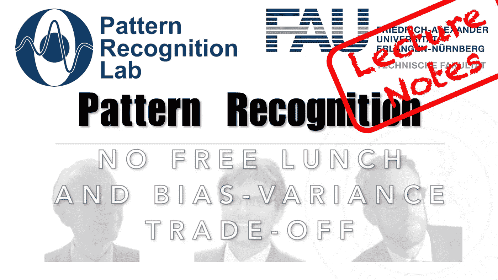

# 蛋糕是个谎言！

> 原文：<https://medium.com/codex/the-cake-is-a-lie-6ba31c1be921?source=collection_archive---------2----------------------->

## 模式识别中的 FAU 讲义

## 没有免费的午餐定理&偏差-方差权衡

来自[模式识别讲座](https://www.youtube.com/playlist?list=PLpOGQvPCDQzsWvT_bqmexrJ359RTQQuMO)的 [CC BY 4.0](https://creativecommons.org/licenses/by/4.0/) 下的图片

**这些是 FAU 的 YouTube 讲座“** [**模式识别**](https://www.youtube.com/playlist?list=PLpOGQvPCDQzsWvT_bqmexrJ359RTQQuMO) **”的讲义。这是讲座视频&** [**配套幻灯片**](https://doi.org/10.5281/zenodo.4429576) **的完整抄本。幻灯片的来源可在** [**此处**](https://github.com/akmaier/pr-slides) **获得。我们希望，你喜欢这个视频一样多。这份抄本是** …