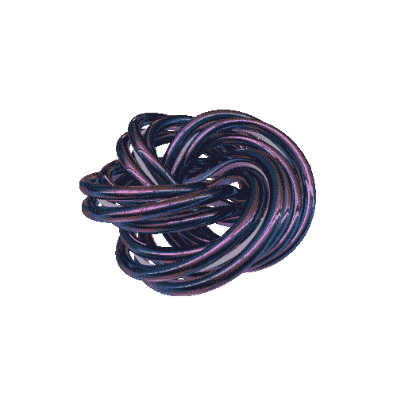

# 在创造性编程中使用面向对象语言的案例

> 原文：<https://medium.com/codex/the-case-for-oop-in-creative-programming-48c3dd3ae231?source=collection_archive---------31----------------------->

编码和框架之间的交汇点通常建立在面向对象语言之上，这种交汇点允许复杂的、模块化的和可关联的接口来创建创造性的部分。这可以在各种不同的媒体和格式中看到，例如使用 Blender 时用 Python 编写[脚本，或者使用 Ruby](https://www.youtube.com/watch?v=cyt0O7saU4Q) 用 Sonic Pi 制作音乐[(在那篇文章的标题中极其自由地使用了“dub techno”)。我想从更多的角度了解为什么会出现这种情况，并综合为什么 OOP 最终成为这些渠道的首选，当然，也想与您分享我的发现！](https://www.youtube.com/watch?v=7ts1q_wUd3Q)

# **传承**

让我们思考一下为什么继承的概念会使开发一个允许用户更有效地发挥创造力的框架变得更加有效。继承本质上意味着一种类型或类的属性能够被传递/传递/继承给其他类型或类，并且共享那些特性，而不必在每个用例中重新定义它们。基因是这个原则的一个更抽象的例子，尽管遗传的证据是最明显的。这对应用程序来说意味着，通过它们的继承类，值和属性将更容易访问，并且在这个过程中肯定有效率的维度，对于用户和机器都是如此。作为一个创作者，让你的画布(可以这么说)以一种不需要一次又一次重新发明轮子(可以这么说)的方式定位，允许更自然的想法流动和更接近拥有和丰富我们生活的艺术冲动的能力，而不必在技术障碍的森林中徘徊或迷失，因此是这些框架中 OOP 的最重要的品质。

# 多态性

回顾一下这个概念，“多态性”是指根据输入情况执行不同的相似代码块。假设您有一个函数，当给定一个数字时，它输出一个字符串(一个相当一维的例子)。所有数字的输出都是恒定的，但假设我们希望不同的数字范围有不同的输出，比如一个生物对温度的反应范围是“凝固在一个超级冰的维度中”到“被几千个太阳的强度所抹杀”。在面向对象程序设计中，这一原则可以通过复制相同的输入/输出方法来应用于不同的输入，以决定输出是什么。想象一下，你正在尝试创建一个像 MS Paint 这样的简单的画图应用程序，并且你正在“工具”部分工作。您可能希望根据光标点击和选择的位置，在画布上产生不同的效果，并且希望将这些属性存储在某个辅助某个函数的地方……这就是多态性的强大之处，同时也消除了编写大量 if/else 语句的倾向。

# 可读性

在我看来，守门对于任何有益于创造美好和对社会有建设性的事物来说都是一种深刻对立的实践。也就是说，没有必要为了扩展 Blender 之类应用程序的功能而要求学习 C 之类的语言，从而掩盖更多基于模块化的插座的潜力。与汇编语言相比，面向对象语言更接近于用英语编写，因此在概念上更容易掌握，在实践中更容易应用，这为更多基于代码的创造性应用程序打下了良好的基础。此外，如果一个人被引擎盖下发生的事情的想法冲昏了头脑，甚至超越了像[纯数据](https://www.youtube.com/watch?v=jADuLtsFqkk)这样的界面，那么用户总是可以越陷越深，直到他们对机器如何工作有了令人难以置信的全面理解，然后通过理解，作为一个个体与机器融为一体，从而消除了所有人的方面，以及产生艺术的欲望(不是每个人的最终目标)。在那种情况下，一个快乐的媒介可能更值得去争取！

归功于 [DarkAngelOne](https://plus.google.com/+DarkAngel0ne/)