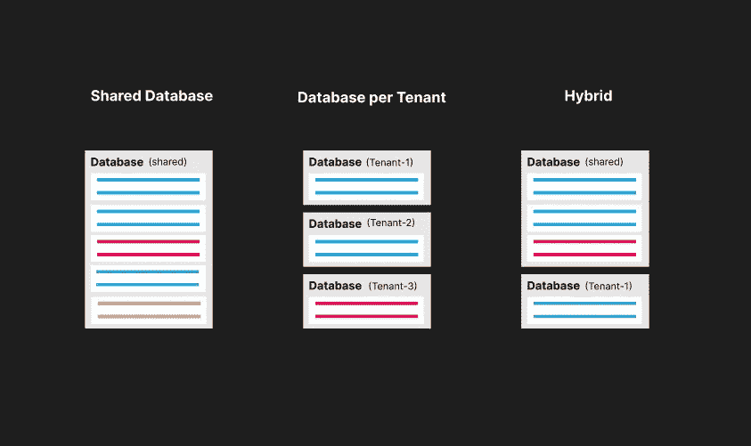
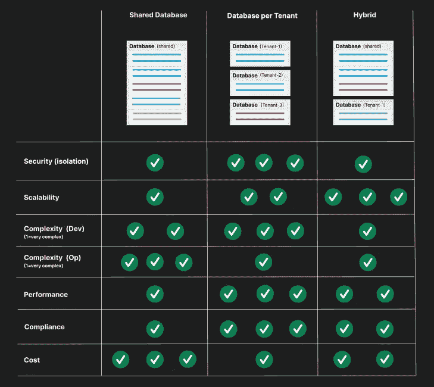

# SaaS 数据库隔离的挑战

> 原文：<https://medium.com/codex/the-challenge-of-saas-database-isolation-c3dbf3f42774?source=collection_archive---------10----------------------->

共享数据库与每个租户的数据库与混合数据库

数据库隔离

软件即服务企业经常面临的一个挑战是如何安全地管理客户的数据并防止数据泄露。

选择正确的数据库租用模型应该非常小心，因为它会影响应用程序的安全性、可伸缩性、复杂性、性能和合规性。稍后，切换到不同的模型通常是困难的，并且需要对您的整个架构进行重大更改。

让我们从解决这个问题的可用选项开始。

## 共享数据库

所有客户都使用一个共享的数据库，生活在彼此之间。数据在应用程序级别被分离，并在查询逻辑中实现。通常，您会向每一行添加某种租户标识符来区分数据。

## 每个租户的数据库

每个客户都有自己专用的数据库，数据是完全隔离的。然后，您将实现一个目录服务，根据传入的请求找出要使用哪个数据库。还可以将某些客户转移到完全专用的数据库实例。

## 混合(两者结合)

上面解释的方法被组合起来，较大的客户有一个单独的数据库，而较小的客户彼此共享数据库。在这种情况下，您必须实现一个目录服务以及一个逻辑来在应用程序级别上分离数据。

还可以使用其他一些模型，比如在同一个数据库中为每个客户部署一个模式。但是我会把重点放在上面提到的经典方法上，而不会过多考虑这个挑战。

# 比较

我将比较下面列出的七个类别中的选项，以便让您了解在选择解决方案之前必须考虑的某些标准。

## 安全性(隔离)

这一点描述了隔离级别和您将分阶段进行并需要防止的潜在安全风险。

## 可量测性

您将对每个解决方案的可伸缩性挑战进行阶段划分，但是它给出了这些挑战将发生在哪个级别的想法。

## 复杂性——发展

实现这种数据库模型所需的工作以及可能出现的潜在挑战。

## 复杂性—操作

类似于开发复杂性、运营期间所需的工作和挑战(管理数据库、推广、备份管理等。).

## 表演

这一点与可伸缩性略有关联，并描述了潜在的性能瓶颈。

## 服从

这一点经常被软件开发者和创始人遗忘。但是无论你的应用有多好多差，这都能决定一个公司买不买你的软件。

根据您的软件的功能和您正在处理的数据类型，您可能需要满足特定的合规性标准。尤其是当您正在处理财务数据或受某些隐私法规约束的数据时。较大的企业通常也有内部法规和标准，您的应用程序必须满足这些法规和标准才能合规。

## 成本(运营)

托管此类模型的成本(计算、存储等成本。)，这不包括开发或运营工作。

数据库隔离比较

**安全性(隔离)——**共享数据库增加了数据暴露给错误租户的风险。这可以通过精确的测试来避免。您还必须同时向所有客户推出变更，并且不能分阶段执行。

**可扩展性** —完整的共享数据库方法可能会更快地导致可扩展性问题，因为整个计算资源是共享的，并且许多数据库(通常是 SQL 数据库)不能非常高效地扩展。

**复杂性(Dev)**—每个租户一个数据库不需要在查询逻辑中进行数据分离，这可能会加快开发速度。

**复杂性(Op)** —一个数据库显然比多个数据库更容易维护，模式更改只需应用于一个数据库。

**性能—** 如果操作正确，所有型号都可以实现出色的性能。在共享数据库中，计算能力是共享的，客户可能会相互干扰。响应性能问题也更加困难，因为无法将客户转移到不同的实例。

**合规性—** 共享数据库在某些情况下可能不合规(通常是财务法规)

**成本—** 更多的数据库通常意味着更强的计算能力，从而导致更高的成本。如果您的客户越来越多，但每个客户的价格却越来越低，那么每个租户一个数据库可能会太贵。

# 结论

这三种模型都是有效的，这在很大程度上取决于您的应用和您所服务的客户类型。如果您确保自己没有受到某些要求特殊数据隔离的法规的约束，那么选择最佳方案基本上取决于您。如果您服务的客户群更多是企业级的，只有较高的门票销售，我建议您选择每租户隔离的数据库。否则，我会使用一种混合方法，在这种方法中，您可以为较小的客户使用共享数据库，同时还可以灵活地为您可能遇到的某些高级客户部署独立的数据库。