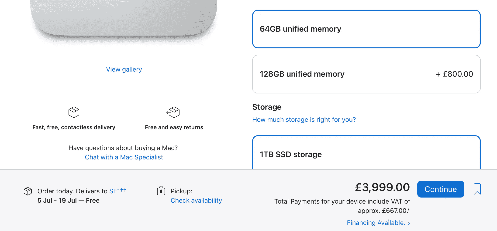

# 闭环系统

> 原文：<https://medium.com/codex/the-closed-loop-system-f1b2ee23a151?source=collection_archive---------12----------------------->

## 以及苹果断裂的供应链

如果你经常阅读我的博客，你就会知道，我最近一直在订购一些新的苹果设备。过去几周，我一直在谈论供应链问题和全球芯片短缺。事实证明，这些不仅仅是纸上的文字，而是实实在在的“东西”，附带着人力成本！

## 真实世界的例子

耐心点…

经过几个月的考虑，今年 3 月，我终于决定拿出我的钱来，订购一台工作室显示器和一台高规格的 16 英寸 MacBook Pro。我是在三月底订购的，在*的那个*点，MacBook 的预定日期是五月初，显示器的预定日期是六月中旬。不完美，但是嘿…没有压力，对吧？订单已下，耐心等待*“已经在路上了”*邮件。嗯，我确实收到了一封电子邮件，在第一个到期日，5 月 4 日。带着期待去看我的收件箱是一个错误！MacBook 的上市日期现在是 7 月！这大约需要 12 周的准备时间(而且只是一个估计)。本次展览的截止日期为 5 月 30 日至 6 月 15 日。如果它也被取消了，我也不会感到惊讶。

## 让我们来看看

…在 Mac 工作室中工作…

看看苹果今天的网站，这里有一些目前预计的最早*交付日期的例子；*

*   10.9 英寸 iPad Air，Wi-Fi，64GB—6 月 14 日
*   M1 Ultra Mac Studio，48 核 GPU 和 64GB 统一内存—7 月 5 日
*   基地 M1 专业版 14 英寸 MacBook Pro—7 月 5 日
*   M1 MacBook Air 基地—6 月 29 日

…你明白我的意思了！我们生活在这样一个时代，我们期望当天送达，或者最坏的情况下，第二天送达，但对于苹果公司，我们要等一个多月才能买到一台基本的 M1 MacBook Air。随着苹果芯片的出现，我们看到了一些他们有史以来最好的产品。对公司来说，这确实是一个平静的时期。当前产品系列的速度、效率和生产力令人惊叹。而且，他们也倾听了。我们现在有大量的端口，MagSafe，HDMI 端口，SD 卡插槽…我们终于拥有了我们所要求的一切，但还有一个关键的小点。*我们其实买不到！我的 MacBook 很幸运，在英国找到了唯一一台，并于上周发货。不过，这种展示并不令人愉快。为此，等待还在继续。*

乔恩普罗瑟本周提出了一个有效的观点，即现在获得产品的唯一途径是等待下一次活动。当他们在舞台上被宣布的时候，点击“立即购买”按钮，或者等待，等待，等待…

负 16 和特拉维斯 MCP

## 人力成本

…在亚马逊上也好不到哪里去

我和其他人一样珍贵，在我安全的小世界里，不断刷新我的订单页面，看着我的产品何时上市。然而，本周网上出现了视频，展示了供应链上可怕的人力成本。我们看到为苹果组装 MacBooks 的中国广达电脑公司的工人几乎暴动，试图摆脱他们的工作限制。为了提高生产率，中国启用了一种叫做“闭环”的系统。由于新冠肺炎在中国仍然是一个真实存在的威胁，他们几乎强迫工人一次呆在生产车间几个月。他们认为不让任何人出去更有效，而不是每天在到达时测试每个人。你能想象那是什么感觉吗？你要去工作——不是去坐牢！这份工作本身，肯定是乏味的，但接下来要锁定…

 [## 我在 M1 麦克领地的第一个 48 小时…

### …从英特尔到苹果芯片的过渡

medium.com](/codex/my-first-48-hours-in-m1-mac-territory-9e88b093a961) 

## 答案？

英国唯一的 16 英寸 MacBook。我很幸运！

坦白说，我不知道。也许苹果应该看看世界各地的其他生产设施。或许，他们犯了把所有鸡蛋都放在中国篮子里的错误。但有一点是肯定的，现在这些视频已经曝光，苹果&蒂姆·库克不能再视而不见了。库克曾经是首席运营官。他的工作是确保产品供应。很有可能，许多合同都有库克的参与。他们有一个强有力的环境和人道主义形象。现在是时候站出来，让人们看到你正在努力停止这些令人发指的工作行为。

## 要耐心

伟大的机器…如果你能得到它们！

因此，当你为 iPad、MacBook 或 Studio 显示器的交付而烦恼时，去看看 Quanta 的视频，看看现实吧。我们很幸运也很荣幸能够购买这些产品。我和其他人一样因为想要我的产品而感到内疚**现在**，但是当你看到人类的代价时，你知道吗，等待似乎并不是一颗难以下咽的苦果。

 [## Apple TV…值得吗？

### 我大胆尝试，以下是我的想法。

medium.com](/codex/apple-tv-is-it-worth-it-1f3c01f142) 

## 在你走之前

## *你订阅《灵媒》了吗？*

我只是高端博客网站 Medium 的众多作者之一。它是如此物有所值，你可以在这里加入[https://medium.com/membership](https://medium.com/membership)

[**加入我的幕后邮件列表**](https://www.talkingtechandaudio.com)

**原载于 2022 年 5 月 11 日 https://www.talkingtechandaudio.com/blog******。****