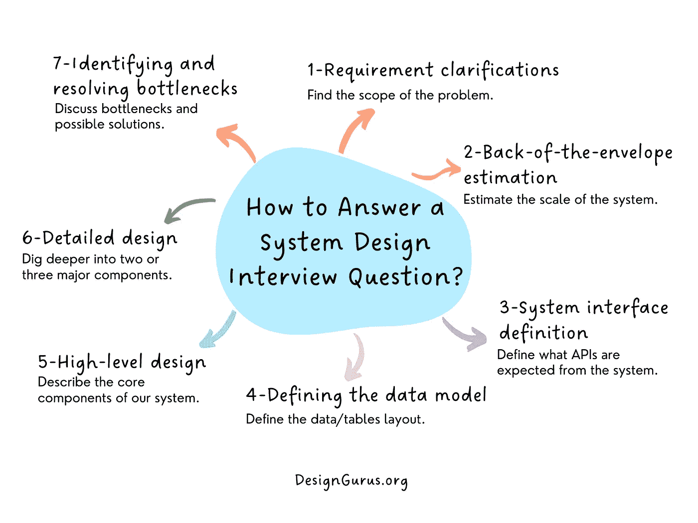

# 2023 年 Ace 系统设计面试完全指南

> 原文：<https://medium.com/codex/the-complete-guide-to-ace-the-system-design-interview-in-2022-2d21c9534905?source=collection_archive---------2----------------------->

回答任何系统设计面试问题的 7 步流程。

回答任何系统设计问题的 7 步流程

# 什么是系统设计面试？

系统设计面试问题旨在了解候选人如何思考复杂的问题，他们如何交流自己的想法，以及如何与他人合作。

系统设计面试中问的问题都是基于大规模真实世界的问题。回答这些问题展示了候选人创造性思维和团队合作的能力。

# 为什么系统设计面试很重要？

系统设计面试的目的是评估你从头到尾设计和实现系统的能力。系统设计面试允许你展示你的知识，你解决问题的技巧，你解决问题并把它分解成小部分的能力，以及你在团队中工作的能力。

# 如何准备系统设计面试？

*   从准备中获得最大收益的最好方法就是练习。
*   看书和网上 [**课程**](https://designgurus.org/course/grokking-the-system-design-interview) 关于系统设计的面试。
*   与朋友和同事一起练习。
*   和导师一起练习；可能是你团队中有经验的开发人员或高级工程师，或者是其他人，他们可以给你反馈，告诉你在模拟面试中做得对或错，并帮助你在下次面试中提高。
*   使用在线资源中的一种来练习模拟面试。
*   为了确保你不会忘记你所学的东西，在笔记本或电子表格中记录每一件事，并定期复习。

# 如何回答一个系统设计问题？

系统设计面试问题侧重于抽象的问题解决，而不是你对编程语言或技术堆栈的具体知识。因此，它们是很好的指标，表明你在没有所有信息的情况下，如何设计和解决大规模问题。

回答系统设计面试问题的关键是理解你的系统是如何工作的。

当你被问到某个特定系统的设计时，花点时间去理解面试官想知道这个系统的什么，以及为什么它对他们很重要。

# 如何开始系统设计面试问题？

这里有一个 [7 步流程](https://designgurus.org/blog/step-by-step-guide)，可以帮助你创建一个系统设计问题的解决方案:

**第一步:需求澄清**

当你被要求为一个问题设计一个系统时，你应该做的第一件事就是理解这个问题。你需要了解你的系统的用户将会做什么，他们试图完成什么，以及你的解决方案如何帮助他们实现他们的目标？

理解系统的所有限制。你需要知道这样的事情，总共有多少用户，他们会同时使用系统，还是他们会单独访问系统？

**第二步:粗略估计**

估计你将要设计的系统的规模总是一个好主意。当您以后关注伸缩、分区、负载平衡和缓存时，这也会有所帮助。

**第三步:系统界面定义**

定义系统需要什么 API。这将建立系统所期望的精确契约，并确保您没有得到任何错误的需求。

**第四步:定义数据模型**

定义数据模型将阐明数据如何在不同的系统组件之间流动。稍后，它将指导数据分区和管理。

**第五步:高层设计**

画一个框图，用 5-6 个方框代表我们系统的核心组件。您应该从头到尾确定解决实际问题所需的足够多的组件。

**第六步:详细设计**

深入挖掘两到三个主要组件；面试官的反馈应该总是引导你系统的哪些部分需要进一步讨论。你应该提出不同的方法，它们的优缺点，并解释为什么你会喜欢一种方法。

**第 7 步:识别和解决瓶颈**

试着讨论尽可能多的瓶颈和缓解它们的不同方法。

# 为系统设计面试准备的主题

在进行系统设计面试之前，您应该熟悉以下一些关键概念:

1.  贮藏
2.  存储
3.  分身术
4.  数据划分技术
5.  负载平衡
6.  可扩展系统的性能测量
7.  API 设计
8.  大型系统的可伸缩性、可用性和可靠性
9.  正向和反向代理。
10.  SQL 与 NoSQL

# 软件开发人员的顶级系统设计面试问题

因为系统设计面试可以涵盖广泛的主题，所以事先研究潜在的问题是很重要的。

以下是系统设计面试中一些最常见的问题:

1.  设计一个像 Dropbox 或 Google Drive 这样的全球文件存储和共享服务。
2.  设计一个像脸书、Instagram 或 Twitter 这样的社交网络。
3.  设计一个像 Facebook Messenger 或 WhatsApp 这样的全球聊天服务。
4.  设计一个像 YouTube 或网飞这样的全球视频流服务。
5.  设计一个像优步或 Lyft 这样的叫车服务。
6.  设计一个网络爬虫。
7.  设计类型先行搜索。
8.  设计票主。
9.  设计一个键值存储。
10.  设计一个 API 速率限制器。
11.  设计 URL 缩短服务。
12.  设计一个分布式消息系统。
13.  设计一个电梯系统。
14.  设计一个停车场系统。
15.  设计一盘棋。
16.  设计一个电影票预订系统。
17.  设计一个图书馆管理系统。
18.  设计一个类似亚马逊的电商商店。

# 系统设计面试中的常见问题

*   不要害怕问问题。重要的是要记住，你应该随时放心地向面试官提问你可能有的任何问题。这是你澄清任何不清楚或令人困惑的事情的机会，也有助于你和面试官之间的交流。
*   **不要被面试官吓倒**。几位面试者对被置于尴尬的境地感到紧张。如果这发生在你身上，记住这是过程的一部分:每个人在面试前都会紧张。回答问题时，不要让紧张妨碍你——相反，要专注于给出好的回答。
*   **如果有些事情不太清楚，不要害怕要求澄清。询问关于需求和约束的问题。像我们需要什么类型的数据这样的问题？我们需要多少数据？这些数据从何而来？我们对用户的行为了解多少(以及我们不知道什么)？**

# 准备好迎接下一次科技面试了吗？

在本文中，我们讨论了软件开发人员的系统设计面试过程。

看看 [**系统设计面试**](https://designgurus.org/course/grokking-the-system-design-interview) 中的系统设计面试问题，如:

1.  设计像 Google Drive 或 Dropbox 这样的文件共享服务。
2.  设计一个像 Facebook Messenger 一样流行的消息服务。
3.  设计流行的社交网站，如 Twitter 或脸书。
4.  设计像 Youtube 这样的全球视频流服务。
5.  设计像优步一样的全球打车服务。

学习软件架构和练习高级系统设计面试问题看一下 [**钻研高级系统设计面试**](https://designgurus.org/course/grokking-the-advanced-system-design-interview) 。

# 感谢阅读

*   👏请为这个故事鼓掌，然后跟我来👉
*   📰查看更多关于[编码和系统设计访谈的内容](https://arslan-ahmad.medium.com/)
*   🔔关注我:[LinkedIn](https://www.linkedin.com/in/arslanahmad/)|[Twitter](https://twitter.com/arslan_ah)|[时事通讯](https://designgurus.org/interview-noodle-page)