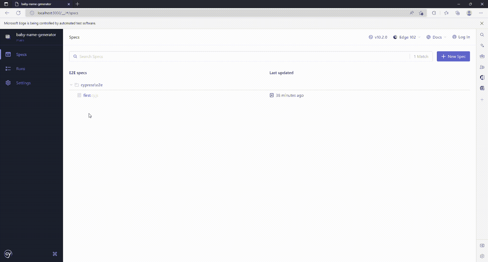

# Cypress 测试完全指南

> 原文：<https://medium.com/codex/the-complete-guide-to-testing-with-cypress-7bbdb2ffa5d7?source=collection_archive---------6----------------------->

## E2E 测试驱动的网站开发


塔尔哈·哈桑在 [Unsplash](https://unsplash.com?utm_source=medium&utm_medium=referral) 上拍摄的照片

大多数进入这个行业的网站开发者并没有像他们应该的那样重视测试。测试应用程序可以自动检查每个组件是否正常工作。测试单个功能很容易；然而，测试一个网站可能是令人生畏的。Cypress 是大多数开发人员用来对网站进行端到端测试的工具。无论你使用 React、Vue、Angular、Svelte 还是任何其他框架，Cypress 都可以帮助你测试你构建的任何网站。

# 装置

安装 Cypress 很简单。在项目根目录下运行命令:

```
npm install -d cypress
```

这将把 Cypress 添加到您的开发者依赖项中。**注意**安装需要一些时间，所以在安装完全完成之前不要中止安装。

# 打开你的柏树窗户

Cypress 安装了必要的组件和窗口来执行测试。运行命令:

```
npx cypress open
```

从柏树之窗开始。你会看到这个窗口


E2E 测试可以继续进行；让我们点击它。由于您的项目中的 Cypress 还没有被配置，他们将为您添加配置文件。


现在，你必须选择一个浏览器来测试你的网站。我个人喜欢微软 Edge，我会继续下去。


您轻松成功地启动了 Cypress。您现在应该能够查看仪表板了。


# Cypress 规范文件

Spec 文件是 Cypress 识别来运行测试的文件。要创建您的第一个测试文件，请选择“创建新的空规范”。所有规格文件必须在`cypress/e2e/`文件夹内。让我们将测试文件命名为`first.cy.js`。按几次 Enter 键后，第一个测试开始加载:


# 创建您的测试

让我们回到我们的代码，你应该会看到`cypress/e2e`文件夹。在这里，您还可以找到带有一些初始代码的`first.cy.js`文件。让我们删除它并添加我们自己的。

1.  `describe`用于记录内部的一组测试。
2.  `it`是您需要编写测试代码的地方。

使用`cy`变量，我们可以打开您想要测试的网站。但是，**请确保您的网站服务器正在运行**。

返回浏览器，运行等级库文件。你应该看到测试通过了！


使用 Nuxt3 的示例网站

# 添加更复杂的测试

> 测试不过是断言需要为真的值

对于 Cypress 来说，每一个命令都是一个断言。访问 URL 本身就是一种断言。

## 断言文本

让我们检查一下标题是否可见。

太好了！我们的两项测试都成功通过。

## 点击项目，并断言类名



测试网站

# 结论

测试是项目开发的重要部分。这些年来，对网站的端到端测试取得了巨大的进步。正如本文所见，测试网站就像写英语一样简单。使用 Cypress 可以发现更多的命令。看自动化网站很有趣，NGL！

我希望你喜欢读我的文章，并学到了一些东西。谢谢大家！✌️

```
**Want to connect?**My [GitHub](https://github.com/cybercoder-naj) Profile
My [Portfolio](https://cybercoder-naj.github.io) Website
```