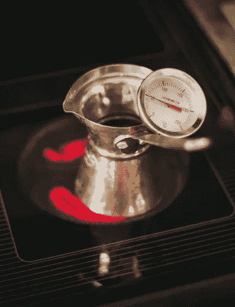

# 炊具是热的，但开发者无论如何都要触摸它

> 原文：<https://medium.com/codex/the-cooker-is-hot-but-developers-have-to-touch-it-anyway-5f7d21a47d82?source=collection_archive---------6----------------------->

## 有些人必须被烫伤才知道炊具是热的

来自 Pexels 的 Ashford Marx】

> 我**听到了，我忘记了。我看到了，我记得**。我知道，我也理解。孔子

所有的开发人员都很聪明，都可以编写代码，但是只有聪明的开发人员才能通过避免…