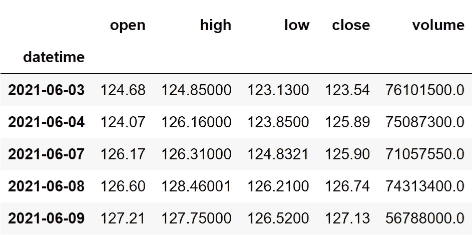

# 科博克曲线——用 Python 对交易策略进行编码和回溯测试

> 原文：<https://medium.com/codex/the-coppock-curve-coding-and-backtesting-a-trading-strategy-in-python-8dac8bbe3c3f?source=collection_archive---------0----------------------->

## 使用科博克曲线指标进行更好的算法交易的完整指南


穆罕默德·拉赫马尼在 [Unsplash](https://unsplash.com?utm_source=medium&utm_medium=referral) 上的照片

在今天的文章中，我们将讨论一个专门用于长期交易目的的特殊指标，即科博克曲线。我们将首先讨论科博克曲线的前提概念。然后，我们将继续探索本文的主要概念，即科博克曲线，以及指标背后的数学原理。之后，我们将进入编码部分，在这里我们将使用 Python 从头构建指标，基于它构建交易策略，对策略进行回溯测试，并将结果与 SPY ETF(一种专门设计用于跟踪标准普尔 500 市场指数运动的 ETF)的结果进行比较。话虽如此，让我们深入到文章中。

在继续之前，如果你想在没有任何代码的情况下回溯测试你的交易策略，有一个解决方案。这是[的后验区](https://www.backtestzone.com/)。这是一个平台，可以免费对不同类型的可交易资产的任意数量的交易策略进行回溯测试，无需编码。点击这里的链接，你可以马上使用这个工具:[https://www.backtestzone.com/](https://www.backtestzone.com/)

# 中华民国和 WMA

正如我之前所说，我们将首先讨论科博克曲线的前提概念，这些概念只不过是变化率(ROC)和加权移动平均线(WMA)。如果没有这些概念的知识，学习科博克曲线是很困难的。

首先是 ROC 指标。变化率指标是一个动量指标，交易者使用它作为一种工具来确定价格相对于当前收盘价和指定时间段之前的价格的百分比变化。与 RSI 和 CCI 等其他动量指标不同，变化率指标是一个无界的振荡器，其值不会在一定的范围内波动。

为了计算 ROC 的读数，我们必须首先确定“n”值，这个值就是当前收盘价与多少个周期之前的值进行比较。“n”的确定因交易者而异，但传统的设置是 9(广泛用于短期交易)。将 9 作为“n”值，ROC 指示器的读数计算如下:

首先，从当前收盘价中减去 9 期前的收盘价。这个差额然后除以 9 期前的收盘价，再乘以 100。该计算可以用数学方法表示如下:

```
**ROC 9** = [ ( **C.CLOSE** - **PREV9.CLOSE** ) / **PREV9.CLOSE** ] * **100**where,
C.CLOSE = Current Closing Price
PREV9.CLOSE = Closing Price of 9 Periods ago
```

接下来是 WMA。在使用简单移动平均线时，困扰交易者的一件事是，该指标对一个系列中的所有数据点赋予相同的权重。这就是加权移动平均线发挥作用的地方。为了解决这个问题，WMA 给最近或最近的数据点分配较大的权重(或较大的重要性),给过去的数据点分配较小的权重。为了确定给定系列的 WMA，将每个值乘以预先确定的某些权重，并将结果相加。

现在，让我们假设一个序列有过去三天的收盘价数据，它们的值分别是 12，13，15。现在，为了计算这三个收盘价的 WMA，我们需要首先确定权重，权重为 1，2，3，权重之和为 6。使用这些预先确定的权重及其总和，WMA 计算如下:

```
[ **( 15 * 3 )** + **( 13 * 2 )** + **( 12 * 1 )** ] / **6** = **21.333333**
```

从上面的计算中，您可以看到我们给最新的数据点(15)分配了较大的权重，给过去的数据点(12)分配了较小的权重。请注意，这是一个关于如何分配权重以计算 WMA 的非常基本的示例，但在现实世界中，情况要复杂得多。有时，权重也可以是十进制数。这就是关于中华民国和 WMA 的一切。现在，让我们深入了解这篇文章的主要概念，即科博克曲线。

# 科博克曲线

由 Edwin Coppock 创立的 Coppock 曲线是一个长期动量指标，交易者或投资者经常使用它来确定市场的上涨趋势和下跌趋势。这一指标主要应用于标准普尔 500 等市场指数，以确定买入和卖出信号，但在本文中，我们将把它应用于股票，这样做也没有限制。此外，该指标的设计方式是按月实施，但今天我们将尝试按日实施。

通过取两个 roc 的 WMA 来计算科博克曲线的读数，一个 roc 的 n 值较小，另一个 roc 的 n 值较大。确定科博克曲线的典型设置是 10 作为 WMA 的回望期，14 和 11 分别作为长和短 ROC 的“n”值。使用典型设置计算 Coppock 曲线的公式可表示如下:

```
**COPPOCK CURVE** = **WMA 10** [ **LONG ROC** + **SHORT ROC** ]where,
WMA 10 = 10-day Weighted Moving Average
LONG ROC = 14-period Rate Of Change
SHORT ROC = 11-period Rate Of Change
```

这就是计算科博克曲线读数的全过程。现在，让我们来分析一个图表，其中苹果的收盘价数据与其科博克曲线一起绘制。


作者图片

上面的图表分为两个面板:上面的面板是苹果的收盘价数据，下面的面板是科博克曲线的读数。从上面的图表中，可以观察到，每当 Coppock 曲线的读数高于零时，直方图以绿色绘制，同样，每当读数低于零或为负时，直方图变为红色。现在，使用直方图，我们可以很容易地发现市场的当前趋势。如果柱状图用绿色绘制，代表市场处于上升趋势，如果柱状图用红色绘制，则观察到市场处于下降趋势。科博克曲线也可以用来检测市场的波动和趋势，但这不是它的主要优势。

现在让我们来讨论一下利用科博克曲线可以建立的交易策略。根据这个指标实施的最重要的策略是零线交叉，当科博克曲线从零线以下上升到零线以上时，它显示买入信号，同样，当科博克曲线从零线以上下降到零线以下时，它显示卖出信号。如果零线听起来像一个流行语，它只不过是零(0)。该策略可以表示如下:

```
IF **P.COPPC** < **ZERO-LINE** AND **C.COPPC** > **ZERO-LINE** ==> **BUY SIGNAL**
IF **P.COPPC** > **ZERO-LINE** AND **C.COPPC** < **ZERO-LINE** ==> **SELL SIGNAL**
```

直接应用这种策略可能会导致灾难性的结果，因为科博克曲线有两个缺点。科博克曲线的第一个缺点是它在本质上非常滞后。因此，人们在使用该指标进行交易时，必须比以往任何时候都更加谨慎。另一个缺点是，科博克曲线容易暴露很多错误信号，导致我们做不好的交易。为了取得好的效果，需要对典型的零线交叉策略进行调优。只有当过去四个读数低于零线，当前读数高于零线时，我们调整的策略才会显示买入信号。同样，只有在过去四个读数高于零线，当前读数低于零线时，才会产生卖出。调整后的策略可以表示如下:

```
IF **P.4 COPPCs** < **ZERO-LINE** AND **C.COPPC** > **ZERO-LINE** ==> **BUY SIGNAL**
IF **P.4 COPPCs** > **ZERO-LINE** AND **C.COPPC** < **ZERO-LINE** ==> **SELL SIGNAL**
```

这就结束了我们关于科博克曲线的理论部分。现在，让我们转到编程部分，首先从头开始构建指标，构建我们刚刚讨论过的调整过的零线交叉策略，然后将我们的策略与 Python 中 SPY ETF 的性能进行比较。来做点编码吧！在继续之前，关于免责声明的一个注意事项:本文的唯一目的是教育人们，必须被视为一个信息，而不是投资建议等。

# 用 Python 实现

编码部分分为以下几个步骤:

```
**1\. Importing Packages
2\. Extracting Stock Data from Twelve Data
3\. Coppock Curve Calculation
4\. Creating the Tuned Zero-line Crossover Trading Strategy
5\. Plotting the Trading Lists
6\. Creating our Position
7\. Backtesting
8\. SPY ETF Comparison**
```

我们将按照上面列表中提到的顺序，系好安全带，跟随每一个即将到来的编码部分。

## 步骤 1:导入包

将所需的包导入 python 环境是一个不可跳过的步骤。主要的包是处理数据的 Pandas，处理数组和复杂函数的 NumPy，用于绘图的 Matplotlib，以及进行 API 调用的请求。二级包是数学函数的 Math 和字体定制的 Termcolor(可选)。

**Python 实现:**

```
**# IMPORTING PACKAGES** 
import requests
import numpy as np
import pandas as pd
import matplotlib.pyplot as plt
from math import floor
from termcolor import colored as cl

plt.style.use('fivethirtyeight')
plt.rcParams['figure.figsize'] = (20,10)
```

现在我们已经将所有需要的包导入到 python 中。我们用十二数据的 API 端点来拉一下苹果的历史数据。

## 步骤 2:从 12 个数据中提取数据

在这一步中，我们将使用 twelvedata.com[提供的 API 端点提取苹果的历史股票数据。在此之前，请注意 twelvedata.com](https://twelvedata.com/):十二数据公司是领先的市场数据提供商之一，拥有大量适用于所有类型市场数据的 API 端点。它非常容易与十二数据提供的 API 进行交互，并且拥有有史以来最好的文档。此外，确保您在[twelvedata.com](https://twelvedata.com/)上有一个帐户，只有这样，您才能访问您的 API 密钥(使用 API 提取数据的重要元素)。

**Python 实现:**

```
**# EXTRACTING STOCK DATA** 
def get_historical_data(symbol, start_date):
    api_key = 'YOUR API KEY'
    api_url = f'https://api.twelvedata.com/time_series?symbol={symbol}&interval=1day&outputsize=5000&apikey={api_key}'
    raw_df = requests.get(api_url).json()
    df = pd.DataFrame(raw_df['values']).iloc[::-1].set_index('datetime').astype(float)
    df = df[df.index >= start_date]
    df.index = pd.to_datetime(df.index)
    return df

aapl = get_historical_data('AAPL', '2020-01-01')
aapl.tail()
```

**输出:**



作者图片

**代码解释:**我们做的第一件事是定义一个名为‘get _ historical _ data’的函数，该函数将股票的符号(‘symbol’)和历史数据的起始日期(‘start _ date’)作为参数。在函数内部，我们定义了 API 键和 URL，并将它们存储到各自的变量中。接下来，我们使用“get”函数提取 JSON 格式的历史数据，并将其存储到“raw_df”变量中。在对原始 JSON 数据进行清理和格式化之后，我们将以干净的 Pandas 数据帧的形式返回它。最后，我们调用创建的函数来提取苹果公司从 2020 年开始的历史数据，并将其存储到‘AAPL’变量中。

## 第三步:科博克曲线计算

在这一步中，我们将按照之前讨论的公式来计算 Coppock 曲线的读数。

**Python 实现:**

```
**# COPPOCK CURVE CALCULATION** 
def wma(data, lookback):
    weights = np.arange(1, lookback + 1)
    val = data.rolling(lookback)
    wma = val.apply(lambda prices: np.dot(prices, weights) / weights.sum(), raw = True)
    return wma

def get_roc(close, n):
    difference = close.diff(n)
    nprev_values = close.shift(n)
    roc = (difference / nprev_values) * 100
    return roc

def get_cc(data, roc1_n, roc2_n, wma_lookback):
    longROC = get_roc(data, roc1_n)
    shortROC = get_roc(data, roc2_n)
    ROC = longROC + shortROC
    cc = wma(ROC, wma_lookback)
    return cc

aapl['cc'] = get_cc(aapl['close'], 14, 11, 10)
aapl = aapl.dropna()
aapl.tail()
```

**输出:**


作者图片

**代码解释:**以上代码可分为三类:加权移动平均计算、变化率计算、科博克曲线计算。

wma 计算:在这一部分中，我们首先定义一个名为“WMA”的函数，它将收盘价(“数据”)和回望期(“回望”)作为参数。在函数内部，我们首先确定分配给每个数据点的权重，并将它们存储到“weights”变量中。接下来，我们将创建一个名为‘val’的变量，在 Pandas 包提供的‘rolling’函数的帮助下，存储指定周期数的滚动数据系列。现在，使用预先确定的权重和滚动值，我们正在计算 wma 值并将其存储到“WMA”变量中。

ROC 计算:首先，我们定义一个名为“get_roc”的函数，它将股票的收盘价(“close”)和“n”值(“n”)作为参数。在该函数中，我们首先使用 Pandas 包提供的“diff”函数来获取当前收盘价和指定时间段之前的收盘价之间的差值。在“shift”函数的帮助下，我们考虑了指定时间段之前的收盘价，并将其存储到“nprev_values”变量中。然后，我们将确定的值代入我们之前讨论的 ROC 指标公式，以计算值并最终返回数据。

Coppock 曲线计算:与我们在其他两个函数中所做的一样，这里我们也首先定义一个名为“get_cc”的函数，它将股票的收盘价数据(“data”)、较长 ROC(“ROC _ 1”)和较短 ROC(“ROC _ 2”)的“n”值以及加权移动平均回看周期(“wma_lookback”)作为参数。在函数内部，我们首先使用前面创建的“get_roc”函数确定两个 roc，一个具有较大的“n”值，另一个具有较短的“n”值。然后我们将两个 ROC 相加，并将结果存储到“ROC”变量中。在我们之前创建的“wma”函数的帮助下，我们对两个 roc 之和进行加权移动平均，以获得 Coppock 曲线的读数。

最后，我们调用创建的“get_cc”函数来存储苹果公司的 Coppock 曲线的读数。现在，让我们开始创建讨论过的调整零线交叉交易策略。

## 步骤 4:创建交易策略

在这一步，我们将在 python 中实现讨论过的 Coppock 曲线调整的零线交叉交易策略。

**Python 实现:**

```
**# COPPOCK CURVE STRATEGY** 
def implement_cc_strategy(prices, cc):
    buy_price = []
    sell_price = []
    cc_signal = []
    signal = 0

    for i in range(len(prices)):
        if cc[i-4] < 0 and cc[i-3] < 0 and cc[i-2] < 0 and cc[i-1] < 0 and cc[i] > 0:
            if signal != 1:
                buy_price.append(prices[i])
                sell_price.append(np.nan)
                signal = 1
                cc_signal.append(signal)
            else:
                buy_price.append(np.nan)
                sell_price.append(np.nan)
                cc_signal.append(0)
        elif cc[i-4] > 0 and cc[i-3] > 0 and cc[i-2] > 0 and cc[i-1] > 0 and cc[i] < 0:
            if signal != -1:
                buy_price.append(np.nan)
                sell_price.append(prices[i])
                signal = -1
                cc_signal.append(signal)
            else:
                buy_price.append(np.nan)
                sell_price.append(np.nan)
                cc_signal.append(0)
        else:
            buy_price.append(np.nan)
            sell_price.append(np.nan)
            cc_signal.append(0)

    return buy_price, sell_price, cc_signal

buy_price, sell_price, cc_signal = implement_cc_strategy(aapl['close'], aapl['cc'])
```

**代码解释:**首先，我们定义一个名为‘implement _ cc _ strategy’的函数，它将股票价格(‘prices’)和科博克曲线的读数(‘cc’)作为参数。

在该函数中，我们创建了三个空列表(buy_price、sell_price 和 cc_signal ),在创建交易策略时，将在这些列表中追加值。

之后，我们通过 for 循环实施交易策略。在 for 循环内部，我们传递某些条件，如果条件得到满足，相应的值将被追加到空列表中。如果购买股票的条件得到满足，买入价将被追加到“buy_price”列表中，信号值将被追加为 1，表示购买股票。类似地，如果卖出股票的条件得到满足，卖价将被追加到“sell_price”列表中，信号值将被追加为-1，表示卖出股票。

最后，我们返回附加了值的列表。然后，我们调用创建的函数并将值存储到各自的变量中。除非我们画出这些值，否则这个列表没有任何意义。所以，让我们画出创建的交易列表的值。

## 第五步:绘制交易信号

在这一步，我们将绘制已创建的交易列表，以使它们有意义。

**Python 实现:**

```
**# COPPOCK CURVE TRADING SIGNAL PLOT** 
ax1 = plt.subplot2grid((11,1), (0,0), rowspan = 5, colspan = 1)
ax2 = plt.subplot2grid((11,1), (6,0), rowspan = 6, colspan = 1)
ax1.plot(aapl['close'], linewidth = 2, label = 'aapl')
ax1.plot(aapl.index, buy_price, marker = '^', color = 'green', markersize = 12, linewidth = 0, label = 'BUY SIGNAL')
ax1.plot(aapl.index, sell_price, marker = 'v', color = 'r', markersize = 12, linewidth = 0, label = 'SELL SIGNAL')
ax1.legend()
ax1.set_title('AAPL CC TRADING SIGNALS')
for i in range(len(aapl)):
    if aapl.iloc[i, 5] >= 0:
        ax2.bar(aapl.iloc[i].name, aapl.iloc[i, 5], color = '#009688')
    else:    
        ax2.bar(aapl.iloc[i].name, aapl.iloc[i, 5], color = '#f44336')
ax2.set_title('AAPL COPPOCK CURVE')
plt.show()
```

**输出:**


作者图片

**代码解释:**我们正在绘制科博克曲线的读数，以及由调整后的零线交叉交易策略产生的买入和卖出信号。我们可以观察到，每当 Coppock 曲线的前四个读数低于零线，当前读数高于零线时，图表中就会绘制绿色的买入信号。类似地，每当 Coppock 曲线的前四个读数在零线以上，当前读数在零线以下时，图表中就会显示红色的卖出信号。

## 步骤 6:创建我们的职位

在这一步中，我们将创建一个列表，如果我们持有股票，该列表将指示 1；如果我们不拥有或持有股票，该列表将指示 0。

**Python 实现:**

```
**# STOCK POSITION** 
position = []
for i in range(len(cc_signal)):
    if cc_signal[i] > 1:
        position.append(0)
    else:
        position.append(1)

for i in range(len(aapl['close'])):
    if cc_signal[i] == 1:
        position[i] = 1
    elif cc_signal[i] == -1:
        position[i] = 0
    else:
        position[i] = position[i-1]

close_price = aapl['close']
cc = aapl['cc']
cc_signal = pd.DataFrame(cc_signal).rename(columns = {0:'cc_signal'}).set_index(aapl.index)
position = pd.DataFrame(position).rename(columns = {0:'cc_position'}).set_index(aapl.index)

frames = [close_price, cc, cc_signal, position]
strategy = pd.concat(frames, join = 'inner', axis = 1)

strategy
```

**输出:**


作者图片

**代码解释:**首先，我们创建一个名为‘position’的空列表。我们传递两个 for 循环，一个是为“位置”列表生成值，以匹配“信号”列表的长度。另一个 for 循环是我们用来生成实际位置值的循环。在第二个 for 循环中，我们对“signal”列表的值进行迭代，而“position”列表的值被附加到满足哪个条件上。如果我们持有股票，头寸的价值仍为 1；如果我们卖出或不持有股票，头寸的价值仍为 0。最后，我们正在进行一些数据操作，将所有创建的列表合并到一个数据帧中。

从显示的输出中，我们可以看到，在前两行中，我们在股票中的位置保持为 1(因为在 Coppock 曲线信号中没有任何变化)，但是当 Coppock 曲线交易信号代表卖出信号(-1)时，当我们卖出股票时，我们的位置突然变成-1。我们的头寸将保持为 0，直到交易信号发生一些变化。现在是时候实现一些回溯测试过程了！

## 步骤 7:回溯测试

在继续之前，有必要知道什么是回溯测试。回溯测试是查看我们的交易策略在给定股票数据上表现如何的过程。在我们的例子中，我们将对苹果股票数据的 Coppock 曲线交易策略实施回溯测试过程。

**Python 实现:**

```
**# BACKTESTING** 
aapl_ret = pd.DataFrame(np.diff(aapl['close'])).rename(columns = {0:'returns'})
cc_strategy_ret = []

for i in range(len(aapl_ret)):
    returns = aapl_ret['returns'][i]*strategy['cc_position'][i]
    cc_strategy_ret.append(returns)

cc_strategy_ret_df = pd.DataFrame(cc_strategy_ret).rename(columns = {0:'cc_returns'})
investment_value = 100000
number_of_stocks = floor(investment_value/aapl['close'][0])
cc_investment_ret = []

for i in range(len(cc_strategy_ret_df['cc_returns'])):
    returns = number_of_stocks*cc_strategy_ret_df['cc_returns'][i]
    cc_investment_ret.append(returns)

cc_investment_ret_df = pd.DataFrame(cc_investment_ret).rename(columns = {0:'investment_returns'})
total_investment_ret = round(sum(cc_investment_ret_df['investment_returns']), 2)
profit_percentage = floor((total_investment_ret/investment_value)*100)
print(cl('Profit gained from the CC strategy by investing $100k in AAPL : {}'.format(total_investment_ret), attrs = ['bold']))
print(cl('Profit percentage of the CC strategy : {}%'.format(profit_percentage), attrs = ['bold']))
```

**输出:**

```
**Profit gained from the CC strategy by investing $100k in AAPL : 60850.26**
**Profit percentage of the CC strategy : 60%**
```

**代码解释:**首先，我们使用 NumPy 包提供的‘diff’函数计算苹果股票的回报，并将其作为数据帧存储到‘AAPL _ ret’变量中。接下来，我们将传递一个 for 循环来迭代' aapl_ret '变量的值，以计算我们从 Coppock 曲线交易策略中获得的回报，这些回报值将被追加到' cc_strategy_ret '列表中。接下来，我们将“cc_strategy_ret”列表转换为数据帧，并将其存储到“cc_strategy_ret_df”变量中。

接下来是回溯测试过程。我们将通过投资 10 万美元到我们的交易策略中来回测我们的策略。首先，我们将投资金额存储到“投资值”变量中。之后，我们正在计算使用投资金额可以购买的苹果股票数量。你可以注意到，我使用了 Math 软件包提供的“floor”函数，因为当投资金额除以苹果股票的收盘价时，它会输出一个十进制数。股票数量应该是整数，而不是小数。使用“底数”函数，我们可以去掉小数。请记住,“floor”函数比“round”函数要复杂得多。然后，我们传递一个 for 循环来查找投资回报，后面是一些数据操作任务。

最后，我们打印了我们通过投资 10 万美元到我们的交易策略中得到的总回报，并且显示我们在一年中获得了大约 6 万美元的利润。那还不错！现在，让我们将我们的回报与 SPY ETF(一种旨在跟踪标准普尔 500 股票市场指数的 ETF)的回报进行比较。

## 第八步:间谍 ETF 对比

这一步是可选的，但强烈推荐，因为我们可以了解我们的交易策略相对于基准(间谍 ETF)的表现如何。在这一步中，我们将使用我们创建的“get_historical_data”函数提取 SPY ETF 数据，并将我们从 SPY ETF 获得的回报与我们在 Apple 上的 Coppock 曲线调整的零线交叉交易策略回报进行比较。

你可能已经注意到，在我所有的算法交易文章中，我没有将策略结果与标准普尔 500 市场指数本身进行比较，而是与 SPY ETF 进行比较，这是因为大多数股票数据提供商(如 12 Data)不提供标准普尔 500 指数数据。所以，我别无选择，只能选择间谍 ETF。如果你有幸得到标准普尔 500 市场指数数据，建议用它来做比较，而不是任何 ETF。

**Python 实现:**

```
**# SPY ETF COMPARISON** 
def get_benchmark(start_date, investment_value):
    spy = get_historical_data('SPY', start_date)['close']
    benchmark = pd.DataFrame(np.diff(spy)).rename(columns = {0:'benchmark_returns'})

    investment_value = investment_value
    number_of_stocks = floor(investment_value/spy[-1])
    benchmark_investment_ret = []

    for i in range(len(benchmark['benchmark_returns'])):
        returns = number_of_stocks*benchmark['benchmark_returns'][i]
        benchmark_investment_ret.append(returns)

    benchmark_investment_ret_df = pd.DataFrame(benchmark_investment_ret).rename(columns = {0:'investment_returns'})
    return benchmark_investment_ret_df

benchmark = get_benchmark('2020-01-01', 100000)
investment_value = 100000
total_benchmark_investment_ret = round(sum(benchmark['investment_returns']), 2)
benchmark_profit_percentage = floor((total_benchmark_investment_ret/investment_value)*100)
print(cl('Benchmark profit by investing $100k : {}'.format(total_benchmark_investment_ret), attrs = ['bold']))
print(cl('Benchmark Profit percentage : {}%'.format(benchmark_profit_percentage), attrs = ['bold']))
print(cl('CC Strategy profit is {}% higher than the Benchmark Profit'.format(profit_percentage - benchmark_profit_percentage), attrs = ['bold']))
```

**输出:**

```
**Benchmark profit by investing $100k : 22929.75**
**Benchmark Profit percentage : 22%**
**CC Strategy profit is 38% higher than the Benchmark Profit**
```

**代码解释:**这一步中使用的代码几乎与前一个回溯测试步骤中使用的代码相似，但我们不是投资苹果，而是通过不实施任何交易策略来投资 SPY ETF。从输出中，我们可以看到我们的 Coppock 曲线调整的零线交叉交易策略已经跑赢 SPY ETF 22%。太好了！

# 最后的想法！

在粉碎理论和编码部分的巨大过程后，我们成功地了解了科博克曲线是什么，以及如何在 Python 的帮助下实现基于它的交易策略。

现在，谈到我在所有文章中经常提到的即兴创作，可以改进的一个重要方面是选择最佳股票的方法。在本文中，我们随机选择了苹果股票来实施该指标，但在现实市场中应用时，它可能会导致糟糕的交易。因此，选择正确的股票至关重要，但如何选择呢？用定量策略处理这种情况会更好，如果这听起来太专业，请在这里阅读我的文章。

就是这样！如果您忘记了遵循任何编码部分，不要担心。我在文章末尾提供了完整的源代码。希望你能从这篇文章中学到一些新的有用的东西。

## 完整代码:

```
**# IMPORTING PACKAGES** 
import requests
import numpy as np
import pandas as pd
import matplotlib.pyplot as plt
from math import floor
from termcolor import colored as cl

plt.style.use('fivethirtyeight')
plt.rcParams['figure.figsize'] = (20,10)

**# EXTRACTING STOCK DATA** 
def get_historical_data(symbol, start_date):
    api_key = 'YOUR API KEY'
    api_url = f'https://api.twelvedata.com/time_series?symbol={symbol}&interval=1day&outputsize=5000&apikey={api_key}'
    raw_df = requests.get(api_url).json()
    df = pd.DataFrame(raw_df['values']).iloc[::-1].set_index('datetime').astype(float)
    df = df[df.index >= start_date]
    df.index = pd.to_datetime(df.index)
    return df

aapl = get_historical_data('AAPL', '2020-01-01')
aapl.tail()

**# COPPOCK CURVE CALCULATION** 
def wma(data, lookback):
    weights = np.arange(1, lookback + 1)
    val = data.rolling(lookback)
    wma = val.apply(lambda prices: np.dot(prices, weights) / weights.sum(), raw = True)
    return wma

def get_roc(close, n):
    difference = close.diff(n)
    nprev_values = close.shift(n)
    roc = (difference / nprev_values) * 100
    return roc

def get_cc(data, roc1_n, roc2_n, wma_lookback):
    longROC = get_roc(data, roc1_n)
    shortROC = get_roc(data, roc2_n)
    ROC = longROC + shortROC
    cc = wma(ROC, wma_lookback)
    return cc

aapl['cc'] = get_cc(aapl['close'], 14, 11, 10)
aapl = aapl.dropna()
aapl.tail()

**# COPPOCK CURVE PLOT** 
ax1 = plt.subplot2grid((11,1), (0,0), rowspan = 5, colspan = 1)
ax2 = plt.subplot2grid((11,1), (6,0), rowspan = 6, colspan = 1)
ax1.plot(aapl['close'], linewidth = 2.5)
ax1.set_title('AAPL CLOSING PRICES')
for i in range(len(aapl)):
    if aapl.iloc[i, 5] >= 0:
        ax2.bar(aapl.iloc[i].name, aapl.iloc[i, 5], color = '#009688')
    else:    
        ax2.bar(aapl.iloc[i].name, aapl.iloc[i, 5], color = '#f44336')
ax2.set_title('AAPL COPPOCK CURVE')
plt.show()

**# COPPOCK CURVE STRATEGY** 
def implement_cc_strategy(prices, cc):
    buy_price = []
    sell_price = []
    cc_signal = []
    signal = 0

    for i in range(len(prices)):
        if cc[i-4] < 0 and cc[i-3] < 0 and cc[i-2] < 0 and cc[i-1] < 0 and cc[i] > 0:
            if signal != 1:
                buy_price.append(prices[i])
                sell_price.append(np.nan)
                signal = 1
                cc_signal.append(signal)
            else:
                buy_price.append(np.nan)
                sell_price.append(np.nan)
                cc_signal.append(0)
        elif cc[i-4] > 0 and cc[i-3] > 0 and cc[i-2] > 0 and cc[i-1] > 0 and cc[i] < 0:
            if signal != -1:
                buy_price.append(np.nan)
                sell_price.append(prices[i])
                signal = -1
                cc_signal.append(signal)
            else:
                buy_price.append(np.nan)
                sell_price.append(np.nan)
                cc_signal.append(0)
        else:
            buy_price.append(np.nan)
            sell_price.append(np.nan)
            cc_signal.append(0)

    return buy_price, sell_price, cc_signal

buy_price, sell_price, cc_signal = implement_cc_strategy(aapl['close'], aapl['cc'])

**# COPPOCK CURVE TRADING SIGNAL PLOT** 
ax1 = plt.subplot2grid((11,1), (0,0), rowspan = 5, colspan = 1)
ax2 = plt.subplot2grid((11,1), (6,0), rowspan = 6, colspan = 1)
ax1.plot(aapl['close'], linewidth = 2, label = 'AAPL')
ax1.plot(aapl.index, buy_price, marker = '^', color = 'green', markersize = 12, linewidth = 0, label = 'BUY SIGNAL')
ax1.plot(aapl.index, sell_price, marker = 'v', color = 'r', markersize = 12, linewidth = 0, label = 'SELL SIGNAL')
ax1.legend()
ax1.set_title('AAPL CC TRADING SIGNALS')
for i in range(len(aapl)):
    if aapl.iloc[i, 5] >= 0:
        ax2.bar(aapl.iloc[i].name, aapl.iloc[i, 5], color = '#009688')
    else:    
        ax2.bar(aapl.iloc[i].name, aapl.iloc[i, 5], color = '#f44336')
ax2.set_title('AAPL COPPOCK CURVE')
plt.show()

**# STOCK POSITION** 
position = []
for i in range(len(cc_signal)):
    if cc_signal[i] > 1:
        position.append(0)
    else:
        position.append(1)

for i in range(len(aapl['close'])):
    if cc_signal[i] == 1:
        position[i] = 1
    elif cc_signal[i] == -1:
        position[i] = 0
    else:
        position[i] = position[i-1]

close_price = aapl['close']
cc = aapl['cc']
cc_signal = pd.DataFrame(cc_signal).rename(columns = {0:'cc_signal'}).set_index(aapl.index)
position = pd.DataFrame(position).rename(columns = {0:'cc_position'}).set_index(aapl.index)

frames = [close_price, cc, cc_signal, position]
strategy = pd.concat(frames, join = 'inner', axis = 1)

strategy
strategy[10:15]

**# BACKTESTING** 
aapl_ret = pd.DataFrame(np.diff(aapl['close'])).rename(columns = {0:'returns'})
cc_strategy_ret = []

for i in range(len(aapl_ret)):
    returns = aapl_ret['returns'][i]*strategy['cc_position'][i]
    cc_strategy_ret.append(returns)

cc_strategy_ret_df = pd.DataFrame(cc_strategy_ret).rename(columns = {0:'cc_returns'})
investment_value = 100000
number_of_stocks = floor(investment_value/aapl['close'][0])
cc_investment_ret = []

for i in range(len(cc_strategy_ret_df['cc_returns'])):
    returns = number_of_stocks*cc_strategy_ret_df['cc_returns'][i]
    cc_investment_ret.append(returns)

cc_investment_ret_df = pd.DataFrame(cc_investment_ret).rename(columns = {0:'investment_returns'})
total_investment_ret = round(sum(cc_investment_ret_df['investment_returns']), 2)
profit_percentage = floor((total_investment_ret/investment_value)*100)
print(cl('Profit gained from the CC strategy by investing $100k in AAPL : {}'.format(total_investment_ret), attrs = ['bold']))
print(cl('Profit percentage of the CC strategy : {}%'.format(profit_percentage), attrs = ['bold']))

**# SPY ETF COMPARISON** 
def get_benchmark(start_date, investment_value):
    spy = get_historical_data('SPY', start_date)['close']
    benchmark = pd.DataFrame(np.diff(spy)).rename(columns = {0:'benchmark_returns'})

    investment_value = investment_value
    number_of_stocks = floor(investment_value/spy[-1])
    benchmark_investment_ret = []

    for i in range(len(benchmark['benchmark_returns'])):
        returns = number_of_stocks*benchmark['benchmark_returns'][i]
        benchmark_investment_ret.append(returns)

    benchmark_investment_ret_df = pd.DataFrame(benchmark_investment_ret).rename(columns = {0:'investment_returns'})
    return benchmark_investment_ret_df

benchmark = get_benchmark('2020-01-01', 100000)
investment_value = 100000
total_benchmark_investment_ret = round(sum(benchmark['investment_returns']), 2)
benchmark_profit_percentage = floor((total_benchmark_investment_ret/investment_value)*100)
print(cl('Benchmark profit by investing $100k : {}'.format(total_benchmark_investment_ret), attrs = ['bold']))
print(cl('Benchmark Profit percentage : {}%'.format(benchmark_profit_percentage), attrs = ['bold']))
print(cl('CC Strategy profit is {}% higher than the Benchmark Profit'.format(profit_percentage - benchmark_profit_percentage), attrs = ['bold']))
```