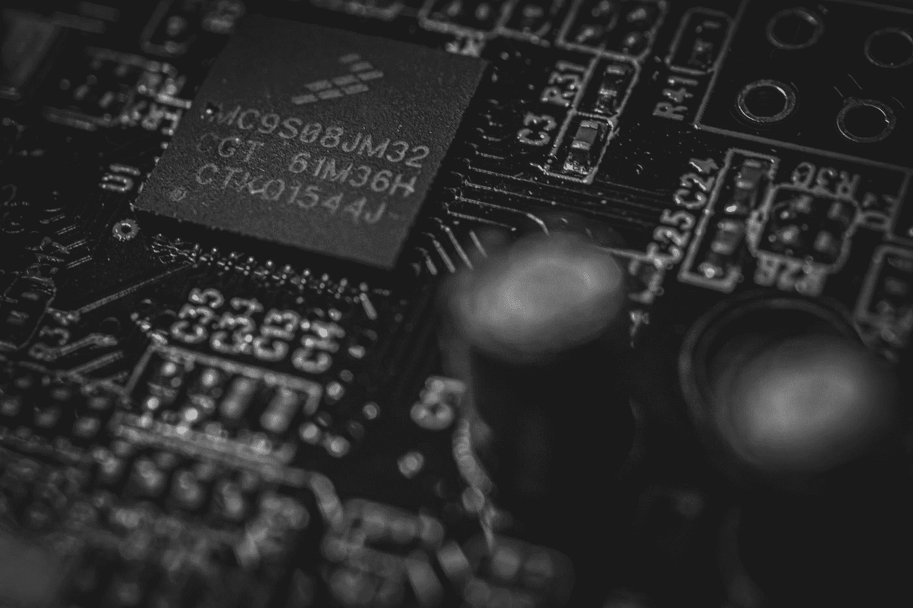

# 人类思维的历史协处理器

> 原文：<https://medium.com/codex/the-coprocessors-of-the-human-mind-4e58785347bc?source=collection_archive---------4----------------------->

照片由[克莱德何](https://unsplash.com/@clyde_he?utm_source=medium&utm_medium=referral)在 [Unsplash](https://unsplash.com?utm_source=medium&utm_medium=referral)

## [抄本](https://medium.com/codex)

## 通用微处理器是一个相当现代的现象，但特殊类型计算的专用硬件的帮助却不是。

最近，我一直在写苹果的 M1 微处理器是如何拥有所有这些专用协处理器和…