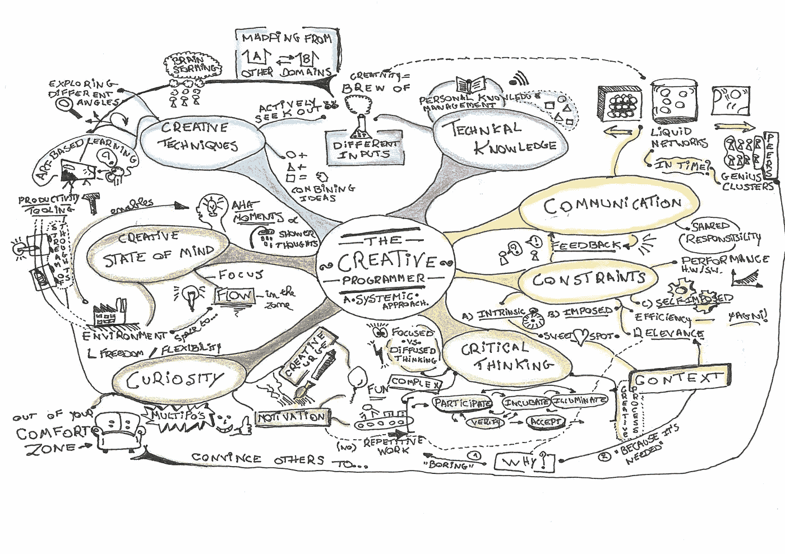

# 前方的创意之路

> 原文：<https://medium.com/codex/the-creative-road-ahead-6eb8515a337b?source=collection_archive---------8----------------------->

## 新 MEAP

## *出自*[*Wouter Groeneveld*的创意程序员](https://www.manning.com/books/the-creative-programmer?utm_source=medium&utm_medium=referral&utm_campaign=book_groeneveld_creative_9_22_22)

创造力对于成为一名成功的程序员至关重要。本书中的故事、例子和突破性的研究将帮助你释放你的创造潜力，使你成为一个更成功的开发者。

*继续阅读了解更多信息！*

在[manning.com](https://www.manning.com/books/the-creative-programmer?utm_source=medium&utm_medium=referral&utm_campaign=book_groeneveld_creative_9_22_22)结账时，在折扣箱中输入 **fccgroeneveld** 即可享受 25%的折扣。

我们人类热爱创造。根据哲学家兼小说家安伯托·艾柯的观点，创造来控制我们的命运和环境是人类与生俱来的本性的一种表现。在这种情况下，这本书将带你踏上一段旅程，成为一名有创造力的程序员。

你可能对这本书感兴趣，因为你想成为一名更好的程序员。你来对地方了。只是，不要期待最新技术奇迹的出现，比如某个虚拟机的 JIT 编译器，或者学习更多关于编程语言`x`或`y`。这和你一般的编程书差远了。

相反，我们将在不同的层面上工作。你将了解高度创造性的个人(和团体)是如何处理问题的，他们的习惯和思维过程是什么样的，以及他们如何达成更有成效和更有创造性的解决方案。一旦你成为一名认证的创意程序员，你将能够轻松地解决任何技术上的奇迹，同时学习多种编程语言。至少理论上是这样的。无论你是刚刚开始学习编程这门新学科，还是经验丰富的开发人员，我希望你至少能掌握一些新的创造性技巧。

在编程等技术行业有更多的经验并不一定意味着更有创造性。我已经在软件开发行业工作了十多年，见证了很少的高潮和很多的低谷。软件似乎注定要失败。务实的程序员和敏捷软件开发*宣言*的共同创造者安迪·亨特以类似的令人不安的口吻开始了他的书*务实的思维&学习*[【2】](https://freecontent.manning.com/the-creative-road-ahead/#id_ftn2):

不管你是程序员还是沮丧的用户，你可能已经怀疑软件开发肯定是人类有史以来想象和实践的最困难的努力。它的复杂性每天都在消耗我们最大的能力，而失败往往是惊人的，有新闻价值的。”

安迪的方法是教你如何思考和学习，而我的方法是教读者如何更有创造性地处理问题。在目睹了如此多的软件失败后(并无意识地帮助构思了它们)，我开始相信这种缺陷可能是非技术技能，而不是技术能力。这种痴迷甚至把我带回了学术界，在那里我花了四年时间研究软件工程中的创造力。我的混合产业/学术工作的成果是这本书。

但是在我们开始之前，我们首先需要解决几个问题。

## **为什么要创意？**

当你已经是一个有能力的程序员时，为什么还要费心去成为一个有创造力的程序员呢？答案是多维的。让我们来看看过创造性开发者生活的主要原因。

第一，简单说:因为雇主要求。多年来，几乎每个软件开发招聘广告都包含“创意”一词。每个人都知道招聘广告充斥着人力资源部门为了吸引尽可能多的应聘者而编造的毫无意义的词语。软技能最近风靡一时。我们没有浏览广告，而是通过简单地询问软件开发专家“你认为作为一名优秀的开发人员需要哪些非技术技能？”来进行自己的研究[【4】](https://freecontent.manning.com/the-creative-road-ahead/#id_ftn4)猜猜是哪个词蹦出来的。如果你想推销自己，你必须有创意。

至于为什么创造力是如此受欢迎的技能，答案在于解决问题。当传统方法失败时，引入一点创造力可能是一条出路。了解创意过程是如何运作的，就解决了一半问题。例如，如果您的 web 应用程序正在努力处理每秒数千个请求，那么查看消息队列、负载平衡、缓存或协同例程可能是个好主意。如果团队中没有人提出这些建议，你可能会陷入困境。一个有创造力的程序员将团队从这些圈子中解放出来。

但是有时候，解决问题是不够的。有时，问题还没有被发现，更不用说定义了。在这种情况下，你典型的解决问题的技巧将不会非常有效:你将需要依靠你的创造性感觉来*发现*问题。

当查尔斯·达尔文在 1831 年乘坐*号小猎犬号*离开普利茅斯，一次持续五年的航行时，他并没有打算解决进化论的问题:问题域甚至还不存在。英国皇家海军研究人员的任务只是绘制南美洲的海岸线。达尔文遇到的奇异的植物和动物，并小心翼翼地记录下来，为他的理论埋下了种子，而这些种子只会在航行结束多年后才被构思出来。

达尔文不是一个解决问题的人。他是一个问题- *发现者*。作为程序员，我们能从达尔文的思维方式中学到什么？我们通常被小而明确的(子)问题淹没。泳道中的任务必须以某种方式进入“完成”栏。但是也许，在这个过程中的某个地方，足够多的点被收集起来，然后连接起来形成一个全新的问题。也许我们发现了一个我们的客户甚至不知道的问题。一个有创造力的程序员既是问题发现者又是问题解决者*。*

*关心他人创造性判断的第二个原因是，你的同事的意见很重要。如果你还没有注意到，软件开发是一个基于团队的活动。创造力孤立起来是没有意义的，因为它是一种社会建构。相互尊重让大家更安心，从而增加团队的凝聚力。这为你提供了学习和成长的可能性，也帮助其他人学习和成长。*

*有创造力的第三个原因是因为创造力是有趣的。我们采访的许多专家提到，成为程序员的唯一原因是有机会发挥创造力。有创造力的程序员非常喜欢他们的工作。他们喜欢深入研究，走出自己的舒适区，联系不同寻常的想法，与他人讨论不同的方法，并融入其中。简而言之，有创造力的程序员屈服于他们的创造力。他们成为了安伯托·艾柯的“费伯人”。*

*许多创造者希望通过创造性的工作来获得永生，这些工作可能比他们虚弱的身体更长久。少数幸运儿实现了在世界上留下永久印记的梦想，被誉为真正的远见卓识者。作为程序员，我们工作在高度不稳定的技术中，最好驯服我们不朽的渴望。我敢打赌，到这本书出版的时候，现有的几十本关于编程的技术书籍可以安全地移到“老式”书架上了。我们都知道这意味着什么。*

## ***变得更有创造力的路线图***

*这本书不是关于如何成为一个天才或有远见的人，这与“创造基因”关系不大:正如我们很快就会发现的那样，根本没有这种东西。相反，它是关于发现和解决问题的相关过程。通过应用不同的创作方法和对创造力的见解，整齐地包裹在七个不同但紧密交织的主题中，我希望你能够成为一名更好的程序员。如果您不是程序员，请不要担心:我们将看到这些方法中的许多可以很容易地转移到其他领域。*

*安迪·亨特的*实用主义思维&学习*从一张漂亮的手绘思维导图开始，它兼作路线图。由于他的书也倾向于编程的软的一面，我让自己受到他的画的启发，并用它来照亮我们的研究报告——这被认为是非常有创意的，并迅速被接受。如图 1 所示，思维导图也是本书的指南。地图中的每个“触手”都代表了一个有着与创造力相关的独特主题的章节。*

**

*图 1:将本书所有七章联系在一起的创造性程序员思维导图。*

*本书中所有插图都是我手绘的，以更好地符合创意主题。*

## ***七大创意程序员主题***

*下面的冒险等待着我们:*

***1。技术知识***

*任何有创造力的人都必须对他们领域的现状有一个牢固的把握。这听起来似乎太明显了，以至于浪费一整章的时间似乎有些过分。如果一个程序员首先不是程序员，他就不可能是一个有创造力的程序员。尽管“先学习后行动”是不言而喻的，但停下来思考各种消费信息、持续学习、意识到认知偏差和管理知识的方法仍然是值得的。*

*有创造力的程序员知道如何将源源不断的知识转化为新想法。*

***2。通信***

*创造力从来不会孤立地产生。思想的提炼是一个社会过程。没有任何一种反馈，就不可能把你稍微有点原创的想法升级成一个优秀的。你的同龄人可以成为变革的催化剂。在这一章中，我们将探索天才集群的概念，如何建立梦之队，以及提高团队创造力的技巧。*

*有创造力的程序员总是意识到想法、个人和团队之间微妙的相互作用。*

***3。约束条件***

*处理任何类型的问题都需要考虑到约束，无论它们是自我施加的还是外部的。与普遍的看法相反，约束实际上激发了创造力，而不是削弱了它。我们将探索多个创造性爆发的案例，这些案例是将看似恼人的限制转化为突然优势的结果。*

**有创造力的程序员知道如何利用强加的约束，而不是事后才抱怨。**

***4。批判性思维***

*想出很多点子只是工作的一半；另一半，可以说是更困难的，涉及到激烈的争论，直到最好的想法被搁置。那时，也只有那时，可能是采取行动的时候了。在这一章中，我们将尝试在批判性思维和疯狂想法的永恒源泉之间建立一种共生关系。我们会发现，创造力不仅仅是产生想法，还包括决策。*

**有创造力的程序员能够流利地在发散思维和批判性评估之间切换。**

***5。好奇心***

*你为什么对这本书感兴趣？你对它的内容好奇吗？你渴望学习吗？如果答案是肯定的，我们就有了一个好的开始！根据创造力研究者米哈里·契克森米哈的研究，好奇心和毅力是创造力的两个最重要的性格特征。在接下来的章节中，我们将定期重温 Csikszentmihalyi 在这个主题上的出色工作。*

**好奇心意味着学习新事物(技术知识)的动力。好奇心导致问“*为什么”*问题(批判性思维)。我们将讨论为什么有一种惊奇感不仅对心不在焉的教授有利，而且对有创造力的程序员也有利。**

***6。创作心态***

*我们都知道频繁的中断对编程流程是有害的。进入正确的心态会大大提高你的创造性工作。我们将考察心流和洞察力是如何工作的，洞察力引发能带来什么，以及如何增加那些非常重要但易变的“啊哈！”时刻。*

*改善你个人的精神状态是一回事。增强你的团队或公司的集体精神状态是另一个——对一个有创造力的程序员来说，这两者同等重要。*

*7。创作技法*

*最后，我们将讨论几种实用的创作技巧，这些技巧可以积极地影响前面所有章节中解释的概念。就像创造力的系统定义一样，这些技术与创造性问题解决的所有维度交织在一起。它们不一定完全符合一个独特的主题。我们将以批判的眼光看待经典的头脑风暴会议和更非传统的技术，比如给你的想法添加一些腿。*

## ***本书的结构***

*每章以一个背景故事开始，以设定场景，并提供技术世界内外的创造性思维的例子。除了传统的例子，我也倾向于使用视频游戏作为上下文助手。这不仅仅是因为我碰巧喜欢游戏。包括我自己的研究在内的几十项研究已经证明，视觉例子更能抓住兴趣，游戏之美能引发有趣的学习。既然这是一本关于创意编程的书，不去挖掘游戏开发的故事就太可惜了。毕竟，它们不也被认为是艺术品吗？*

*各章节也慷慨地撒上了带有明显边界的练习。因为这不是一本技术编程书，所以练习不像你习惯的那样需要动手。然而，它们仍然是有价值的思考练习，可以作为回顾的主题。当然，我不能强迫你突然变得有创意。我能做的就是指出正确的方向。将这些指示转化为行动取决于你。*

*有时，作为题外话，我会偏离主题，提供额外的有趣和有见地的背景故事。你会发现这些离题部分是文本中间的灰色侧边栏。如果你赶时间，可以跳过它们，尽管如果你决定这样做，你可能会错过创造性的触发。*

*我们将在每章的结尾列出一个清单，总结该章中涉及的新概念。这些可以作为一个提醒，但是请考虑它们的上下文:仅仅浏览摘要不会让你更接近创造性编码的掌握，它们也不能作为最佳实践的完整概述。*

*你现在已经为你的创造性冒险做好了准备。点击了解《T2》一书的更多信息。*

*[【1】](https://freecontent.manning.com/the-creative-road-ahead/#id_ftnref1)安伯托·艾柯等人的公开作品。哈佛大学出版社，1989 年。*

*安迪·亨特。务实的思考和学习:重构你的湿件。实用书架，2008。*

*朱迪·L·怀尼库和黛安·B·瓦尔兹。调查优秀软件开发人员的特征。信息技术&人，2000。*

*[【4】](https://freecontent.manning.com/the-creative-road-ahead/#id_ftnref4)沃特·格罗内维尔德，汉斯·雅各布斯，约斯特·文内肯斯，克里斯·艾尔茨。杰出软件工程师的非认知能力:一项德尔菲研究。2020 年第 51 届 ACM 计算机科学教育技术研讨会论文集。*

*米哈里·契克森米哈。创造力:流动与发现和发明的心理学。哈珀双年展，纽约，1997。*