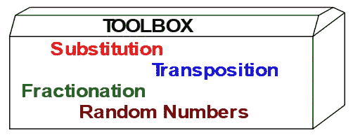
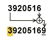
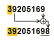
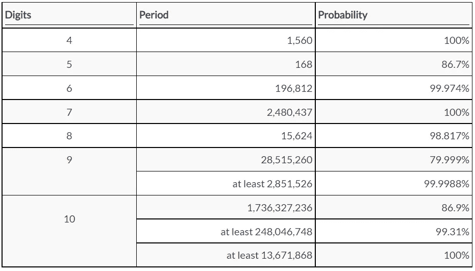

# 密码学家的工具箱

> 原文：<https://medium.com/codex/the-cryptographers-toolbox-5d31ef0f5058?source=collection_archive---------10----------------------->

## 引用

## *出自* [*秘钥密码术*](https://www.manning.com/books/secret-key-cryptography?utm_source=medium&utm_medium=referral&utm_campaign=book_rubin_secret_12_27_21) *作者弗兰克·鲁宾*

*本文涵盖:*

*   *用于密码的评级系统*
*   *替代密码*
*   *换位密码*
*   *分割，将字母分割成更小的单元*
*   *伪随机数发生器*

在[manning.com](https://www.manning.com/books/secret-key-cryptography?utm_source=medium&utm_medium=referral&utm_campaign=book_rubin_secret_12_27_21)的结账处，将 **fccrubin** 输入折扣码框，即可享受 [*密钥加密*](https://www.manning.com/books/secret-key-cryptography?utm_source=medium&utm_medium=referral&utm_campaign=book_rubin_secret_12_27_21)35%的折扣。

秘密密钥密码是由一些基本元素构成的。你可以认为这些是交易的工具。要构建一个强大的密码，你需要工具箱中的所有这些工具。这并不意味着你应该使用每个密码中的每个元素。这可能会导致额外的复杂性，而不会提高安全性。你的密码会更慢，没有额外的好处。这篇文章涵盖了替换，换位，分馏和随机数。

在讨论元素之前，先说实力。密码的强度是用比特来衡量的。每一位代表一个二进制选择。如果有一个密码，其中每个密文只能代表两个可能的明文之一，那么该密码的强度将为 1 位。举个例子，

0 =我们输了。

1 =我们赢了。

密钥的大小是决定密码强度的一个限制因素。如果密码使用 64 位密钥，那么它的强度不能超过 64 位，但是如果密码较弱，强度可以更小。



## **评级系统**

为了让您对密码的优势有一个总体的感觉，我将密码分为一到十个等级。这些是我的个人评级，基于我的经验和我对使用我所知的最佳技术破解密码需要多少努力的分析，以及这些密码相互之间以及与实践中被破解或未被破解的历史密码的比较。我在每个评级之前的部分给出了很多分析。

*   一个表示一个密码，没有受过训练的初学者只用纸和笔，适度的努力就能破解。
*   二表示一个有经验的业余爱好者或爱好者只用纸和铅笔就能破解的密码。
*   三是一个熟练的业余密码学家可以用手工破解的密码。
*   四五个意味着需要一台电脑，一个训练有素的密码师，或者两者都需要。
*   从 6 到 9 表示一个专家对手需要多少计算能力。
*   10 表示一种可以对抗国家密码机构的密码，国家密码机构拥有大量训练有素的密码学家，使用当今最大的超级计算机。

有时我会超出范围。零表示不需要纸笔就能理解密码，如猪拉丁或`GNITIRW` `EHT` `SDROW` `SDRAWKCAB`。11 的评级意味着该密码将经得起未来潜在的超级计算机的考验，远远强于量子计算机或我们目前设想的超级计算机。

通过看我如何评价不同的密码，你可以得到如何评价你在别处看到的或你自己发明的密码的要点。每个评级只是一个估计，并不能保证实力。

## **换人**

密码学家工具箱中的第一个工具是替换。课文中一个单位代替另一个单位。明文单元可以是单个字母、成对字母或更长的块。密文单元可以是字母、字母组、数字组或字母-数字组合。当所有单元都是单字母时，该密码称为*简单替换*或*单字母密码*。在计算机密码学中，单位可以是比特、字节或任意长度的比特或字节块。本节简要介绍了一下。

已知的最古老的替代密码之一是凯撒密码，由朱利叶斯·凯撒使用并可能发明，其中字母表的每个字母被后面 3 个位置的字母替代。在现代使用中，这可能是任何固定数量的位置更早或更晚。凯撒密码被评为一级。

不要求所有明文单元都具有相同的长度。假设密码采用字母表中的字母并替换成 2 位数对。字母表只有 26 个字母，但有 100 个可能的数字对。这意味着有 74 对额外的密码可以用于其他目的。一种已经使用了数百年的方法是提供普通字母对的替代，例如 TH、er、on、as 和 NT，以及除了单个字母之外的可能的短单词，例如 and 和。明文单元的长度将是 1、2 或 3 个字母。这使得数字对的频率更加一致。因为字母频率的差异可以用来解密码，所以让频率更均匀会让密码更强。

另一种方法是使用额外的对来为一些常见的字母提供额外的替代。这叫*谐音*替代。例如，您可以为 E 提供 10 个替代项，为 T 提供 8 个替代项，依此类推。给定字母的多个替代字母被称为*同音字*。这类似于英语中同音字 F 和 PH 都代表同一个音。提供多个替代项使得 100 位数字对的频率更加均匀。自然，字母对和谐音替换这两种方法可以结合使用，以获得数字对更均匀的频率。换句话说，这些方法阻止对手使用频率分析。

## **霍夫曼码**

在计算机环境中，密文单元可以是比特串。一个很好的例子是 Huffman 编码，它是由 David A. Huffman 于 1952 年在麻省理工学院上学时开发的。我不会讨论优化代码集的方法，我只会给出一个变长二进制代码的例子的一般概念。在霍夫曼编码中，最频繁的字母得到短码，而较少的字母得到长码，这是基于底层的字母频率表。因此，需要更少的比特来表达消息。这叫做*文本压缩*。

英语中最常见的字母是 E 和 T，它们各出现 1/8 的时间。由于 8=23，我们使用 3 位来表示 E 和 T。我们可以任意选择任何 3 位值，比如 E=100 和 T=111。我把这种方法叫做混合霍夫曼。下一个最常见的是 A、O、I、N、S、R、h，每一个出现的时间大约是 1/16，所以我们用 4 位来表示每一个。我们可以使用任何 4 位代码，除了已经使用的以 100 或 111 开头的代码。下一组字母是 D、L、U、C、M、F、Y，每组出现的时间约为 1/32，因此需要 5 位代码。诸如此类。

这是我根据 150，000 个英文字母的计数创建的一组混合霍夫曼代码。其他语言各不相同。霍夫曼码具有*前缀属性*，即没有任何码是任何更长码的前缀。例如，如果 **abcd** 是一个代码，那么**ABCD**不可能也是二进制数字 a、b、c、d、e 的任意选择的代码。前缀属性是由数学家埃米尔·莱昂·波斯特在 1920 年首次描述的。

```
E 100     D 00000     P 010010     
         T 111     L 01000     B 010011     
         A 0001    U 10110     V 110101     
         O 0010    C 10111     K 1101000    
         I 0011    M 11000     X 11010011   
         N 0101    F 11001     Q 110100101
         S 0110    Y 11011     J 1101001000
         R 0111    W 000010    Z 1101001001
         H 1010    G 000011
```

使用这些代码组，单词 STYLE 将被编码为`0110` `111` `11011` `01000` `100`。以 4 位为一组进行重写，得到十六进制的`0110` `1111` `1011` `0100` `0100`。

虽然 Emily 几乎不可能识别密文中单个字母的代码组，但 Emily 可以搜索更长的重复位串。这些将代表常见的字母对，称为*二元组*，字母三元组，称为*三元组*，或单词。例如，任何给定的 10 位字符串应该每 210 或 1024 次出现一次。如果一个 10 位字符串在 1024 个字符串中出现 20 次或更多次，那么它几乎肯定代表单词 the，这是英语中最常见的单词。如果你已经在一篇文章中识别出单词 the，那么你可以寻找像 THERE 或 THESE 这样的扩展名，因为重复的 e，所以很容易被发现。

## **换位**

第二个主要的加密工具是换位，改变消息中字符的顺序。最简单的方法是*路线换位*。消息的字母按一个顺序被写入一个矩形，并按不同的顺序读出。本节简要介绍了这方面的实践。

例如，有 25 个字母的信息“小偷之间没有爱”从左到右横着写在这个 5×5 的网格中，并沿着列从上到下读出。当从上到下阅读时，该网格中最左边的列是`TIOOI`。

```
T H E R E     Plaintext:  THERE IS NO LOVE AMONG THIEVES
         I S N O L
         O V E A M     Ciphertext:  TIOOI HSVNE ENEGV ROATE ELMHS
         O N G T H
         I E V E S
```

将字母写入网格以及将字母从网格中读出的常见路线包括直着穿过行、向左或向右、直着向上或向下穿过列、交替向左和向右穿过行、交替向上和向下穿过列、对角地从任何角落开始、对角地交替方向、或者顺时针或逆时针螺旋。路由转置密码被评定为一级。

## **分馏**

分割是将字符分割成更小的单元。我们已经看到一种方法，用二进制数表示一个字符。该二进制数的每一位都可以作为一个独立的单元进行处理、替换或转置。本节介绍分馏。

将一个字母表示为两位数的经典方法是波利比乌斯方块，它是由希腊历史学家波利比乌斯在公元前二世纪发明的。这是一个 5×5 的正方形，使用混合字母表和关键字 SAMPLE。请注意，字母 I 和 J 共享一个单元格，以使 26 个字母的字母表适合 25 个单元格的网格。

```
1  2  3  4  5
         1  U  V  W  X  Y     A mixed Polybius Square using
         2  Z  S  A  M  P     the keyword SAMPLE
         3  L  E  B  C  D
         4  F  G  H  IJ  K
         5  N  O  Q  R  T
```

因为 A 在单元格 3 的第 2 行，所以用 23 表示。b 是 33，C 是 34，以此类推，直到用 21 表示的 Z。I 和 J 都用 44 表示。然后，这些数字可以用各种方式替换、调换和重新组合。使用这个格子，或者以不同的混合顺序排列的另一个波利比乌斯方块，可以将成对的数字变回字母。

现代版本会用 ASCII 或 UTF 8 码中的十六进制表示来替换每个字符。因此 A=41，B=42，C=43，一直到 Z=5A。这些十六进制数字同样可以被替换、转置、重新分组并变回字节。

一个有趣的例子是 M. E .欧哈弗在 1910 年发明的分馏莫尔斯电码。欧哈弗总是用 M.E .来称呼他，因为他不喜欢他的名，即莫尔。

在分段莫尔斯电码中，字母被分成固定大小的组，比如 7 个，然后用/作为字母分隔符，替换成对应的莫尔斯电码。然后，代码组的长度被反转，并且调整大小的组被变回字母。

```
E X    A  M  P    L    E   Plaintext
         ·/-··-/·-/--/·--·/·-··/·   Morse equivalents
         1 4    2  2  4    4    1   Code group lengths
         1 4    4    2  2  4    1   Lengths in reverse order
         ·/-··-/·---/·-/-·/·-··/·   Regrouped Morse
        E X    J    A  N  L    E   Equivalent letters
```

莫尔斯电码是阿尔弗雷德·维尔在 1840 年发明的，并以他的雇主塞缪尔·f·b·莫尔斯的名字命名。

这种密码有几个明显的弱点。由于它使用标准的莫尔斯字母表，唯一的关键是字母组的长度，只需几次尝试就可以猜到。明文字母经常被自己代替。有 30 个不同的莫尔斯电码组，但只有 26 个字母，所以需要 4 个额外的字符。欧哈弗使用了日耳曼语的、和。分馏莫尔斯被评为一级。

这些问题可以通过两个改变得到部分解决:(1)只使用长度为 1、3 和 4 的莫尔斯群。有 26 个这样的组，完全符合 26 个字母的字母表。(2)打乱字母表的顺序，或者，等价地，打乱莫尔斯码组的顺序。我称之为加强版的动作莫尔斯。例如，使用关键字 MIXEDALPHBT 将字母表与莫尔斯组按标准顺序混合，您会得到:

```
M ·     P -·-    Y ·-··   N -·--  
         I -     H --·    Z ·-·-   O --··
         X ···   B ---    C ·--·   Q --·-
         E ··-   T ····   F ·---   R ---·
         D ·-·   U ···-   G -···   S ----
         A ·--   V ··-·   J -··-  
         L -··   W ··--   K -·-·
```

即使有这些改进，FR-actioned 莫尔斯被评为只有两个。

## **随机数发生器**

随机数生成器可以是在给定范围内产生一系列数字的任何东西。这些数字可以是一位、8 位字节、十进制数字或任何其他所需范围内的数字。例如，在 0 到 25 范围内的数字，对应于字母表中的 26 个字母，对于一些加密目的是有用的。本节介绍这个主题。

认识到没有“随机数”这种东西是很重要的。你不能说 51 是一个随机数，而 52 不是，反之亦然。然而，你可以说 51、52、53、54……的顺序不是随机的。这个顺序是完全可以预测的。随机性是序列或发生器的一种属性，而不是序列中单个数字的属性。说“随机数字序列”比“随机数字序列”更准确

发电机可能是一个物理过程，如宇宙射线，盖革计数器的乒乒乓乓，计算机按键的精确计时，在强风中飘扬的旗帜，海浪撞击的浪花或赶火车的人群。大多数物理源对于加密目的来说不够快，但是数字序列可以存储在计算机文件中以备后用。

生成器也可以是一个数学函数或计算机程序，每次被调用时都会产生一个数字。由数学算法产生的随机数称为*伪随机*数，以区别于*真随机*数。它们被认为比真正的随机数弱，因为确定随机序列的一部分的对手可能能够计算出前面和后面的数字，从而读取消息。数学函数永远不会产生真正的随机数。

伪随机序列和真随机序列的一大区别是伪随机序列最终会重复，而真随机序列从不重复。序列重复之前的项数称为其*周期*。例如，序列 3，1，9，2，4，3，1，9，2，4，3，1，9，2，4，3…有一个带下划线的句点 5。一般来说，周期越长，密码越强。

仅仅因为一个数字序列是随机的，并不意味着这些数字是同样可能的。例如，假设你正在观察穿过一座繁忙的桥的汽车的颜色。颜色是随机的，但某些颜色比其他颜色更常见。白色、黑色、银色和红色远比橙色、紫红色或黄绿色更常见。类似地，在掷骰子的游戏中，如果骰子是公平的，那么每次投掷都是随机的，然而投掷 7 的可能性是投掷 12 的六倍。

让我们假设任何一个随机数发生器产生的数字都是等概率的(并不总是这样)。这被称为*均匀分布*，或*等概率分布*。有了一个好的随机数生成器，生成的数字的对和三等也将具有统一的概率，也许会达到八倍甚至更高。

## **链式数字发生器**

让我用一个伪随机数发生器的例子来结束这一节，这个例子可以用纸和笔很容易地完成。不需要电脑。让我们称之为链式数字发生器。从写任何 7 位十进制数开始。这 7 位数字称为*种子、*或*初始值*，或*初始化向量*。它们可以被认为是包含该生成器的任何密码的密钥或密钥的一部分。要获得第一个伪随机数，只需将第一个和最后一个数字相加。将这个新数字添加到序列中，并涂黑第一个数字。所以，从 3920516 开始，我们加 3+6 得到 9。



每当总数超过 9 时，我们就去掉十位数。也就是说，加法是以 10 为模进行的。为了得到第二个伪随机数，我们重复这个过程。这里 9+9 等于 18。我们去掉十位数得到 8。



这个过程可以重复进行，以获得所需数量的伪随机十进制数字。

```
39205169800562199940232...
```

产生的伪随机序列是`9800562199940232...`

请注意，如果种子中的所有数字都是偶数，那么所有生成的数字都将是偶数。同样，如果所有数字都可以被 5 整除，即 0 或 5，那么所有生成的数字都可以被 5 整除。在这种情况下，周期可能不超过 128，因为种子中有 7 个数字，只有 27=128 个可能的 0 和 5 的组合。因为这种种子不能产生长周期，所以它们被称为*不合格*。对于链式数字生成器，一个*合格的*种子必须包含至少一个奇数和一个不是 5 的倍数的数字。比如 2222225 是合格的种子，但是 2222222 和 5555555 是不合格的。对于合格的 7 位数种子，周期将始终为 2，480，437。

该发生器具有典型的自制伪随机数发生器的行为。有 107 个可能的 7 位数种子。如果您从任何一个种子开始，生成器将循环通过某个数字序列，直到它再次生成该种子，因此 7 位数的集合被划分为几个离散的循环，每个循环都有自己的周期。如果你选择了一个合格的种子，那么循环将总是有 2，480，437 个数字的最大可能周期。这个长度有 4 个独立的周期，加上不合格种子产生的几个更短的周期。

对于其他大小的种子，该行为是类似的。即使当最大循环非常短时，也经常有很高的概率获得最大循环，因为可能有许多最大循环。下表显示了使用合格种子获得给定长度周期的概率:



表 1

该表显示，5 位数和 8 位数的种子长度是不安全的。它们产生很大比例的非常短的周期。7 和 10 位数的种子长度是最好的，因为你总是保证有一个长的周期。

这个随机数生成器严格来说是一个演示模型，只是为了展示使用简单的手工方法可以实现什么。不适合高安全性的工作。

## **有用的组合，浪费的组合**

这篇文章中的 4 种基本技术可以有无数种组合，我将在我即将出版的新书《牢不可破的密码学》中对此进行探讨。然而，重要的是从一开始就认识到，并不是每种组合都是有益的。有些组合增加了功，但没有增加力量。

考虑一些初学者尝试的想法。他们对消息执行简单的替换，然后对产生的文本执行第二次简单的替换，然后第三次，等等，进行 5、10 甚至 100 轮。这是白费力气。执行两个简单的替换和执行一个是一样的，但是使用不同的混合字母表，所以执行许多简单的替换不会增加任何力量。这里有一个例子。这两个替换混合了第一个和第二个键。第三次替换相当于先执行第一次替换，然后执行第二次替换。

```
ABCDEFGHIJKLMNOPQRSTUVWXYZ    First substitution
         XYZFIRSTABCDEGHJKLMONPQUVW
         ABCDEFGHIJKLMNOPQRSTUVWXYZ    Second substitution
         UVWXYZSECONDABFGHIJKLMPQRT
         ABCDEFGHIJKLMNOPQRSTUVWXYZ    Equivalent
         QRTZCIJKUVWXYSEONDAFBGHLMP
```

让我们试一个例子。如果我们使用第一次替换对单词`EXAMPLE`进行加密，结果就是`IUXEJDI`。如果`IUXEJDI`用第二次替换加密，结果是`CLQYOXC`。你可以自己验证用等价替换加密`EXAMPLE`会产生`CLQYOXC`。

执行一次加密然后执行第二次加密称为*，构成*两次加密。前面的例子表明，组合两个简单的替换只会产生另一个简单的替换。如果第一次加密使用一个代码，那么在代码之后使用一个密码称为*超级加密*。超级解密最常见的形式是非进位加法，或模 10 加法，其工作原理如下:

```
**12155 12155 12155 12155**   Superencipherment key
 **61587** **02954** **70069** **53028**   Plaintext code groups
 **73632 14009 82114 65173**   Superenciphered code groups
```

## **baz eries 4 型密码**

我们来看看相反的情况。让我们来看一个密码，使用一个替换步骤，然后进行一个非常简单的转置，产生一个更强的密码。

这种密码是由才华横溢、脾气暴躁且爱责骂人的法国密码学家 tienne Bazeries 在 1898 年提出的。我不知道 Bazeries 给这个密码起了什么名字。我称之为 Bazeries Type 4，因为这是他在 19 世纪 90 年代向外交使团提出的 4 种密码中的最后一种。这很容易用手工完成。

Bazeries 类型 4 由简单的替换和简单的转置组成，我称之为*分段反转*。转置根据一个键(一系列小整数)反转文本的小段。这里有一个例子，使用关键字 BAZERIS 来混合替换字母表，使用关键字 4，2，3 来进行移调。

```
ABCDEFGHIJKLMNOPQRSTUVWXYZ   Plaintext alphabet
 HGFDCBAZERISYXWVUTQPONMLKJ   Ciphertext alphabet
 THEQUICKBROWNFOXJUMPSOVERTHELAZYDOG   Message plaintext
 PZCUOEFIGTWMXBWLROYVQWNCTPZCSHJKDWA   After substitution
 4    2  3   4    2  3   4    2  3   4    2  3   Transposition key
 PZCU OE FIG TWMX BW LRO YVQW NC TPZ CSHJ KD WA
 UCZP EO GIF XMWT WB ORL WQVY CN ZPT JHSC DK AW  Final ciphertext
 UCZPE OGIFX MWTWB ORLWQ VYCNZ PTJHS CDKAW  Ciphertext grouped by fives
```

这种类型的置换可以用来加强许多不同类型的密码，所以它应该有自己的名字。姑且称之为分段反转。更强的分段换位密码可以混合文本的正向和反向部分，就像这个使用数字键 3，4，-3，2 的例子。

```
3   4    -3  2   3   4    -3  2   3   4    -3  2  
 THE QUIC KBR OW  NFO XJUM PSO VE  RTH ELAZ YDO GS  Plaintext
 EHT CIUQ KBR WO  OFN MUJX PSO EV  HTR ZALE YDO SG  Transposed
```

奇夫勒局的密码学家无法破解巴泽里提供的任何样本信息。尽管付出了相当大的努力，这些消息仍然没有解决 40 年，直到著名的建筑师和业余密码学家罗萨里奥·坎德拉解决了它们，并写了一本关于他如何做到这一点的书(《巴泽里司令官的军事密码》，卡尔达诺斯出版社:纽约，1938 年)。

然而，坎德拉无法直接解密这些信息。相反，他发现并利用了 Bazeries 从一把钥匙生成替代字母表的方式中的一个弱点。如果 Bazeries 使用了一种更强的混合密码字母的方法，坎德拉就不可能破译这些信息。因此，混合字母表的 Bazeries 类型 4 被评定为 5。很好地结合了两种方法，每种方法都被评为一。

这里还有另一个历史趣闻:坎德拉是哥伦比亚建筑学院的毕业生，所以他计划在哥伦比亚大学出版社出版他的书。时任美国密码学家学院院长的威廉·f·弗里德曼(William F. Friedman)得到了这方面的风声，并秘密封锁了该出版物。这再次证明了 Bazeries 型密码的强度。

本文到此为止。感谢阅读。