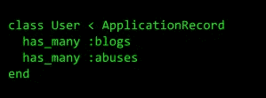
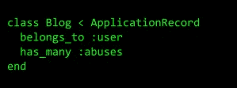
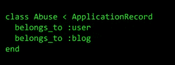
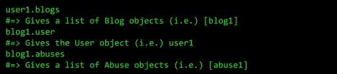
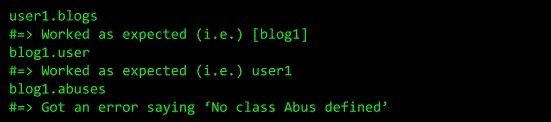

# Rails 协会的奇特案例

> 原文：<https://medium.com/codex/the-curious-case-of-rails-association-b3390b625af0?source=collection_archive---------23----------------------->

感谢你选择阅读这篇文章。我向你保证阅读这个博客会很有趣。这篇博客是关于我在 Rails Association 中遇到的一个问题的经历，以及我是如何找到问题的根源并找到解决方案的。

如果你是 Rails 用户，你可以跳过“搭建舞台”这一部分。

**搭建舞台。**

让我们熟悉一下我们一会儿将要用到的一些术语。

*   **Rails:** Ruby on Rails 或简称 Rails 是一个使用 Ruby 语言语法的 web 开发框架。它提供了一个有组织的结构来存储网站运行所需的不同文件。Ruby 使编码变得简单，因为它的语法和英语几乎一样。
*   **数据库:**数据库是用来存储和检索数据的应用程序。数据将存储在数据库的表(行和列)中。为了理解这一点，想象一下容器或文件是如何保存在橱柜里的。在橱柜里，你可以在架子上找到它们。在架子上，你可以找到它们。橱柜可以与数据库相关联，架子可以与桌子相关联。
*   **关联:**关联是数据库中两个表如何相互关联的一种方式。例如，如果 book 和 page 是两个表，那么它们的关联将是“*一本书‘有很多’页*”。
*   **单数和复数:**我们都应该读过英语中的单数和复数形式。单数和复数是 Rails 中的库函数，分别用于将单词从复数形式转换为单数形式，反之亦然。
*   **API 端点:**应用编程接口(API)是两个应用程序进行交互和交换数据的手段。通常，开发移动应用程序是为了与另一个称为后端服务器的应用程序进行交互。这个后端服务器将使用特定的 URL(端点)进行开发，移动应用程序可以使用这些 URL 进行交互。后端服务器也可以是一个可以使用 Chrome、Firefox 等互联网浏览器访问的网站。例如，可以使用移动应用程序和互联网浏览器访问脸书。为了更好地理解这一点，可以考虑 swiggy 和 zomato 等食品配送公司(这些公司可能与上面所说的移动应用程序有关)。这些服务与餐馆进行交互(可以与后端服务器相关联)，并根据我们的请求交付食物(可以使用后端服务器的 API 端点与移动应用程序相关联)。同样值得注意的是，我们可以直接去餐馆吃饭(这可能与作为网站工作的后端服务器有关)。
*   **类和对象:**类是一个编程概念，允许将任何实体表示为属性和函数。对象是一个类的实例。例如，一所学校的学生可以表示为一个学生班级，包含姓名、性别、学号和属性等详细信息。听、说、写和玩可以是那门课的功能。每个学生都可以成为学生类的对象。
*   **ORM 技术:**允许分别以类和对象的形式访问数据库中的表和表中的行的技术。

**在一个晴朗的日子…**

我被分配的任务是创建一个 Rails 应用程序，只为 API 端点服务，用于评估目的。一个迷你社交媒体应用程序作为一个开发的想法出现了。我使用 ORM 为应用程序创建表，并指定表之间的关联。基本表是 User，包含使用该应用程序的用户的详细信息。用户发布许多博客。所以我创建了一个博客表。用户可以举报博客滥用。所以我创建了一个滥用表，关联“*一个用户‘有许多’滥用*”和“*一个博客‘有许多滥用*”。

对于上面的表，我使用 ORM 在 Rails 应用程序中创建了 User、Blog 和 Abuse 类，并且在这些类中指定了关联，如下所示:

**测试阶段(一切都乱套了)**

为了测试创建的表类及其关联，我创建了一个示例用户( *user1* )，一个由示例用户发布的示例博客(blog1)。创建了另一个用户(用户 2)，该新用户(即用户 2)报告示例博客(即博客 1)被滥用(滥用 1)。

对创建的对象使用关联的预期结果是:

但是，实际的结果是一个真正的大煞风景！看看会发生什么:

等等。什么？名为**的类滥用**没有定义吗？但是我们已经知道，根据英语语法，滥用的复数形式是滥用，我们已经定义了同样的意思。

面对这样一个毫无头绪的错误，我首先在谷歌上搜索了这个问题。但是没有任何结果。

我联系了我的技术主管和团队中的同事。在我的机器里检查过之后，他们都不知道这个问题。一天在绝望中过去了。

**突然灵光一现！**

不知从哪里，我想到了 Rails 中关联的工作方式。在上面的代码中，您会注意到两种类型的关联，分别是:' **has_many** '和'**归属 _ T21 '。对于 belongs _ to 关联，在*单数形式*中提到了*目标表名*。但是对于 has_many 关联，在*复数形式*中提到了*目标表名*。**

Rails 在各自的类中使用给定的关联词(用户、博客、滥用和博客)来确定目标类。例如，如果我们给定为 ***blog1.user*** ，Rails 将使用 user 类查找表。类似地，如果我们给定为 ***user1.blogs*** ，Rails 将使用 singularize 函数并将其转换为 blog，之后它将使用 blog 类查找表 Blog。

现在，我通过给 ***“滥用”来研究单词滥用的奇点化函数的工作。单数化*** 。不出所料，结果是***【abus】***。原因是 bus 和 abuse 分别具有与 bus 和 abuse 相似的复数形式。因此，singularize 函数将“滥用”的单数形式返回为“abus”，而不是“abuse”。

**朝着解决方案努力**

由于这是 Rails 框架的一个问题，我想修复它并贡献给开源社区(在 GitHub 上)。在检查了过去关于同一主题的问题后，我了解到由于旧版本(向后兼容问题)，无法制定解决方案。作为替代，Rails 的主要开发者建议将解决方案代码写入应用程序中的一个文件。我做了同样的事情，发现问题已经得到解决。

如果您对解决方案感兴趣，[请访问此处](https://github.com/rails/rails/pull/32332)。感谢你阅读这篇文章。

**那都是乡亲们！**

这个事件是一个在编码时相信直觉的经典例子。这将有助于解决我们可能不知道其根本原因或解决方案的问题。

**作者:斯里拉姆 K**