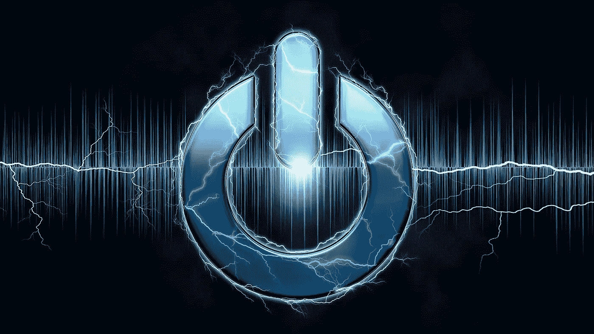
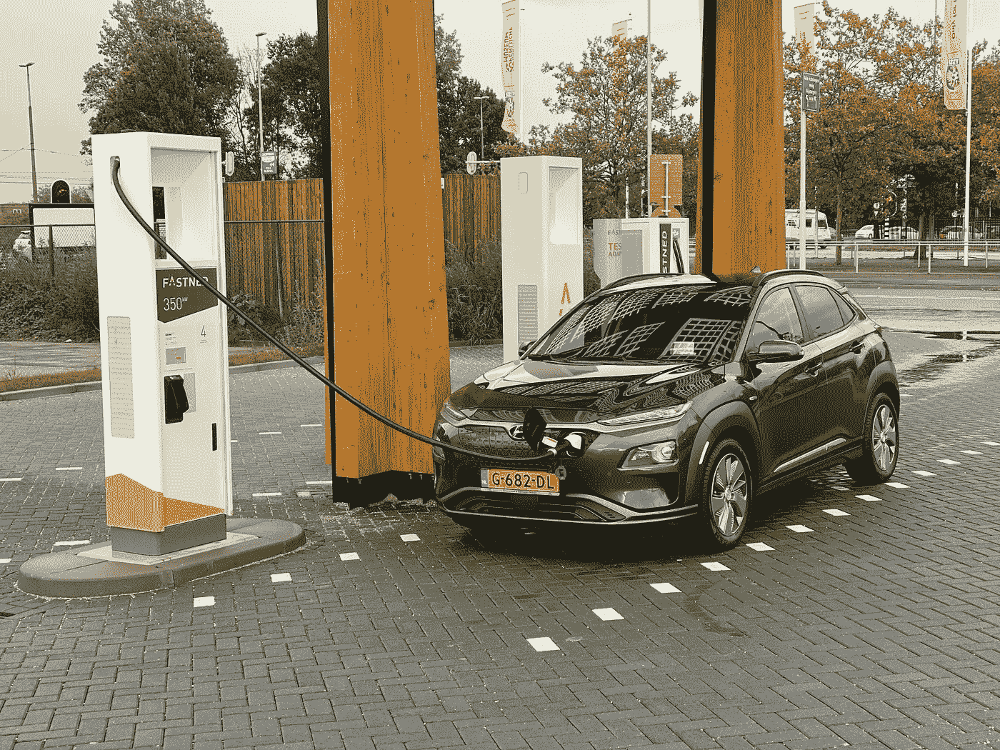
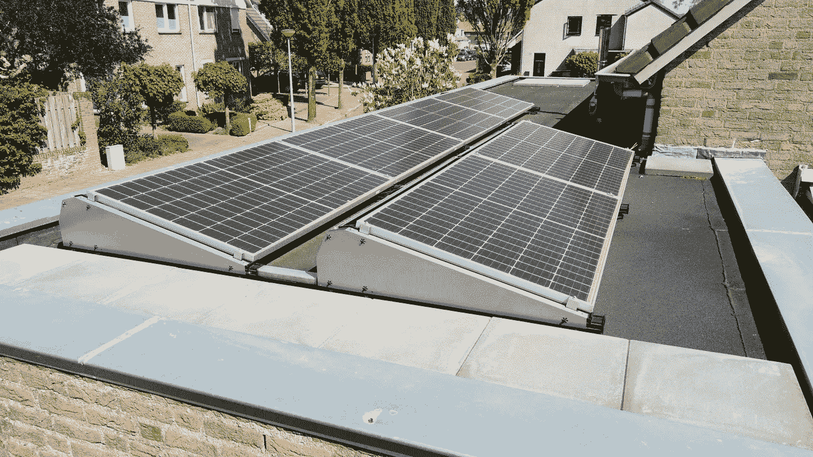
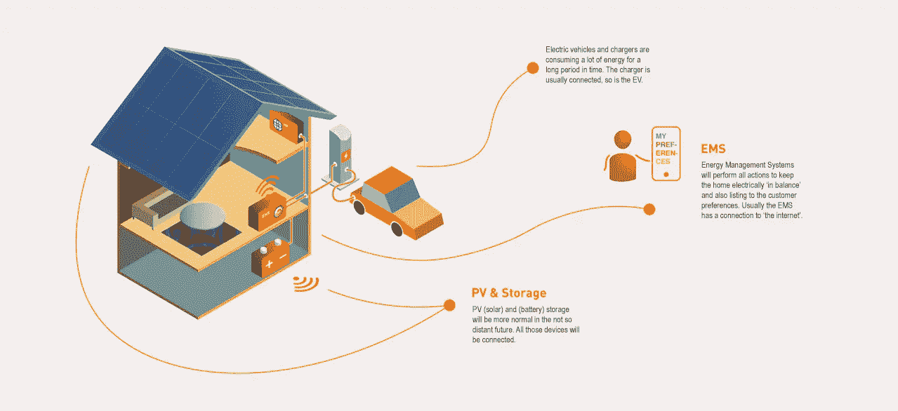
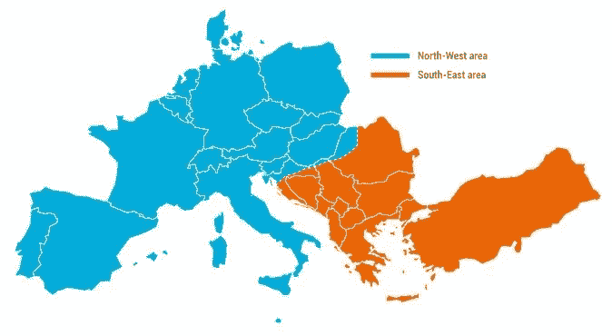
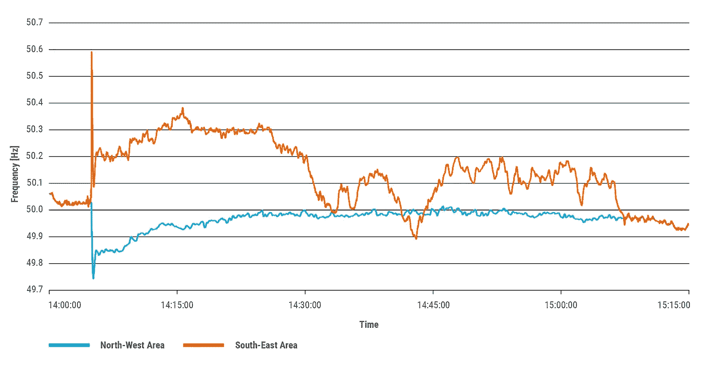
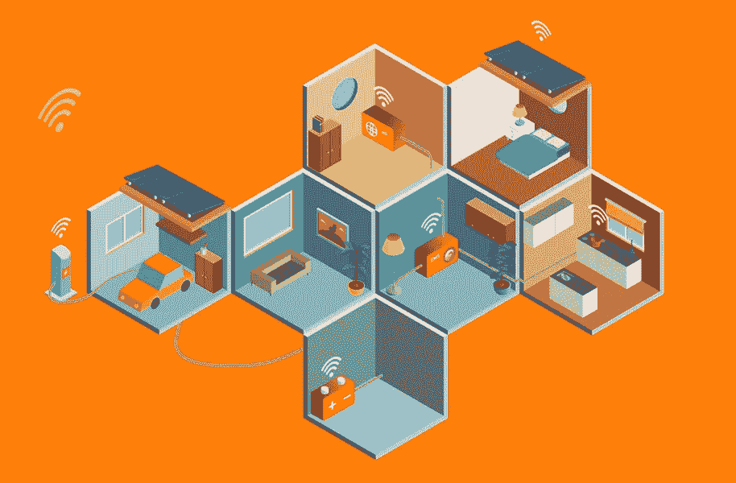

# 能源互联网的网络安全挑战

> 原文：<https://medium.com/codex/the-cyber-security-challenges-of-the-internet-of-energy-5b6fc966dba7?source=collection_archive---------4----------------------->

TLDR: 一个按钮就能关掉我们整个电网？我们正在创建一个不安全的高功率连接设备。我们应该担心吗？接入电网的高功率设备(家用电器)越多，我们就越应该担心电网的稳定性和电力的可用性。在数以百万计的设备被加入电网之前，我们应该有网络安全措施。监管应该(至少)在欧洲层面上进行。

图片由 [intographics](https://pixabay.com/users/intographics-2633886/?utm_source=link-attribution&utm_medium=referral&utm_campaign=image&utm_content=1872802) 来自 [Pixabay](https://pixabay.com/?utm_source=link-attribution&utm_medium=referral&utm_campaign=image&utm_content=1872802)

# 什么是能源互联网

[能源互联网](https://www.smart-energy.com/industry-sectors/smart-grid/from-a-smart-grid-to-the-internet-of-energy/) (IoE)是一个术语，指所有与电力相关的生产者和消费者(硬件)。通常情况下，IoE 允许更有效地利用能源(并调整需求和供给)。你可以想到本地生产和储存的能源，也可以想到家中的设备通过相互通信来管理能源的流动。

# 什么是典型的 IoE 设备

能源互联网中的典型设备是可以消耗大量电力的设备，并且是天然连接的，例如电动汽车、热泵、太阳能逆变器等。

荷兰快速充电站的电动汽车充电

最近，像冰箱和烤箱/炉子这样的家用电器也变得越来越智能和联网。这意味着这些设备可以被控制，因此被视为 IoE 的一部分。

屋顶的太阳能电池板

# 挑战是什么？

一台冰箱只使用少量的峰值功率(0.1 千瓦)，而一台烤箱或炉灶可以轻松使用高达 4 千瓦的峰值功率。在公共充电站或家里充电的电动汽车通常在 3.7 到 11 千瓦之间。

家庭中的太阳能电池板通常可以产生 1 到 10kW 的电能，固定电池可以从 2 kW 到 11 kW 或更多。

为了应对气候变化，我们将在电网中增加越来越多的可持续生产，因此更多的这些联网逆变器(可能还有电池)将被连接。与此同时，我们越来越多地将取暖用的化石燃料转换成电力，或者将内燃机转换成电力。

# 转向可再生能源和全电力，是件好事，对吧？你想说什么？

毫无疑问，从化石燃料转向可再生能源是一件好事。然而，当谈到连接时，我们现在这样做的方式感觉像是我们没有从以前的错误和挑战中吸取教训，转而更加连接。

仅仅因为这是一个有很多创新的领域(当涉及到物理时，特别是在电池部件和高效热泵、太阳能电池板等方面)，我们就忘记了良好的网络安全的必要性。焦点完全在功能上，而不是在设计上包含网络安全。

> **万物相连，只因“需要相连”。但是这些设备缺乏安全性，或者根本没有安全性。**

2017 年[一个机器人吸尘器被黑客攻击](https://www.rtlnieuws.nl/tech/artikel/3711036/hackers-veranderen-slimme-stofzuiger-lg-spionagerobot)，或者 2020 年[一个 IP 摄像头被黑客攻击并“开始与主人交谈”](https://www.rtlnieuws.nl/tech/artikel/5191328/hoe-rilana-zich-kapot-schrok-van-seksuele-toespelingen-uit-haar-slimme-camera)。这可能看起来像是个别的案例，但是这些案例是一个整体。我认为这是一个全行业的问题，网络安全增加了产品的成本，这个问题通常只是边缘性的(从本地的角度来看，只对所有者而言)。

美国殖民地管道黑客事件再次显示了我们对技术的依赖，以及它对我们日常生活的影响。

今年五月，美国核安全局遭到黑客攻击。

当它不仅仅是一个 IP 摄像头时，影响会发生变化，尽管侵犯隐私对个人来说感觉很糟糕，但对更高功率的设备来说也是如此。每个人都会说:是的，发电厂需要安全！电很重要！

# 高功率家用电器的聚合，这就是它变得可怕的时候

但因为更高功率电器的总和感觉威胁更小，我们似乎并不在乎。感觉离我们更远了，也可能只是难以把握。

> 当黑客执行分布式拒绝服务 [(DDoS)攻击](https://www.cloudflare.com/learning/ddos/what-is-a-ddos-attack/)时，也会进行聚合。一台设备的“能量”是不够的，但较小设备的组合能量足以摧毁整个网络。

当我们谈论发电厂时，我们都同意它们需要网络安全，因为它们消耗大量电力。但是大功率家用电器的总和很容易超过几个发电厂。这就是风险所在。保护您完全控制的一项资产比由房屋所有者购买和安装的分布式资产更容易。

让我们取 100.000(十万)个充电站。这听起来可能很多，但在荷兰，我们已经有超过 2.5 倍(2021 年 6 月)。如果那 10 万台平均功率 5kW 充电，那就占 500MW (500.000kW)。大多数较新的汽车实际上可以充电 11kW (3 相，每相 16 安培，230 伏)，所以随着时间的推移，这个问题只会变得更糟。

我们的欧洲大陆电网是互联的(也是频率方面的)，这意味着欧洲的充电站在哪里并不重要，只要你能控制它，你就能影响整个大陆的频率。当它在欧洲水平上时，10 万充电器在 2030 年时听起来不再那么多了。

想象一下，控制 500，000 个充电器以 10kW 的平均速度充电，这是一个巨大的 5000 兆瓦！这是一个可怕的力量，这是巨大的。[(美国的)一座核电站平均输出功率为 1000 兆瓦(1 吉瓦)。](https://www.energy.gov/ne/articles/infographic-how-much-power-does-nuclear-reactor-produce)

黑掉几个操作 500，000 个充电器的充电点运营商，将会给你和黑掉 5 个核电站一样多的电力。当你把家用电池、热泵、光伏逆变器和智能烤箱包括在内的时候，算一算吧…

我们家园的未来。控制能源流动的家庭能源管理系统，通常也连接到“云”。阅读更多关于[家庭能源灵活性协议](https://www.elaad.nl/uploads/files/In-Home_Energy_Flexibility_Protocols_-_TKI_Urban_Energy_v1_20200630.pdf)

# 对电网的影响

这真的有那么重要吗？**是**。只是是的。简而言之，这种影响既可能是欧洲层面的，也可能是局部的。

## **欧洲水平(输电网)**

对于欧洲大陆，欧盟国家在[中制定了输电系统运行指南](https://eur-lex.europa.eu/legal-content/EN/TXT/?toc=OJ%3AL%3A2017%3A220%3ATOC&uri=uriserv%3AOJ.L_.2017.220.01.0001.01.ENG):

> 同步区域所需的 FCR 备用容量应至少涵盖参考事件，对于 ce 和北欧同步区域，还应涵盖根据第(c)点进行的 FCR 概率尺寸方法的结果；
> 
> (b)应根据以下条件确定参考事件的大小:
> 
> (I)对于 CE 同步区域，参考事件应为正向 **3 000 MW** 和负向**3000 MW**；

这意味着对欧洲大陆来说，一个破坏性的 30 亿瓦(GW)的变化应该可以应付。然而，如果你控制着 300，000 个充电器，你就已经拥有了足够的电量。任何怀有恶意的人、黑客或政府官员都可以利用这些充电器搞垮(或严重破坏)电网。通过打开和关闭这些设备，这将对电网(和频率)产生振荡效应，从而在高水平上扰乱需求/响应。这可能会导致欧洲部分电网瘫痪。

**层叠效果**

然而，级联效应可能会导致整个欧洲的灾难性停电。德州大停电解释了其中一个可能的问题。虽然美国电网以 60 赫兹运行，而我们的欧洲电网以 50 赫兹运行，但效果是一样的。

德克萨斯州的电网离崩溃还有 4 分 37 秒。事情是这样发生的

> ERCOT 官员说，如果电网上没有足够的电力来满足需求，电网的频率就会降到 60 赫兹以下。这可能会对全州的电力输送设备造成物理损坏。它可能会迫使更多的发电厂关闭——可能导致电网完全瘫痪。”

*分裂*(图片由 Entsoe 提供)

在欧洲，2021 年 1 月 8 日发生了*系统分裂*，原因是几个传输网络元件在很短的时间内中断。[根据 Entsoe 的说法，最初的事件是 Ernestinovo(克罗地亚)变电站的 400 kV 母线耦合器因过电流保护而跳闸。](https://www.entsoe.eu/news/2021/01/26/system-separation-in-the-continental-europe-synchronous-area-on-8-january-2021-2nd-update/)这导致 Ernestinovo 变电站的两条母线去耦，进而将该变电站的西北和东南电流分开。

分离网格的频率(图片由 Entsoe 提供)

如果频率低于 49.7，这可能会产生连锁反应，结果未知。据我所知，也不清楚从完全停电中重启会如何进行，以及需要多长时间。这可能会导致几天没有电。

**本地(配电网)**

当更多的可再生能源加入电网，以及更多的热泵、电动汽车和其他高功率要求的电器时，对*容量管理*的需求将会增加，或者在某个时候它将成为一种必须。电缆只能承受这么多(电流)，如果超过这个量，就会发热并加速磨损。

重点是，当容量管理是防止(本地)电网过载的必要条件时，这也意味着如果有人可以改变电网该部分中多个设备的行为，这可能会对电网的该部分造成潜在损害(增加磨损，甚至瞬间损坏/断电)。

# 我们应该做些什么来减轻这些风险？

我们应该做的是制定网络安全要求，并立法强制实施这些要求，以创建一个更加安全的互联能源网络。这里的挑战不是技术性的，从技术上来说，我们已经可以通过设计，通过保护通信、系统加固并使其更具弹性，使这些设备(及其后台)更加安全。这并不像是火箭科学，以前已经做过多次，只是没有人强迫制造商发布高功率并网设备的安全产品。

我们的家庭将充满互联设备，这将对电网产生巨大影响。

我们需要立法强制设备(及其后勤办公室/服务器)安全，并遵循网络安全框架，然后才允许它们上市。就像智能手机市场上的设备现在需要至少几年才能获得更新一样，家用电器应该至少 10 年以上才能获得网络安全更新。对这些设备、服务器、后勤办公室和软件开发部门的年度审计应确保它们合规并保持合规。

我不是立法方面的专家，所以我不知道这是如何做到的，但我相信有足够多的人知道这是如何运作的。我只知道它(网络安全基线)应该尽快实施，否则我们将有数百万不安全的设备。发展将再次超越立法。

一种方法是通过(EU-范围内的)认证。如果一个设备以及带有后勤部门的整个链被认为是安全的并且满足要求，这样的设备可以获得证书。这将方便客户从被认为安全的供应商/制造商列表中进行选择。

当我们做得对的时候，我们不会注意到任何事情(可能会让我们觉得所有的工作一开始就没有必要)，但是如果做得不对，我们会感受到后果。

> 事情变糟只是时间问题。这不是关于 T2 是否会发生，而是什么时候发生。数字在增加，影响也在增加。