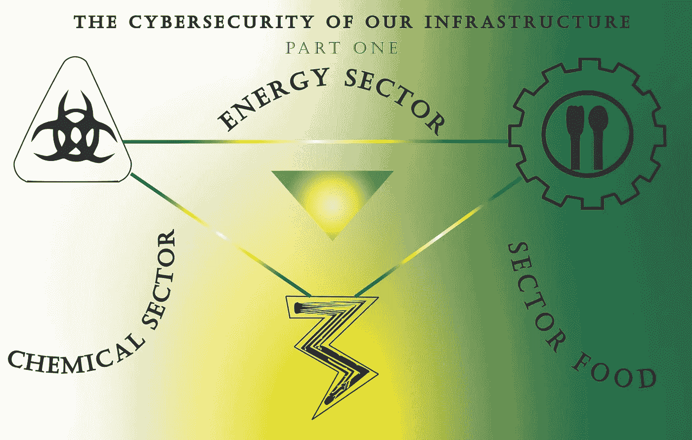

# 关键基础设施的网络安全

> 原文：<https://medium.com/codex/the-cybersecurity-of-critical-infrastructure-14b4db1dac7d?source=collection_archive---------21----------------------->

我们的关键基础设施是保持国家平稳运行的关键拼图，使家庭、学校和日常生活安全舒适。我们基础设施的每个部分都是相互联系的，不仅仅是相互联系，还与先进的数字技术联系在一起。这些技术提高了效率和能力，但也为不可预见的网络威胁打开了大门。随着需要 IT 和 OT 资源的机器和流程的增加，对国内外网络事件的关注也相应增加。今天，我们将探讨化学、核、能源、食品和农业部门的网络安全流程、标准和缺陷；在这个由四部分组成的系列中，请记住这个问题:我们是否尽一切可能为我们的关键基础设施创造可持续的网络安全？

要获得每个领域及其目的的完整分类，请访问之前的 crest 博客帖子,[16 个关键基础设施:概述。](https://www.crestassure.com/crestblog/critical-infrastructures-the-basics)

现在，自 2013 年初发布第 13636 号行政命令《改善关键基础设施网络安全》以来，每个部门内的每个私营和公共设施都承担了创建、实施和维护特定部门网络安全计划的任务，其基础是确定其技术/情报资产并限制对关键框架的广泛访问。不久之后，国家标准和技术研究所(NIST)发布了一项逐步实施的计划(改善关键基础设施网络安全的框架),这一直是第 13636 号行政命令所产生的所有网络安全计划的基础。

## 具体部门的计划

**化工板块:**

化学部门最初在 2014 年建立了一个特定部门资源、教育工具和遵守标准的列表，其中许多一直沿用至今。

资源:

*   化学安全评估工具:一个基于网络的评估平台，用于收集和审查化学设施的安全信息。它确定了符合或不符合高风险设施标准的设施，并提供了进行顶层筛选和安全漏洞评估(SVA)以及制定现场安全计划的方法
*   化学设施反恐标准(CFATS)和基于风险的性能标准 8 (RBPS 8):这些标准提供了如何通过防止对所有化学设施的 SCADA、DCS、PCS、ICS、关键业务系统和其他敏感计算机化系统的未授权现场或远程访问来阻止网络破坏的标准
*   网络弹性审查(CRR)和网络安全评估工具(CSET):这些工具广泛应用于各个部门，因为 CRR 评估计划和实践资产管理、控制管理、配置和变更管理、漏洞管理、事件管理、服务连续性管理、风险管理、外部依赖性管理培训和意识以及情况意识。CSET 指导企业逐步评估其控制系统和信息技术网络安全实践，并与行业标准进行比较。这些是在任何行业中识别和管理 IT/OT 网络安全的主要问责工具。
*   美国化学委员会负责任的安全守则(RCSC)-网络安全指南:这为 ACC 成员和负责任的网络安全专业人员提供了如何实施 NIST 网络安全框架的指南。虽然遵守只限于行政协调会成员，但强烈鼓励大多数化学部门组织使用这一框架
*   关键基础设施网络社区志愿者计划:该志愿者计划旨在促进 NIST 网络安全框架的认识和实施

**能源板块**:

化学和能源部门之间有相当多的共享标准，因为这两个部门经常相互作用，以创建其最终输出，这包括 RBPS-8、CRR、CSET 和化学设施反恐标准。然而，它们确实略有不同，因为能源部门不仅需要部门特定的网络安全，还需要分部门特定的网络安全。最需要单独评估和缓解的分部门是电力分部门以及石油和天然气分部门。

*   电力分部门风险管理方法包括:
*   [北美可靠性公司(NERC) CIP 标准](https://www.nerc.com/pa/Stand/Reliability%20Standards/CIP-005-6.pdf)，该标准提供网络安全标准，以保护运行和维护大电网的能源系统资产
*   [由 NIST 提供的机构间报告(IR) 7628《智能电网网络安全指南》](https://nvlpubs.nist.gov/nistpubs/ir/2014/NIST.IR.7628r1.pdf),为制定有效的网络安全策略提供了一个深入的框架，以应对特定的智能电网相关特征、风险和漏洞
*   石油和天然气分部门风险管理方法包括:
*   [美国州际天然气协会(INGAA)制定的国家天然气管道行业控制系统网络安全指南](https://www.aga.org/sites/default/files/legacy-assets/membercenter/gotocommitteepages/NGS/Documents/INGAAControlSystemsCyberSecurityGuidelines.pdf)概述了所有运营商的天然气管道控制系统网络安全管理要求
*   [RP 780 风险管理评估方法](https://www.api.org/~/media/files/publications/whats%20new/780%20e1%20pa.pdf)详细说明了石油和天然气作业风险评估的操作方法；由美国石油协会(API)建立

**食品和农业部门**

该部门的网络安全工作在其他部门中并不多见，因此他们的网络安全工作似乎更像是基于 NIST 框架和多个政府网络安全评估的广泛标准化，如 CRR、FISMA 记分卡(衡量组织识别、防范、检测、响应和恢复网络威胁和事件的能力)和管理计划跟踪系统记分卡(监控机构在实施 IT 和运营技术管理计划方面的进展)

**核反应堆、材料和废物部门:**

由于该行业的特定潜在波动性，网络安全似乎是该行业中一个极其严肃的话题。它们不仅有特定部门的网络安全要求，而且有助于关键基础设施网络安全的发展。NCR(核管理委员会)是形成全面网络安全实践的最大支持者之一，并将网络安全整合到所有 OT 和 IT 资产的基础中。

*   NCR 核电厂网络安全要求:
*   建立专门的网络安全评估团队
*   确定 NRC 要求范围内的关键系统和关键数字资产
*   隔离关键控制系统
*   对便携式媒体和设备(如 u 盘、光盘和笔记本电脑)实施可靠的控制，包括尽量减少使用非工厂维护的设备，在设备连接到工厂设备之前和之后扫描设备是否有病毒，以及在数据或设备来源于工厂之外时实施额外的安全措施
*   通过实施包括网络属性在内的培训和内部缓解计划，增加对使用数字化工厂设备的个人的安全筛查，以及增加网络安全培训和行为观察，增强对内部威胁的防御

正如您所看到的，基于 NIST 框架的网络安全标准的严格实施受到了极大的重视，在第 13636 号行政命令发布之年就制定了一个全面的意识、识别、缓解和预防计划。

## 这些关键部门的缺点

现在，所有关键基础设施部门的问题似乎都很大，86%的部门对其系统的可见性有限(这意味着他们不知道他们的系统如何应对误报、日常噪音和实际威胁/攻击)，44%的部门在大组员工之间共享 IT/ot 凭证，70%的部门与关键 OT 有外部连接，77%的部门分割不良。所有这些数字都是 NCR 在 2022 年报告的，尽管 EO 13636 已经实施了近十年。这是一个非常严重的国家安全问题，因为这些缺点可能会导致对手通过窃取的组凭据获得整个系统的访问权限，通过浏览未分段的系统来窃取宝贵的数据，通过远程破坏外部系统来关闭整个系统，更不用说保护工业控制系统的问题了(在以前的 CrestBlog 文章中概述了这个问题)。

这种疏忽的解决方案是什么呢？虽然大多数机构在技术上达到了 NIST 标准，但网络安全的实施是为适应原有的关键系统和机制而制定的，与将网络安全设计为所有内部和外部系统的基础相比，网络安全更容易受到攻击。这就是为什么政府官员希望通过创造以网络安全为基础的所有技术来改善我们关键基础设施的网络安全。这不仅使这些系统不那么脆弱，而且在网络攻击的情况下更容易防御，因为防御协议要么已经被编程到所述技术中，要么很容易为 IT 专家准备好。这些想法是在总统乔·拜登于 2022 年 5 月 12 日签署生效的 EO 14028“改善国家网络安全”之后提出的。这为投入人力和资本资源为我们的关键基础设施创建最密不透风的系统打开了大门。CISA、DHS、DOJ 和联邦调查局等机构都在合作开发网络攻击的解决方案和前兆。

随着这一更新的 EO，毫无疑问，美国如何看待和处理网络安全，包括私人和公共网络安全，将会有重大进步。Crest Security Assurance 期待成为未来缓解策略的一部分，并促进我们国家关键基础设施的意识和准备。有关佳洁士如何保护您的组织的更多信息，请访问我们网站的[服务](https://www.crestassure.com/services)选项卡。

下周请继续关注第二部分，我们将更详细地介绍商业和制造业的网络安全实践！

来源:

[https://www . cisa . gov/sites/default/files/publications/nipp-ssp-nuclear-2015-508 . pdf](https://www.cisa.gov/sites/default/files/publications/nipp-ssp-nuclear-2015-508.pdf)

[https://www . cisa . gov/sites/default/files/publications/nipp-ssp-energy-2015-508 . pdf](https://www.cisa.gov/sites/default/files/publications/nipp-ssp-energy-2015-508.pdf)

[https://www . cisa . gov/us cert/sites/default/files/c3vp/framework _ guidance/chemical-framework-implementation-guide-2015-508 . pdf](https://www.cisa.gov/uscert/sites/default/files/c3vp/framework_guidance/chemical-framework-implementation-guide-2015-508.pdf)

[https://www . cisa . gov/sites/default/files/publications/nipp-ssp-food-ag-2015-508 . pdf](https://www.cisa.gov/sites/default/files/publications/nipp-ssp-food-ag-2015-508.pdf)

[https://www . API . org/-/media/Files/Policy/cyber security/2018/Defense-Depth-network security-in-the-Natural-Gas-and-Oil-industry . pdf](https://www.api.org/-/media/Files/Policy/Cybersecurity/2018/Defense-in-Depth-Cybersecurity-in-the-Natural-Gas-and-Oil-Industry.pdf)

[https://youtu.be/poTh31C4ia0](https://youtu.be/poTh31C4ia0)