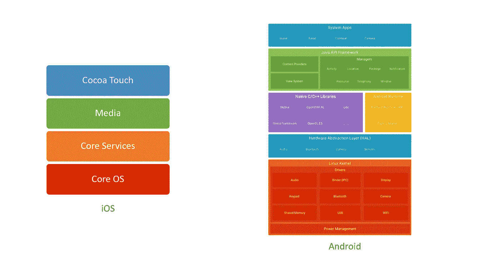
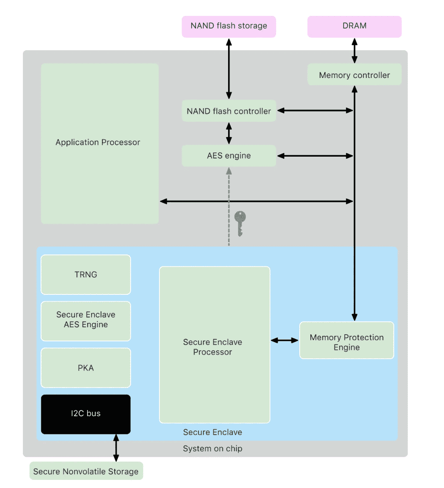
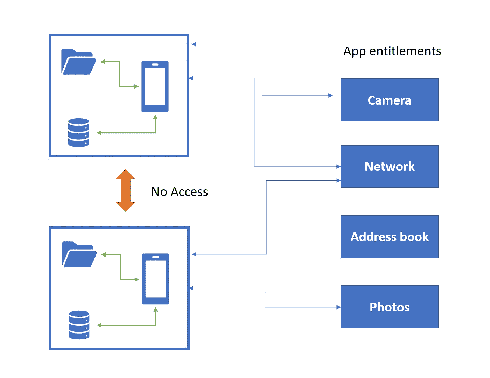
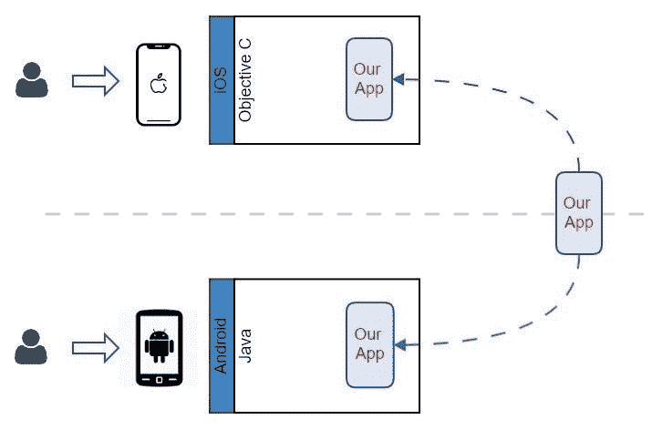
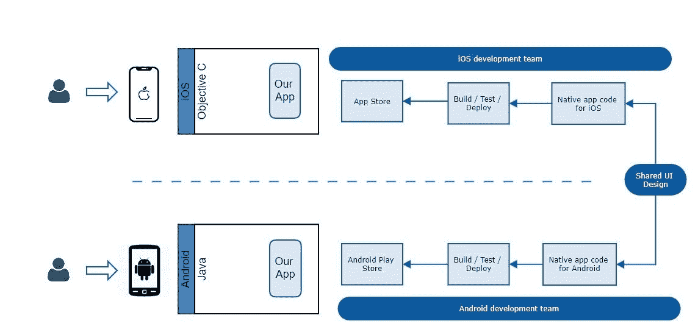
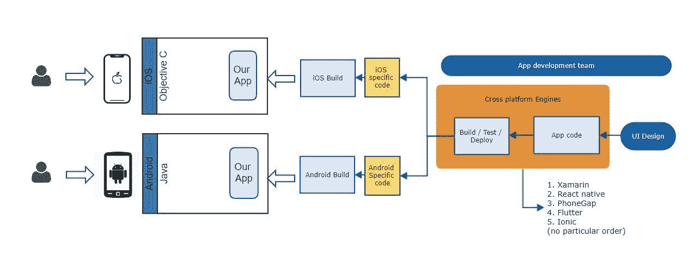
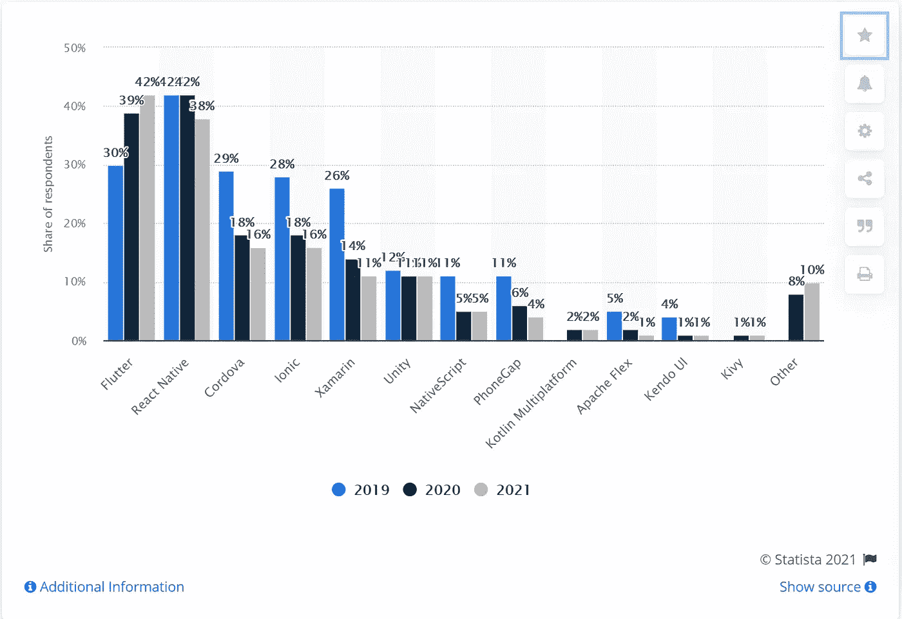

# 构建企业级移动应用的黑暗艺术——第 1 部分

> 原文：<https://medium.com/codex/the-dark-art-of-building-an-enterprise-grade-mobile-app-part-1-34ff34387deb?source=collection_archive---------11----------------------->

移动应用是数字存在的缩影。这意味着你关心你的顾客。这意味着你已经找到了进入他们生活的方式，并且有了一个在个人层面与他们互动的平台。它呼唤以设计为中心的思维，尖端的技术，高度响应的用户界面。支撑这一切的是(很可能)驻留在云中的一套坚实的 API。这些系统需要容错、高度安全，并且可以按需扩展。

它*的意思是*你解决了很多工程问题。

通过这篇文章，我打算从一个企业的角度，带您踏上移动应用程序开发的旅程，以及它所带来的多方面的挑战。与此同时，已经注意到将概念分解成简单的字节大小的插图，任何人都可以跟随！

这篇文章是一系列文章中的第一篇，部分是*如何做*，部分是*杂志*，概述了我过去 18 个月的移动应用开发之旅。

# 两个操作系统的故事

在我们直接进入如何构建移动应用的机制之前，让我们先了解一些背景。任何移动应用都需要运行在两大操作系统之一上，即 iOS 和 Android。

苹果的软件是专有的，只运行安全的苹果硬件，只有他们制造。另一方面，安卓以开源著称，可以在成千上万的设备上运行。制造商也可以根据他们设备的需求定制操作系统。它也是世界上最受欢迎的操作系统，拥有 30 亿活跃用户，而苹果只有 10 亿。眨眼！

> 有 **iOS** ，却没有一个 ***Android*** *。*只是口味不同而已。是的，我是吃了苦头才知道的！

## 更深入地了解这些架构

下面是两个操作系统架构的比较。每个操作系统的最顶层包含了我们接触、交流或互动的框架。每个操作系统的最底层直接位于底层硬件之上，处理底层功能。(想想文件系统、内存、电源、网络等。)

iOS 与 Android 平台架构

您可能会发现 iOS 中抽象层次较低。这个故事还有很多，但直觉上，它应该是有意义的。

> 如果我的软件只在我生产的产品上运行，我要处理的复杂性就会降低很多。

## 安全架构

让我们更进一步，看看他们的安全架构。虽然 iOS 和 Android 都采取了分层的安全方法，但苹果硬件的定义特征是存在一个安全的飞地。(下图中的蓝框)。把它想象成你设备中的一个安全芯片，它有自己的加密固件，没有人可以访问！*不是* e *ven 你自己的 iOS* 。进去的东西永远出不来！算是吧。

保护 Enclave 组件。来源:[苹果](https://support.apple.com/en-au/guide/security/sec59b0b31ff/web)

Secure Enclave 便于保护设备密码、生物识别、Apple Pay 和加密密钥。(目前支持椭圆曲线密码，具体来说就是 Diffie-Hellman 算法。私钥生成并存储在 enclave 中。你可以在这篇优秀的[博客文章](https://darthnull.org/secure-enclave-ecies/)中读到更多。据我们所知，Android 设备制造商开始效仿他们自己的 secure enclave 实现。当我们讨论生物识别技术时，我们将再次讨论这个话题。

## 应用程序沙箱

然而，两种操作系统的一个共同主题是应用程序沙箱的概念。每个应用程序都位于其自己的逻辑边界内，以保护应用程序，并只授予最低级别的权限来做它需要的事情。沙盒的底层实现在两种操作系统之间有所不同。

Android 使用非常 Linux 风格的 UUID(唯一用户标识)。每个应用程序在操作系统上都有一个 UUID，从而确保其完整性(它的工作方式非常类似于 Linux 操作系统中的用户权限)。一个应用程序存储的文件或数据不能被另一个应用程序访问)。这也是为什么根设备会带来问题，因为流氓应用程序或恶意软件可能会损害应用程序的完整性。在 iOS 中，沙盒是建立在苹果所谓的[权利](https://developer.apple.com/library/archive/documentation/Miscellaneous/Reference/EntitlementKeyReference/Chapters/EnablingAppSandbox.html)之上的。权限是由应用程序开发人员在其构建的配置中设置的键值对，授予对目标资源的特定权限。例如，查看和共享照片的授权密钥并不能授权应用程序读取另一个应用程序的文件系统或用户的位置。

应用沙盒插图

因此，我们对移动生态系统的理解应该是这样的。我们将在此基础上继续前进！

# 选择正确的技术

我们的应用程序应该运行在两个完全不同的平台上。有几种方法可以解决这个问题。

## 原生应用

我们有理由认为，我们需要在两个不同的代码库(完全用不同的语言编写)上构建两个独立的应用程序，它们的外观、感觉和行为都是一样的。我们是对的。这种方法提供了许多独特的优势，如独立的发布周期、对底层安全实现的更高控制、保持最新的操作系统版本升级等等。这也是以运行两个独立团队为代价的。

原生应用开发模式

## 跨平台应用

如果我们能开发一个能在两个平台上运行的应用程序会怎么样？我们仍然需要做一些小的调整，但是没关系；我们可以忍受。它将降低成本，使我们可以即时部署的设备多样化，将上市时间最小化，并拥有紧凑的可重用代码(难道开发人员不喜欢这样吗？)

跨平台应用开发模型

市场上有几种平台已经竭尽全力来解决这些问题。选择合适的平台来构建我们的应用程序是一个绝对关键的考虑因素，不可掉以轻心。除非我们用“概念证明”来试水，否则这是一条不归路(或者非常昂贵的一条)。在我看来，没有一个对或错的平台，只有适合组织的平台，它的用户群、预算、人才库、发布节奏、你想成为的最新版本等等。

下面是一个统计数据，概括了过去 3 年中跨平台框架的流行程度。Flutter 已经在 2021 年挤过 react-native。

跨平台应用框架。来源: [Statista](https://www.statista.com/statistics/869224/worldwide-software-developer-working-hours/)

# React-native 案例

我们走了自然的路。它符合我们的要求；我们能够快速迭代，并在六个月内与一个由网络工程师组成的团队一起构建应用的核心组件，这对他们来说是移动优先。那么，我们对 react-native 有什么体验呢？

## 一个团队，一个代码库

选择 react-native(更广泛地说，跨平台方法)而不是 native 的最大优势可能是*一个开发团队*可以为两个平台构建。这对企业来说是巨大的成本节约；一个人可以争论几乎一半。由于代码库也是共享的，所有的特性都是为我们的客户同时构建、测试和发布的。(这个故事有一些例外，但基本上是成立的。)事实上，我们可以用一个小型工程师团队(不到 10 人)构建一个企业级应用程序，这是对 react-native 强大功能的证明。

## **“开关”和可重用性**

对于我们这样一个从网络迅速转向移动的团队来说，这是一个显而易见的选择。这似乎是一个有争议的话题，但是对于 react 开发人员来说，过渡到 react-native 要容易得多。React-native 基于 React.js，而 react . js 又基于 Javascript。更好的是，该团队可以在 react-native 应用程序中重用一些现有的 react 模块。这同样有助于节省大量时间和成本。

## **实验和迭代**

我们在斯派克住了好几个月。react-native 构建了我们的构建管道，集成了生物识别、联邦 API、检测离线模式或与某些本机模块交互，使我们能够在遵循企业要求的标准的同时快速迭代。

## **那么本地代码呢？**

好了，好戏来了。我们仍然需要编写本地代码，这意味着我们仍然需要本地专业知识。我们很幸运有一些杰出的工程师，他们卷起袖子开始工作，实现了这一目标。本地专业知识可能是一个挑战。但是仍然有大约 95%-5%的人支持 RN。与原生方法相比，这仍然是一个非常可接受的折衷方案。

## 开发社区和第三方支持

脸书为解决跨平台开发的问题而构建的 React-native 是开源的，拥有一个庞大而活跃的开发人员社区，他们积极为之做出贡献。脸书的 react-native 团队仍在开发核心模块。在它落后的地方，有许多第三方库，这使得生活更容易。但是这就引出了我们的下一个问题。

## **安全呢？**

嗯，还不错。但是我们必须小心。我们必须尽快与 Expo 库分离。在项目的初始阶段，我们没有在管道中构建代码和漏洞扫描软件，这需要一些返工。我们还进行了精心的笔测试；(黑盒和白盒)并需要进一步修改以修补某些问题。

## 是不是“一次编写，随处运行？”

不完全是。有时我们会看到不同设备的 UI 组件不一致。谷歌的 Pixel 想到很多！对源代码的任何更改都意味着要对我们的设备环境进行全面测试。但是我们发现了这些不一致背后的根本原因，而且这些原因很少。

这篇文章是一系列文章中的第一篇，这一系列文章的第一部分概述了我过去 18 个月的移动应用程序开发之旅。

*第 1 部分:介绍和选择正确的技术*

[第 2 部分:解释移动设备特有的挑战](/@sundarsingh_2383/the-dark-art-of-building-an-enterprise-grade-mobile-app-part-2-950f1d9e911b)

[第三部分:移动和应用安全](/@sundarsingh_2383/the-dark-art-of-building-an-enterprise-grade-mobile-app-part-3-e24c60ab735d)

[第四部分:分析、分布式监控、敏捷软件开发](/@sundarsingh_2383/the-dark-art-of-building-an-enterprise-grade-mobile-app-part-4-2ab218e5ad62)