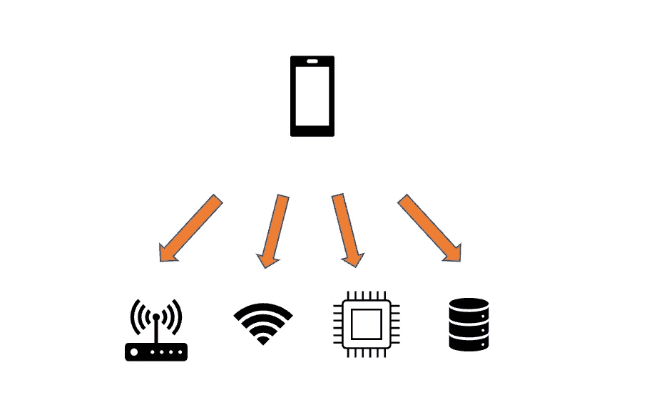
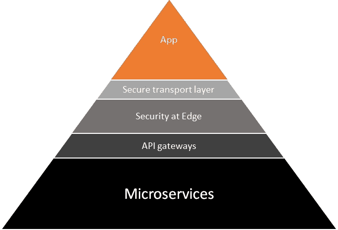
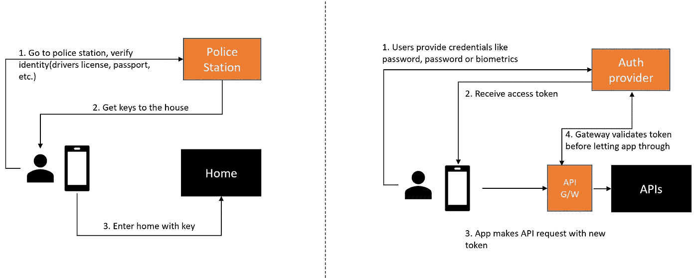
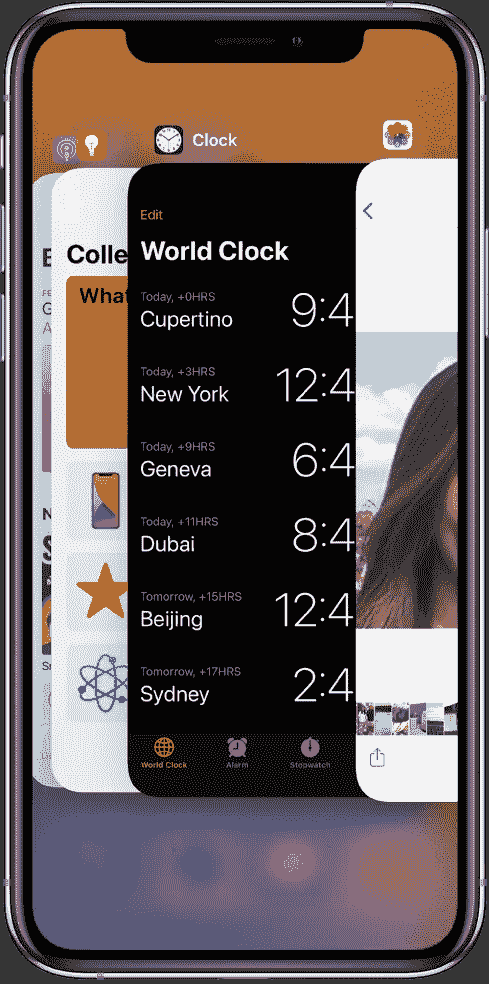
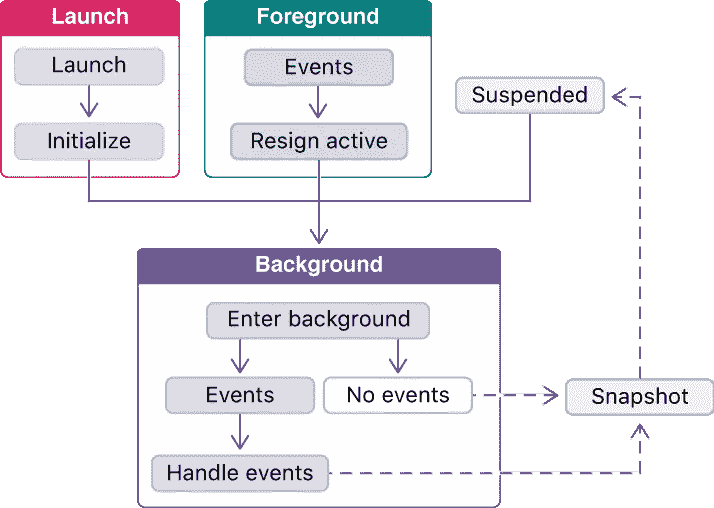
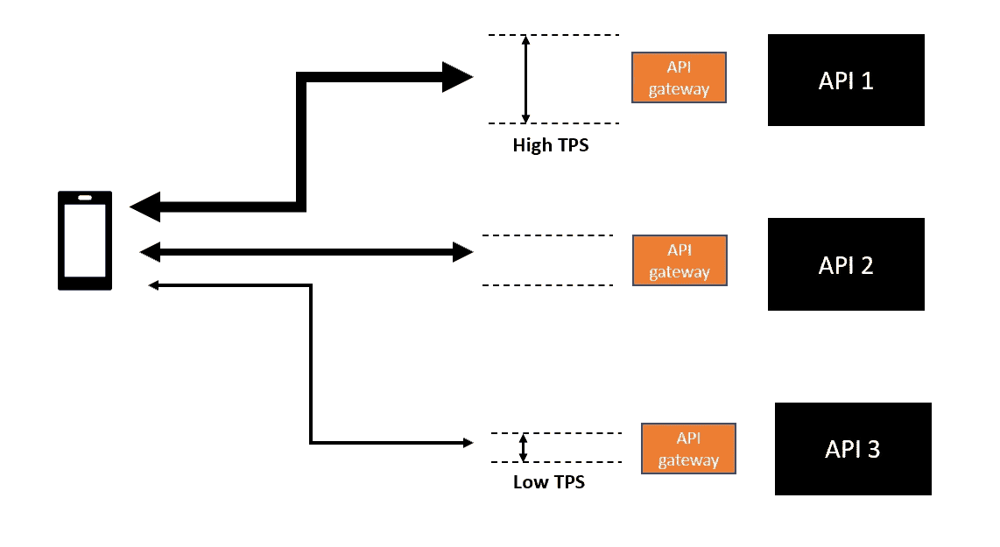
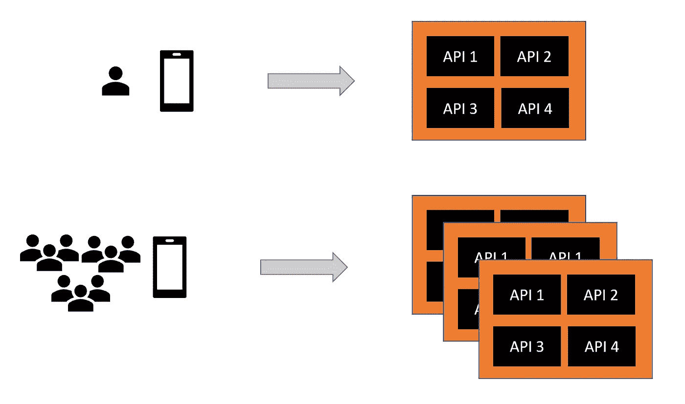
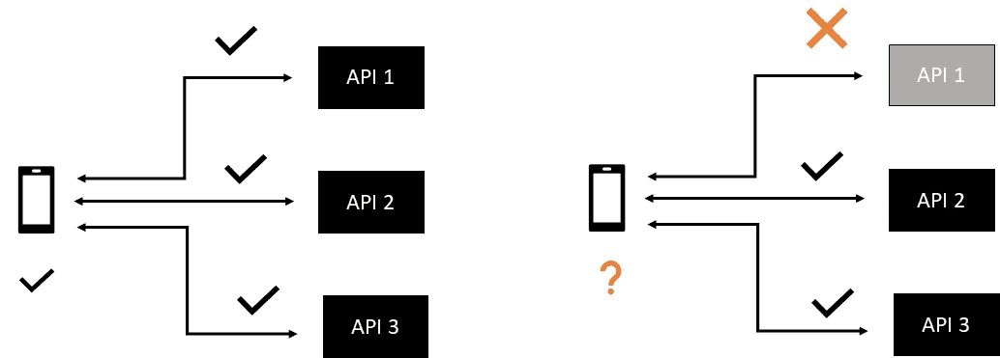

# 构建企业级移动应用的黑暗艺术——第 2 部分

> 原文：<https://medium.com/codex/the-dark-art-of-building-an-enterprise-grade-mobile-app-part-2-950f1d9e911b?source=collection_archive---------12----------------------->

吉尔·兰伯特在 [Unsplash](https://unsplash.com?utm_source=medium&utm_medium=referral) 上的照片

这篇文章是**系列文章中的第二篇**，这一系列文章的第一部分是*操作指南*和第二部分是*日志*，概述了我过去 18 个月的移动应用开发之旅。

# 什么是手机 App？

看一个 App 有两种方式。

一个。

> 简单来说，移动应用程序可以被认为是一个伪装成应用程序的浏览器，它与一个网站进行对话。

两个。

> 移动应用是服务器端软件的对立面。

为什么？

想象一下:你的产品负责人在一个晴朗的日子走进工作岗位，召集团队，下达命令。“听着，我需要你给我造一个软件。我不知道它将在哪里运行，也不知道它将获得多少内存。在它运行的时候，我会把网线从机器上拔下来几次，并不时地暂停一下内存。但它需要看起来很酷，我希望不折不扣的用户参与。哦，而且没有回滚。”

> 认为任何软件在遭受这种滥用时都会工作是不可思议的，更不用说提供无与伦比的用户参与了，然而这正是几乎每天无缝发生的事情，通过一些非常复杂的工程使之成为可能。

在地下 50 英尺的拥挤地铁里旅行，你的连接会掉线 3 次。当你准备在亚马逊上点击订购商品时，你妈妈打来一个视频电话，你接了。你忘记了购买，转到 Spotify，然后睡着了。你回到家，你的另一半会提醒你是否订了礼物。你喃喃自语，“是的，亲爱的！”溜进厕所，打开 app，去推车，完成购买！

什么都不能保证！

# 一个 App 就是冰山一角。

考虑到我们刚刚看到的复杂性和不确定性，许多繁重的工作都是在“幕后”完成的通俗地说，就是我们所说的*后端*。这并不是说开发一个应用程序很容易。假设它需要所有能得到的帮助！在本文的其余部分(以及接下来的两篇文章)，我们将看看不同的层，并对实现移动应用的组件有一个直观的理解。

用全局观点来开发应用程序是有好处的。

# 组件和一些独特的挑战！

## 简单来说就是 OAuth2.0

让我们从登录开始。OAuth 2.0 是授权的代名词，它解决了访问控制的*委托问题。简单地说，开发人员担心应用程序的构建，并将访问控制委托给联邦 API。这就是所有流行应用程序允许你用谷歌、脸书或苹果账户登录的方式，这就是它的工作原理。*

想象一个场景，你家的钥匙只使用了一次，而警察局有了新的钥匙。每天，在你到家之前，你必须在警察局停下来，证明你的身份(驾照、护照等)。)，拿好你的钥匙。你是在赶时间，因为那把钥匙不会长久有效。你回到家，打开门，一头扎进沙发，就这样。下次你离开家的时候，你要再做一遍。

> 如果你丢失了你的文件，比如驾照或护照，你的房子仍然受到保护。松开钥匙就完事了。

OAuth 2.0 的工作方式非常相似，只是您的密钥被称为*不记名令牌*。这只是一个很长的数字，不可能在很短的时间内猜测，通常在几分钟到一天之间有效。

对 OAuth 如何工作的直观解释

## 生物识别的世界

“不！我被黑了！”这是一种痛苦，你需要改变你的密码(可能跨几个网站)，但你可以恢复。指纹丢了会怎么样？你不能改变你的指纹，你的身份将永远暴露！由于这个原因，没有生物特征数据会离开手机。触控 ID 或 Face ID 说，当一部手机被购买并注册了生物识别技术后，它就被安全地锁在一个安全的地方，永远不会被公开！如何使用生物识别技术登录？

就像上面的不记名令牌一样，当你在应用程序中“选择”生物识别时，它会请求另一个令牌，称为幕后设备令牌，加密它(使用 Diffie-Hellman 生成的临时密钥)，并使用生物识别保护它。和我呆一会儿。

设备令牌就像你的驾照；您不能使用它登录。您需要它来证明您的身份以获得密钥，并且您可以获得设备令牌的唯一方法是通过设备上的生物特征检查。

> 简而言之，企业信任应用程序开发人员来保护设备令牌，而应用程序开发人员反过来又信任设备令牌的安全。每次您清除指纹检查时，设备令牌都会代表您使用！

## App 中的后台模式和状态管理

如果有一个问题让我彻夜难眠，那就是这个问题。试图弄清楚是什么操作或行为导致用户在服务器端进行特定的 API 调用或特定的问题，而在应用程序中没有可见性，这并不有趣。我在说什么呢？

放置在后台的应用程序。来源:[苹果](https://support.apple.com/en-au/guide/iphone/iph1a1f981ad/ios)

一个 app 每次放到后台都会暂停。(浏览器应用程序继续运行的情况并非如此)检测应用程序何时退出后台模式，并管理不同事件开始时的竞争条件，是应用程序开发最重要的方面之一。

App 中事件放在后台时的生命周期(iOS 中)来源:[苹果](https://developer.apple.com/documentation/uikit/app_and_environment/scenes/preparing_your_ui_to_run_in_the_background/about_the_background_execution_sequence)。

> 警惕将浏览器代码的组件重新引入 react native。天下没有免费的午餐。

## 版本控制和强制升级

包括我们在内的大多数组织平均每个月都会在 Appstore 上发布 1 到 2 次。六个月后，用户群可能会有 12 个不同的版本，如果不是更多的话。并非所有人都打开了自动更新。这不一定是一个问题，但后端更改可能会破坏旧版本的应用程序。如果检测到任何安全漏洞，您希望用户尽快迁移到新版本或停止使用该应用程序。我们通过在应用程序登录时验证的一个 API 端点上构建软硬最低版本检查来解决这个问题。

## 不回滚！

一旦应用程序被提交到 Appstore 并安装到设备上，就不能回头了。不见了。没有回滚，只有更新版本的 Appstore。这可能需要几个小时到一周或更长时间。希望你能明白其中的意思。(更小的变化和频繁的循环的另一个例子)

## 离线模式下的应用行为

检测应用程序何时离线，并找出哪些功能有效，哪些功能无效，是另一个挑战。对于像在隧道中旅行这样连接容易中断的短时间，用户体验可以是无缝的。(这可能是隐藏或禁用 UI 中的某些组件)但是，如果应用程序的状态发生重大变化(比如向购物车中添加商品)，当连接恢复时，它们需要与后端同步。

> 实现离线模式的复杂性让我们措手不及

在走这条路之前，在全力以赴并在整个应用程序中实施之前，值得考虑一种迭代方法。

## 其他一些事情…

还有很多，但这些是突出的东西。想到的其他特定于移动设备的功能:推送通知、个性化信息、风景模式

# 再说后端。

一个移动应用需要由一组丰富的 API 提供服务，这些 API 主要位于几个独立的微服务中(可能位于也可能不位于云中)。如果这篇文章有什么启示的话，那就是—

> "把应用程序和后端看作一个整体."

## API 网关和负载建模

应用程序如何使用不同 API 端点的统计视图是非常好的数据。例如，该应用程序可能会更多地使用“登录”页面上的 API，而不是“设置”页面上的 API。如果应用程序不在生产中，使用 beta 测试阶段的数据得出一些近似值。根据用户群和使用情况，负载模型数据用于设置各个 API 的限制级别。

应用程序的 API 使用情况

高 TPS 或每秒交易量的代价很高。超过特定限制后，如果不提升底层基础架构，TPS 就无法提高。(尽管像 AWS API gateway 这样的云提供商提供高得离谱的现成 TPS)。相反，如果访问平台的用户突然激增，低的或保守的 TPS 可能会导致次优的用户体验。TPS 还充当闸门，保护 API 免受相同的用户流量激增(或停机后恢复场景)的影响，因此这是一种平衡行为。

## 自动缩放或按需缩放

与静态设置的 TPS 不同，自动扩展是后端系统在任何时间点随着平台上的用户数量增长或扩展的能力。不同的 API 或微服务将具有不同的扩展参数，如平均 CPU 或内存(或任何自定义指标)，具体取决于工作负载和设计。在选择正确的方法之前，选择正确的策略可能需要几轮负载测试。

自动伸缩:后端随着用户负载增长的能力

## 无状态 API 和缓存层

由于 API 可以由任意数量的计算实例在某个时间点提供服务，因此它们在设计上是无状态的，并且所有会话数据都被写入缓存层。缓存层需要使用适当的加密算法和适当的密钥轮换策略来保护。这些需要定期检查(著名的遗言！)并需要成为运营仪表板的一部分。

此外，需要小心选择正确的缓存策略(例如，通读、回写、缓存备用等)。)和缓存间隔或 TTL。缓存很棘手，出奇的难。

> *通过最终用户行为验证您的缓存策略。*

正如笑话所说，在计算机科学中，[两件事很难](https://martinfowler.com/bliki/TwoHardThings.html)。命名事物和缓存失效。

## 服务的弹性和适度降级

如果有任何 API 关闭，应用程序会如何运行？app 内置了部分可用性吗？当它过载，或者它的一个依赖数据源或下游系统发生故障时，API 如何表现？你的 API 有内置的[断路器](https://martinfowler.com/bliki/CircuitBreaker.html)逻辑吗？触发断路器时，用户在 App 中的体验如何？在这些下游故障期间，应用程序是否内置了适当的错误消息，以便用户理解？

思想需要进入应用程序的部分用户体验。

这篇文章是一系列文章中的第二篇，部分是*指南*，部分是*日志*，概述了我过去 18 个月的移动应用开发之旅。

[第 1 部分:介绍和选择正确的技术](/@sundarsingh_2383/the-dark-art-of-building-an-enterprise-grade-mobile-app-part-1-34ff34387deb)

*第 2 部分:解释移动设备特有的挑战*

[第 3 部分:应用程序、API 和分布式监控的安全性](/@sundarsingh_2383/the-dark-art-of-building-an-enterprise-grade-mobile-app-part-3-e24c60ab735d)

[第四部分:敏捷软件开发](/@sundarsingh_2383/the-dark-art-of-building-an-enterprise-grade-mobile-app-part-4-2ab218e5ad62)