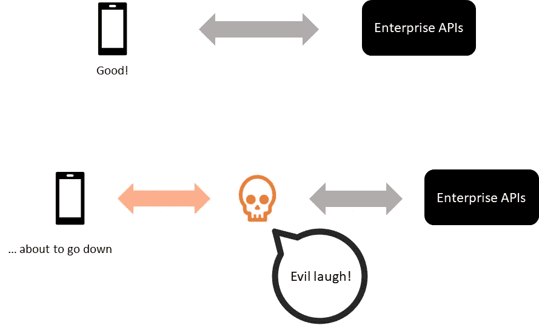
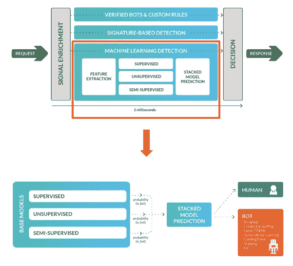

# 构建企业级移动应用的黑暗艺术——第 3 部分

> 原文：<https://medium.com/codex/the-dark-art-of-building-an-enterprise-grade-mobile-app-part-3-e24c60ab735d?source=collection_archive---------6----------------------->

Rami Al-zayat 在 [Unsplash](https://unsplash.com?utm_source=medium&utm_medium=referral) 上拍摄的照片

这篇文章是**系列文章中的第三篇**，这一系列文章的第一部分是*指南*，第二部分是*日志*，概述了我过去 18 个月的移动应用开发之旅。

您可以通过下面的链接查看第 1 部分和第 2 部分:

[第 1 部分:介绍和选择正确的技术](/@sundarsingh_2383/the-dark-art-of-building-an-enterprise-grade-mobile-app-part-1-34ff34387deb)

[第 2 部分:解释移动设备特有的挑战](/@sundarsingh_2383/the-dark-art-of-building-an-enterprise-grade-mobile-app-part-2-950f1d9e911b)

# 来说说坏人吧！

移动软件开发的一个伤脑筋的方面是把你的代码放在外面，知道会有不好的事情发生。没有防火墙，没有物理保护，就像一个安全的数据中心。任何人都可以反编译应用程序并检查代码。设备丢失并经常落入坏人之手。安装在设备上的恶意软件或流氓应用程序也可能会寻找潜在的弱点。[第二部分](/@sundarsingh_2383/the-dark-art-of-building-an-enterprise-grade-mobile-app-part-2-950f1d9e911b)中的对偶类比！)

来源: [OWASP](https://owasp.org/www-project-mobile-top-10/#tab=Top_10_Mobile_Risks)

本文将着眼于移动安全的不同方面，牢记一个原则— *深度防御*。没有一种安全功能本身是万无一失的，但是它们结合在一起可以提供强大的防御。

如果从这篇文章中有一个关键的收获的话—

> 安全不是特色！安全性不是一个单独的故事或待办事项。它需要成为开发过程的一个组成部分。

当安全风险在特性开发接近尾声时被强调时，我们发现它们通常会对交付日期产生负面影响，并且修复和重新测试的成本很高。

## 移动取证简介

为了充分理解移动应用程序可能经历的审查程度，让我们快速了解一下从手机中恢复数字证据背后的科学— *移动取证*。

从移动设备中提取数据有不同的方式，从非常简单到非常复杂。

移动式法医工具调平系统。来源:[奥莱利](https://www.oreilly.com/library/view/practical-mobile-forensics/9781838647520/)，【nist.gov】T2

*逻辑分析*包括将 USB 电缆或蓝牙连接到设备以提取数据。 *Hex dump* 是关于提取手机的内存转储，然后用附加软件进行分析，甚至可以恢复被删除的文件。读过关于[移动取证](https://www.oreilly.com/library/view/practical-mobile-forensics/9781838647520/)的书，一个共同的主题是高级提取需要物理接触设备。

> 不要在设备上写任何会给公司带来风险的东西。为用户提供在丢失应用时注销应用的能力。

## 什么是笔测试，我们为什么需要它？

Pentest 或渗透测试是手机应用程序的一种道德黑客行为。我们将房子的钥匙提交给一些对应用程序做坏事的好人，并突出显示突然出现的风险和漏洞。它让我们对安全漏洞和数据泄露有了一定程度的信心。

笔测有两种:黑盒和白盒。

黑盒测试与白盒测试

Pen 测试要经历几个阶段，持续大约 2-3 周。测试人员分析代码库、所使用的第三方库，查看 web、社交媒体和堆栈溢出，寻找任何已知的漏洞。他们还在一系列设备上安装应用程序，拦截进出的流量。安装和删除应用程序并检查留下的数据足迹等。

pentest 的不同阶段

最后，移动团队会收到一份概述风险及其相应威胁级别的报告。

> 了解开发过程中的安全需求，将代码扫描软件和严格的质量控制与 git commits 集成在一起将节省大量的时间和精力。

# 保护应用程序

## 越狱或根检测(为什么这是一个问题)

这是一种检测设备是越狱(iOS)还是 root(Android)并限制某些应用功能或完全停止应用工作的机制。苹果设备不再像越狱那样微不足道，一旦连接到互联网，它们就会有一个自我纠正的机制。不过，安卓设备略有不同；一些设备出厂时具有 root 访问权限。完全停止它们可能会阻止一部分用户访问应用程序。所以这是一个平衡的行为。

*为什么是问题？*

在根设备中，不保证应用程序沙盒

应用程序沙盒的完整性受到损害。流氓应用程序可以获得权限来读取应用程序的文件系统和安全存储。

> 在将任何数据写入设备之前，请务必进行加密。

呃，如果你把主密钥到处乱放，加密就没有意义了。我[只是说](https://www.appknox.com/blog/major-bug-in-ola-app-can-make-you-either-rich-or-poor)。

## 移动安全的其他方面

代码混淆——阻止反编译器读取应用程序代码。

调试器检测—阻止应用程序在调试模式下运行，以逆向工程应用程序逻辑。

如果你对这个话题感兴趣，我推荐你阅读威瑞森 2020 年移动安全指数(MSI)报告[点击这里](https://enterprise.verizon.com/resources/reports/2020-msi-report.pdf)。

# 保护传输层

目标是防止任何人拦截应用程序和企业之间的流量。更糟糕的是，他们假装*他们*是企业，诱骗用户提供敏感信息，如信用卡详情或银行账户信息。即将发生的事情有一个好听的名字叫做*中间人攻击*。

中间人攻击

我知道你在想什么；我们会用 HTTPS。保持这种想法。

## 重温 HTTPS 的工作方式

每一个网站，甚至远程专业，使用 HTTPS 与浏览器交流，我们认为这是理所当然的。让我们快速看一下它是如何工作的。

> HTTPS 的目的是什么？

1.  它对流量进行加密，这很简单。当浏览器发起请求时，存在复杂的信息和密钥交换，这是进一步通信的基础。

对 HTTPS 工作方式的简单介绍

2.它验证服务器的身份——举证责任在于服务器，它基于*数字签名*和*信任链。*世界上的每个浏览器都有一个可信根证书列表。(您可以在浏览器的安全- >管理证书部分验证这一点)

少数实体最终签署了世界上所有的网站。

这就像你在问，*你是谁写的这篇文章？我们为什么要相信你说的话？*有效问题。

你的伴侣碰巧说，*嗯，是 Sundar，为一个叫 Jas 的家伙工作；他认为自己没事。*

谁是 Jas？

嗯，你认识为达诺工作的那个家伙。

谁是达诺？

他为经营 NAB 的罗斯工作。

你说，*哦！大家都信任罗斯，所以 Sundar 应该没问题！*

这正是问题所在！*信任链*容易被滥用，导致了许多严重的安全事故。

我们如何解决这个问题？当然是通过打破信任链！

我们将借鉴第二部分中的浏览器类比！一个应用程序是一个美化了的浏览器，它与一个网站对话，但是浏览器必须做更多的事情。它必须对数百万个网站和一些非常有问题的网站说话。它依靠信任链来进行区分。如果应用程序自己负责信任服务器(它被设计用来对话的企业)会怎样？

## 证书锁定

为了复制浏览器如何带有内置的根证书，我们可以将应用程序与企业的数字签名打包，以验证它确实是企业。这是一个有效的选择。唯一的缺点是，如果证书(以及随后的签名)有变化，每次都必须发布新的应用程序！

证书锁定如何工作的图示

另一种选择是每次应用程序初始化时从单独的端点加载密钥。由于它是一个额外的 API 调用，所以可以说它比较慢，但它有一个额外的优势，就是将应用程序和安全层分离。如果你在想，*如果坏人能拦截 API 端点，他们也能伪造证书端点吗？*非对称密钥加密和哈希算法的美妙之处在于，如果证书文件的内容被篡改，应用程序可以轻松识别。

> 检测并停止不安全的通信信道，并通知用户。

# 边缘固定

我们将深入探讨一个主题——机器人检测

## 机器人检测

如果证书锁定是为了阻止假冒企业的不良实体，那么 bot 检测则相反。坏机器人是伪装成移动应用的恶意软件。

工作中的机器人探测器

## 当今世界的机器人

坏的机器人会造成很大的损害。他们可以发起像拒绝服务这样的自动攻击。他们可以挖掘凭证，抓取有价值的内容，扫描漏洞，以及一大堆其他讨厌的东西。机器人已经变得如此复杂，以至于它们可以非常接近地模仿用户的行为。它们可以从住宅 IP 启动，每个 IP 只使用几次。(来自接近真实用户的位置！)它们被安装在真实的移动设备上，作为大型设备农场的一部分，甚至可以逃避验证码测试。

工作中的设备场。[来源](https://www.core77.com/posts/81665/Eye-Opening-Photos-and-Video-Taken-Inside-Illegal-Click-Farms)

> 谈到机器人检测，这真的是一场军备竞赛。

## bot 探测器是如何工作的？

来源:[数据仓库](https://datadome.co/bot-management-protection/bot-detection-how-to-identify-bot-traffic-to-your-website/)

僵尸检测器使用已知的僵尸签名、行为分析、HTTP 头、移动指纹的组合，并将其输入到高级机器学习模型中进行预测。这些模型不断被微调并部署到边缘。为了帮助检测机器人，该应用程序需要用设备指纹和传感器数据等附加数据来补充机器人检测器。通常，这是使用集成到应用程序中的 SDK 来完成的。

一个应用程序可能会向机器人检测器发送什么

这些数据有任何用处吗？想象一下人类如何使用设备和软件。

> 从在床上打滚到在床上滚动，我们有一种使用手机的方式，机器人可能无法模仿。

查看传感器数据(上表)的一种方式是作为 10 维空间中的向量(-0.484，3.7，4.8，-0.102，-0.80，0，1，1，0)，而机器人检测器是一个矩阵。这就像矩阵向量乘法一样简单，尽管是在高维空间中，人类和机器人被一个超平面隔开！最终归结为一个数学运算，这也是它们如此快速的原因，以亚毫秒级的延迟运行。

## 关于保护后端的进一步阅读

API 安全是一个热门话题！保护 API 的全部范围有点超出了本文的范围，但是我想留给您 Gartner 关于应用程序安全性的炒作周期报告。(这是 2019 年版，公开发布，但运行有点旧，我们已经看过的 2020 版有一些变化)

来源: [apisecurity.io](https://apisecurity.io/issue-68-api-security-in-gartner-hype-cycle-threat-predictions-for-2020/)

这篇文章是一系列文章的第三篇，部分是*指南*，部分是*日志*，概述了我过去 18 个月的移动应用开发之旅。

[第 1 部分:介绍和选择正确的技术](/@sundarsingh_2383/the-dark-art-of-building-an-enterprise-grade-mobile-app-part-1-34ff34387deb)

[第 2 部分:解释移动设备特有的挑战](/@sundarsingh_2383/the-dark-art-of-building-an-enterprise-grade-mobile-app-part-2-950f1d9e911b)

*第 3 部分:应用程序、传输和 API 的安全性*

[第四部分:敏捷软件开发](/@sundarsingh_2383/the-dark-art-of-building-an-enterprise-grade-mobile-app-part-4-2ab218e5ad62)