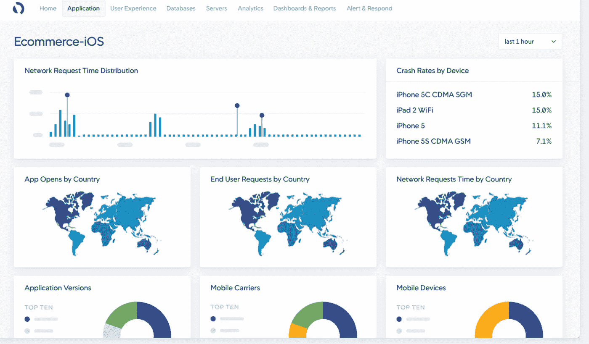
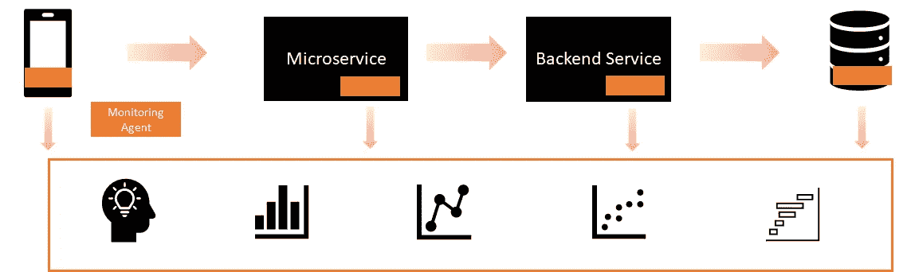
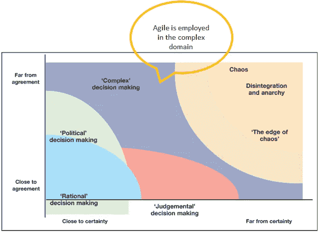
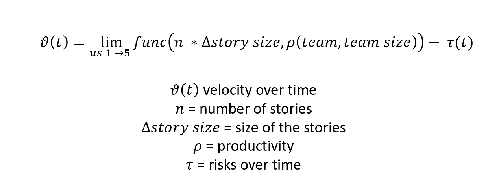
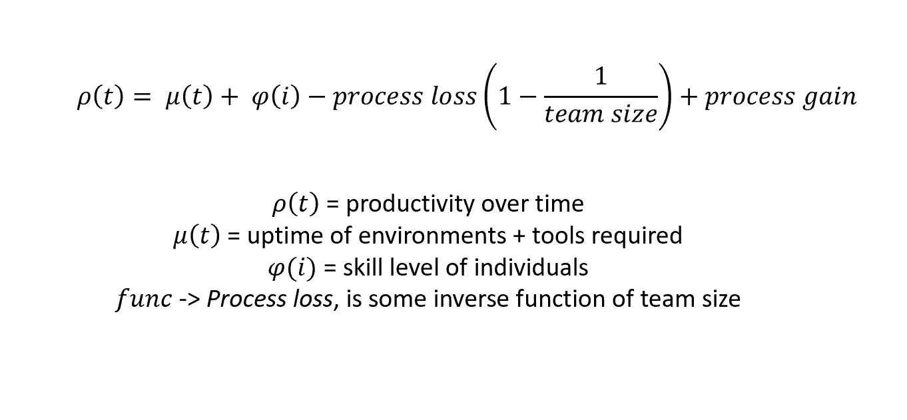
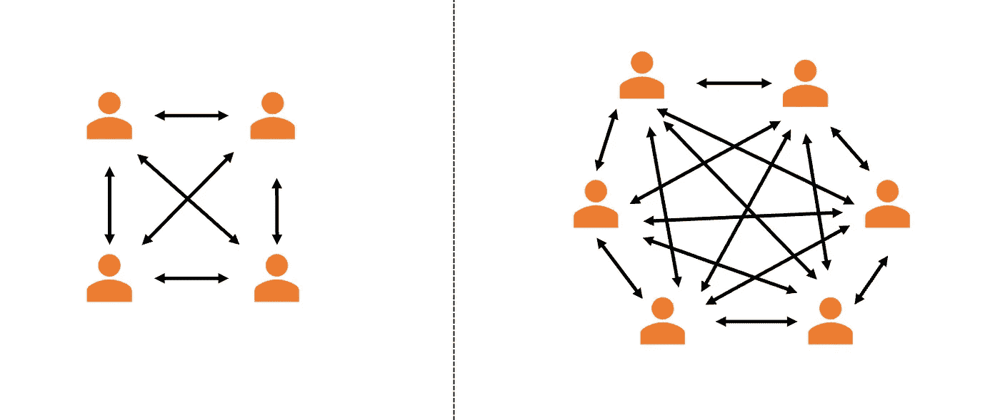
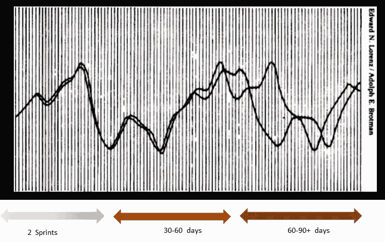

# 构建企业级移动应用的黑暗艺术——第 4 部分

> 原文：<https://medium.com/codex/the-dark-art-of-building-an-enterprise-grade-mobile-app-part-4-2ab218e5ad62?source=collection_archive---------14----------------------->

凯利·西克玛在 [Unsplash](https://unsplash.com?utm_source=medium&utm_medium=referral) 上的照片

这篇文章是一系列文章中的最后一篇:第一篇*如何做*和第二篇*日志*概述了我过去 18 个月的移动应用开发之旅。

你可以在下面的链接中找到前三个部分:

[第 1 部分:介绍和选择正确的技术](/@sundarsingh_2383/the-dark-art-of-building-an-enterprise-grade-mobile-app-part-1-34ff34387deb)

[第 2 部分:解释移动设备特有的挑战](/@sundarsingh_2383/the-dark-art-of-building-an-enterprise-grade-mobile-app-part-2-950f1d9e911b)

[第三部分:手机应用安全](/@sundarsingh_2383/the-dark-art-of-building-an-enterprise-grade-mobile-app-part-3-e24c60ab735d)

# 广阔世界中的可观察性

我们在旅途中经历了应用程序开发的不同方面，构建它，要考虑的事情，注意，保护它，等等。我们的宝宝准备好离开家了。现在，我们需要弄清楚它在现实世界中的表现如何！

那么问题来了。

> 成功是什么样的，我们如何衡量它？

## 移动应用分析简介

在当今世界中，数据就是一切，有数百种指标和 KPI 可用。这些指标迎合了组织的不同领域，从开发团队(他们想知道应用程序的性能如何或是否崩溃)到销售和营销团队(他们可能对用户旅程和分析更感兴趣)。我们将了解一些基本指标。

**安装**非常标准，当我们在 AppStore 或 Playstore 中部署它时，这是现成的。

**每日登录:**衡量每天有多少独立用户登录应用程序。

**新用户:**有多少“新”用户正在使用这个应用程序，从其他渠道迁移过来，或者刚刚进入这个平台。

**用户会话:**如果每日登录衡量的是有多少独立用户在登录，那么会话数据会给出人们使用该应用的频率。

保持和流失:这是事情变得有趣的地方。吸引或迁移用户是不够的。我们希望他们使用这款应用并参与其中。例如，如果用户在第 0 天下载应用程序，他们在第 90 天还在吗？(这被称为 3 个月的*留存率*)。不管应用程序的性质如何，这都是一个至关重要的指标。保留有几种计算方法，从传统、固定到滚动。*流失率*与留存率相反，衡量的是同等时间窗口内用户离开平台的百分比。

生命周期价值:LTV 衡量的是用户在使用应用程序时产生的收入。例如，用 YouTube 的术语来说，我的用户只是在查看内容还是喜欢、评论、分享和推广产生收入的内容？了解客户细分及其相应的 LTV 有助于确定 App 合适功能的优先级。

我不想用不同指标或分析术语的定义来烦你。在 O'Reilly 上有一篇由 Wolfgang Breer 撰写的关于[移动应用分析](https://www.oreilly.com/library/view/mobile-app-analytics/9781492042754/)的简明报告。如果能引起你的兴趣，我强烈建议你读一读。

## 应用程序监控和工具

检测监控代理需要将代理库(SDK)嵌入到移动代码库中。代理跟踪应用程序的使用情况、不同的 API 和响应时间以及其他设备信息(作为应用程序授权的一部分提供)。像 AppDynamics 这样的代理可以实时提供丰富的用户体验数据，这非常有价值。

来源: [AppDynamics](https://www.appdynamics.com/product/end-user-monitoring/mobile-real-user-monitoring)

它还提供了一些现成的功能。但是要注意的一点是*观察的行为会影响过程*。有一个库被打包到应用程序中，这是应用程序大小的微小增加。它还监控应用程序，在用户的手机上进行一些计算。然后，它将数据发布回基站，再次占用用户设备上的一些额外网络资源。但这是回报的最低代价。

> 我们采用了一种迭代的方法来实现，使用基本功能，然后在此基础上构建自定义用户数据、崩溃面包屑等。

像 AppDynamics 这样的平台的美妙之处在于，它让全栈可观测性的梦想成为现实。从用户点击按钮到数据库提交，以及跨多个云提供商、供应商、平台和操作系统追踪请求，可以提供令人信服的见解。

游戏中的全栈可观察性

# 构建应用——敏捷的方式

> 那些研究混沌动力学的人发现，动态系统的无序行为是一个创造性的过程。它产生了复杂性:丰富的组织模式，有时稳定，有时不稳定，有时有限，有时无限，但总是充满了生物的魅力。
> 
> —詹姆斯·格雷克在他的书《混沌:创造一门新科学》中写道。

拥抱敏捷软件开发意味着什么？抛开所有的模型，归结起来就是这个。生命在混乱的边缘繁荣。创造力在混乱的边缘蓬勃发展。敏捷原则、混沌理论、约束理论、系统思维、进化和人类行为心理学之间有着深刻的联系。这就是我们今天还活着而恐龙没有的原因。(好吧，最后一点是我编的，但你会明白的)

## 作为动态系统的工程团队

组织需要某种形式的可预测性，这是一个公平的要求。然而，任何动态系统都可能很快振荡失控。工程团队如何保持可预测性，同时利用其创造性潜力来解决复杂问题？

它的关键在于混沌理论，也就是众所周知的蝴蝶效应。它的技术名称:*对初始条件的敏感依赖。*

考虑一个团队在一段时间内的速度。它不仅仅是一个烧透的故事的函数，而是每个故事的切片、团队的规模和生产力减去一个阻尼因子，比如风险、缺陷等等。假设，我们可以这样表示。(*我写这个等式是为了用数学的方式表达一个敏捷团队，但我并没有大错特错。*)

团队速度的数学表示

为什么将故事大小限制为 5？我们发现这是防止故事点膨胀的神奇数字，同时也确定了与这些故事相关的不确定性。

团队的生产力可以表示为环境正常运行时间、个人技能水平的函数，并与团队规模成反比(由于流程损耗)。

团队生产力的表现

过程收获是当一个团队产生共鸣并一起摇摆时获得的涅槃感。[过程损耗](https://dictionary.apa.org/process-loss)在大群体中引入熵，阻止其发挥全部潜力。

大型团队带来的认知超载。

每个工程团队都知道，估计用户故事和猜测特定时间框架之外的特性交付是不准确的。如果我告诉你下图是超过 90 天的*实际*和*预计*交货之间的关系，你可能会同意我的观点。

软件的实际交付与预计交付…或者是？[来源](https://www.amazon.com/Chaos-Making-Science-James-Gleick/dp/0143113453)

但是上图恰好是天气模式如何根据对初始条件敏感性而发生变化。希望我已经让你相信了动态系统的类比。

> 所有的 scrum 事件都旨在控制这个活生生的动态系统的状态，并保持其可预测性。

1.  一段时间间隔后重置状态(冲刺，重置，防止故事溢出)
2.  移除未知(将故事切小)
3.  消除风险，预见依赖。
4.  增加过程收益(Scrum、团队友爱、伙伴关系的价值)
5.  减少流程损失(2 个披萨团队)
6.  需要时进入混乱领域(尖峰，但只有严格的时间限制的行动和结果)

## 团队结构和心态

> 设计系统的组织被限制生产这些组织的通信结构的拷贝的设计。
> 
> 康威，1967 年

你生产的软件是你的组织结构的反映。跨职能团队不仅仅是一个敏捷术语。让 UX 专家、前端、后端和 DevOps 工程师作为一个有凝聚力的单位一起工作是值得的。

> 在开发过程中，这样一个团队的信息交流是不可低估的。

当后端开发人员喊道，“啊，坚持住！这看起来不对，”当前端工程师做出某些假设时，也许达到 sprint 目标和陷入一堆缺陷之间的区别。

敏捷的许多价值观和原则都植根于人类行为心理学和博弈论。互惠利他和[针锋相对](https://en.wikipedia.org/wiki/Tit_for_tat)是经过充分研究和充分理解的概念，是以某种方式进化多年的结果。当一个群体面临挑战时，唯一的出路就是互相帮助。

> 为人*好*。*礼尚往来*。*帮助队友*。

在你的团队中有一个人可能会赢得战斗，但你会输掉战争。当我们说我们拥抱 Scrum 的价值观——勇气、承诺、专注、开放和尊重，我们是认真的。

这里有一篇关于两个开发者之间囚徒困境的有趣文章。

> 系统思维非常重要。正是系统思维和敏捷思维的缺失导致了围绕*做*敏捷和*是*敏捷的宗教思维。—一个非常聪明的人，同时也是我们的[敏捷教练](https://www.linkedin.com/in/jason-gounder-761a397/)。

## 分割用户故事的诀窍

> 我们因没有对故事进行足够的切片而感到内疚，但却被教导要做相反的事情。

越小越好，2-3 天最好。任何故事都不应该超越 sprint，包括开发、测试和这些测试的自动化。这很难实践，对每个参与的人来说都是一种文化转变，但我们在教练的指导下变得更好了(以及一种检查-适应的心态)。这使得每个人的提问更加直接，更多的故事在黑板上向右移动，团队聚集了动力。一旦转变发生了，你就能在故事分解会议中感受到热情，因为开发人员和测试人员相互交流。

## 持续交付和部署

思维敏捷是非常好的，但是仅仅这样还不够好。敏捷的工具是最重要的。对于开发团队来说，没有什么比拥有健壮的构建管道更敏捷的了。说起来容易做起来难，尤其是在移动环境中，代码可能是为多个操作系统构建的，并部署在许多设备上。所有这些都是工程上的努力，技术和专题报道需要同等的优先权！虽然总是强调交付业务价值，但是在项目的早期拥有正确的基础将允许持续的交付，这将使业务显著受益。

我们已经一次又一次地看到了提交代码不够频繁的负面影响。当代码库的其余部分进化时，一个未提交的特性将会衰退，而这个特性将会在以后的某一天被提取出来。在重新访问该分支时，有相当多的认知超载，试图理解代码和编写它的上下文，所有这些都等于白费力气。

## 嘲笑还是不嘲笑？

在大型企业中排列依赖关系并不总是简单的。团队动摇，优先权改变，人们退出，日期推后，环境恶化，事情发生。

> “曾经，”素甲鱼最后深深地叹了口气说，“我是一只真正的乌龟。”—爱丽丝梦游仙境，刘易斯·卡罗尔

在移动应用程序开发的环境中，这意味着无法继续开发或测试工作，因为 API 端点已经关闭(或者更糟，还没有准备好)。准确复制或模仿 API 响应的能力将极大地有益于团队，但这又相当于工程工作(并引发业务功能与技术的争论)。开发人员和 QA 工程师可以在模拟终端中进行大量的 backbox 测试或自动化测试，以减少停机时间。

然而，在“系统集成”阶段或者当构建被推到更高的环境时，模拟测试需要被重新验证或者在真实环境中测试。

# 结论

这一切将把我们引向何方？我们这些专家正在开辟通向尖端应用的道路吗？恰恰相反。虽然我们有专家，但对包括我自己在内的许多工程师来说，这也是第一次。我们已经失败了很多次。当我们这样做时，它是在一个安全的环境中。我们以开放和尊重的态度进行检查。我们改进。不断地。对于信任我们的企业和依赖我们的客户来说。哦，我们这样做的确很有趣！

这篇文章是一系列文章中的最后一篇文章:第一篇是*指南*，第二篇是*日志*，概述了我过去 18 个月的移动应用开发之旅。

[第 1 部分:介绍和选择正确的技术](/@sundarsingh_2383/the-dark-art-of-building-an-enterprise-grade-mobile-app-part-1-34ff34387deb)

[第 2 部分:解释移动设备特有的挑战](/@sundarsingh_2383/the-dark-art-of-building-an-enterprise-grade-mobile-app-part-2-950f1d9e911b)

[第 3 部分:应用程序、传输和 API 的安全性](/@sundarsingh_2383/the-dark-art-of-building-an-enterprise-grade-mobile-app-part-3-e24c60ab735d)

*第四部分:敏捷软件开发*

—根据我使用 Nabtrade 移动应用程序的经验撰写。