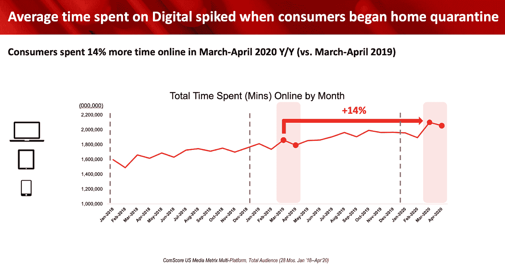
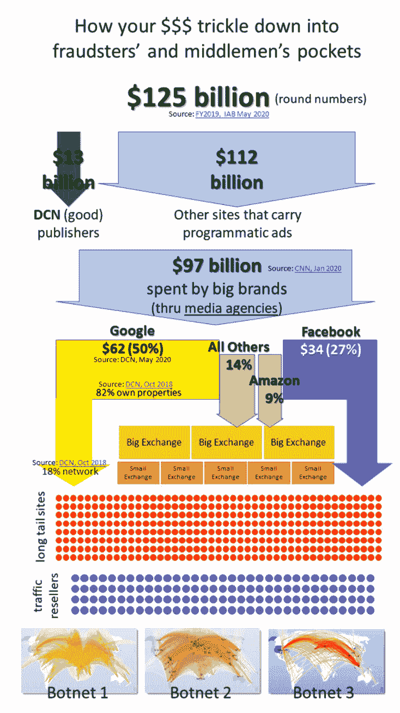

# 数据神和数字广告欺诈的兴起。

> 原文：<https://medium.com/codex/the-data-deity-and-the-rise-of-digital-ad-fraud-253af3ca1b16?source=collection_archive---------9----------------------->

## 营销人员接触到了错误的客户群，也向欺骗性地抓取网页来帮助你达到活动指标的机器人营销。

我们生活在一个数据成为新神的时代，我们以数据为基础构建商业模式。

今天的数据正在影响经济的所有领域，使营销人员能够建立媒体计划和大规模购买广告库存。更具体地说，它旨在通过满足客户的需求和愿望来为他们提供价值，同时为他们的组织和股东提供价值。

主要问题是，投资广告购买的品牌希望跟踪和验证对活动和媒体购买的投资。正如斯坦福大学商学院[的营销学教授 Harikesh Nair](https://www.gsb.stanford.edu/insights/marketing-math-microseconds) 所说，“他们不仅想知道有多少人看到了他们的广告，还想知道他们是否在销售方面获得了回报。证明这一点是非常困难的，因为我不能只统计看到广告然后购买产品的人数，因为也许他们已经打算购买了。15 年前，一个平台可能会使用这种有缺陷的分析，但品牌不再相信这一点。”

资料来源:ComScore & IAB

## 糟糕的数据和机器人的崛起

然而，它可能具有欺骗性，营销人员可能会被引入歧途。这是一场正在形成的数据危机，因为它不仅导致每年高达 70 亿美元的广告支出浪费在错误的目标用户群上，而且估计还有另外 60 亿美元的僵尸工具！！

虽然对第三方数据的需求持续增长，但随着谷歌、脸书和苹果的隐私驱动，供应流似乎正在枯竭，这是一种以牺牲独立出版商和品牌为代价来增加其围墙花园的经济价值的偷偷摸摸的方式。

根据 IAB 最近的一项研究，人类的在线使用在 2021 年第一季度趋于平稳，COVID 的放缓也影响了这一事实。

尽管发生了这些变化，但广告价格在过去 10 年里大幅下降。据[网络安全、反广告欺诈顾问 Augustine Fou](https://www.linkedin.com/in/augustinefou/) 博士称，营销人员过去从出版商那里购买的广告价格约为每条 30 美元，而现在他们支付的是每条 30 美元，但仍然花费价值 30 美元的库存。

这怎么可能呢？简单。供应量没有下降，而是上升了。可扩展的僵尸网络已经从人类使用的地方开始了，这是一个真正的问题。那么这一切是如何运作的呢？还是那句话，真的没那么复杂。当媒体策划人购买广告网络上的程序化展示时，广告网络购买中型广告网络上的广告单元，而中型广告网络又在这种程序化购买和销售中的较小网络上购买更多流量，生态系统中的一些公司正在购买机器人，然后消费广告单元，并实现媒体计划的到达目标。

[Linkedin 全球市场开发主管](https://www.linkedin.com/in/weinbergpeter/)Peter Weinberg 在[最近的一篇文章](https://business.linkedin.com/marketing-solutions/content-marketing/b2b-trends/subprime-data-crisis)中将其描述为“次贷数据危机”,并强调其与 2008 年金融危机前银行业将 D 级贷款与 AAA 级贷款捆绑在一起的做法有着惊人的相似之处。与 21 世纪初出售次级抵押贷款类似，发送机器人点击广告可以赚很多钱。在 2013 年的一项研究中，数字公民联盟发现，仅广告支持的盗版网站就不仅赚取了数百万美元，而且利润率高达 83-99%。通过考虑有多少虚假网站，你可以开始了解这种欺诈的规模。

来源:Augustine Fou 博士

那些把我们的广告送到天堂的广告公司牧师呢？事实证明，他们可能也被骗了。根据 Fau 博士的说法，大型广告网络向中小型网络销售广告，这些网络继续销售，直到他们“神奇地”保证了确切的印象数。

如果你在考虑像尼采一样，在街上跑，大喊“我们的大数据上帝死了！”，你不需要。嗯，反正还没有。正如任何伟大的宗教故事一样，总有挽回的余地。彼得·温伯格(Peter Weinberg)有一些很好的建议来限制暴露在看似迫在眉睫的危机中，他告诉我们，“如果营销人员想要更好的数据，我们需要努力缩短供应链”。

我们先不要放弃我们的数据神。它还没有失去相关性。好的数据可以做大事，尤其是在消费者和企业营销领域。我们是用户，既是内容的消费者，也是营销者，所以让我们走向更健康、更平衡的关系，永远记住，仅仅因为神承诺了世界，并不意味着它会实现它。

来源:

[https://www . gsb . Stanford . edu/insights/marketing-math-微秒 ](https://www.gsb.stanford.edu/insights/marketing-math-microseconds)

[*https://www . iab . com/WP-content/uploads/2020/05/Consumer-Media-Usage-2019-through-April-2020 . pdf*](https://www.iab.com/wp-content/uploads/2020/05/Consumer-Media-Usage-2019-through-April-2020.pdf)

[*https://www . Forbes . com/sites/augustinefou/2020/06/02/what-the-economics-of-digital-ad-fraud/？sh = 633 ab 7912847*](https://www.forbes.com/sites/augustinefou/2020/06/02/what-are-the-economics-of-digital-ad-fraud/?sh=633ab7912847)

[*https://business . LinkedIn . com/marketing-solutions/content-marketing/B2B-trends/subprime-data-crisis*](https://business.linkedin.com/marketing-solutions/content-marketing/b2b-trends/subprime-data-crisis)